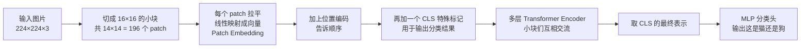

# 25-了解 ViT（Vision Transformer）吗

> [!question] 面试官想考什么
> 考你是否了解 Transformer 的"出圈"应用——拿去看图片。答清"**图像怎么变成序列**"这个核心问题就抓住了灵魂。

## 🍼 大白话：把图片"拆成字"给 Transformer 读

Transformer 原本只懂文字。ViT 的绝招是：**把一张图片"翻译"成 Transformer 能读的"一句话"**。

- 假设一张图片是 224×224 像素，切成 **16×16 的小方块** → 共 (224/16)² = **14×14 = 196 个小方块**。
- 每个小方块 = Transformer 眼中的一个"字"（token）。
- 于是"看图"变成了"读一串 196 个字的句子"，后面的事就交给 Transformer 老本行——自注意力。

## 📖 详细讲解

### ViT 处理流程



### 详细步骤表

| 步骤 | 白话 | 作用 |
|---|---|---|
| **Patchify 切块** | 把图片切成小块 | 让 Transformer 有"字"可读（196 个小块） |
| **Linear Projection** | 每块压扁成向量 | 变成机器能算的"patch 向量" |
| **加位置编码** | 贴座位号 | 让小方块知道自己在图里的位置 |
| **加 [CLS] token** | 放个"汇总员" | 最后汇总出分类结果 |
| **Encoder 编码** | 小方块们互相看 | 建模各区域的关联 |
| **分类头** | 拍板 | 输出分类结果 |

### 关键结论：数据量的"钞能力"

- **数据量大**时：ViT 用大规模预训练（如 JFT-300M）再微调，**能超过 ResNet 等 CNN**。
- **数据量小**时：ViT 表现**不如 CNN**——因为 CNN 天生自带"平移不变性"等先验（inductive bias），ViT 没有，全靠数据喂出来。

> [!note] 联系之前的防坑知识
> ViT 相当于：**Encoder + 位置编码 + [CLS] + MLP**，即 BERT 的"看图版"（→ [[12-对Transformer的Encoder模块的理解]]）。它没接 Decoder、不做生成，只做"理解"（分类）。

## 🎯 面试怎么答（话术模板）

```
"ViT 把图像切成固定大小的 patch，每个 patch 拉平后线性映射成向量，
加上位置编码和 [CLS] token，送进 Transformer Encoder，
最后取 [CLS] 的输出做分类。
它把图像理解变成了序列建模，数据量足够大时能超过 CNN；
但因为缺少 CNN 的归纳偏置，在小数据场景不如 CNN，
需要大规模预训练来弥补。"
```

## 🔗 相关知识链接

- Encoder 编码原理 → [[12-对Transformer的Encoder模块的理解]]
- 位置编码为什么必要 → [[04-Transformer的位置编码是怎样的]]
- 多模态更进一步？→ [[26-了解ViLT吗]]

---
> [!info] 导航
> 返回 [[Transformer 面试题]] · 上一题 [[24-Transformer和LLM有哪些区别]] · 下一题 → [[26-了解ViLT吗]]