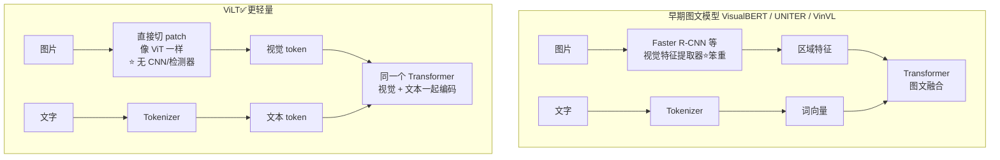

# 26-了解 ViLT（Vision-and-Language Transformer）吗

> [!question] 面试官想考什么
> 这是"前沿扩展题"，考察你对**多模态（图文）模型**的了解和比概念的 **横向对比**。核心就记住三个词：**轻量、无 backbone、单 Transformer**。

## 🍼 大白话：让一张图和一个句子"同堂上课"

ViLT = Vision-and-Language Transformer，一个**图文双修**的轻量模型。

想象一间教室：

- 以前的图文模型（VisualBERT、UNITER 等）很"笨重"：先派一个**图像特长生（CNN/检测器）** 把图片"提炼"成特征，再拿去和文字一起学——像先配个助教，麻烦。
- **ViLT 的改进**：干脆**不要助教了**！图片切草块后直接进 Transformer，和文字 token **坐在同一个教室里上课**（同一个 Transformer），谁都能看到谁。

好处：**更快、更小、更简单**，一样的算力能做更多事。

## 📖 详细讲解

### ViLT 与其他图文模型的对比



### ViLT 的三个核心卖点

| 卖点 | 白话 | 对比 |
|---|---|---|
| **无视觉 backbone** | 不配"图像助教" | 省掉 Faster R-CNN 之类的重特征提取器 |
| **单一 Transformer** | 图和字同堂上课 | 视觉/文本 token 一起过同一个编码器 |
| **轻量高效** | 又小又快 | 参数量、训练、推理成本都低 |

> [!note] 它做什么任务？
> 图文对齐（这张图和这句话配不配）、VQA 视觉问答（看图回答问题）、指代等。预训练常用图文匹配（ITM）+ 文本掩码（MLM）。

### 一句话对比记忆

- **ViT**：只懂图（纯视觉）。
- **ViLT**：图 + 文一起懂（多模态），而且**很轻**。

## 🎯 面试怎么答（话术模板）

```
"ViLT 是一个轻量级的图文多模态模型。
它最大的特点是去掉了视觉 backbone——不像早期 VisualBERT、UNITER
要先用 Faster R-CNN 提取区域特征，
而是像 ViT 一样把图像直接切成 patch 作为视觉 token，
和文本 token 一起进入同一个 Transformer 编码，
实现端到端的图文联合建模。
所以它更简单、更快、参数更少，适合图文对齐、VQA 等任务。"
```

## 🔗 相关知识链接

- ViLT 的"视觉部分"学自 ViT → [[25-了解ViT吗]]
- "一起进同一个 Transformer"意味着什么 → [[01-聊一聊Transformer的架构和基本原理]]
- 它具体怎么处理图像？→ [[27-ViLT如何应用于图像识别任务]]

---
> [!info] 导航
> 返回 [[Transformer 面试题]] · 上一题 [[25-了解ViT吗]] · 下一题 → [[27-ViLT如何应用于图像识别任务]]