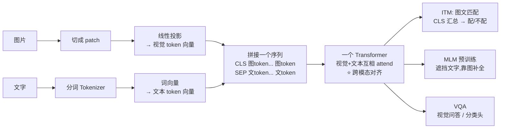

# 27-ViLT 模型是如何将 Transformer 应用于图像识别任务的

> [!question] 面试官想考什么
> 这道题是上一题的"机制版"，考**具体的输入怎么组织、注意力怎么联合、输出怎么做**。记住四个字主线："**图字同炉**"。

## 🍼 大白话：图和字混在一张卷子里答题

ViLT 做图文任务就像**一张混合考卷**：

- 卷子上半部分：图片被切成一块块"拼图"（视觉 patch token）；
- 卷子下半部分：一句描述文字（文本 token）；
- 整张卷子**一起交给同一个阅卷老师（Transformer）**，所有 token 互相看（自注意力），图和字的关联就被摸清了；
- 最后按题目需求交卷：
  - 问"图文匹配吗？" → 用 [CLS] 汇总输出"配 / 不配"；
  - 问"图里有什么？" → 用答案头输出标签。

## 📖 详细讲解

### ViLT 完整流程



### 关键步骤逐条

| 步骤 | 白话 | 说明 |
|---|---|---|
| **视觉 token 化** | 图片切块压扁成向量 | 类似 ViT 的 Patch Embedding（→ [[25-了解ViT吗]]） |
| **和文本拼接** | 混合成一个序列 | `[CLS] img_token... [SEP] txt_token...` |
| **联合编码** | 单 Transformer 处理 | 视觉/文本 token 互相做自注意力 → 学到跨模态对齐 |
| **任务头输出** | 按需交卷 | ITM 二分类 / MLM 补词 / VQA 分类 |

### 为什么"拼接 + 自注意力"能对齐图文？

- 自注意力会让**所有 token 相互看**：图中的"猫"和文本里"cat"（或其描述）会产生**高注意力权重**。
- 训练时用图文匹配任务逼它学这种对齐——图片和文字配对，模型就学会了"图上有什么就对应文本里什么"。

> [!tip] pre 训练 vs 微调
> - **预训练**（学通用图文对齐）：用海量「图-文对」，做 **ITM + MLM**。
> - **微调**（学特定任务）：VQA、图像字幕、指代等下游任务上再训练一步。

## 🎯 面试怎么答（话术模板）

```
"ViLT 把图像切成 patch 线性投影成视觉 token，
和文本 token 拼接成同一个序列，一起送入同一个 Transformer 做自注意力，
让视觉和文本互相 attend，从而学到跨模态对齐。
预训练阶段用图文匹配（ITM）和文本掩码（MLM）两个任务来训练这种对齐；
微调阶段通过 [CLS] 或任务头适配 VQA、字幕、指代等下游任务。
考古图的本质就是‘把看图翻译成读 token 序列’。"
```

## 🔗 相关知识链接

- 视觉部分学自 ViT → [[25-了解ViT吗]]
- 自注意力怎么算关联 → [[06-self-attention中的K和Q是用来做什么的]]
- 它和文字模型的关系 → [[24-Transformer和LLM有哪些区别]]

---
> [!info] 导航
> 返回 [[Transformer 面试题]] · 上一题 [[26-了解ViLT吗]] · 下一题 → [[28-chatGLM和GPT在结构上有什么区别]]