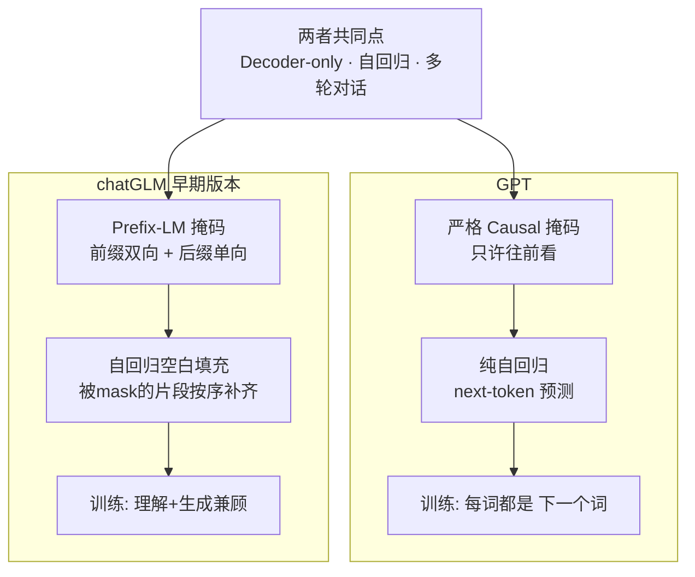

# 28-chatGLM 和 GPT 在结构上有什么区别

> [!question] 面试官想考什么
> 考察你对**具体模型**的了解，重点抓"训练目标"和"注意力方式"两个差异维度。最容易糊的点：忘记不同版本差异，把 chatGLM/GPT 当铁板一块。

## 🍼 大白话：同样是"接龙"，考法不同

GPT 和 chatGLM 都是"**接龙选手**"（Decoder-only 自回归），都会说话。差别在**训练时的玩法**：

- **GPT 的训练法**：你写一句"今天天气真不错"，它学"从头到尾一个字接一个字"——标准自回归。
- **chatGLM 的训练法（早期版本）**：你给它"今天天气真[____]"，让它把**中间空掉的词补上**，而且补的时候**也要按顺序补**——叫"自回归空白填充"。

> [!tip] 两个词背下来
> - GPT：**Next-Token Prediction**（纯自回归）
> - GLM：**Autoregressive Blank Infilling**（自回归式填空）

## 📖 详细讲解

### 核心差异总览图



### 逐点对比表

| 维度 | GPT | chatGLM（以早期 chatGLM-6B 为例） |
|---|---|---|
| **位置编码** | GPT-2 用可学习绝对编码；GPT-3.5 + 后期走 RoPE | 早期就用 **RoPE + ALiBi 变体** |
| **训练目标** | 纯 next-token 自回归 | **自回归空白填充**（填空式+有序） |
| **注意力方式** | 严格 Causal（只往前看） | **Prefix-LM**：前缀双向、后缀单向 |
| **结构优化** | GPT-3.5 之后 GQA 等 | GLM-4 也跟进 **GQA、RoPE、长上下文** |
| **对齐方式** | 预训练 + SFT + RLHF | 同样预训练 + SFT + RLHF，中文/Code 强化早 |

> [!warning] 版本提醒（面试必备的"辩证"）
> - "GLM" 是一个**大家族**：GLM（早期论文）→ chatGLM-6B → GLM-2/3 → **GLM-4**。
> - 越到后期，GLM 与现代 LLM（含 GPT 系）的**工程细节越趋同**：大家都用 RoPE、GQA、长上下文。
> - 所以谈区别要**限定版本**，否则容易说错。

### 为什么 GLM 早期这么设计？

- **Prefix-LM + 空白填充** = 让模型同时练**理解**（看双向）和**生成**（按序补全）。
- 目标是：**一个模型两头通吃**（既能 BERT 式的理解，又能 GPT 式的生成）。GPT 只专生成。
- 这就是"GLM"全称的由来：General Language Model（通用语言模型）。

> [!note] 一句话结论
> 核心差异就两条：**训练任务**（填空补全 vs 纯生成）+ **注意力**（prefix 双向 + 后缀自回归 vs 纯 causal）。版本越新，差异越小。

## 🎯 面试怎么答（话术模板）

```
"两者都是 decoder-only 的自回归模型，但早期 chatGLM 和 GPT 有两点核心差异。
第一是训练目标：GPT 是纯 next-token 自回归，
而 chatGLM 用自回归空白填充，对被 mask 的片段按顺序补齐，
兼顾了理解和生成能力。
第二是注意力方式：GPT 用严格的 causal 掩码只往前看，
早期 chatGLM 用 Prefix-LM，前缀部分双向、后缀部分自回归。
另外 early GLM 就用上了 RoPE 的变体。
不过也要注意，像 GLM-4 这些新版本已经在向主流靠拢，
和 GPT 系的工程细节差异越来越小。"
```

## 🔗 相关知识链接

- "Decoder-only 自回归"是什么 → [[17-什么是自回归属性autoregressive-property]]
- Causal 掩码怎么实现 → [[16-注意力遮蔽Attention-Masking的工作原理]]
- 大模型和架构的关系 → [[24-Transformer和LLM有哪些区别]]

---
> [!info] 导航
> 返回 [[Transformer 面试题]] · 上一题 [[27-ViLT如何应用于图像识别任务]]