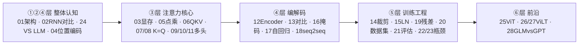

# 🧠 Transformer 面试题

> [!abstract] 题库来源
> 面试鸭题库：Transformer 是 NLP 领域的革命性模型，广泛应用于机器翻译和文本生成。
> 考察重点：自注意力机制、多头注意力、位置编码、编码器与解码器结构、BERT 与 GPT 的区别、训练与优化、NLP 任务中的应用。

> [!tip] 新手入口
> 还没学过 Transformer？**先读 [[00-Transformer入门总览]]** —— 3 分钟建立整体感，再进单题。每题文档均有：大白话讲解 + 流程图 + 面试话术。

## 🗺️ 知识地图

## 📋 题目列表（共 28 条）

### 一、整体认知

1. [ ] 聊一聊 Transformer 的架构和基本原理。（中等）→ [[01-聊一聊Transformer的架构和基本原理]]
2. [ ] 使用 Transformer 解决了 RNN 面临的一些什么问题？（简单）→ [[02-使用Transformer解决了RNN面临的什么问题]]
3. [ ] Transformer 和 LLM 有哪些区别？（简单）→ [[24-Transformer和LLM有哪些区别]]

### 二、注意力核心

4. [ ] Transformer 的哪个部分最占用显存？（中等）→ [[03-Transformer的哪个部分最占用显存]]
5. [ ] Transformer 在计算 attention 的时候使用的是点乘还是加法？请说明理由。（中等）→ [[05-计算attention用的是点乘还是加法]]
6. [ ] self attention 中的 K 和 Q 是用来做什么的？（简单）→ [[06-self-attention中的K和Q是用来做什么的]]
7. [ ] K 和 Q 可以使用同一个值通过对自身进行点乘得到吗？（中等）→ [[07-K和Q可以使用同一个值吗]]
8. [ ] 如果让 K 和 Q 变成同一个矩阵，你觉得对模型性能会带来怎样的影响？（困难）→ [[08-让K和Q变成同一个矩阵的影响]]
9. [ ] 为什么 Transformer 采用多头注意力机制？（中等）→ [[09-为什么Transformer采用多头注意力机制]]
10. [ ] 在不考虑计算量的情况下，head 能否无限增多？（中等）→ [[10-head能否无限增多]]
11. [ ] 在进行多头注意力的时候需要对每个 head 进行降维吗？（中等）→ [[11-多头注意力需要降维吗]]

### 三、编解码器

12. [ ] 讲一下你对 Transformer 的 Encoder 模块的理解。（中等）→ [[12-对Transformer的Encoder模块的理解]]
13. [ ] Decoder 阶段的多头自注意力和 Encoder 阶段的是相同的吗？（中等）→ [[13-Decoder和Encoder的多头自注意力相同吗]]
14. [ ] 注意力遮蔽（Attention Masking）的工作原理是什么？（中等）→ [[16-注意力遮蔽Attention-Masking的工作原理]]
15. [ ] 什么是自回归属性（autoregressive property）？（中等）→ [[17-什么是自回归属性autoregressive-property]]
16. [ ] Transformer 中如何实现序列到序列的映射？（中等）→ [[18-如何实现序列到序列的映射]]

### 四、训练与优化

17. [ ] Transformer 的位置编码是怎样的？（简单）→ [[04-Transformer的位置编码是怎样的]]
18. [ ] 了解 Transformer 模型训练中的梯度裁剪（Gradient Clipping）吗？（中等）→ [[14-了解梯度裁剪Gradient-Clipping吗]]
19. [ ] Transformer 为什么采用 Layer Normalization 而不是 Batch Normalization？（中等）→ [[15-为什么用LayerNorm而不是BatchNorm]]
20. [ ] Transformer 中的"残差连接"可以缓解梯度消失问题吗？（中等）→ [[19-残差连接可以缓解梯度消失吗]]
21. [ ] Transformer 中，如何处理大型数据集？（中等）→ [[20-如何处理大型数据集]]
22. [ ] Transformer 模型训练完成后，如何评估其性能和效果？（中等）→ [[21-如何评估Transformer的性能和效果]]
23. [ ] Transformer 模型的性能瓶颈在哪？（中等）→ [[22-Transformer模型的性能瓶颈在哪]]
24. [ ] 你觉得可以怎样缓解这个性能瓶颈？（困难）→ [[23-怎样缓解Transformer的性能瓶颈]]

### 五、前沿扩展

25. [ ] 了解 ViT（Vision Transformer）吗？（中等）→ [[25-了解ViT吗]]
26. [ ] 了解 ViLT（Vision-and-Language Transformer）吗？（困难）→ [[26-了解ViLT吗]]
27. [ ] ViLT 模型是如何将 Transformer 应用于图像识别任务的？（中等）→ [[27-ViLT如何应用于图像识别任务]]
28. [ ] chatGLM 和 GPT 在结构上有什么区别？（中等）→ [[28-chatGLM和GPT在结构上有什么区别]]

> [!note] 统计
> 共 28 题：简单 4 · 中等 22 · 困难 2。每题一个编号答案文档（01-28），栏目按知识逻辑重新分组，原序号即文件名编号。

## 🏷️ 标签

#Transformer #NLP #面试题 #自注意力 #多头注意力 #位置编码

---
回到 [[01-学习路径总览]] · 新手速通 [[00-Transformer入门总览]]