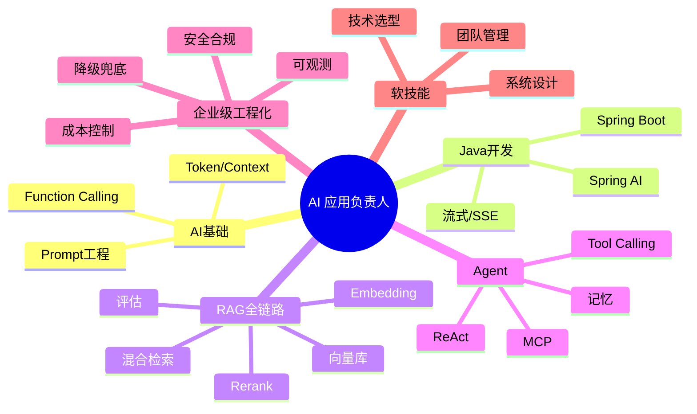
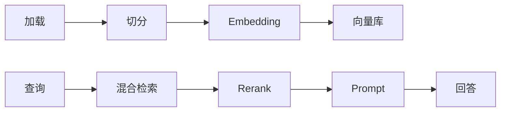

# 🧭 技术栈地图

> [!abstract] 面向"AI 应用开发负责人"的完整技能地图
> 分三层：**必须精通 / 必须会用 / 了解加分**

## 技能全貌

## 一、AI 基础（必须精通）

| 能力 | 掌握标准 |
| --- | --- |
| LLM 核心概念 | Token / Context / Temperature / 幻觉 / Embedding |
| Prompt 工程 | 结构化 Prompt、Few-shot、CoT |
| API 工程 | 对话、流式、多轮、Function Calling、计费 |

## 二、Java 开发（必须精通 —— 你的底牌）

| 能力 | 掌握标准 |
| --- | --- |
| Spring Boot | Restful、SSE、WebSocket、异步 |
| **Spring AI** | 对话、流式、Tool、RAG、向量库集成 |
| LangChain4j | 了解概念即可（压缩版已砍） |

## 三、RAG 全链路（必须精通）

| 组件 | 常用选择 | 层级 |
| --- | --- | --- |
| Embedding | bge-m3 / text-embedding-3 | 必须会用 |
| Rerank | bge-reranker | 必须会用 |
| 向量库 | pgvector / Milvus | 精通一种 |
| 检索 | 向量 + BM25 | 必须精通 |
| 评估 | 测试集 + RAGAS | 必须会用 |

## 四、Agent（必须会用）

| 主题 | 掌握标准 |
| --- | --- |
| Agent 模式 | ReAct、Plan-and-Execute、Multi-Agent |
| 工具调用 | Tool Calling 设计、错误处理 |
| 记忆 | 短期会话、长期向量记忆 |
| **MCP** | 理解协议，能接入工具 |
| Human-in-the-loop | 人工审批流 |

## 五、企业级工程化（负责人必答）

| 维度 | 要点 |
| --- | --- |
| 可观测性 | Langfuse、OpenTelemetry、Trace/Token/成本 |
| 评估 | 离线测试集、线上 A/B、反馈回流 |
| 成本 | 模型分层、缓存、压缩、预算预警 |
| 稳定 | 降级兜底、超时重试、限流熔断 |
| 安全 | Prompt 注入防护、脱敏、内容审核 |
| 网关 | 统一接入多家模型、灰度发布 |

## 六、了解加分项（不用精通）

- 模型微调（LoRA）：知道场景与成本即可
- Python / LangChain：能读代码、跑 demo
- 多模态：语音、视觉、视频
- Milvus 集群、HNSW 索引

## 七、软技能（总监/负责人必考）

| 能力 | 面试场景 |
| --- | --- |
| 系统设计 | 白板设计智能客服 / 知识库 / Agent 平台 |
| 技术选型 | 自研 vs 开源 vs API |
| 团队管理 | 分工、排期、风险 |
| 业务落地 | "这个 AI 功能带来什么业务价值" |

## 🏷️ 标签

#技术栈 #Java #SpringAI #RAG #Agent #MCP #工程化

---
回到 [[README]]
