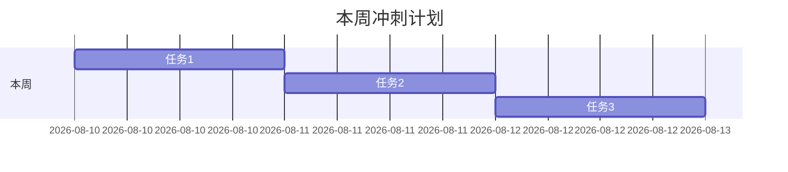

# 📊 每日进度

> [!note] 打卡方式
> 1. 打开**日历插件**（已装），点任意日期 → 自动在 `AI 学习规划/每日打卡/` 生成当日笔记
> 2. 模板来自 [[模板-每日打卡]]，5 分钟填完
> 3. 进度会自动出现在本页下方和标签 `#打卡` 中

## 本周目标

> 手动更新：把本周任务填进上面的甘特图。

## 打卡记录（按日期链接）

- [[2026-08-10]]
- [[2026-08-11]]
- [[2026-08-12]]
- [[2026-08-13]]
- [[2026-08-14]]
- [[2026-08-15]]
- [[2026-08-16]]

> 点击「日历」插件图标即可创建任意日期的笔记。

## 里程碑

- [ ] 第 1 周结束：RAG 系统跑通 ✅/❌
- [ ] 第 2 周结束：Agent 完成 ✅/❌
- [ ] 第 3 周结束：架构方案文档完成 ✅/❌
- [ ] 第 4 周结束：简历投递 + 面试 ✅/❌

## 🏷️ 标签

#打卡 #进度 #AI学习

---
回到 [[README]]
