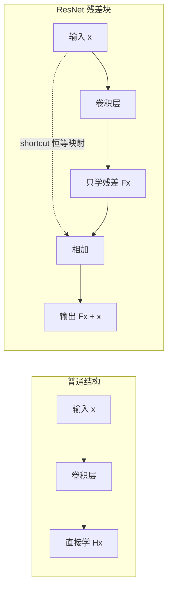
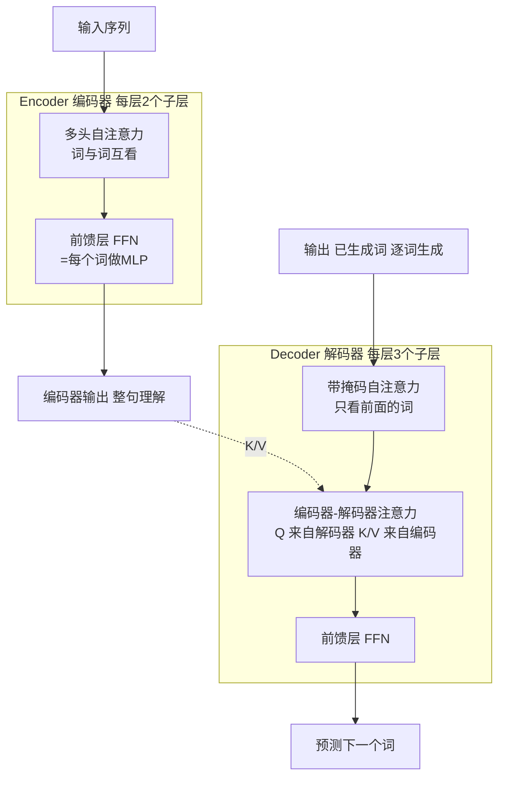
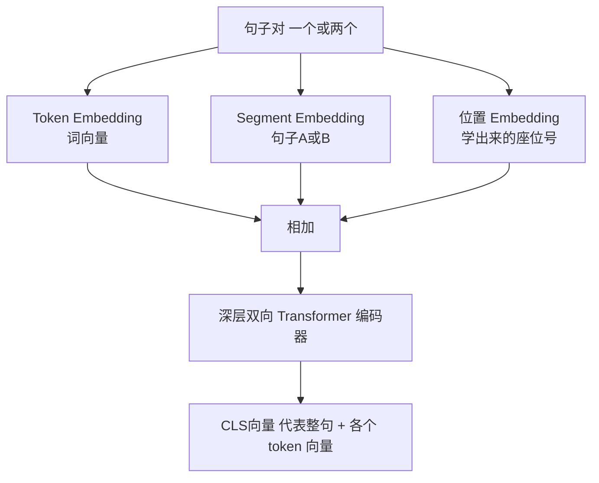

# 🔬 李沐论文精读系列一：四篇经典论文

> [!abstract] 这份文档是干什么的
> 给「零基础小白」准备的 **AI 四大里程碑论文** 通俗精读笔记。围绕李沐《论文精读》系列一整理：
> - **ResNet**：让网络能"更深"
> - **Transformer**：让序列建模能"并行"（→ [[Transformer 面试题]]）
> - **GAN**：让机器会"创造"
> - **BERT**：让迁移学习统治 NLP
>
> 内容已提炼最核心结论，公式尽量跳过，配了比喻 + 图 + 面试要点。

---

## 🧭 一句话概览

| 论文 | 2026 年视角一句话 | 核心贡献 |
|---|---|---|
| ResNet | 打不过就抄近道，跳跃连接让深层网络不再"学不动" | 残差学习 / Shortcut |
| Transformer | 不循环、不卷积，纯靠"注意力"让翻译又快又好 | 自注意力 + 多头 |
| GAN | 造假者与验真者互相监督，逼出以假乱真的生成器 | 对抗训练 |
| BERT | 让预训练模型理解"左右两边"，成就 NLP 标准化底座 | MLM + NSP |

---

## 一、ResNet —— 网络怎么才能"更深"

### 大问题：为什么网络变深反而变差？

> [!warning] 迷惑点
> 深层网络精度变差，**不是过拟合**（训练误差其实也更高），而是**训练不动**了 —— SGD 优化器找不到那个理想解。

理论上，往浅层网络里加层，新层至少可以学成"恒等映射"（输入啥输出啥），精度不该变差。但实际做不到。李沐的解释：**加了残差连接后，模型内在复杂度大大降低了** —— 网络更容易训练出一个"简单模型"来拟合数据。

### 解法：残差学习

- 原来：直接学 `H(x)`（完整映射）
- 现在：只学残差 `F(x) = H(x) − x`，最后输出 `F(x) + x`
- 实现方式：**Shortcut 连接**，跳过一层或多层，把输入直接加到输出上
- 好处：**不增加任何参数**，只多一次加法，计算量不变 → 新层学不好也能降级回简单模型



> [!tip] 与 GBDT 的关系（面试加分）
> GBDT 是在 **label 上**做残差叠加弱分类器；ResNet 是在 **特征上**做残差。技巧老，用对地方就是经典。

### 重要实验结论

| 配置 | 结果 |
|---|---|
| plain 18 层 vs 34 层 | 34 层报错率更高（28.54 vs 27.94）→ 深了反而差 |
| ResNet 34 层 | 报错率降到 **25.03**，比同深度 plain 好很多 |
| ImageNet-152 | 比 VGG 深 8 倍，但计算复杂度更低 → 冠军 |
| CIFAR-10 | 能训练 **1000+ 层** 仍不严重过拟合 |

### 两个工程细节（要会讲）

1. **输入输出维度不一致怎么办**：方案 A 补 0 padding；方案 B（作者选用）用 **1×1 卷积**做投影统一维度；方案 C 全部投影。B 和 C 效果差不多但 B 更省。
2. **Bottleneck 瓶颈结构**（ResNet-50 及以上）：把 `3×3` 卷积前后都包上 `1×1` 卷积降维再升维，比如 256 → 64 → 256，计算量骤减 16 倍，所以 ResNet-50 没比 34 贵太多。

> [!quote] 李沐观点
> ResNet 训练快，是因为残差让**梯度始终包含前层梯度**，不容易消失；SGD 只要能保持较大梯度，就可以一直训练，效果自然好。

---

## 二、Transformer —— 全靠注意力也能做翻译

### 它解决了什么

| RNN 的问题 | Transformer 的方案 |
|---|---|
| 时序依赖 → **难以并行** | 去掉循环，全并行 |
| 长距离衰减 → 远词记不住 | 一次看全序列，路径长度 **O(1)** |
| 内存大（把每个时间步都存下来） | 常量路径长度 |

> [!note] 为什么不用 CNN？
> 卷积感受野小，长序列要靠**很多层**才能把远距离位置关联起来（路径随距离线性/对数增长）；注意力一层搞定。但卷积的"多通道"输出很棒，所以 Transformer 学来了 **多头注意力** 模拟多通道。

### 架构速览（N=6 层堆叠）



- 每个子层都做 **残差连接 + LayerNorm**，公式：`LayerNorm(x + Sublayer(x))`
- 所有子层向量统一 `d_model = 512`（省心，只有 N 和 d_model 两个超参）

### 注意力机制（最核心）

- **Scaling 点积注意力**：`Attention(Q,K,V) = softmax(Q·Kᵀ / √dₖ)·V`
  - Q 与每个 K 点积 → 相似度；除以 **√dₖ** 防止点积太大把 softmax 推到梯度极小区域
- **多头注意力（h=8）**：把 Q/K/V 分别投影到 8 个低维空间（每个 64 维），各自算注意力再拼起来乘 Wᵒ 映射回去
- **为什么要多头**：单头 softmax 归一化导致注意力**互斥**（关注一个就忽略另一个）；多头让不同头关注不同关系，比如"猫—它/调皮/可爱"

> [!example] 三种用途
> 1. **Encoder 自注意力**：Q=K=V，双向全看
> 2. **Decoder 掩码自注意力**：屏蔽未来位置（Softmax 前加 `-inf`），保持自回归
> 3. **编码器-解码器注意力**：Q 来自解码器，K/V 来自编码器输出 → 翻译时知道该看原句哪里

> [!info] 面试要点
> - 为什么用 LN 不用 BN：见 [[15-为什么用LayerNorm而不是BatchNorm]]
> - 为什么 MLP 先升维 2048 再降回 512：先做**特征组合**扩大分辨力，再**去噪**降维
> - Transformer 细节大量已整理进 [[Transformer 面试题]]，此处不再展开

### 位置编码：给词贴"座位号"

注意力本身不关心顺序（把句子倒过来结果一样），所以必须加位置信息。原文用**不同频率的正弦/余弦函数**：

```
PE(pos, 2i)   = sin(pos / 10000^(2i/d_model))
PE(pos, 2i+1) = cos(pos / 10000^(2i/d_model))
```

好处：对任意偏移 k，`PE(pos+k)` 可以表示为 `PE(pos)` 的线性函数 → 便于模型学到"相对位置"关系。

### 训练技巧与结果

- 优化器：Adam（β₁=0.9, β₂=0.98）+ **warmup** 学习率（前 4000 步线性升，之后按步数平方根衰减）
- 正则化：残差 Dropout 0.1 + Label Smoothing 0.1
- 结果：WMT14 英德 **28.4 BLEU**（+2），英法 **41.8 BLEU**（8 卡 P100 训练 3.5 天）

> [!quote] 辩证评价 + 面试答法
> - attention 其实只是**聚合信息**，后面的 FFN / 残差也缺一不可
> - 它不建模序列顺序，却打败了 RNN：因为归纳偏置更"泛"，代价是需要**更大的模型和更多数据**（所以现在模型都巨大）

---

## 三、GAN —— 机器怎么学会"造假"

### 原理：造假者 vs 验真者（一句话比喻）

```
生成器 G（造假者）   从噪声 z → 生成假样本，目标：骗过 D
判别器 D（验真者）   判断输入的是真样本还是假样本
```

> [!success] 理想结局
> 二者互相博弈共同进化，最终 `D(G(z)) = 0.5` —— 判别器彻底分不清真假，说明 G 生成的数据分布**逼近真实分布**。

### 目标函数（能说含义即可）

`min_G max_D V(D,G) = E[log D(x)] + E[log(1 − D(G(z)))]`

- D 想让 `D(x)→1`（真样本判真），`D(G(z))→0`（假样本判假）→ **max** lexically
- G 想让 `D(G(z))→1`（骗过 D）→ 最小化 `log(1−D(G(z)))` → **min**

> [!tip] GAN 的灵感来源
> GAN 本身是**无监督学习**（不需要标注数据），但用**有监督的损失**来训练（标签 = "真实 or 生成"）。这个"自监督"思路后来启发了 **BERT** 等模型。

### 训练难点（面试高频）

| 问题 | 表现 | 原因 / 对策 |
|---|---|---|
| 难以收敛 | 不保证达到纳什均衡 | 梯度下降只在凸函数保证均衡，神经网络难保证 |
| 模式崩溃 | G 退化，只生成一样的样本 | G 发现"糊弄一种答案"就够了，无法继续学习 |
| 自由不可控 | 高维大图效果差 | 不建分布函数，采样太自由 |

> [!note] 引出的改进
> 原始 GAN 早期 G 太弱、D 太好导致 G 梯度消失 → 作者建议 G 改为**最大化 `log D(G(z))`**（有梯度）。后续大量工作都在修收敛不稳的问题。

---

## 四、BERT —— NLP 从此有了"预训练底座"

### 背景：它之前，NLP 没有统一底座

| 模型 | 方向 | 结构 | 缺点 |
|---|---|---|---|
| GPT | 单向（左→右） | Transformer | 只能看左边，理解受限 |
| ELMo | 双向但浅 | RNN | 双向融合太浅，
| BERT | **深层双向** | Transformer 编码器 | 生成不方便 |

> [!success] 核心贡献
> BERT 用 **MLM（完形填空）** 实现了**深层双向预训练** → 一个底座微调就能打 11 项 NLP 任务，GLUE 80.5%（+7.7%）。

### 架构与输入

- `BERT_base`：L=12, H=768, A=12, **1.1 亿参数**（词嵌入 + 自注意力 4H² + FFN 8H² 每层）
- 输入 = Token 向量 + 位置向量 + **Segment 向量**，用 `[CLS]` 开头、`[SEP]` 分隔句子对
- 用 **WordPiece** 分词（词频低就切开成子词，词表保持 3 万）→ 可学习参数才不会都堆在嵌入层



### 两个预训练任务

1. **MLM 遮蔽语言模型（完形填空）**：随机遮 15% 的 token，遮住后——
   - 80% 换 `[MASK]`，10% 换成随机词（噪声），10% 保持不变（避免微调时没见过 `[MASK]` 而错位）
2. **NSP 下一句预测**：50% 是真正的下一句（IsNext），50% 是随机句子（NotNext）→ 学会句子间关系，对问答/推理有用

### 微调：加一层输出层即可

- 分类任务：`[CLS]` 向量 → 分类层
- 问答任务：用「开始向量 + 结束向量」在段落里圈答案区间
- 消融实验结论：**NSP 有用**、**模型越大越好**（预训练充分时可 scale 到极大）、**当特征提取器不如微调**

> [!quote] 为什么 BERT 比同期 GPT 出圈
> 处理"语言理解"类任务（分类、问答、推理）更多，需求大；而且 BERT 的"利用率"远高于 GPT，影响力随之放大。缺点是做**生成**（机器翻译、摘要）不方便 —— 只用了编码器。

---

## 🎯 学习路线建议

> [!success] 与你的规划如何衔接
> 1. **Transformer** → 已深度整理在 [[Transformer 面试题]]，重点啃
> 2. **ResNet / 注意力基础** → 面试常问"为什么需要残差/LN/多头"，两篇一并吃透
> 3. **BERT** → LLM 面试必考，配合「预训练 / 微调 / Prompt」一起理解
> 4. **GAN** → 了解思想即可，重点记住"自监督"这一脉（通往扩散模型）

## 🔗 相关链接

- 面试题库 → [[Transformer 面试题]]
- 主学习规划 → [[README]]
- 原文章：《李沐论文精读系列一： ResNet、Transformer、GAN、BERT》（知乎 · 神洛）