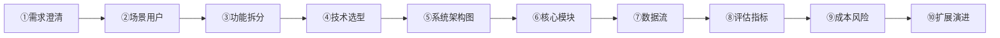

# 🎤 面试准备

> [!abstract] 三块：硬技能 / 系统设计 / 领导力
> 目标岗位：AI 应用开发工程师 / AI 技术负责人

## 一、硬技能高频题

### LLM 基础
- [ ] Token / Context Window / 长上下文管理？
- [ ] Temperature / Top-p 影响什么？
- [ ] 幻觉是什么？缓解手段？
- [ ] 预训练 / 微调 / Prompt / RAG 怎么选？

### Prompt 工程
- [ ] 结构化 Prompt 要素？
- [ ] Few-shot / CoT / 角色扮演什么时候失效？

### RAG
- [ ] RAG vs 微调？
- [ ] 完整 RAG 流程？
- [ ] chunk 怎么切？
- [ ] 检索不准怎么优化？
- [ ] 怎么评估 RAG？
- [ ] 文档级权限隔离怎么做？

### Agent
- [ ] Agent vs 工作流/对话？
- [ ] ReAct / Plan-and-Execute？
- [ ] 多 Agent 架构？
- [ ] 防死循环？
- [ ] Tool Calling 设计与参数校验？
- [ ] MCP 解决什么问题？

### 工程与部署
- [ ] 流式（SSE/WebSocket）为什么？
- [ ] 降级 / 兜底方案？
- [ ] 成本控制手段？
- [ ] 怎么观测 AI 系统？
- [ ] Prompt 注入防护？

> [!tip] 自测方法
> 每题用自己的话讲 1 分钟，讲不顺的就是盲区，打上 `#待补` 标签，集中攻克。

## 二、系统设计题

### 常考题
1. 设计企业知识库问答系统（RAG）
2. 设计智能客服系统（Agent + 人工兜底）
3. 设计 AI 数据分析助手（Text-to-SQL）
4. 设计 Agent 平台

### 万能答题框架



### 必讲细节
- 模型选型理由（效果/成本/延迟/合规）
- 向量库选型理由（数据量/QPS/运维）
- 缓存与降级：主模型挂了怎么办
- 安全：权限、脱敏、审核
- 成本估算：给一个量级

## 三、领导力与软技能（总监必考）

- [ ] 从 0 带一个 AI 团队怎么搭？
- [ ] 业务方提"AI 需求"，第一步做什么？
- [ ] 技术选型冲突怎么决策？
- [ ] 延期/效果不达标怎么处理？
- [ ] 怎么让 AI 项目产生业务价值？
- [ ] 没有管理经验怎么答？（讲带新人/主导方案）

## 四、自我介绍模板

```
我是 X，X 年 Java 后端开发经验。近 3 个月全职转型 AI 应用开发，
完成两个完整项目：
1. 企业知识库 RAG 系统（Spring AI + pgvector，检索命中率 93%）
2. 智能客服多 Agent（人工介入率下降 X%）
我熟悉 LLM 应用全链路：Prompt、RAG、Agent、可观测、成本与安全。
我的定位是能独立设计 AI 系统架构、能带团队落地的 AI 应用负责人。
```

## 五、反问环节（体现总监思维）

- "贵司 AI 应用目前的核心场景和最大瓶颈？"
- "团队在模型选型和 RAG 上的技术栈？"
- "这个岗位 6 个月内的核心目标？"

## 🏷️ 标签

#面试 #系统设计 #领导力 #自我介绍

---
回到 [[01-学习路径总览]]
