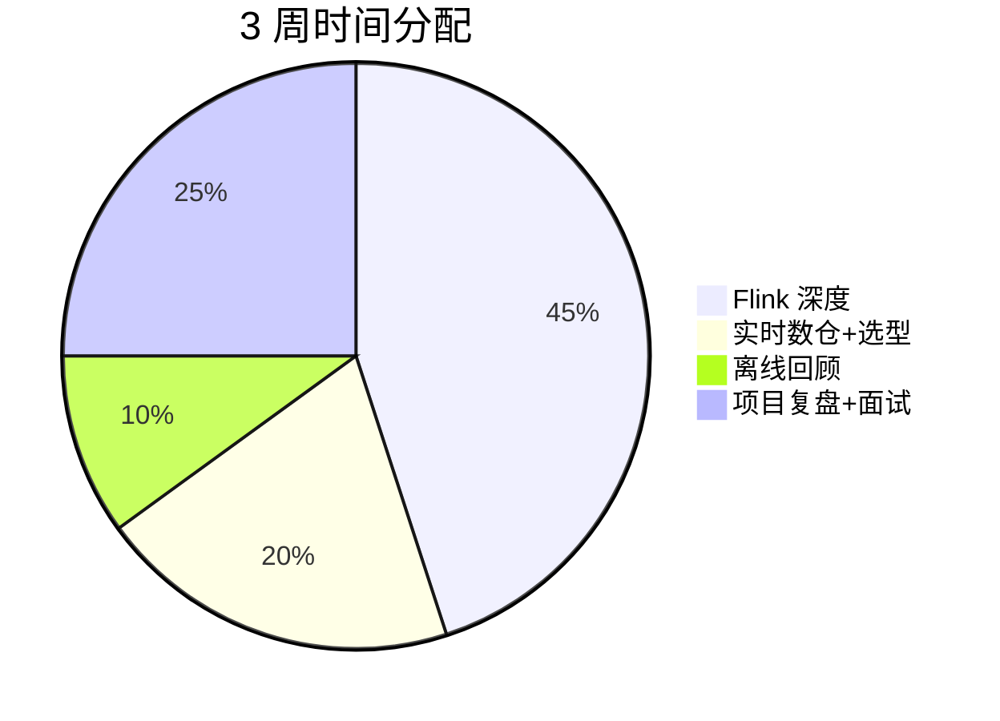

# 🗺️ 大数据 3 周补强路线

> [!tldr] 一句话目标
> **3 周：Flink 从"用过"到"能讲深、能面试" + 实时数仓架构能力。**

> [!warning] 节奏说明
> 你有 1 年经验，**不做基础扫盲**，只做深度补强。
> 每天 4-6 小时即可，与 AI 学习穿插进行（上午 AI / 下午大数据）。

## 精力分配

## 第一周 · Flink 深度补课 ⭐

> [!example] 产出：一个流处理 Demo + 一整套可讲深的知识笔记

| 天 | 主题 | 必懂要点 |
| --- | --- | --- |
| Day 1 | 时间与窗口 | Event time / Watermark / 乱序 / 迟到数据、窗口类型与触发 |
| Day 2 | 状态管理 | Keyed State / 状态后端（RocksDB）、状态 TTL |
| Day 3 | 容错 | Checkpoint / Savepoint / 精确一次（Exactly-Once）|
| Day 4 | 背压与调优 | Backpressure、并行度、资源与吞吐 |
| Day 5 | Flink SQL + CDC | Flink SQL 实战、Flink CDC 抓取 MySQL |
| Day 6 | 生产实践 | 常见故障、监控、任务调优 |
| Day 7 | 复盘 | 整理到 [[02-Flink补课]]，写总结笔记 |

> [!tip] 判断补课标准
> 能对每个主题回答三个问题：**是什么 / 为什么 / 生产上怎么用**，做不到的标 `#待补`。

## 第二周 · 实时数仓 + 存储选型

| 主题 | 要点 |
| --- | --- |
| 实时链路 | Kafka → Flink → 存储 → 查询/服务 |
| OLAP 选型 | Doris / ClickHouse / StarRocks 对比与取舍 |
| 数据湖 | Iceberg / Hudi / Paimon，与实时数仓结合 |
| 数仓分层 | ODS/DWD/DWS/ADS，实时与离线口径统一 |
| 调度与运维 | DolphinScheduler / Airflow 了解即可 |

> [!example] 产出：画一张**实时数仓架构图** + 一份 OLAP 选型对比表

## 第三周 · 项目复盘 + 面试

| 任务 | 要点 |
| --- | --- |
| 复盘过往项目 | 用 STAR 法整理 2 个代表作（含 Flink 场景）|
| 大数据面试题 | 见 [[05-求职与面试]] |
| 与 AI 结合点 | 准备"实时特征 + AI 推理"、"数据平台支撑 RAG"等复合题 |

> [!example] 产出：2 个项目的 STAR 卡片 + 面试题答案库

## ✅ 验收标准

- [ ] Flink 八问（窗口/状态/容错/背压/CDC）都能讲深 5 分钟
- [ ] 画得出实时数仓架构图并讲清选型理由
- [ ] 简历上大数据项目能经得起追问

---
上一页：[[README]] · 下一页：[[02-Flink补课]]
