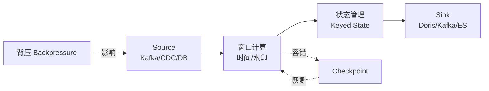

# ⚡ Flink 深度补课（第 1 周）

> [!quote] 本阶段目标
> Flink 从"**跑过任务**"升级到"**能讲深、能面试、能调优**"。
> 有基础，直接按"面试八问"逐个击破，不用从头看入门视频。

## 流处理全景图

## 🔥 面试八问（补课清单）

### 1. 时间与窗口
- [ ] 三种时间：Event / Ingestion / Processing Time
- [ ] **Watermark** 是什么？怎么生成？乱序与迟到数据怎么处理（allowedLateness / sideOutput）
- [ ] 窗口类型：滚动 / 滑动 / 会话 / 全局，触发时机与语义
- [ ] 生产案例：延迟统计、实时大屏（能讲一个）

> [!tip] 高频追问
> "数据晚了 1 分钟，怎么保证结果正确？"——要答出 Watermark + allowedLateness + 延迟数据重算。

### 2. 状态管理
- [ ] Keyed State vs Operator State
- [ ] 状态后端：MemoryStateBackend / FsStateBackend / **RocksDBStateBackend** 区别与选型
- [ ] 状态 TTL、状态大小膨胀怎么解决

### 3. 容错与一致性
- [ ] **Checkpoint** 机制：Barrier、异步快照、增量 Checkpoint
- [ ] Savepoint 与 Checkpoint 区别、手动恢复
- [ ] **Exactly-Once**：Flink + Kafka 端到端精确一次怎么实现
- [ ] 故障恢复策略：RestartStrategy、自动重启

> [!danger] 必考
> "Flink 怎么保证精确一次？"——答案分三部分：Source 位点、Checkpoint、Sink 幂等/两阶段提交。

### 4. 背压与调优
- [ ] 背压原理：Credit-based 反压、如何识别（监控指标）
- [ ] 常见调优：并行度设置、算子链、序列化、资源参数
- [ ] 反压太强怎么定位瓶颈（Source / 算子 / Sink）

### 5. Flink SQL + CDC
- [ ] Flink SQL 核心：动态表、流与表的转换
- [ ] **Flink CDC**：原理（binlog），MySQL → Kafka/Flink 采集链路
- [ ] CDC 到 Doris/StarRocks 的实时同步（这是当前岗位热点）

> [!note] 生产热点
> 现在大量岗位要求 **Flink CDC + 实时数仓**，这个组合必须能亲手跑通。

### 6. 生产实践与故障
- [ ] 常见故障：Checkpoint 失败、OOM、数据倾斜、重复消费
- [ ] 监控告警：延迟、吞吐、Checkpoint 耗时、反压指标
- [ ] 任务部署：Application 模式 vs Per-Job 模式

### 7. 与 Kafka/存储配合
- [ ] Kafka 消费：并行度与分区、Offset 提交方式
- [ ] 端到端链路：Kafka → Flink → Doris/ClickHouse 怎么设计

### 8. 与批处理/流批一体
- [ ] Flink 流批一体理念、Table API 统一
- [ ] Flink vs Spark Streaming 对比（面试高频）

## 📝 补课方法

> [!important] 三步法
> 1. **回忆**：先自己写一遍"这个知识点是什么"
> 2. **对照**：查官方文档/权威文章，找出盲区标 `#待补`
> 3. **落地**：动手写个 10 行 Demo 验证（尤其 Watermark、CDC、Checkpoint）

## 🔧 建议环境

- 本地 Docker 起：Kafka + MySQL + Flink + Doris（一天搭完，全程可演示）
- 参考项目：Flink 官方 examples + Flink CDC 官方示例

## 🏷️ 标签

#Flink #Watermark #状态管理 #Checkpoint #背压 #FlinkCDC #流批一体

## ✅ 验收标准

- [ ] 八问每问能脱稿讲 5 分钟
- [ ] 亲手跑通：Watermark Demo + CDC→Doris 同步
- [ ] 面试被问"Flink 原理"不慌

---
上一页：[[01-学习路径总览]] · 下一页：[[03-实时数仓与存储]]
