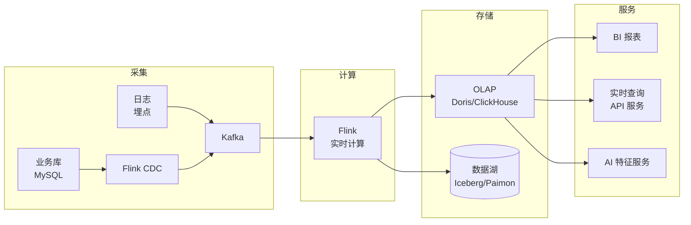

# 🏗️ 实时数仓与存储选型（第 2 周）

> [!quote] 本阶段目标
> 把 Flink 能力接到**真实数仓链路**里，具备"实时数仓架构师"的视野。
> 面试 AI/数据负责人时，能画出完整链路 + 讲清选型。

## 实时数仓全景图

## 数仓分层回顾

> [!note] 经典四层（面试必背）
> - **ODS**：原始数据层（贴源，Kafka/落地）
> - **DWD**：明细层（清洗、宽表）
> - **DWS**：汇总层（指标预聚合）
> - **ADS**：应用层（面向业务/报表/服务）
>
> 要点：**实时与离线口径统一**，避免两套数据对不上。

## OLAP 选型对比

| 维度 | Doris | ClickHouse | StarRocks |
| --- | --- | --- | --- |
| 数据模型 | 明细/聚合/主键 | 列式+局部去重 | 明细/聚合/主键 |
| 实时写入 | ⭐ 强（CDC 友好） | 一般 | ⭐ 强 |
| 高并发查询 | 好 | 好 | 好 |
| 运维成本 | 低（FE/BE） | 低 | 低 |
| 生态 | 社区热，阿里面向 | 大厂广泛 | 类似 Doris |

> [!tip] 结论方向
> 实时数仓新项目**优先 Doris/StarRocks**（CDC 写入友好）；已有 ClickHouse 则继续用它，讲清取舍即可。

## 数据湖了解即可

- Iceberg / Hudi / **Paimon（阿里）** 在流批一体中的定位
- 什么时候需要数据湖：多引擎共享、可更新、需要批流统一

## 本周任务

- [ ] 搭通：MySQL → Flink CDC → Kafka → Flink → Doris 的完整链路
- [ ] 建数仓表：ODS/DWD/DWS 各一层，写一个实时指标任务
- [ ] 画实时数仓架构图（Mermaid 或 Excalidraw）
- [ ] 写《OLAP 选型对比.md》笔记，含业务场景与结论

> [!example] 交付
> 一张架构图 + 一条跑通的实时链路 + 一份选型文档

## 🏷️ 标签

#实时数仓 #Doris #ClickHouse #FlinkCDC #数据湖 #Paimon #数仓分层

## ✅ 验收标准

- [ ] 全链路亲手跑通
- [ ] 被问"实时数仓怎么搭"能画图讲 10 分钟

---
上一页：[[02-Flink补课]] · 下一页：[[04-离线回顾]]
