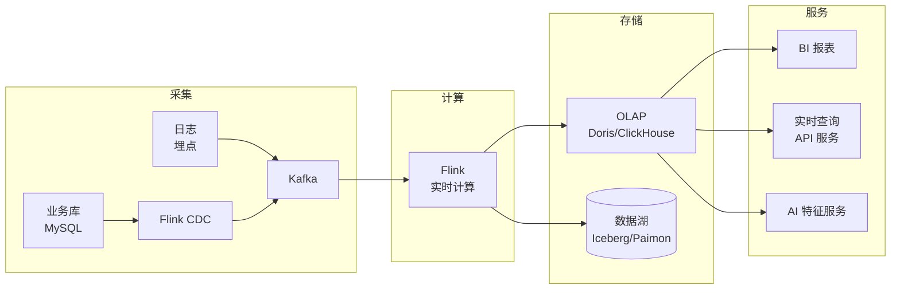

# 🏗️ 实时数仓与存储选型（第 2 周）

> [!quote] 本阶段目标
> 把 Flink 能力接到**真实数仓链路**里，具备"实时数仓架构师"的视野。
> 面试 AI/数据负责人时，能画出完整链路 + 讲清选型。

## 实时数仓全景图

```mermaid
flowchart LR
    subgraph 采集
        A1[业务库<br>MySQL] --> C[Flink CDC]
        A2[日志<br>埋点] --> K[Kafka]
    end
    subgraph 计算
        C --> K
        K --> F[Flink<br>实时计算]
    end
    subgraph 存储
        F --> D[OLAP<br>Doris/ClickHouse]
        F --> H[(数据湖<br>Iceberg/Paimon)]
    end
    subgraph 服务
        D --> R[BI 报表]
        D --> API[实时查询<br>API 服务]
        D --> AI[AI 特征服务]
    end
```

## 数仓分层回顾

> [!note] 经典四层（面试必背）
> - **ODS**：原始数据层（贴源，Kafka/落地）
> - **DWD**：明细层（清洗、宽表）
> - **DWS**：汇总层（指标预聚合）
> - **ADS**：应用层（面向业务/报表/服务）
>
> 要点：**实时与离线口径统一**，避免两套数据对不上。

## OLAP 选型对比

| 维度 | Doris | ClickHouse | StarRocks |
| --- | --- | --- | --- |
| 数据模型 | 明细/聚合/主键 | 列式+局部去重 | 明细/聚合/主键 |
| 实时写入 | ⭐ 强（CDC 友好） | 一般 | ⭐ 强 |
| 高并发查询 | 好 | 好 | 好 |
| 运维成本 | 低（FE/BE） | 低 | 低 |
| 生态 | 社区热，阿里面向 | 大厂广泛 | 类似 Doris |

> [!tip] 结论方向
> 实时数仓新项目**优先 Doris/StarRocks**（CDC 写入友好）；已有 ClickHouse 则继续用它，讲清取舍即可。

> [!important] Doris 深度知识库（本任务存储侧的答案都在这）
> 选型只是入口，「怎么建表 / 怎么导入 / 怎么优化 / 怎么运维」已整理到 `5-bigdata/1-doris/`：
>
> | 主题 | 深度笔记 |
> |---|---|
> | 集群怎么运转 | [[1-架构与原理]]（FE/BE、分区/分桶/tablet、查询流程、存算分离） |
> | 表用哪种模型 | [[2-数据模型]]（Duplicate / Unique-MoW / Aggregate） |
> | 怎么设计才对 | [[3-表设计]]（key 与排序、分区/分桶、设计反模式） |
> | 建表语法与操作 | [[4-建表与分区分桶]]（DDL、动态分区、Schema Change） |
> | 慢 SQL 怎么治 | [[5-查询优化]]（EXPLAIN/PROFILE、Join 四式、物化视图） |
> | 数据怎么进来 | [[6-数据导入与FlinkCDC]]（Stream/Routine Load、label 幂等、CDC→Doris） |
> | 湖仓怎么配合 | [[7-湖仓一体]]（External Catalog、写湖 vs 写 Doris） |
> | 集群怎么管稳 | [[8-运维与调优]]（Compaction、-235、内存、监控） |
> | 三者怎么选 | [[9-对比StarRocks与ClickHouse]] |
>
> 入口：[[0-Doris总览]] · 面试速答：[[10-面试高频题]]
> 上游计算侧见 [[5-bigdata/0-flink/0-Flink总览|Flink 系列]]。

## 数据湖了解即可

- Iceberg / Hudi / **Paimon（阿里）** 在流批一体中的定位
- 什么时候需要数据湖：多引擎共享、可更新、需要批流统一

## 本周任务

- [ ] 搭通：MySQL → Flink CDC → Kafka → Flink → Doris 的完整链路
- [ ] 建数仓表：ODS/DWD/DWS 各一层，写一个实时指标任务
- [ ] 画实时数仓架构图（Mermaid 或 Excalidraw）
- [ ] 写《OLAP 选型对比.md》笔记，含业务场景与结论

> [!example] 交付
> 一张架构图 + 一条跑通的实时链路 + 一份选型文档

## 🏷️ 标签

#实时数仓 #Doris #ClickHouse #FlinkCDC #数据湖 #Paimon #数仓分层

## ✅ 验收标准

- [ ] 全链路亲手跑通
- [ ] 被问"实时数仓怎么搭"能画图讲 10 分钟

---
上一页：[[02-Flink补课]] · 下一页：[[04-离线回顾]]

