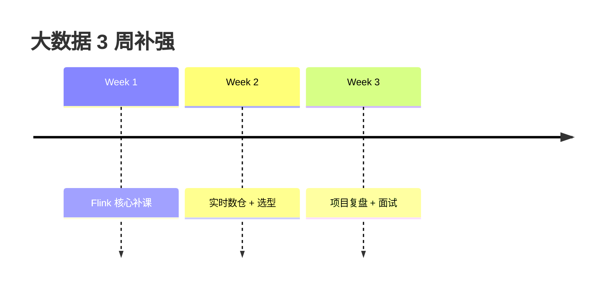

# 📊 大数据学习规划

> [!abstract] 我的定位
> 有 **1 年大数据经验**，需要**补强 Flink + 实时数仓**，补齐 AI+大数据复合能力。
> 目标：AI 开发总监 / 技术负责人（**懂数据平台 + 懂 AI 应用**，才是完整的技术负责人）

> [!info] 核心数据
> - 现状：1 年大数据工作，Flink 最需要补课
> - 周期：**3 周**（与 AI 学习并行或穿插）
> - 原则：**复习为主，升级 Flink 深度**，不从头学
> - 亮点组合：**Java + 大数据平台 + AI 应用** = 稀缺复合背景

## 为什么大数据要学（和 AI 的关系）

> [!tip] 复合定位的价值
> 1. **RAG/Agent 需要数据底座**：知识库、日志、特征都来自数据平台
> 2. **AI 落地要处理实时数据**：实时特征、实时推理、实时监控
> 3. 面试 AI 负责人时，能讲"**数据链路 + AI 应用**"是巨大加分项
> 4. 你已有的 Java + 大数据经验，让 AI 应用开发更有"系统观"

## 🗺️ 学习路线（3 周）

| 周 | 主题 | 产出 |
| --- | --- | --- |
| [[01-学习路径总览#第一周|Week 1]] | **Flink 深度补课** | 流处理全链路 Demo + 知识体系笔记 |
| [[01-学习路径总览#第二周|Week 2]] | 实时数仓 + 存储选型 | 实时链路架构图 + 选型方案 |
| [[01-学习路径总览#第三周|Week 3]] | 项目复盘 + 面试 | 项目 STAR + 面试题库 |

## 📚 文档导航

- [[01-学习路径总览]] —— 3 周主线
- [[02-Flink补课]] —— ⭐ 核心：Flink 深度查漏补缺
- [[03-实时数仓与存储]] —— 实时链路 + OLAP 选型
- [[04-离线回顾]] —— Spark/Hive 快速复习
- [[05-求职与面试]] —— 大数据面试 + 与 AI 结合
- [[每日进度]] —— 打卡汇总

## 🔗 关联计划

- 与 [[AI 学习规划/README|AI 学习规划]] 配合：AI 项目里的数据底座部分用大数据技能支撑

## 🏷️ 全部标签

#大数据 #Flink #实时数仓 #Spark #Kafka #求职

---
*配合 Obsidian：日历打卡、标签聚合、双链跳转均已配置。*
