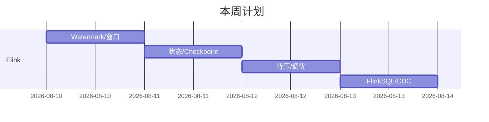

# 📊 大数据学习进度

> [!note] 打卡说明
> 每日打卡统一走 [[AI 学习规划/模板-每日打卡|模板]]，笔记生成在 `AI 学习规划/每日打卡/`（Obsidian 日历已配置）。
> 本页只做**里程碑追踪**。

## 里程碑

- [ ] 第 1 周：Flink 八问全部能讲深 ✅/❌
- [ ] 第 2 周：实时链路（CDC→Doris）跑通 ✅/❌
- [ ] 第 2 周：实时数仓架构图画完 ✅/❌
- [ ] 第 3 周：2 个项目 STAR 卡片完成 ✅/❌

## 待补清单（#待补）

> 学习过程中卡壳的知识点，随手在此追加，集中攻克：

- [ ] （示例）Watermark 与 allowedLateness 的具体代码写法
- [ ] （示例）RocksDB 状态后端参数调优

## 本周甘特图

## 关联

- 计划：[[01-学习路径总览]] · 核心：[[02-Flink补课]]
- 主线：[[AI 学习规划/README|AI 学习规划]]（复合定位）

---
回到 [[README]]
