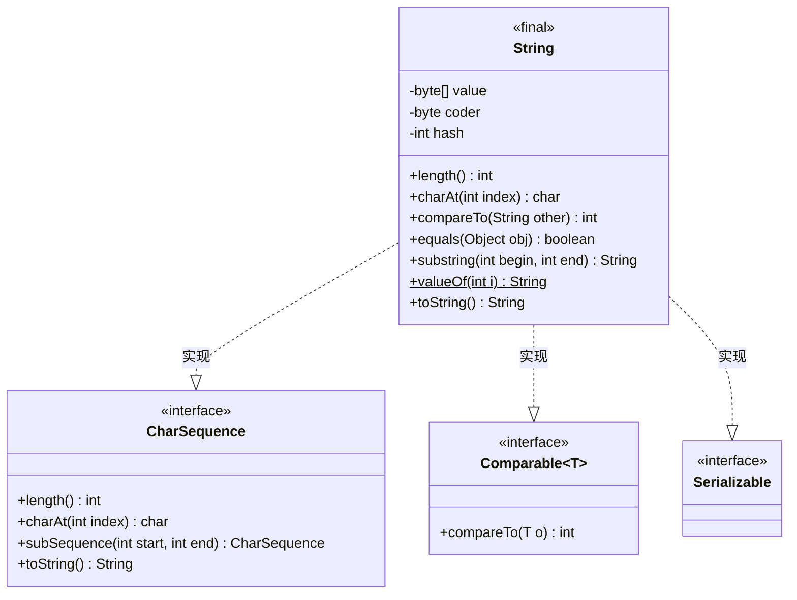
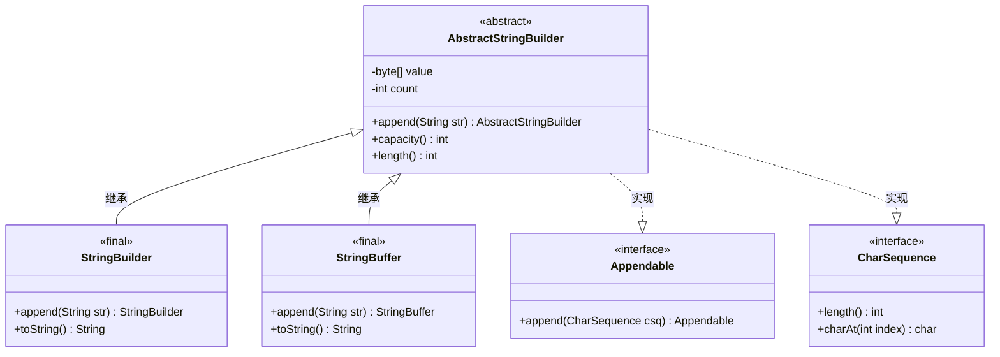

# String 相关类图

用 Mermaid 绘制的 `java.lang` 中 String 家族的类图，重点演示两种关系：

- **继承**：实线 `<|--`，三角指向父类
- **实现**：虚线 `..|>`，三角指向接口

> 说明：JDK 9 起 `String` 内部改用 `byte[] value` + `byte coder` 实现「紧凑字符串」（compact strings）；JDK 8 及更早版本用 `char[] value`。

## 1. String 与它实现的接口（实现关系）

> `String ..|> CharSequence` 表示 String 实现 CharSequence 接口。实际代码里 String 实现的是 `Comparable<String>`（即 `Comparable~T~` 的 `T` 绑定为 String）。`Serializable` 是标记接口，没有方法。方法名后带 `$` 表示 `static` 方法。

## 2. StringBuilder / StringBuffer 继承体系（继承关系）

> `AbstractStringBuilder <|-- StringBuilder` 表示 StringBuilder 继承 AbstractStringBuilder（三角指向父类）。`AbstractStringBuilder` 实现 `Appendable` 和 `CharSequence`，两个子类通过继承自动获得这些实现。为清晰起见，本图省略了部分标记接口等细节。

## 关系符号速查

- 继承：`父类 <|-- 子类`（实线，三角指向父类；反向写 `子类 --|> 父类`）
- 实现：`实现类 ..|> 接口`（虚线，三角指向接口；反向写 `接口 <|.. 实现类`）
- 组合：`*--`
- 聚合：`o--`
- 关联：`-->`
- 依赖：`..>`
- 普通连接：`--`（实线）/ `..`（虚线）

## 参考资料

- [Mermaid 官方类图文档](https://mermaid.js.org/syntax/classDiagram.html)