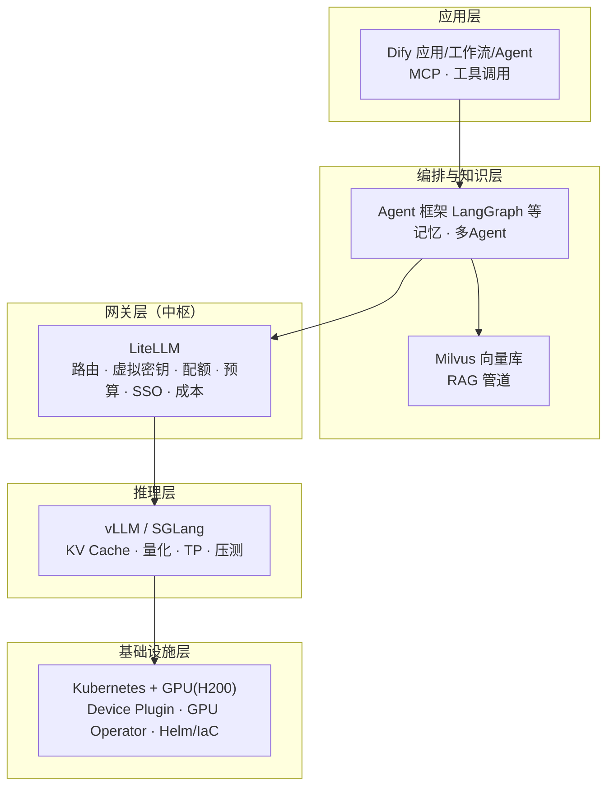
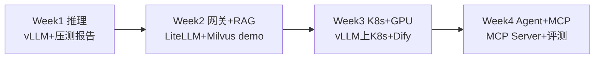

# 🎯 AI运维 & AI架构师 · JD 整理与学习清单

> [!abstract] 一句话判断
> 这是同一家（做**包网/棋牌平台、SaaS** 的公司）放出的**一条 AI 工程化路线的两个级别**：
> **AI运维 = 把 AI 平台跑稳跑快**（GPU/K8s/推理/网关/向量库），**AI架构师 = 把 AI 能力做成平台与规范**（MCP网关/Agent编排/评测门禁/带团队）。
> 两个岗都要求 **6 天制**、高压。架构师要多 10-20K，但硬门槛是 **3 年团队管理 + 0到1 建平台**。
> 共同的硬主线：**LiteLLM 网关 + vLLM/SGLang 推理 + Milvus/RAG + Dify/Agent + K8s/GPU**。

---

## 1. 岗位 A：AI运维工程师（30-50K）

### 定位

横跨**基础设施 / 模型服务 / 应用开发**的混合岗：底层把 GPU 与大模型服务跑稳跑快，往上做向量检索、RAG 管道与 AI 应用落地。以 **LiteLLM AI 网关为中枢**，统一纳管 GLM / DeepSeek / GPT / Gemma / Qwen 等自建模型。

### 职责聚类（10 条 → 6 块）

| 块 | JD 原条目 | 关键词 |
|---|---|---|
| ① AI 网关 | 1 | LiteLLM：多模型接入、路由与负载均衡、**虚拟密钥/API Key**、多租户/团队配额、限流与预算、SSO、用量统计与成本核算、高可用低延迟 |
| ② 推理服务 | 2 | vLLM / SGLang、OpenAI 兼容 API、压测调优：**吞吐 / 首 Token 延迟(TTFT) / 并发 / KV Cache / 量化(FP8·INT8) / 张量并行(TP)** |
| ③ GPU + K8s | 3 | H200 集群、资源规划调度、**Device Plugin / DRA / NVIDIA GPU Operator**、显存算力隔离与利用率、驱动 / CUDA |
| ④ 向量库 + RAG | 4 | **Milvus** 部署运维、RAG 管道：**切分 → Embedding → 入库 → 检索** |
| ⑤ 应用平台 + Agent | 5、6 | **Dify** 部署运维与业务对接、工作流/Agent 搭建、**MCP / 工具调用** 内部落地 |
| ⑥ 治理 | 7、8、9、10 | 成本与容量规划、安全（**Vault**、内容审核、Prompt 注入防护、脱敏）、故障定位（**OOM / 掉卡 / 推理超时 / 网关雪崩**）+ SOP + 监控告警、**Helm / IaC** 自动化 |

### 任职要求（含优先项）

- 经验：3 年+（AI 基础设施 / 大模型服务 / 平台工程 / 后端均可）
- **硬技能**：精通 K8s（生产级）· LiteLLM 实战 · vLLM/SGLang 至少一种 · Milvus · Dify · Helm/IaC · Python/Go/Shell 至少一门 · Linux/网络/存储/GPU驱动
- **软性**：重度 AI 使用者（Cursor / Claude Code / Copilot + 高质量 Prompt）
- 优先：微调（LoRA / SFT / DPO / GRPO）· 压测实战（MoE / FP8 / 多实例）· 多云出海 GPU（AWS / 阿里云 / GCP 海外）· MCP/复杂 RAG 落地 · AI 安全实践 · **CKA/CKAD/CKS** 或开源贡献

---

## 2. 岗位 B：AI架构师（40-70K）

### 三大核心方向

| 方向 | 内容 |
|---|---|
| ① AI 基础设施架构 | **MCP 统一网关、Agent 编排调度平台、RAG 知识底座、Skill 插件分发体系** |
| ② 工程质量门禁 | **AI Harness 评测体系、Golden Set 质量卡点、RSWC 四层 Vibe Coding 规范**、内部 AI 工具链 |
| ③ 落地与培训 | 业务深度集成与规模化交付、分层培训布道、最佳实践案例库 |

### 任职要求聚类

- **管理**：5 年+ 平台/基础架构开发、3 年+ 团队管理、**0到1 建平台**经历、抗压、跨部门（技术/产品/安全/业务）对齐
- **工程底座**：Go / Python / Java 至少一门生产级；微服务、分布式、高并发高可用海量数据；SaaS 多租户；TCP/UDP/HTTP/WebSocket/gRPC；关系型/NoSQL/**向量**/时序数据库 + Redis/Kafka/RabbitMQ；K8s 原理 + DevOps
- **LLM 工程化**：Prompt Engineering、Function Calling、**Token 预算管理、上下文窗口**
- **Agent**：LangGraph / CrewAI / AutoGen / ADK 至少一种；多 Agent 协作、工具调用、记忆管理
- **MCP/A2A**：Server/Client 架构，有 MCP Server 开发或集成经验优先
- **RAG 全链路**：向量检索、**混合检索、Rerank、引用溯源**；LangChain / LlamaIndex 实战
- **AI 评测**：Golden Set / Evaluator / 自动化回归，**CI/CD 中嵌入自动化评测**
- **AI 编程工具**：Claude Code / Cursor / Copilot / Codex 深度使用，对 Vibe Coding 有自己的判断
- 加分：工具链开发（Linter / AST / Compiler Plugin / IDE Plugin）· 自研 Agent 或 AI Coding 工具（**Claude Code Hooks / Skills / MEMORY.md 体系**）· AI 安全（注入防御 / 敏感命令拦截 / 沙箱）· 海外高并发 SaaS · 技术影响力（尤其 MCP Server / Agent Skill / 评测工具开源）

---

## 3. 两个 JD 合并后的技能全景图

> [!tip] 记忆口诀
> **一张图 = 一条请求的路径**：用户在 Dify 里提问 → Agent/编排决定调什么 → 检索 Milvus 知识 → 经 LiteLLM 网关选模型/限流记账 → vLLM 在 K8s 的 GPU 上出 Token。
> 面试时能沿这条链路从上讲到下、每层说出 2 个关键机制，JD 就吃透了。

---

## 4. 匹配度与差距（对照现状）

| JD 要求 | 现状 | 结论 |
|---|---|---|
| Python/Go/Shell 一门 | Java 十几年 + Shell，Python/Go 弱 | ⚠️ Python 必补（AI 生态第一语言）；Go 是架构师加分 |
| K8s 生产级 + GPU 调度 | K8s 薄弱，GPU/CUDA 未碰 | ❌ **最大缺口**，P0 |
| vLLM/SGLang + 推理调优 | 无 | ❌ P0，概念多但上手不难 |
| LiteLLM 网关 | 无 | ❌ P0，两岗共同中枢，必须亲手搭 |
| Milvus + RAG 管道 | 有 Spring AI RAG demo（pgvector） | ⚠️ 概念已通，缺 Milvus 与工程化管道 |
| Dify / Agent / MCP | 笔记有概念（[[面试准备/专业技能/01-AI应用工程化]]），无落地 | ❌ P0-P1 |
| AI 评测 / Golden Set | 无 | ❌ 架构师岗核心考点，P1 |
| 微服务/分布式/高并发/DB | 主场（Redis/Kafka/MySQL 调优） | ✅ 架构师 JD 的后端硬要求基本全覆盖 |
| 重度 AI 使用者 + Prompt | 日常深度使用 AI 编码工具 | ✅✅ 差异化亮点，两个 JD 都明确要 |
| 团队管理 3 年+ | 有主导项目/带教，正式头衔少 | ⚠️ 冲架构师才需要，话术同 [[面试准备/冠顿/01-管理面与负责人题]] |

> [!warning] 优先级判断
> 运维岗的门槛是 **K8s/GPU + 推理 + 网关** 这条硬链路；架构师在这之上再加 **Agent/MCP/评测/管理**。
> **先按运维岗的技能树学**（覆盖面就是架构师的下半层），学到位后两个岗都能投；管理话术单独备一份。

---

## 5. 学习清单（按优先级）

> [!example] 图例
> **P0** = 硬门槛，面试必问、必须动手 · **P1** = 高频加分 · **P2** = 了解即可/长期

### P0 · 必学（动手为主，每项要有产出）

| # | 主题 | 学什么 | 产出物 |
|---|---|---|---|
| 1 | **Python + Linux/CUDA 基础** | Python 异步/类型注解；nvidia-smi、驱动/CUDA 版本对应、显存查看 | 能写脚本调 OpenAI 兼容 API 并统计 token 成本 |
| 2 | **vLLM 推理服务** | 部署 Qwen/DeepSeek 小参模型；OpenAI 兼容 API；KV Cache/PagedAttention、Continuous Batching、量化（FP8/INT8/AWQ/GPTQ）、TP | 一份压测报告：吞吐/TTFT/并发曲线 + 量化前后对比 |
| 3 | **LiteLLM 网关** | 多模型代理、路由/fallback、虚拟密钥、团队/预算/限流、用量与成本统计、Postgres+Redis 后端 | 带密钥管理和成本报表的本地网关 demo |
| 4 | **K8s + GPU 调度** | 生产 K8s 运维；NVIDIA Device Plugin / GPU Operator；显存分配与利用率；Helm 装 vLLM | K8s 上跑起 vLLM 的拓扑图 + 排障笔记 |
| 5 | **Milvus + RAG 管道** | Milvus 部署（Docker/Helm）、索引（HNSW/IVF）、切分策略、Embedding 选型、召回 + Rerank | 端到端知识库问答（可演示，替换掉 demo 里的 pgvector） |
| 6 | **Dify** | 部署、工作流编排、知识库挂接、业务对接 | 用 Dify 搭一个走自建网关的应用 |

### P1 · 高频加分

| # | 主题 | 学什么 |
|---|---|---|
| 7 | **Agent 框架** | LangGraph 深入一个（ReAct/工具调用/记忆/多 Agent），CrewAI/AutoGen/ADK 知道定位差异 |
| 8 | **MCP** | Server/Client 架构、用 Python/TS 写一个 MCP Server 并接入 Claude Code；A2A 概念 |
| 9 | **AI 评测** | Golden Set 构建、Evaluator、自动化回归、嵌入 CI/CD；理解"AI Harness 评测体系"怎么讲 |
| 10 | **SRE + 安全** | OOM/掉卡/超时/雪崩的定位 SOP；Vault 密钥治理、Prompt 注入防护、内容审核、脱敏 |
| 11 | **Helm / IaC** | 自己写一个 Chart；Terraform 或 ArgoCD 声明式管理 |

### P2 · 了解即可 / 长期

- 微调：LoRA / SFT / DPO / GRPO 概念 + 跑通一次 LoRA（加分项，不必深）
- Go 语言（架构师 JD 点名，配合后端经验转）
- 多云出海 GPU（AWS/GCP 海外 region）、SGLang 对比 vLLM、MoE 部署
- CKA 认证、开源贡献（MCP Server / Agent Skill / 评测工具是 JD 点名方向）
- Claude Code Hooks / Skills / MEMORY.md 体系（你天天用，整理成话术就是加分答案）

---

## 6. 四周上手路线（在职节奏）

| 周 | 目标 | 验收 |
|---|---|---|
| Week 1 | 租一张卡（AutoDL/RunPod 均可），vLLM 部署 + 压测 | 能报出数字：吞吐 / TTFT / 并发 / 量化对比 |
| Week 2 | LiteLLM 网关 + Milvus RAG 端到端 | 一个带密钥、配额、成本统计的知识库 demo |
| Week 3 | K8s（kind 或云）+ GPU Operator + Dify | vLLM 跑在 K8s，Dify 走网关调用，画出全链路图 |
| Week 4 | LangGraph Agent + MCP Server + Golden Set 评测 | 一个可演示 Agent + 一份评测报告 |

> [!tip] 边学边沉淀
> 每周的产出各写一篇笔记/博客 —— JD 的优先项里**技术影响力、开源贡献**都点名了；面试时"我按这份 JD 自学了四周，产出是这四样"本身就是最强话术。

---

## 7. 面试最小可讲清单（学完必须能答）

- [ ] 一条请求从 Dify 到 GPU 的**全链路**讲 5 分钟（每层 2 个机制）
- [ ] vLLM 为什么快：PagedAttention / Continuous Batching / 前缀缓存
- [ ] 量化怎么选：FP8 vs INT8 vs AWQ/GPTQ，精度-显存-速度的取舍
- [ ] LiteLLM 的虚拟密钥/预算/限流怎么设计，网关怎么做到高可用
- [ ] GPU 在 K8s 里怎么调度：Device Plugin vs DRA vs GPU Operator
- [ ] 模型 OOM / GPU 掉卡 / 网关雪崩的排查步骤（SOP 口径）
- [ ] RAG 管道：切分→Embedding→入库→召回→Rerank→溯源，Milvus 索引怎么选
- [ ] MCP 是什么、Server 怎么写、和 Function Calling 的关系
- [ ] Golden Set / Evaluator 怎么落到 CI/CD
- [ ] Prompt 注入怎么防、密钥怎么治（Vault）

---

## 🔗 关联

- [[面试准备/专业技能/01-AI应用工程化]] · LLM 工程化、RAG、Agent 已有底子
- [[面试准备/专业技能/06-自动化运维Shell]] · Shell 运维底子
- [[面试准备/冠顿/00-JD与匹配分析]] · 管理面话术可复用
- [[AI 学习规划/01-学习路径总览]] · 已有的 8 周 AI 路线（偏应用开发，本 JD 偏基础设施，互补）
- 原始 JD：附件《AI岗位JD.txt》（两个岗位、含优先条件与薪资）

#面试 #JD #AI运维 #AI架构师 #大模型 #LiteLLM #vLLM #Milvus #Dify #K8s
