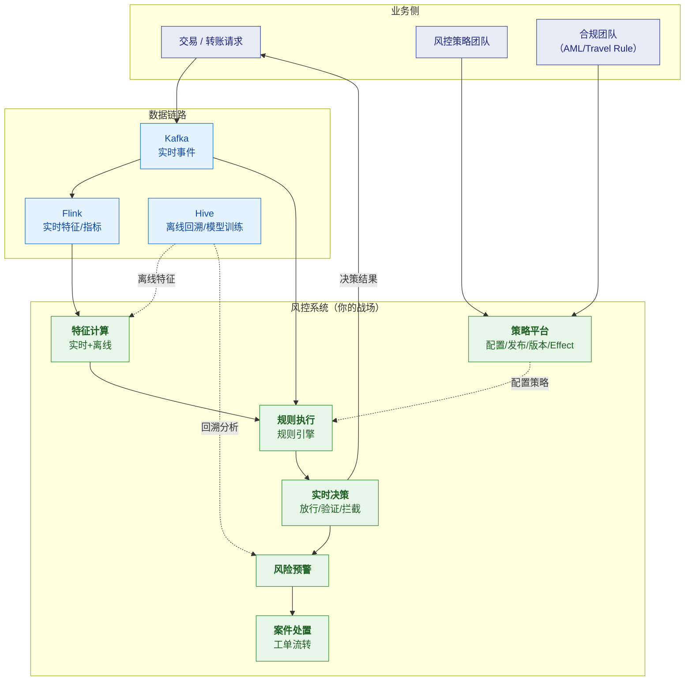
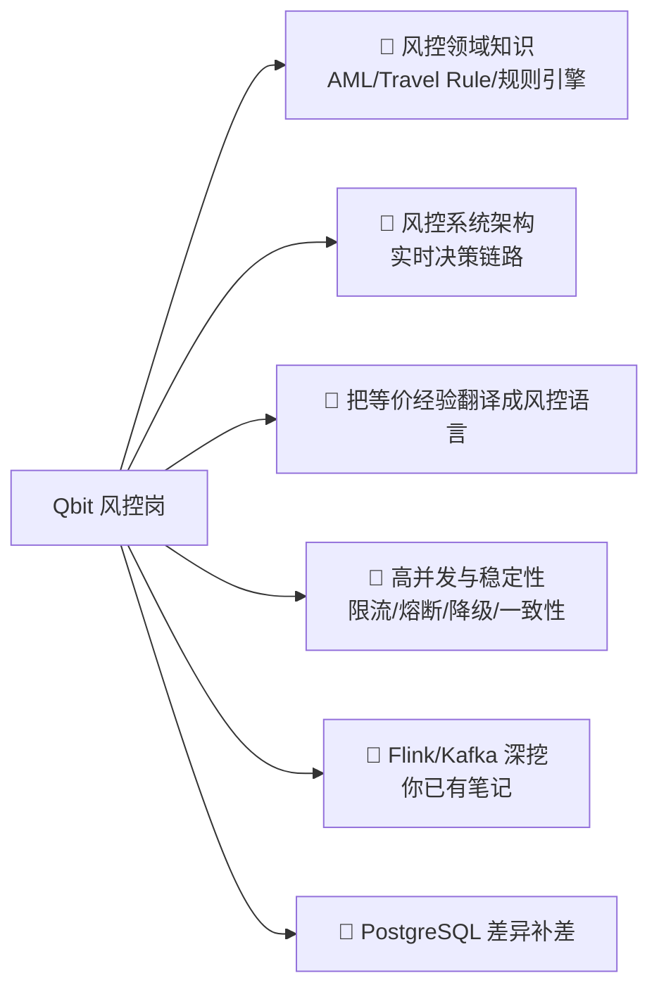

# 🎯 Qbit（趣比汇）· 高级研发工程师（风控方向）

> [!abstract] 一句话判断（先说结论）
> **这是一个"跨境支付 + 区块链"公司的风控研发岗，技术栈是 Java/Kafka/Flink/Hive + PostgreSQL，
> 核心业务是 AML（反洗钱）、Travel Rule、交易风控。**
>
> **它的本质是：给"钱的流动"做实时裁判**——
> 每一笔跨境转账/加密货币划转，都要在**毫秒级**判断：放行、验证、还是拦截。
>
> **你的匹配情况**：
> - ✅ **技术骨架高度匹配**：Java + 并发 + Spring Cloud + Kafka + Flink + Hive + MySQL，**你几乎全占**
> - ⭐ **你做过风控系统**（规则引擎 / 反欺诈 / 处置流程）——**这不是转行，是场景切换**
> - 🔴 **唯一缺口**：**金融支付场景的合规知识**（AML 监管要求 / Travel Rule 标准 / 名单筛查惯例）
> - 🚩 **两个必须先确认**：① **后端主力语言是不是 Java**（尽调未证实）② **合同主体与期权主体**（双层结构）
> - ⚠️ **薪资 15-25K 明显偏低**（杭州同类岗位市场价 25-45K）

---

## 1. JD 原文（整理版）

| 项 | 内容 |
|---|---|
| 岗位 | **高级研发工程师（风控方向）** |
| 公司 | 杭州趣比汇网络科技有限公司 · **Qbit / QBIT** · **B 轮** · 100-499 人 · 互联网 |
| 地点 | 杭州**上城区平安金融中心 C 座 18F**（近 9 号线新业路站） |
| 薪资 | **15-25K** |
| 经验/学历 | **3-5 年 / 本科** |
| HR | 朱女士，今日回复 10+ 次 |
| 标签 | AML、PostgreSQL、分布式经验、Java、Kafka、SpringCloud、风控、Flink、Hive、**Travel rule**、MySQL、**交易风控**、**区块链经验** |

### 岗位职责（6 条，按"性质"归类）

| # | 原文要点 | 性质 |
|---|---|---|
| 1 | 风控系统的设计、开发与维护，包括**风险特征计算、规则执行、实时决策、风险预警、案件处置** | 🧠 **风控核心链路** |
| 2 | 基于 **Kafka、Flink、Hive** 建设**实时与离线数据处理链路**，支持**交易行为分析、风险指标计算、历史数据回溯** | 🔧 **数据链路（你的主场）** |
| 3 | **规则配置、策略发布、版本管理和效果监控**，提高风控策略的**上线效率与可追溯性** | ⚙️ **策略平台（平台化能力）** |
| 4 | 优化**高并发交易链路**中的风控服务，运用**限流、熔断、异步化**，保障**低延迟、稳定性与数据一致性** | 🚀 **高并发（你的王牌）** |
| 5 | 与**产品、风控策略、合规及业务团队**协作，把**风险识别和合规需求转化为技术方案** | 🤝 **跨团队 + 合规** |
| 6 | 系统监控、线上问题排查、性能优化；**独立完成需求分析→方案设计→开发上线→改进** | 🔧 **全流程独立作战** |

### 任职要求（已见部分）

1. **Java 基础扎实**，熟悉**并发编程、JVM 及常见性能优化**；熟悉 **Spring Boot、Spring Cloud**…
2. （截图截断，推测还包含：Kafka/Flink/Hive、风控经验、区块链/Travel Rule 相关）

> [!important] 关键洞察：这个岗位要的是"两栖人才"
> 把 6 条职责拆开看，它其实要**两种能力的交集**：
>
> | 能力 | 对应职责 | 稀缺度 |
> |---|---|---|
> | **数据工程**：Kafka + Flink + Hive 建实时/离线链路 | 2 | 常见 |
> | **风控业务**：AML / Travel Rule / 规则策略 / 案件处置 | 1、3、5 | **稀缺** |
> | **高并发服务**：限流熔断、低延迟、一致性 | 4 | 常见 |
>
> **三者交集的人很少**——会 Flink 的不懂 AML，懂 AML 的往往不是研发。
> **所以这个岗位的门槛不在"技术多难"，而在"你懂不懂这个业务"。**

---

## 2. 匹配度分析

### ✅ 你的硬匹配（比想象中好）

| JD 要求 | 你的情况 | 结论 |
|---|---|---|
| **Java 基础扎实** | 十几年 Java，简历写"精通 Java、高并发编程" | ✅ **超配** |
| **并发编程 / JVM / 性能优化** | [[面试准备/专业技能/02-Java核心与微服务]]、[[1-java/4-jvm/0-JVM总览\|JVM 系列]] 已备 | ✅ 主场 |
| **Spring Boot / Spring Cloud** | 简历明确写了框架源码级 | ✅ |
| **Kafka** | [[3-mq/2-Kafka/10-面试高频题\|Kafka 高频题]] 已备；回收平台/机器人项目用过 MQ | ✅ |
| **Flink** | [[5-bigdata/0-flink/0-Flink总览\|Flink 系列]] + [[5-bigdata/0-flink/10-面试高频题\|高频题]] 已备 | ✅ **有体系化准备** |
| **Hive** | 服务器巡检里有 Hive 实操；[[1-java/10-数据仓库/0-数据仓库总览\|数仓系列]] 刚建好 | ✅ |
| **MySQL** | 精通级，[[面试准备/专业技能/04-数据库调优]] | ✅ |
| **PostgreSQL** | ⚠️ 主力是 MySQL | 🟠 **需补差异点**（见风险三） |
| **分布式经验** | 十几年，分布式事务/幂等/一致性都有 | ✅ |
| **限流、熔断、异步化** | [[面试准备/冠顿/05-并发]]、[[面试准备/冠顿/08-消息]] 已备 | ✅✅ **这是你的强项** |
| **数据一致性** | [[面试准备/冠顿/04-事务一致性]]、对账经验 | ✅✅ **对账经验在这里极值钱** |

### 💎 你的"等价经验"（被低估的资产）

> [!success] 风控系统里的很多机制，你在业务系统里已经做过
> **关键是把它们"翻译"成风控语言**——这是本场面试最重要的技巧。

| 风控概念 | 你的等价经验 | 怎么讲 |
|---|---|---|
| **规则引擎** | 回收平台的**风控防刷**（频次限制、异常重量识别、黑名单、规则可配置） | ⭐ **你做过真风控**！"避免硬编码、规则+阈值可配置"正是规则引擎的核心思想 |
| **实时决策** | 积分扣减的**Redis+Lua 原子校验**、下单前置校验 | "决策要在毫秒内给出，且不能因为并发出错" |
| **风险特征计算** | 设备上报的**异常值剔除**（超阈值挂起转人工） | "特征本身要可信，脏特征会放大误判" |
| **限流熔断** | [[面试准备/冠顿/05-并发\|冠顿并发篇]] 已备 | "风控服务串在交易链路上，它挂了不能拖垮交易" |
| **数据一致性** | 积分**三账体系**（可用/冻结/累计）+ **T+1 对账** | ⭐ **对账 = 风控的兜底审计**，这个类比极强 |
| **案件处置 / 工单** | 对账差异**分三类生成工单流转**、异常工单 | ⭐ **和"案件处置"几乎一模一样** |
| **状态机** | 任务状态机（待分配→配送中→已完成） | 处置流程也是状态机 |
| **幂等** | 设备重复上报去重、唯一键 | 风控事件不能重复计分/重复拦截 |
| **可追溯/版本管理** | 对账差异留痕、补数工单 | ⭐ **"策略版本可追溯"和"变更留痕"是同一件事** |

> [!important] ⭐ 面试的核心策略：**你不是转行者**
> **你做过风控系统（规则引擎 / 反欺诈 / 处置流程）**，
> 所以**不要说"我没做过风控"**——那是自我贬低，而且不真实。
>
> **正确说法**：
> **"我做过风控系统——规则引擎和反欺诈我有实际经验，
> 只是场景是电商/IoT 的业务风控，不是金融支付。
> 工程骨架我是通的，缺的是这个场景的合规规则。"**
>
> 用上表把规则引擎、处置流程、对账一条条映射过去，
> **然后把话题引向技术深挖——那是你的主场**。
>
> ⚠️ **说有经验就一定会被深挖**（规则怎么配置/冲突怎么处理/效果怎么监控），
> **务必提前准备，且只讲真实做过的**。详见 [[04-追问链模拟与口播稿]] 的 Q2、Q3。

### 🔴 风险点（按致命程度）

#### 风险一：**金融支付场景的合规知识**（唯一实质缺口）

> [!danger] 这是唯一的缺口，但它是"场景知识"而非"能力缺失"
> 面试官会问：
> - "**Travel Rule 是什么？技术实现上要解决什么问题？**"
> - "**AML 的交易监控怎么做？阈值规则和模型怎么配合？**"
> - "**名单筛查（Sanctions Screening）怎么做？误报怎么处理？**"
> - "**KYC / KYB / KYT 分别是什么？SAR/STR 又是什么？**"
>
> ⚠️ **注意区分**：这些是**监管与行业知识**，不是"风控系统怎么做"。
> **风控系统的工程骨架你是通的**——特征、规则、决策、处置、可追溯。
> 缺的是**金融场景下这些环节的合规规则**。

**应对**：[[01-风控领域知识速成]] 全覆盖，**这是本次准备的重点**。

#### 风险二：**后端主力语言可能不是 Java** 🚩 最实际的匹配风险

> [!danger] 尽调发现：找不到 Qbit 用 Java 的任何证据
> - **唯一直接线索**：2020 年 CNode 发布的 **「Node.js 全栈工程师」** 招聘（15K-30K）
> - **没有工程博客、没有 GitHub 组织、没有技术演讲**
> - 开发者文档用 ReadMe.io（SaaS），基础设施用阿里云 OSS 杭州节点
>
> **两种可能**：
> 
> | 可能 | 说明 | 影响 |
> |---|---|---|
> | A. 确实是 Java | JD 标签明确写了 Java/SpringCloud/Kafka/Flink，**大概率是真的** | ✅ 匹配 |
> | B. 主力仍是 Node.js | 历史系统是 Node，后来部分转型 | 🚩 **你的专精无法施展** |
>
> **最可能的解读**：JD 上的 Java 栈是**"目标栈"或"新增团队栈"**，历史系统可能是 Node.js。
>
> 👉 **必须问**："**我们后端主力语言是什么？现有风控系统是 Java 还是 Node.js？**"

#### 风险三：**双层主体结构**（合同在境内，牌照在境外）

> [!warning] 已核实
> - **杭州趣比汇**：注册资本 5000 万，⚠️ **认缴至 2049 年**，⚠️ **经营范围无金融牌照**
> - **AILINGUAL LIMITED（香港）**：真正的 **MSB/MSO/TCSP/FINTRAC/Visa 主会员** 持有方
>
> **含义**：裁员赔付能力与"150 亿美元交易额"的体量**不对等**；期权若挂境外主体，**变现路径复杂**。
>
> 👉 **必须问**："劳动合同主体是杭州趣比汇吗？股权激励挂哪个主体？"

#### 风险四：**PostgreSQL 不是你的主力**（难度：低）

> [!note] 这只是技术细节，不是能力门槛
> 应对：准备"**MySQL vs PostgreSQL 关键差异**"的迁移话术，
> 并**挂到业务上**（见 [[02-风控系统架构与技术深挖题]]）：
> **JSONB 存规则配置、`pg_trgm` 做名单模糊匹配**。
> ⚠️ **不要说"PostgreSQL 我很熟"**，要说"**MySQL 我用得深，PostgreSQL 的差异点我清楚**"。

#### 风险五：**薪资 15-25K 对你偏低**

| 对比 | 薪资 |
|---|---|
| **杭州跨境支付风控研发（市场价）** | **25-45K** |
| **Qbit JD 标注** | ⚠️ **15-25K** |
| 冠顿（后端负责人） | 20-25K |

👉 详见 [[03-公司情报与决策建议]] 的谈薪部分。**建议见面前就问清薪资。**

---

## 3. 这个岗位的真实画像

> [!important] 从图里能读出三件事
> 1. **你的主战场在第 2 条职责（数据链路）和实时决策链路上**——
>    这正是你 Flink/Kafka/Hive 能力能直接落地的地方
> 2. **风控服务是"串在交易链路上"的**——所以它必须**低延迟、高可用、能降级**，
>    这直接对应职责 4（限流熔断异步化），**也是你的强项**
> 3. **策略平台（职责 3）是"给策略同学用的工具"**——
>    做好它的关键是**让不懂代码的策略人员能安全地改规则**，
>    这和你做过的"规则可配置、避免硬编码"是同一个思路

---

## 4. 复习优先级

| 优先级 | 内容 | 去哪准备 |
|---|---|---|
| 🥇 | **AML、Travel Rule、KYC/KYB/KYT、名单筛查、SAR** | [[01-风控领域知识速成]] |
| 🥇 | **风控系统架构、规则引擎、实时决策链路** | [[02-风控系统架构与技术深挖题]] |
| 🥇 | **等价经验映射话术**（防刷/对账/工单 → 风控） | [[01-风控领域知识速成]] 第五节 |
| 🥈 | 限流熔断降级、数据一致性 | **已有** [[面试准备/冠顿/05-并发]]、[[面试准备/冠顿/04-事务一致性]] |
| 🥈 | Flink / Kafka 深挖 | **已有** [[5-bigdata/0-flink/10-面试高频题]]、[[3-mq/2-Kafka/10-面试高频题]] |
| 🥉 | PostgreSQL vs MySQL | [[02-风控系统架构与技术深挖题]] |
| 🥉 | 公司与岗位真实性、谈薪 | [[03-公司情报与决策建议]] |

> [!tip] 和得逸/冠顿共用材料，别重复准备
> - **Java 并发 / JVM / 性能优化** → [[面试准备/专业技能/02-Java核心与微服务]]
> - **限流熔断、幂等、缓存、消息、事务一致性** → [[面试准备/冠顿/00-JD与匹配分析]] 的"微服务治理七件套"
> - **Flink / Kafka / Hive** → [[5-bigdata/0-flink/0-Flink总览]]、[[3-mq/2-Kafka/10-面试高频题]]、[[1-java/10-数据仓库/0-数据仓库总览]]

---

## 5. 待确认（面试前必问）

- [ ] **这个岗位是纯 onshore 还是需要和海外团队协作？**（跨境支付通常有多地团队）
- [ ] **业务里有加密资产/稳定币吗？还是纯法币跨境？**（决定区块链部分的权重）
- [ ] **风控团队现在多少人？研发&策略&合规怎么分工？**
- [ ] **技术栈现状**：自研规则引擎还是用开源（Drools / 自研）？Flink 用得多深？
- [ ] **数据量级**：日交易笔数、风控决策 QPS、特征数量级
- [ ] **是否有牌照**（MSB / MPI / VASP）？在哪些司法区展业？
- [ ] **薪资构成**：15-25K 是几档？对你的年限能给到多少？
- [ ] **是否需要值班**（风控是 7×24 业务，可能有 on-call）

## 🔗 关联

- [[01-风控领域知识速成]] · [[02-风控系统架构与技术深挖题]] · [[03-公司情报与决策建议]] · [[04-追问链模拟与口播稿]]
- [[面试准备/冠顿/00-JD与匹配分析]]（微服务治理七件套）
- [[5-bigdata/0-flink/0-Flink总览]] · [[1-java/10-数据仓库/0-数据仓库总览]]

#面试 #Qbit #趣比汇 #风控 #AML #TravelRule #跨境支付 #待确认
