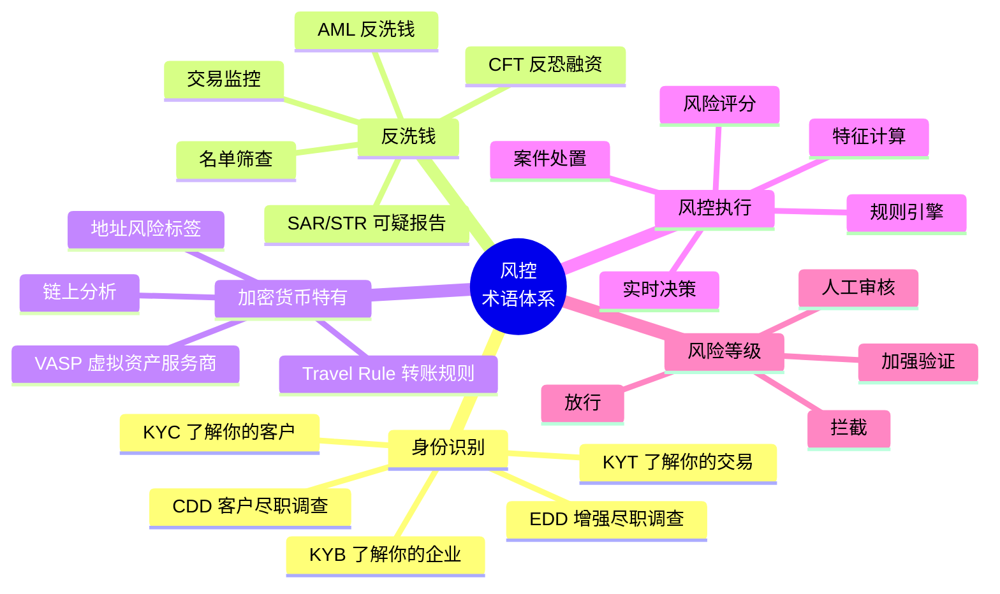
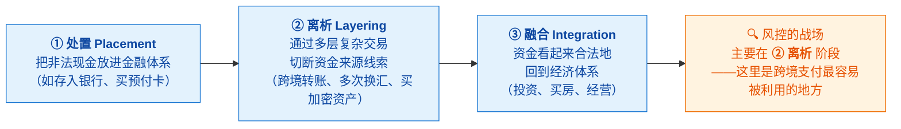
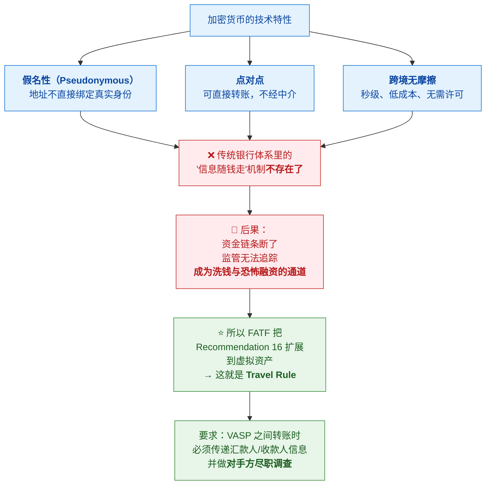
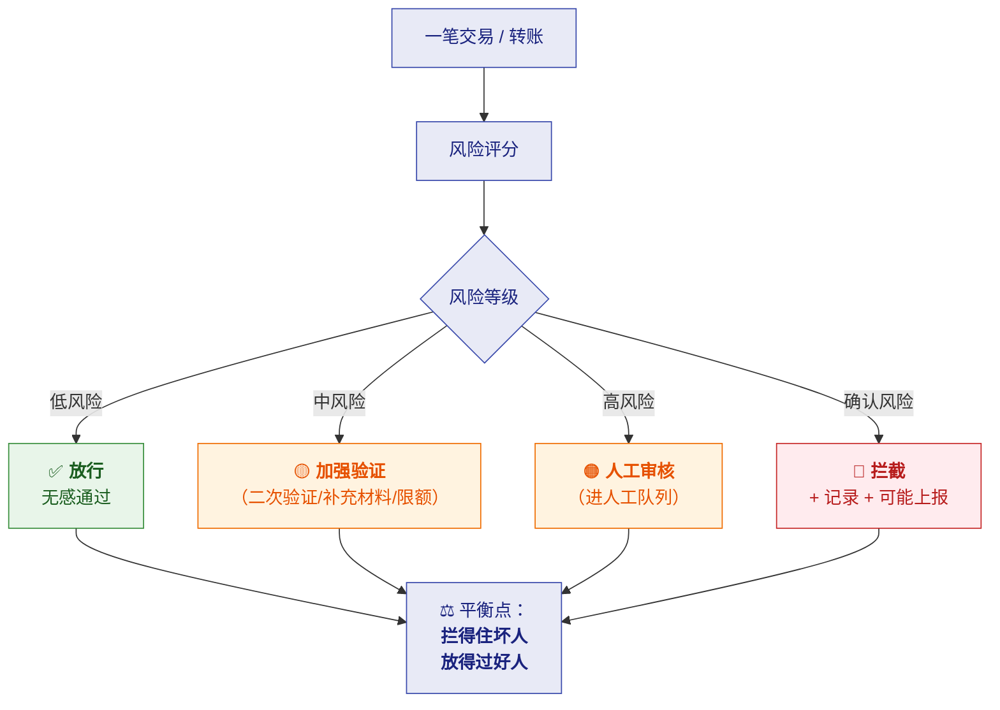

# 📚 一、风控领域知识速成

> [!abstract] 这篇笔记解决什么
> **你对金融风控领域知识为零，而这是本场面试唯一的硬缺口。**
> 这一篇把 **AML（反洗钱）/ Travel Rule / KYC / 名单筛查 / 规则引擎 / 实时决策** 这些
> 必考概念讲清楚——**目标不是成为合规专家，而是"能和技术面试官对话、不显得外行"**。
>
> **读法**：先背**术语表**（第一、二节），再理解**业务逻辑**（第三、四节），
> 最后练**等价经验映射话术**（第五节）——那一节是决定成败的。
> 系统架构见 [[02-风控系统架构与技术深挖题]]。

---

## 一、全局地图：先把术语铺开

> [!important] 一句话串起来
> **KYC 是"你是谁"（开户时）→ KYT 是"你在干什么"（每笔交易）→
> AML 是"别让脏钱流过"（持续监控）→ Travel Rule 是"转账要带上汇款人信息"（加密货币特有）
> → SAR 是"发现可疑就上报监管"。**

---

## 二、核心概念逐个击破

### 2.1 KYC / KYB / KYT（最基础，必须分清）

| 术语 | 全称 | 对象 | 时机 | 做什么 |
|---|---|---|---|---|
| **KYC** | Know Your Customer | **个人客户** | **开户/建立关系时** | 身份核验（证件、人脸、地址证明） |
| **KYB** | Know Your Business | **企业客户** | 开户时 | 核验企业真实性、**UBO（实际受益人）**、经营资质 |
| **KYT** | Know Your Transaction | **每一笔交易** | **交易时/持续** | 分析交易是否异常（金额、频率、对手方、地域） |

> [!tip] 记忆窍门
> **KYC 看"人"，KYB 看"企业"，KYT 看"钱怎么走"。**
>
> 跨境支付公司（如 Qbit）**三者都要做**：
> 给跨境电商卖家开户要做 KYB；卖家提现做 KYC（法人）；每笔资金流动做 KYT。

### 2.2 CDD / EDD（尽职调查的两个档位）

| 术语 | 含义 | 场景 |
|---|---|---|
| **CDD** | Customer Due Diligence，**标准尽职调查** | 所有客户的**基本动作** |
| **EDD** | Enhanced Due Diligence，**增强尽职调查** | **高风险客户**（高风险国家、政治公众人物 PEP、大额、复杂股权结构） |

> [!important] 这是"风险分级"的落地方式
> **风险越高，调查越深。** 不是所有客户都用同一套流程——
> 这正是风控系统里"**分层处理**"的业务来源。

### 2.3 AML / CFT（反洗钱 / 反恐融资）

| 术语 | 含义 |
|---|---|
| **AML** | Anti-Money Laundering，**反洗钱**——防止通过金融体系把非法所得"洗白" |
| **CFT** | Counter Financing of Terrorism，**反恐融资**——防止资金流向恐怖组织 |
| 实践中 | 两者**通常合称 AML/CFT**，共用一套监控与上报体系 |

**洗钱的经典三步**（理解这个才知道风控在防什么）：

> [!success] 面试可以主动讲这个（很加分）
> **"我理解跨境支付在做 AML 时，重点盯的是'离析'阶段——
> 因为跨境、多币种、多层转账正是切断资金线索的典型手法。
> 所以风控系统的核心能力是'**跨账户、跨时间、跨地域地关联分析**'，
> 而不是只看单笔交易是否超阈值。"**
>
> **这句话能立刻证明你不是背名词，而是理解了业务。**

### 2.4 名单筛查（Sanctions Screening）⭐ 高频考点

> [!question] 它是什么
> **把客户和交易对手方，与各类"黑名单"比对**，命中就拦截或人工审核。

**主要名单类型**：

| 名单 | 说明 |
|---|---|
| **制裁名单**（Sanctions） | 联合国、OFAC（美国财政部）、欧盟、英国等发布的制裁对象 |
| **PEP 名单** | Politically Exposed Person，政治公众人物（**不是罪犯，但风险高**） |
| **通缉/失信名单** | 各国司法与执法名单 |
| **内部黑名单** | 公司自己积累的（历史欺诈、已确认可疑） |
| **负面新闻** | Adverse Media，媒体报道的负面信息 |

> [!danger] 核心技术难点：**模糊匹配（Fuzzy Matching）**
> 名字是**跨语言、跨字符集**的（"张伟" / "Zhang Wei" / "Wei Zhang" / "Chang Wei"），
> **精确匹配必然漏，模糊匹配必然多**。这是名单筛查最核心的工程问题。
>
> | 难点 | 说明 |
> |---|---|
> | **音译与拼写变体** | 中文拼音、阿拉伯语转写、俄语转写，同一人多种写法 |
> | **语序** | 姓在前还是名在前 |
> | **缩写与别名** | "Mohammed" 有几十种拼写 |
> | **误报（False Positive）** | 模糊匹配太松 → 大量误报 → **人工审核被淹没** |
>
> **这就是为什么风控系统需要"分层处理"**：命中 → 相似度打分 → 高分自动拦截 / 中分人工复核 / 低分放行。

### 2.5 SAR / STR（可疑活动报告）

| 术语 | 含义 |
|---|---|
| **SAR** | Suspicious Activity Report（美国常用说法） |
| **STR** | Suspicious Transaction Report（国际/其他地区常用） |
| **实质** | **向监管机构上报可疑活动**——很多司法区是**法定义务**，且有**时限要求** |

> [!important] 这对系统设计的影响
> **"可疑"必须被记录、留痕、可追溯**——
> 因为监管可能事后审计："你当时为什么没上报？"
> 这直接推出系统需求：**决策要留全量证据（为什么放行/拦截）、案件要可追溯、策略版本要可回放**。
> 👉 **这正好对应 JD 职责 3 的"可追溯性"。**

---

## 三、⭐ Travel Rule（这个岗位的核心考点）

> [!important] 为什么它对这个岗位最重要
> **JD 标签里明确写了 "Travel rule"**，而且它是**加密货币 + 跨境支付**的交汇点——
> 这正是 Qbit 的业务。**面试几乎一定会问。**

### 3.1 它是什么

> [!note] 定义
> **Travel Rule（转账规则）** 来自 **FATF（金融行动特别工作组）Recommendation 16（第 16 条建议）**。
> 它要求：**金融机构在转账时，必须把"汇款人信息"和"收款人信息"随交易一起传递**。
>
> **通俗理解**：**钱在旅行，它的"身份信息"也要跟着一起旅行。**
> 就像寄快递必须写清楚寄件人和收件人——**因为信息缺失，监管就无法追查资金链条。**

**传统金融里它早就存在**：银行电汇（Wire Transfer）必须带汇款人/收款人姓名、账号、地址。
**争议在于**：**加密货币转账是否适用？**

### 3.2 为什么加密货币需要它

### 3.3 关键概念：VASP

| 术语 | 含义 |
|---|---|
| **VASP** | Virtual Asset Service Provider，**虚拟资产服务商**——交易所、托管钱包、支付服务商等 |
| **门槛金额** | FATF 建议 **≥ 1000 USD/EUR** 的转账要传递完整信息（各地实现有差异） |
| **信息内容** | 汇款人：姓名、账号/地址；收款人：姓名、账号/地址 |
| **适用对象** | **VASP 与 VASP 之间**（VASP-to-VASP）；**VASP 与自托管钱包之间**各地要求不一 |

### 3.4 ⭐ Travel Rule 的技术实现难点（技术面试官最爱问）

> [!important] 这是"技术人问技术人"的问题，必须答好

| 难点 | 说明 |
|---|---|
| **① 没有统一标准** | 有多套协议：**TRISA、TRP（Travel Rule Protocol）、OpenVASP、Sygna、Sumsub/GTR 等商业方案**。**各家用不同协议 → 互操作性差** |
| **② 如何找到对手方 VASP** | 链上只有地址，**不知道对手方是哪家 VASP** → 需要**地址归属识别**（Address Attribution）与**目录服务（Directory）** |
| **③ 隐私 vs 合规的矛盾** | 公链是公开的，**把客户姓名写进链上等于公开隐私** → 所以通常走**链下加密通道**传递信息，链上只放**引用/哈希** |
| **④ 数据保护法规冲突** | GDPR 等要求数据最小化，Travel Rule 要求传递个人信息 → **跨境合规冲突** |
| **⑤ 自托管钱包（Unhosted Wallet）** | 对手方不是 VASP，无法走 VASP 间协议 → 需要**额外验证措施**（如要求客户证明钱包所有权） |
| **⑥ 原子性与一致性** | 信息传递和资金转移**必须都成功或都失败**，否则出现"钱到了但信息没到"→ **对账与补偿机制** |

> [!success] 面试话术（直接可用）
> **"Travel Rule 的技术难点我觉得主要有三个层次：**
>
> **第一是'怎么找到对手方'**——链上只有地址，不知道对方是哪家 VASP，
> 所以需要地址归属识别 + 目录服务。
>
> **第二是'隐私和合规怎么平衡'**——公链上写客户姓名等于公开隐私，
> 所以通常走**链下加密通道**传信息，链上只放引用。
>
> **第三是'标准不统一'**——TRISA、TRP、OpenVASP 各有一套，互操作性差，
> 这是行业目前在解决的痛点。
>
> **另外从工程角度，信息传递和资金转移要保证一致性**——
> 不能出现钱到了但信息没到，所以要有**对账和补偿**机制。"
>
> 👉 **最后那句"对账和补偿"是你的杀手锏**——因为你在回收平台真做过对账。

### 3.5 Travel Rule 与 AML 的关系

---

## 四、风控系统的业务逻辑

### 4.1 风险决策的四种结果（分层处理）

> [!important] 核心认知：风控不是"拦或不拦"的二选一
> **风控的本质是在"风险损失"和"交易转化"之间找平衡。**
> 拦得太狠 → 误杀真实客户 → 业务受损；拦得太松 → 欺诈和罚单。

### 4.2 风控系统的三层能力

| 层 | 做什么 | 优点 | 局限 |
|---|---|---|---|
| **规则引擎** | 配置 IF-THEN 规则（大额、异常 IP、地域不符 → 审核/拦截） | **灵活、可解释、上手快** | 只能拦**已知**风险 |
| **机器学习模型** | 从历史数据学习复杂隐蔽的欺诈模式 | 能应对**未知**欺诈 | **可能误判**异常但真实的交易 |
| **设备指纹 / 行为分析** | 识别设备特征、操作行为 | 识别脚本/模拟器、关联同设备作案 | 需持续更新 |

> [!important] 三层缺一不可（面试可直接引用）
> **"规则引擎是地基（拦已知、可解释），机器学习是大脑（抓未知），
> 设备和行为分析是火眼金睛（识破伪装）。**
> **成熟系统会把三者结合，而不是二选一。"**

### 4.3 关键指标：风控系统怎么算"好"

| 指标 | 含义 | 为什么重要 |
|---|---|---|
| **准确率 / 召回率** | 抓到的 / 该抓的 | 基础 |
| **误杀率（False Positive Rate）** | 把好人当坏人的比例 | ⭐ **直接影响业务转化** |
| **决策延迟（P99）** | 风控决策耗时 | ⭐ 风控串在交易链路上，**慢就是不可用** |
| **覆盖率** | 监控到的交易占比 | 有没有漏网 |
| **人工审核率** | 进人工队列的比例 | 太高说明规则太严/人力不够 |
| **策略上线时长** | 从策略设计到生效的时间 | ⭐ 对应 JD 职责 3 |

> [!tip] 面试可以主动提这个洞察
> **"风控系统的技术指标和业务指标是绑在一起的。**
> 比如**决策延迟**看着是技术指标，但它直接决定交易体验；
> **误杀率**看着是业务指标，但它由规则阈值和模型精度决定。
> **所以做风控研发不能只看系统跑得通，要能说清'这套策略现在的误杀率和拦截率是多少'。**"

---

## 五、⭐ 你的风控经验怎么讲（核心武器）

> [!success] ⚠️ 重要更正：你不是"没做过风控"
> 你**真的做过风控系统（规则引擎 / 反欺诈）**——
> **这跟"等价经验迁移"是完全不同的量级。**
>
> **定位必须改：**
> - ❌ 不要说"我没做过风控"（**这是自我贬低，且不真实**）
> - ✅ 要说"**我做过风控，只是不在金融支付这个场景**"
>
> **这个差别决定了整场面试的基调：**
> 
> | 说法 | 面试官的反应 |
> |---|---|
> | "我没做过风控，但我做过防刷" | 把你当**转行者**，会反复验证你的业务理解 |
> | ⭐ **"我做过风控系统，包括规则引擎和反欺诈，只是场景不同"** | 把你当**同行**，直接进入**技术深挖** |

### 5.1 ⭐ 新定位话术（替换掉之前的保守版）

> **"我做过风控系统——规则引擎和反欺诈这块我有实际经验。**
> 具体来说，在回收平台项目里我主导做了一套防刷风控：
> **规则可配置的规则引擎**（不是硬编码）、**多维度特征**（用户/设备/IP 频次、
> 异常重量识别）、**黑名单**、以及**处置流程**（自动拦截 + 人工工单）。
>
> **我缺的是金融支付场景下的东西**——
> 比如 **AML 的合规要求、Travel Rule 的技术标准、名单筛查的实现细节**，
> 这些业务规则和监管逻辑跟我之前做的电商/IoT 场景不一样。
> **但风控系统的工程骨架——特征、规则、决策、处置、可追溯——我是通的。**"

> [!important] 为什么这个定位强得多
> 1. **它不是"我愿意学"，而是"我做过，只是换场景"**——完全不同的可信度
> 2. **它把面试官的问题引到"技术深挖"**——而技术是你的主场
> 3. **它诚实地划出了边界**（金融合规知识），不显得虚
> 4. **它给了你主动权**：你可以反过来问"你们的规则引擎是怎么设计的？"

### 5.2 经验映射表（把已有经验翻译成金融风控语言）

| 风控概念 | 你的真实经历 | 怎么讲（话术） |
|---|---|---|
| **规则引擎** | 回收平台**风控防刷**：**规则与阈值可配置、避免硬编码**、多规则组合、黑名单 | ⭐⭐ "我做过规则化的防刷——**规则和阈值是可配置的而不是硬编码**。这让我理解规则引擎的核心矛盾：**既要让策略同学能自助调整，又要防止他们写出拖垮系统的规则**。" |
| **规则表达式/DSL** | 规则配置化、阈值可调 | "我们把规则抽出来做成配置，**改策略不用改代码发版**。" |
| **风险特征计算** | 设备上报的**异常值剔除**（重量突变、离线补传，超阈值挂起转人工） | ⭐ "特征本身要可信。我们做过设备**异常识别**——**超阈值的不直接采信而是挂起转人工**。风控里同理：**脏特征会放大误判**。" |
| **实时决策** | 积分扣减 **Redis + Lua 原子校验**、下单前置校验 | "决策要在毫秒内给出且不能因并发出错，我们用 **Redis+Lua 原子脚本**做前置校验。" |
| **案件处置 / 工单** | 对账差异**分三类**（平台多/设备多/金额不符）**生成工单流转**，自动冲正 + 人工工单 | ⭐⭐ "我做过一套**差异处置流程**：分类型 → 能自动判定的自动处理 → 需要人工的走工单。**这和风控的'案件处置'结构完全一样：分类 → 分级 → 自动/人工 → 闭环。**" |
| **数据一致性 / 对账** | **T+1 双向对账**，差异率进指标监控 | ⭐⭐ "对账是最后一道防线。放到风控里，**Travel Rule 的信息传递和资金转移也需要对账**——不能出现钱到了但信息没到。" |
| **可追溯 / 版本管理** | 对账差异留痕、补数工单、变更记录 | ⭐ "JD 提到策略的**可追溯性**，我理解这是同一类需求：我们做对账时**所有差异和处理结果都留痕可查**，因为要能回答'当时为什么这么处理'。" |
| **幂等** | 设备重复上报去重（设备号+时间戳+序号）；唯一键 | "风控事件不能重复计分或重复拦截，幂等要求一样。" |
| **状态机** | 任务状态机（待分配→配送中→已完成/已取消），非法流转拒绝 | "处置流程也是状态机，**非法流转要直接拒绝**。" |
| **限流熔断降级** | [[面试准备/冠顿/05-并发\|冠顿并发篇]]；峰谷削峰 | ⭐ "风控服务**串在交易链路上**，挂了不能拖垮交易——要限流、熔断、**并且定义好降级策略**。" |
| **异步化 / 削峰** | MQ 异步落单、消费端匀速处理 | "不是所有风控动作都要同步。**强规则同步拦，弱特征异步补。**" |
| **多维分析** | 站点/区域/品类多维报表 | "风控也需要多维聚合分析，和我的报表体系经验相通。" |

### 5.3 如果被追问细节（这些要能答）

> [!warning] 说有经验，就一定会被深挖。提前准备好这些细节
> | 追问 | 你要能回答 |
> |---|---|
> | **规则怎么配置的？** | 用什么形式（配置表/表达式/DSL）？怎么加载（启动时/热更新）？ |
> | **规则冲突怎么处理？** | 优先级机制？决策合成规则（从严/打分累加）？ |
> | **规则性能怎么保证？** | 预编译？缓存？有没有限制执行时间？ |
> | **特征怎么算的？** | 实时算还是预计算？存哪（Redis/DB）？ |
> | **拦截后怎么处置？** | 自动拦截 / 进人工队列 / 工单流转，状态机怎么设计 |
> | **怎么知道规则有没有效果？** | 命中率统计、拦截率、误杀率监控 |
> | **规则上线怎么验证？** | 灰度？历史回放？ |
> | **误杀了怎么办？** | 申诉/白名单机制，止血流程 |
>
> 👉 **这些问题的技术答法见 [[02-风控系统架构与技术深挖题]]**。
> ⚠️ **务必按你真实做过的情况回答**——宁可说"我们当时做得比较简单"，
> 也**不要编造**（金融合规领域最忌造假，追问两层就穿）。

### 5.4 千万别说的话

| ❌ 不要说 | 为什么 |
|---|---|
| "风控我没做过，但我学习能力很强" | ⚠️ **这是自我贬低且不真实**——你明明做过 |
| "风控我做过，跟你们差不多" | 太满。**金融风控的合规复杂度远超电商防刷**，会被追问穿 |
| "AML 我了解，就是反洗钱嘛" | 显得只知皮毛 |
| "Travel Rule 我懂，就是转账要带信息" | 太浅。**要能说出技术难点**（对手方识别、隐私、标准不统一） |
| 把电商防刷的细节直接说成金融风控 | ⚠️ 追问"你们怎么做名单筛查的"就露了 |
| 编造金融风控项目经历 | ⚠️ **金融合规领域最忌造假** |

> [!important] 正确的姿态
> **"我做过风控系统，场景是电商/IoT 的业务风控。**
> **金融支付场景下的合规要求（AML、Travel Rule、名单筛查）我需要补，
> 但风控的工程骨架我是通的——而且我很想把这个方向做深。"**
>
> **这个姿态既真实、又有分量、还留了成长空间。**
| **可追溯 / 版本管理** | 对账差异留痕、补数走工单、变更记录 | ⭐ "JD 里提到策略的**可追溯性**，我理解这是同一类需求：我们做对账时所有差异和处理结果都**留痕可查**，因为要能回答'当时为什么这么处理'。" |
| **幂等** | 设备重复上报去重（设备号+时间戳+序号）；唯一键 | "风控事件不能重复计分或重复拦截，幂等的要求是一样的。" |
| **状态机** | 任务状态机（待分配→配送中→已完成/已取消），非法流转直接拒绝 | "处置流程也是状态机，**非法流转要直接拒绝**。" |
| **限流熔断降级** | [[面试准备/冠顿/05-并发\|冠顿并发篇]]；高峰削峰 | ⭐ "风控服务**串在交易链路上**，它挂了不能拖垮交易——所以要限流、熔断、**并且定义好降级策略**（比如风控不可用时是放行还是拒绝，这是业务决策）。" |
| **异步化 / 削峰** | MQ 异步落单、消费端匀速处理 | "不是所有风控动作都要同步。**强规则同步拦，弱特征异步补**——用 MQ 削峰。" |
| **多维分析** | 站点/区域/品类多维报表 | "风控也需要多维聚合分析，这部分和我做过的报表体系是相通的。" |

## 六、30 秒速查表

| 问题 | 一句话答案 |
|---|---|
| KYC / KYB / KYT | **KYC 看人**（开户）、**KYB 看企业**（开户）、**KYT 看交易**（每笔） |
| CDD vs EDD | **CDD 是标准尽调**（所有客户）；**EDD 是增强尽调**（高风险客户/PEP） |
| AML 是什么 | **反洗钱**——防止非法所得通过金融体系洗白；常与 **CFT（反恐融资）** 合称 |
| 洗钱三步 | **处置 → 离析 → 融合**；风控主战场在**离析**（跨境多层转账） |
| 名单筛查是什么 | 把客户/对手方与**制裁名单、PEP、黑名单**比对 |
| 名单筛查最大难点 | **模糊匹配**——跨语言姓名的音译变体导致**漏报与误报的权衡** |
| SAR / STR | **可疑活动报告**，向监管上报，很多司法区是**法定义务 + 有时限** |
| Travel Rule 出处 | **FATF Recommendation 16**，从传统电汇扩展到**虚拟资产转账** |
| Travel Rule 要求什么 | **转账时携带汇款人/收款人信息**（VASP 间，门槛通常 ≥1000 USD/EUR） |
| 为什么加密货币需要它 | 加密的**假名性 + 点对点 + 跨境无摩擦**让"信息随钱走"机制缺失 → 资金链断 |
| VASP 是什么 | **虚拟资产服务商**（交易所、托管钱包、支付商） |
| Travel Rule 技术难点 | **① 找对手方 VASP（地址归属）② 隐私 vs 合规（链下传信息）③ 标准不统一（TRISA/TRP/OpenVASP）④ 自托管钱包 ⑤ 信息与资金的一致性** |
| Travel Rule 与 AML 关系 | **互补**：前者保证"信息可得"，后者"拿信息做判断" |
| 风控决策四种结果 | **放行 / 加强验证 / 人工审核 / 拦截** |
| 风控系统的平衡点 | **拦得住坏人，放得过好人**（在风险损失与交易转化间找平衡） |
| 风控三层能力 | **规则引擎**（拦已知、可解释）+ **机器学习**（抓未知）+ **设备指纹/行为分析** |
| 风控最重要的技术指标 | **决策延迟 P99**（串在交易链路上，慢=不可用） |
| 风控最重要的业务指标 | **误杀率**（直接影响转化）、**拦截率**、**人工审核率** |
| 我的等价经验 | ⭐ **防刷规则可配置** + **T+1 对账与工单处置** + **限流熔断降级** |

---

## 七、学习检查清单

- [ ] 能分清 **KYC / KYB / KYT** 三者的对象与时机
- [ ] 能说清 **CDD 与 EDD** 的区别，以及它是"风险分级"的业务来源
- [ ] 能说出**洗钱三步**，并解释为什么风控主战场在"**离析**"
- [ ] ⭐ 能说清**名单筛查**的做法与**模糊匹配**这个核心难点
- [ ] 能说清 **SAR/STR** 是什么，以及它对系统设计的要求（留痕、可追溯）
- [ ] ⭐⭐ 能完整讲清 **Travel Rule**：出处、要求、为什么加密需要它、**五个技术难点**
- [ ] 能说清 **VASP** 是什么，以及 Travel Rule 的适用范围与门槛金额
- [ ] ⭐ 能说清 **Travel Rule 与 AML 是互补关系**
- [ ] 能说出**风控决策的四种结果**，并解释"分层处理"的业务来源
- [ ] 能说清**风控三层能力**各自解决什么、局限在哪
- [ ] 能说出风控的**关键指标**（尤其决策延迟与误杀率），并解释技术与业务的绑定关系
- [ ] ⭐⭐ **能背熟第五节的"等价经验映射"与开场话术模板**
- [ ] 能说出 5.3 里**不能说的话**，避免踩坑

---
> 关联：[[00-JD与匹配分析]] · [[02-风控系统架构与技术深挖题]] · [[03-公司情报与决策建议]]
