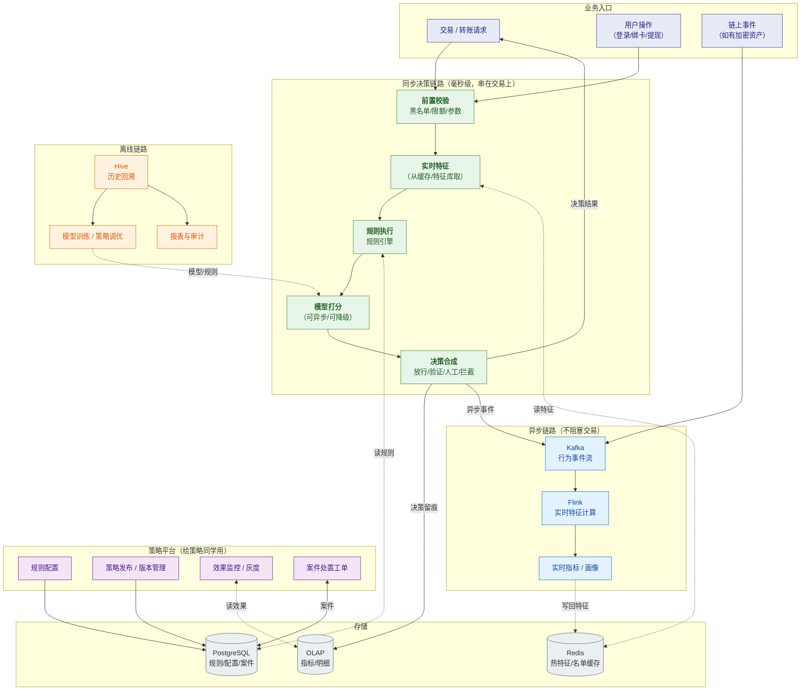
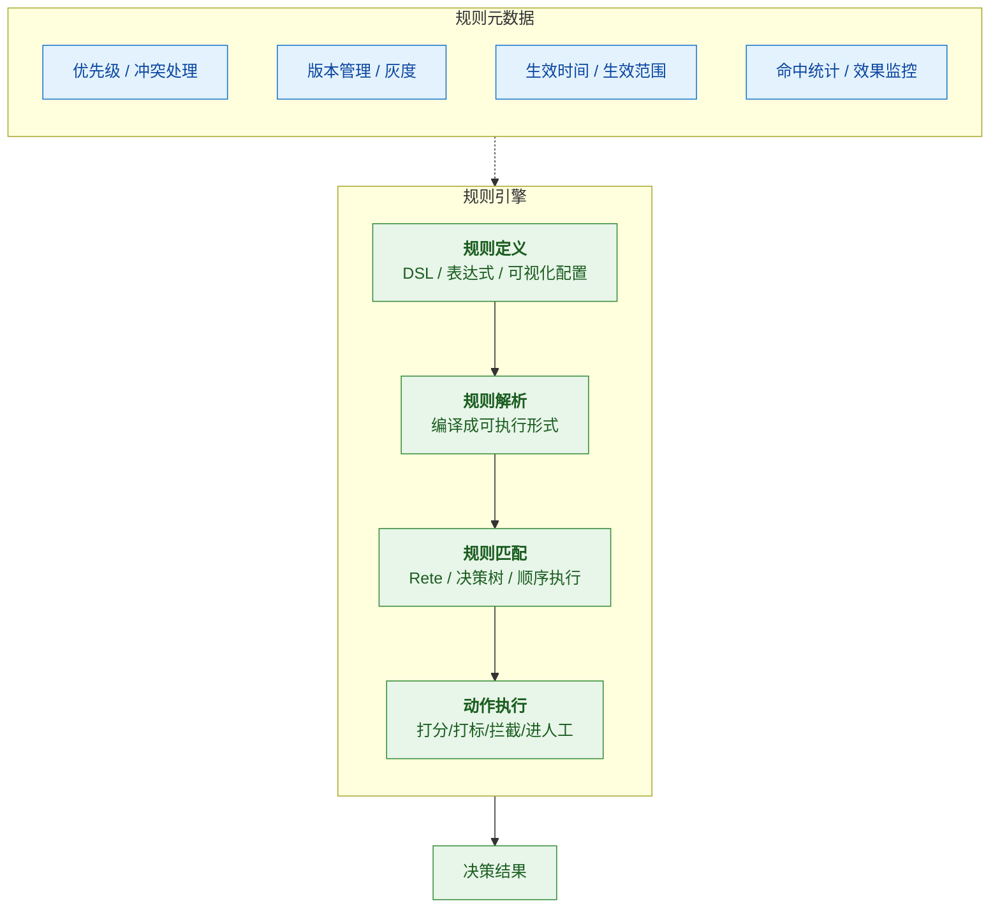
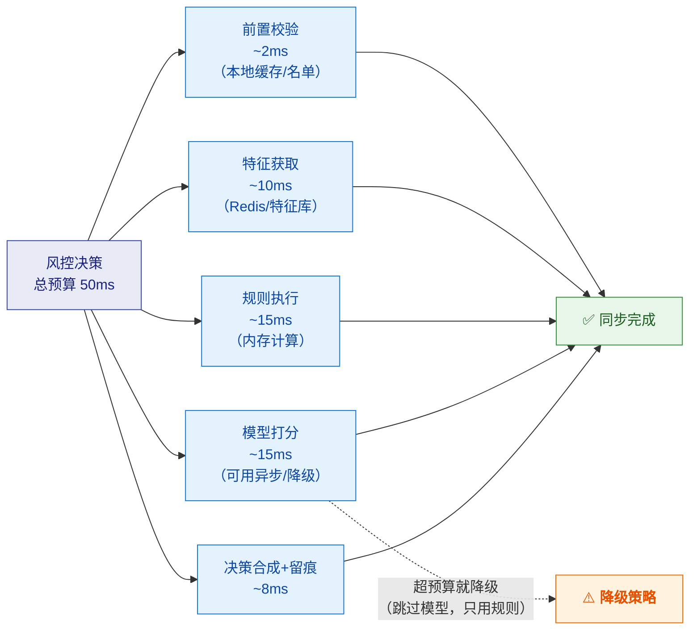
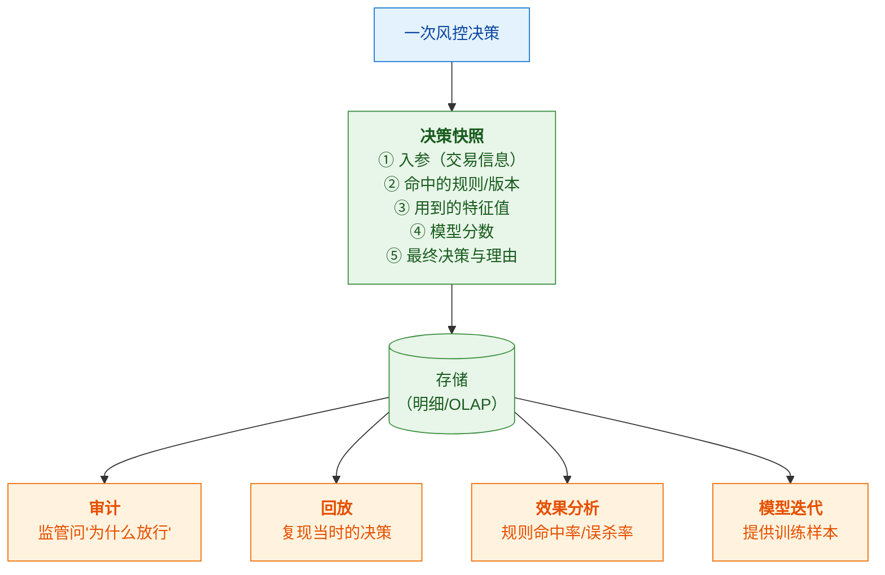
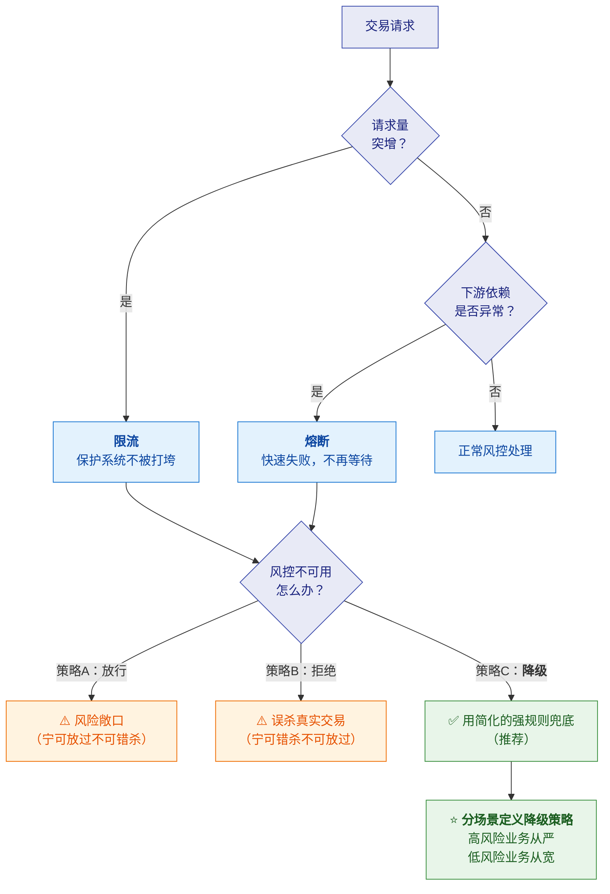

# 🏗️ 二、风控系统架构与技术深挖题

> [!abstract] 这篇笔记解决什么
> [[01-风控领域知识速成]] 讲的是**业务术语**（AML/Travel Rule）；
> 这一篇讲**技术实现**——风控系统长什么样、规则引擎怎么设计、
> 实时决策链路怎么保证低延迟、以及**面试会怎么深挖**。
>
> **你的优势在这里**：Java 并发、Kafka/Flink、限流熔断、一致性、对账——
> **这些你都有真材实料**，只需要把它们**放进风控的语境里**。

---

## 一、风控系统全景架构

> [!important] ⭐ 这张图的三个关键设计决策（面试要点）
> **① 为什么分"同步"和"异步"两条链路？**
> → **因为不是所有风控动作都要在交易链路上完成。**
> **强规则必须同步**（黑名单、限额——拦不住的代价高）；
> **弱特征可以异步补**（画像更新、复杂模型——晚几百毫秒没关系）。
> **这个切分是风控系统性能设计的核心。**
>
> **② 为什么风控服务必须"可降级"？**
> → 它**串在交易链路上**。风控挂了，交易也挂了。
> **所以必须定义"风控不可用时怎么办"**——这是**业务决策**（放行还是拒绝），不是技术决策。
>
> **③ 为什么要"决策留痕"？**
> → 监管审计要求"你当时为什么放行/拦截"。**所以每次决策都要落库，且可回放。**

---

## 二、规则引擎设计（⭐ 高频深挖）

### 2.1 为什么需要规则引擎

> [!question] 它要解决什么问题
> **风控策略变化极快**——今天发现一个新欺诈手法，明天就要上线拦截规则。
> 如果每条规则都要**研发改代码 → 测试 → 发版**，那：
> - 上线慢（可能几天）
> - 风险高（改代码可能引入 bug）
> - **策略同学无法自主调整**（必须排队等研发）

| 维度 | 内容 |
|---|---|
| **① 问题** | 策略变更频繁，但**硬编码的规则导致上线慢、风险高、无法自助** |
| **② 决策** | **规则引擎**：把规则从代码里抽出来，做成**可配置、可热更新、有版本**的 DSL/表达式 |
| **③ 代价** | ⚠️ 表达能力受限（复杂逻辑仍需代码）；⚠️ **性能和安全的平衡**（用户写的规则不能拖垮系统）；⚠️ 规则冲突与优先级管理 |

### 2.2 规则引擎的核心能力

| 能力 | 说明 | 为什么重要 |
|---|---|---|
| **规则定义方式** | DSL / 表达式 / 可视化 | 决定**策略同学能否自助** |
| **优先级与冲突** | 多规则命中时怎么处理 | 避免"规则打架" |
| **版本管理** | 每次变更留版本，可回滚 | ⭐ **对应 JD 职责 3 的"可追溯性"** |
| **灰度发布** | 新规则先小流量验证 | ⭐ 避免新策略全量误杀 |
| **生效范围/时间** | 按用户群、地区、时间段生效 | 灵活性 |
| **命中统计与效果监控** | 每条规则命中率、拦截率、误报率 | ⭐ **没有效果监控的策略是盲目的** |

### 2.3 规则引擎的技术选型（面试可能问）

| 方案 | 说明 | 适用 |
|---|---|---|
| **自研表达式引擎** | 基于 Aviator / QLExpress / SpEL 等，自己封装 | 灵活可控，**大厂常见** |
| **Drools** | 老牌规则引擎，基于 **Rete 算法** | 规则复杂、需要推理；**但重、学习成本高** |
| **决策表 / 决策树** | 表格化配置，编译成代码 | 简单规则、**业务同学友好** |
| **SQL 化规则** | 把规则表达成 SQL | 与数据链路统一，但性能和实时性差 |
| **Flink CEP** | 复杂事件处理（模式匹配） | ⭐ **序列类规则**（如"1小时内多次小额转账"） |

> [!tip] 面试怎么答"规则引擎怎么选型"
> **"我会看规则的复杂度：**
> - **如果是简单条件组合**（大额、黑名单、地域），**自研表达式引擎 + 决策表**就够了，
>   轻量、性能好、可控。
> - **如果规则之间有复杂推理关系**，才考虑 Drools，但**它的 Rete 网络内存开销大**，
>   而且规则多了性能会下降。
> - **如果是'时序/序列模式'的规则**——比如"30 分钟内同一设备多次失败后成功"——
>   这类**用 Flink CEP 更合适**，因为它天生擅长模式匹配。
>
> **实践中通常是组合的**：同步链路走轻量表达式引擎，
> 序列类规则走 Flink 实时计算，两者结果在决策层合成。"

### 2.4 ⚠️ 规则引擎的三个工程难点（能讲这个就显水平）

> [!danger] 这三个问题面试官很爱问，因为它们考"真做过没有"

| 难点 | 问题 | 解法方向 |
|---|---|---|
| **① 性能与安全** | 用户配置的规则**可能写得很差**（如复杂正则、全表扫描），拖垮在线服务 | **规则沙箱**（限制执行时间/资源）；**预编译**；**危险算子黑名单**；上线前**压测** |
| **② 规则冲突与优先级** | 规则 A 说拦截、规则 B 说放行，听谁的？ | **明确的优先级机制**；**冲突检测**（上线时提示）；**决策合成规则**（如"从严"） |
| **③ 规则的回归验证** | 改一条规则，可能影响其他场景 | ⭐ **用历史数据回放（Backtesting）**：把新规则跑一遍历史交易，看**拦截率/误杀率变化**再上线 |

> [!success] "历史回放"是极好的加分点
> **"策略上线前，我会用历史数据做回放——把新规则在最近几个月的真实交易上跑一遍，
> 看它多拦了多少、误杀了多少。**
> **这跟我们在回收平台做对账是一个思路：不要等上生产才发现问题，
> 用历史数据先验证。**"
>
> 👉 **把"回放验证"和你的对账经验挂钩，杀伤力很强。**

---

## 三、实时决策链路的技术设计

### 3.1 延迟预算怎么分配（⭐ 很显专业）

> [!important] 风控串在交易链路上，延迟预算是硬约束
> 假设交易链路总预算是 **200ms**，风控分到 **50ms**——那这 50ms 要这么花：

> [!tip] 面试话术
> **"我会先把延迟预算拆开，看每一段能花多少。**
> **名单和黑名单走本地/Redis 缓存**（毫秒级）；
> **特征尽量预热**，避免实时查库；
> **规则在内存里算**；
> **模型打分是最大的不确定项，所以我会把它设计成'可降级'**——
> 超预算就跳过模型、只用规则，保证交易不被拖死。
> **关键是：风控不能成为交易链路上不可控的那一环。**"

### 3.2 特征获取的三种方式

| 方式 | 说明 | 延迟 | 适用 |
|---|---|---|---|
| **预计算 + 缓存**（Redis / 本地缓存） | 离线/流式算好，在线直接取 | ⭐ 最低 | **高频、强依赖的特征** |
| **实时查询**（查库/查 OLAP） | 决策时现查 | 高 | 低频、可选特征 |
| **流式预聚合**（Flink 写回） | Flink 实时算好写进特征库 | 低 | **实时统计类特征**（近1小时转账次数） |

> [!important] 最重要的架构原则
> **"在线决策链路里，尽量不做'计算'，只做'取数 + 判断'。"**
> 特征要提前算好（离线或流式），在线只负责**快速取用**。
> **这是保证毫秒级响应的前提。**

### 3.3 一致性：特征不能"穿越"

> [!danger] 特征穿越（Feature Leakage / 时间旅行）—— 面试可以主动讲
> **问题**：离线训练模型时，如果用到了"未来"的特征（比如用了这笔交易之后的统计值），
> 模型在离线评估时表现很好，**上线后效果崩掉**。
>
> **根本原因**：**离线特征和在线特征的"时间口径"不一致**。
>
> | 环节 | 要求 |
> |---|---|
> | **离线训练** | 只能用**该时刻之前**的数据算特征（point-in-time correctness） |
> | **在线推理** | 用**当前时刻**已发生的特征 |
> | **一致性保障** | 同一份特征定义、同一份计算逻辑（最好流批同源） |

> [!success] 这个点你能讲得比大多数候选人好
> **"特征穿越的本质是'时间和口径不一致'的问题。**
> **我在回收平台遇到过非常类似的情况**：设备离线后**补传**数据，
> 如果按'到达时间'入库，就会污染按'业务时间'统计的历史指标。
> **我们当时的解法是按业务时间回放**，并且报表标注"数据可能延迟"，T+1 对账修正。
>
> **风控里的特征穿越是同一个问题的另一种形态**：
> 必须严格区分**事件时间**和**处理时间**，
> 否则离线看起来很好、上线就崩。**这也是 Flink 的 Watermark 要解决的问题。**"

### 3.4 决策留痕与回放

> [!important] 这直接对应 JD 职责 3 的"可追溯性"
> **"策略发布要可追溯"** 的技术含义就是：
> **每次决策都要记录'当时用的是哪个版本的规则、哪些特征值、为什么这么判'。**
> 否则监管问起来，你无法解释。

---

## 四、高并发与稳定性（你的王牌区）

> [!success] 这部分你有真材实料，只需映射到风控语境
> 详细技术见 [[面试准备/冠顿/05-并发]]、[[面试准备/冠顿/08-消息]]、[[面试准备/冠顿/10-故障恢复]]。
> 这里只讲**风控场景下的特殊考量**。

### 4.1 限流、熔断、降级的组合

> [!important] ⭐ 降级策略是"业务决策"不是"技术决策"
> 面试官很爱问："**风控服务挂了，交易放行还是拒绝？**"
>
> **标准答法**：
> **"这不是纯技术问题，是业务风险偏好问题，要分场景。**
> - **高风险动作**（大额提现、跨境汇款）→ **宁可不做也不能错**，拒绝或强制人工
> - **低风险动作**（小额支付、查询）→ **宁可放过也不能错杀**，放行 + 事后补审
> - **更好的做法**：**降级到简化的强规则兜底**（黑名单 + 硬限额），
>   而不是二选一的"全放"或"全拒"
>
> **我做过类似的取舍**——机器人项目里梯控/PMS 失败时，
> 我们定义了**超时+重试+降级**（失败改人工介入），
> **而不是让任务卡死。核心思路是：先保证主链路可用，再考虑功能完整。**"

### 4.2 数据一致性（风控场景的特殊性）

| 问题 | 说明 | 解法 |
|---|---|---|
| **决策与留痕的一致性** | 决策做了但留痕丢了 → 审计断链 | 异步落库 + **可靠投递（本地消息表/事务消息）** |
| **特征读取的一致性** | 读到旧特征导致误判 | 特征带版本/时间戳；关键特征**强一致读** |
| **幂等** | 重复事件导致重复计分/重复拦截 | **业务唯一键 + 幂等表**（你有设备去重经验） |
| **对账** | ⭐ 决策日志与实际拦截效果对不上 | **T+1 对账**（你的强项！） |

> [!success] 对账经验在这里再次成为王牌
> **"风控系统也需要对账。"**
> 比如：**决策日志里记了"拦截 100 笔"，但实际拦截系统只执行了 98 笔**——
> 差异 2 笔去哪了？是丢消息了还是执行失败？
> **这跟我做过的设备流水 vs 平台流水对账是同一类问题**，
> 处理方式也一样：**双向比对 → 差异分类 → 自动/人工处置 → 差异率监控。**

---

## 五、技术深挖题库（模拟追问链）

### 🔗 追问链 1：从"你怎么设计风控系统"开始

**Q1（开放）**：如果让你从 0 设计一个风控系统，你怎么做？

> [!important] 答题骨架（六步）
> 1. **先问业务**：防什么风险（欺诈/洗钱/合规）？决策在交易链路的哪个环节？延迟预算是多少？
> 2. **定分层架构**：同步决策链路 + 异步特征链路 + 离线分析链路
> 3. **定决策分层**：放行 / 加强验证 / 人工审核 / 拦截（**不是二选一**）
> 4. **规则引擎**：规则与代码解耦、可配置、有版本、可灰度
> 5. **特征体系**：预计算 + 缓存为主，实时计算补充；**保证离线在线口径一致**
> 6. **可观测与闭环**：决策留痕、效果监控、回放验证、案件处置

**Q2（压力）**：延迟要求 50ms，但模型打分要 100ms，怎么办？

> [!success] 加分答法（体现工程判断）
> **"我不会硬扛，而是分三步：**
> **① 先做延迟拆解**——确认 100ms 是模型本身还是特征获取。**很多时候瓶颈在特征而不是模型。**
> **② 把模型变成'可异步/可降级'**——强规则同步拦，模型分数**异步补充**，
>    或者用**轻量模型（如 LR）同步 + 复杂模型异步复核**。
> **③ 模型优化**：特征预计算、模型蒸馏/量化、批量化推理。
>
> **但最关键的是先和业务对齐：这 50ms 是硬约束还是目标值？**
> 如果模型能显著降低误杀率，业务可能愿意放宽到 80ms——
> **这是取舍问题，要摆到桌面上，而不是技术单方面硬扛。**"

**Q3（深挖）**：怎么保证新策略上线不出事？

> [!important] 四道防线
> ① **历史回放（Backtesting）**——用真实历史交易验证拦截率/误杀率变化
> ② **灰度发布**——先小流量，观察指标
> ③ **可回滚**——版本化，出问题一键回退
> ④ **监控告警**——拦截率/误杀率突变告警

### 🔗 追问链 2：Flink 在风控里的用法

**Q1**：Flink 在风控系统里做什么？

> [!important] 三类典型任务
> | 类型 | 说明 | 例子 |
> |---|---|---|
> | **实时特征计算** | 滚动窗口统计 | 近 1 小时转账次数、近 10 分钟失败次数 |
> | **复杂事件处理（CEP）** | 序列模式匹配 | "多次小额→一次大额"的可疑模式 |
> | **实时指标/告警** | 聚合监控 | 全局拦截率、某规则命中突增 |

**Q2（深挖）**：实时特征和离线特征怎么保证一致？

> → 用 **3.3 的"特征穿越"** 回答：**同源定义 + 严格区分事件时间与处理时间 + point-in-time 正确性**。

**Q3（致命）**：Flink 挂了，实时特征就没了，风控怎么办？

> [!success] 这题考"降级思维"
> **"有几层防护：**
> ① **Flink 有 checkpoint 和状态恢复**，短暂故障能自愈；
> ② **特征库是解耦的**——Flink 只是往特征库写，**在线决策读的是特征库**，
>    所以 Flink 短暂挂掉，**特征库里的旧值还能用**（只是不再更新），
>    我们可以**给特征打上"最后更新时间的标记"**，太旧就降级不使用；
> ③ **兜底**：实时特征不可用时，**退回使用离线特征或只用强规则**。
>
> **核心原则还是那句：风控不能成为交易链路上不可控的一环。**"

### 🔗 追问链 3：PostgreSQL（补差）

**Q**：你用 MySQL 多，PostgreSQL 有什么不同？

> [!important] 诚实 + 说清差异（别说"我很熟"）
> **"我主力是 MySQL，PostgreSQL 我用过、能写，但不敢说精通。**
> **差异我清楚的有几个方向：**
>
> | 维度 | PostgreSQL | MySQL |
> |---|---|---|
> | **JSON 支持** | **JSONB**（二进制、可索引、可 GIN 索引）——**强很多** | JSON 支持较晚、能力弱 |
> | **索引类型** | **GIN / GiST / BRIN / 部分索引 / 表达式索引**，类型丰富 | 主要是 B+ 树、全文索引 |
> | **并发控制** | MVCC 实现不同，**DDL 事务性好**（可回滚） | DDL 隐式提交，部分不可回滚 |
> | **扩展性** | 插件生态强（PostGIS、pg_trgm 模糊匹配） | 扩展性弱 |
> | **数组/自定义类型** | 原生支持 | 不支持 |
>
> **对我们这个场景，我觉得 PostgreSQL 有两个点特别契合**：
> ① **规则和案件配置用 JSONB 存**，灵活且可索引；
> ② **名单筛查的模糊匹配可以用 `pg_trgm`**（三元组相似度），这是 MySQL 不好做的。
>
> **这块我需要在实践中深入，但迁移的思路我是清楚的。**"

> [!tip] 主动把 PostgreSQL 和**业务**挂钩（JSONB 存规则、pg_trgm 做模糊匹配）——
> 这比背差异表更能证明你"理解为什么用 PostgreSQL"。

### 🔗 追问链 4：故障排查

**Q**：线上风控突然大量误杀，你怎么排查？

> [!important] 四步
> **① 止血 → ② 定位 → ③ 根因 → ④ 复盘**（下图）

> [!important] 三个关键点
> - **止血优先**（风控问题会直接影响业务，不能慢慢查）
> - **决策快照是关键证据**（这正是"留痕"的价值）
> - **复盘要问"为什么没提前发现"**——灰度、回放、监控哪一环漏了

---

## 六、30 秒速查表

| 问题 | 一句话答案 |
|---|---|
| 风控系统为什么分同步/异步 | **不是所有动作都要在交易链路上**；强规则同步，弱特征异步 |
| 风控为什么必须可降级 | 它**串在交易链路上**，挂了会拖垮交易 |
| 降级策略谁来定 | ⭐ **业务决策**（分场景：高风险从严，低风险从宽） |
| 为什么要决策留痕 | 监管审计要能回答"**当时为什么放行/拦截**" |
| 规则引擎解决什么 | **策略与代码解耦**——快上线、低风险、策略同学可自助 |
| 规则引擎选型 | 简单规则自研表达式；复杂推理用 Drools（重）；**序列模式用 Flink CEP** |
| 规则引擎三大难点 | **性能安全（沙箱）、规则冲突（优先级）、回归验证（历史回放）** |
| 策略上线前做什么 | ⭐ **历史数据回放**（Backtesting）看拦截率/误杀率变化 |
| 延迟预算怎么分 | 名单缓存 2ms + 特征 10ms + 规则 15ms + 模型 15ms（**模型可降级**） |
| 在线决策的原则 | ⭐ **在线只做"取数+判断"，不做"计算"**——特征提前算好 |
| 特征获取三种方式 | **预计算+缓存**（最优）、实时查询（慢）、**流式预聚合**（Flink） |
| 什么是特征穿越 | 离线用了"未来"特征 → 离线好、上线崩；根因是**时间口径不一致** |
| 特征穿越怎么防 | **同源定义 + 严格区分事件/处理时间 + point-in-time 正确性** |
| 决策留痕记什么 | 入参、命中规则与版本、特征值、模型分数、最终决策与理由 |
| 风控的幂等 | 重复事件不能重复计分/拦截 → **业务唯一键 + 幂等表** |
| 风控怎么做对账 | ⭐ 决策日志 vs 实际执行效果，**双向比对 + 差异分类处置** |
| PostgreSQL 关键差异 | **JSONB 可索引**、**GIN/GiST/BRIN**、**pg_trgm 模糊匹配**、DDL 事务性 |
| 为什么 PG 适合风控 | **JSONB 存规则配置** + **pg_trgm 做名单模糊匹配** |
| 误杀暴增怎么排查 | **先止血（关规则/回滚）→ 查决策快照定位 → 复盘为何没被灰度挡住** |

---

## 七、学习检查清单

- [ ] 能画出**风控系统全景架构**，说清同步/异步/离线三条链路的职责
- [ ] ⭐ 能解释**为什么分同步与异步链路**（强规则 vs 弱特征）
- [ ] ⭐ 能解释**风控为什么要可降级**，以及降级是**业务决策**
- [ ] 能说清**规则引擎解决的核心问题**（策略与代码解耦）
- [ ] 能对比规则引擎的**技术选型**，并说清 Drools 与 Flink CEP 各适合什么
- [ ] ⭐ 能说出**规则引擎的三个工程难点**及解法
- [ ] ⭐ 能讲清**"历史回放"验证策略**，并与你的对账经验挂钩
- [ ] 能拆解**延迟预算**，并说明各段怎么优化
- [ ] ⭐ 能说出"**在线只取数不计算**"这个原则
- [ ] ⭐ 能讲清**特征穿越**的成因与解法，并用**补传数据**做类比
- [ ] 能说清**决策留痕**要记什么、为什么必须记
- [ ] 能说清风控场景下**限流/熔断/降级**的组合，以及降级策略的分场景设计
- [ ] 能说出风控需要的**四种一致性保障**（留痕/特征/幂等/对账）
- [ ] 能**六步回答**"从 0 设计风控系统"
- [ ] 能回答"**模型打分超延迟预算怎么办**"
- [ ] 能说清 **Flink 在风控里的三类用法**，以及 Flink 挂了的兜底
- [ ] 能诚实且专业地回答 **PostgreSQL vs MySQL**，并挂到业务上
- [ ] 能四步排查"**大量误杀**"

---
> 关联：[[00-JD与匹配分析]] · [[01-风控领域知识速成]] · [[03-公司情报与决策建议]]
> 复用：[[面试准备/冠顿/05-并发]] · [[面试准备/冠顿/04-事务一致性]] · [[5-bigdata/0-flink/0-Flink总览]] · [[3-mq/2-Kafka/10-面试高频题]]
