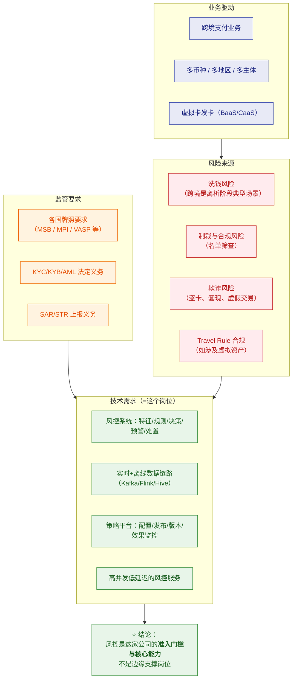
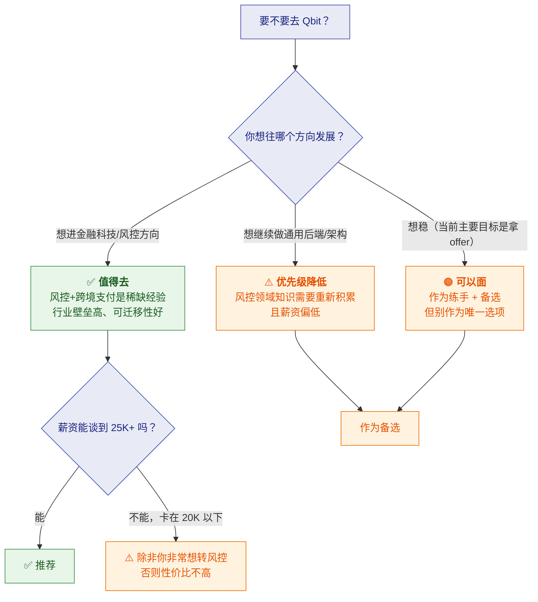

# 🏢 三、Qbit 公司情报与决策建议

> 返回 [[00-JD与匹配分析]]

> [!abstract] 先说结论
> **Qbit（趣比汇）是一家做"一站式跨境资金管理平台"的 B 轮 fintech 公司**，
> 客户是**做跨境生意的企业**（跨境电商卖家为主）。
> 产品是：**全球收款 + 全球付款 + 虚拟卡（量子卡）+ 海外公司注册**。
> **它自述"结合前沿的区块链技术，研发新一代跨境清结算网络"**——
> 这就解释了 JD 里为什么要 **AML + Travel Rule + 区块链经验**。
>
> **对你而言的关键判断**：
> ✅ 业务是**真实且有监管刚需**的（跨境支付必然要做 AML/KYC，不是"造需求"）
> ✅ 技术栈是**主流 Java 体系**，你的能力能直接落地
> ⚠️ 但这是**强监管 + 跨境 + 涉区块链**的业务，**合规风险与业务复杂度都不低**
> ⚠️ 薪资 15-25K 对"3-5 年"合理，**但对你的年限偏低**

---

## 一、公司做什么（已核实）

### 1.1 官方定位

> **"一站式全球资金管理平台"**——为企业提供跨境资金流转，
> 让客户获得**更便捷、高效、低成本**的跨境支付体验。

### 1.2 产品线（来自官网，已核实）

| 产品 | 官网英文名 | 说明 |
|---|---|---|
| **全球账户** | Global Account | 多币种收款账户 |
| **Qbit 卡 / 量子卡** | Qbit Cards / Virtual Payment Card | **虚拟支付卡**（用于广告投放、订阅等场景） |
| **全球付款** | Pay-outs / International Payments | 跨境付款 |
| **海外公司注册** | Business Incorporation | 帮客户注册海外主体 |
| **API 能力** | **BaaS / CaaS** | Banking-as-a-Service / Card-as-a-Service，**对外输出能力** |

> [!important] BaaS / CaaS 这个细节很关键
> 说明 Qbit 不只是"自己做个平台"，而是**把账户和发卡能力做成 API 对外输出**。
> 这解释了为什么它需要**很强的合规与风控中台**——
> **一旦能力对外输出，风险就跟着输出**，风控必须做得扎实。
> **这也说明这个风控岗位不是"边缘岗位"，而是核心能力的一部分。**

### 1.3 客户与场景

| 项 | 内容 |
|---|---|
| **目标客户** | **跨境经营的企业**（跨境电商卖家为主） |
| **公开数据** | 36氪报道称"**服务超 4 万家品牌**"（⚠️ 企业自述口径，待核实） |
| **典型需求** | 收海外平台的货款 → 付海外供应商/广告费 → 资金回流 |
| **痛点** | 传统银行跨境**慢、贵、开户难**；多币种、多地区管理复杂 |

> [!tip] 你要能讲清这个业务链条（面试很加分）
> **"我理解 Qbit 的价值是解决跨境企业的资金流转痛点：**
> **卖家在亚马逊/独立站收的钱，要通过它收回来、再付出去（供应商、广告、物流），
> 传统银行链路慢且贵。**
> **而跨境资金流转天然是 AML 的高风险场景**——
> 因为跨境、多币种、多主体，正是洗钱"离析"阶段的典型特征。
> **所以风控不是附加功能，是这个生意的准入门槛。**"
>
> 👉 这段话把**业务理解 + 风控必要性**串起来了，非常显专业。

---

## 二、⭐ 为什么这个岗位存在（业务驱动分析）

> [!important] 这是理解岗位价值的核心
> **风控岗位不是为了"技术炫技"，而是被监管和业务风险逼出来的。**

> [!success] 面试时讲这个，能体现"你理解岗位价值"
> **"我理解这个岗位不是普通的业务开发，而是支撑公司合规展业的核心能力。**
> **因为跨境支付涉及 AML、名单筛查这些法定义务——
> 风控做不好，轻则罚单，重则牌照受影响、业务停摆。**
> **所以这个系统的要求是：既要拦得住风险，又不能因为误杀把业务做死，
> 还得保证策略能快速迭代、每一次决策都能被审计。**"

---

## 三、Qbit 自述的合规能力（已核实，来自官网）

> [!note] 官网列出的合规做法（可作为面试谈资）
> | 能力 | 官网描述 |
> |---|---|
> | **KYC** | 针对不同企业客户提供**定制化 KYC 方案**，按主体、国家、监管要求做**分层有效的 KYC 体系** |
> | **交易监控** | 基于 **risk-based（风险为本）** 原则，用更科学系统的监控手段把**可疑交易分级为高/中/低**，**机器 + 人工审核结合** |
> | **卡风控** | 量子卡模块通过**实时打标 + 交易风控系统**捕捉不良用卡行为 |
> | **合规领域** | 明确提到跨境支付、**AML**、**数据保护（GDPR）** |

> [!important] 这段信息价值很高——它印证了 JD 的技术需求
> 官网说的"**可疑交易分级高/中/低 + 机器与人工结合**"，
> 正好对应 [[01-风控领域知识速成]] 里讲的"**分层处理**"
> 和 [[02-风控系统架构与技术深挖题]] 里的"**人工审核队列**"。
>
> **面试时可以直接引用**：
> **"我看到官网提到可疑交易按高中低分级、机器与人工结合审核——
> 我理解这对应系统里的'分层决策 + 人工审核队列'，
> 而人工队列的效率取决于前面自动决策的准确率，这就是误杀率为什么这么关键。"**

---

## 四、已知的公司信息

| 项 | 内容 | 来源 |
|---|---|---|
| 公司全称 | **杭州趣比汇网络科技有限公司** | JD |
| 品牌 | **Qbit / QBIT** | JD |
| 融资阶段 | **B 轮**（JD 标注），公开报道提到"千万级美元 B 轮"（2024-11） | DoNews / 36氪 |
| 规模 | **100-499 人**，互联网 | JD |
| 办公地 | 杭州**上城区平安金融中心 C 座 18F**（近 9 号线新业路站） | JD |
| 薪资 | **15-25K**，经验 3-5 年，本科 | JD |
| 官网域名 | qbitnetwork.com | 官方 |
| 版权主体 | 官网版权署名为 **AILINGUAL LIMITED**（⚠️ 境外主体，常见于跨境业务） | 官网 |
| 备案 | 浙 ICP / 浙公网安备（杭州主体） | 官网 |
| 海外身份 | 官网列有 **Visa Principal Member**（Visa 主会员）页面 | 官网 |

> [!warning] 两个值得注意的细节
> **① 版权主体是 AILINGUAL LIMITED（境外公司）**
> 这在跨境支付很常见（需要境外牌照主体），但意味着：
> **你签的劳动合同主体要看清**——是杭州趣比汇，还是境外主体？
> **这直接影响社保、个税、劳动争议管辖。**
>
> **② 官网的 "Visa Principal Member"**
> 如果是真的，说明它有发卡资质（这解释了"量子卡"）——
> 但**主会员资质通常要求很强的合规能力**。
> 👉 **面试时可以问**："我们持有哪些地区的牌照/资质？"——这既是尽调，也显得你懂行。

---

## 五、⚠️ 风险与需要警惕的点

### 5.1 业务与合规风险

| 风险 | 说明 | 你要怎么应对 |
|---|---|---|
| **强监管行业** | 跨境支付 + 涉区块链 → **监管政策变化会直接影响业务** | 面试问："主要展业地区是哪些？监管环境稳定吗？" |
| **区块链/虚拟资产的政策不确定性** | 国内对虚拟资产态度严格；若业务涉及，**合规边界要清楚** | ⚠️ **问清楚：业务里到底有没有虚拟资产？是纯法币还是含稳定币？** |
| **跨境资金合规风险** | 一旦被认定协助违规资金流动，**后果严重** | 这是公司层面的风险，你作为研发主要关注"系统是否有合规设计" |
| **多司法区合规冲突** | 如 GDPR vs Travel Rule 的数据传递要求 | 技术上有挑战，也是学习机会 |

> [!danger] 必须问清楚的一件事
> **"业务里有没有涉及虚拟资产/加密货币？还是纯法币跨境？"**
>
> 为什么必须问：
> - 若是**纯法币**：Travel Rule 可能只是"客户要求或未来规划"，风险相对可控
> - 若**涉及虚拟资产**：**国内主体做这个的合规敏感度很高**，要评估公司是否有境外合规主体与牌照
>
> 👉 这个问题**既保护你，也显得你专业**。

### 5.2 通勤与工作强度

| 项 | 内容 |
|---|---|
| **位置** | 上城区平安金融中心 C 座 18F，**近 9 号线新业路站** |
| **通勤** | ⚠️ **需你自己确认**（你之前的对比基准：智控/冠顿 15.3km、得逸 21.7km） |
| **强度** | 风控是 **7×24 业务**，**可能有 on-call / 值班**——**必须问** |

### 5.3 薪资现实

> [!warning] 15-25K 对"3-5 年"合理，但对你是偏低区间
>
> | 对比 | 薪资 |
> |---|---|
> | 智控（Java 开发，5年+） | 15-20K / 高级≤30K |
> | 冠顿（后端负责人，8年+） | 20-25K |
> | 得逸（技术经理，你谈的） | 你要求 20K |
> | **Qbit（高级研发，3-5年）** | **15-25K** |
>
> **分析**：
> - JD 写 **3-5 年**，说明这个岗位的定位**不是资深/负责人**，而是**能独立干活的骨干**
> - 15-25K 的区间，**上限就是你的下限附近**——对你十几年经验来说**明显偏低**
> - ⚠️ 但**风控方向的经验溢价高**：如果你能积累"跨境支付风控"这块经验，
>   **对后续职业发展（金融科技方向）是有价值的**
>
> **结论**：**如果去谈，一定要争取区间上沿甚至突破（25K+）**，
> 理由是"**我带过项目、做过对账与规则体系、且能独立完成 6 条职责的全流程**"。

---

## 六、⭐ 综合决策建议

> [!important] 我的判断：**值得面，但要看你的方向选择**
>
> **✅ 值得的一面**：
> - **风控 + 跨境支付是"有壁垒"的经验**——不像 CRUD，**换个人不容易上手**
> - **你的技术能直接落地**（Java/Flink/Kafka/Hive/高并发），不是从零开始
> - **行业需求真实**：跨境支付、合规科技是长期方向，**风控人才稀缺**
> - **面试本身就是学习**：你能补上"金融风控"这块认知，**对以后面金融类岗位都有用**
>
> **⚠️ 犹豫的一面**：
> - **薪资 15-25K 对你偏低**（这是"高级研发"而非"负责人/架构师"定位）
> - **业务合规风险**（跨境 + 涉区块链，政策敏感）
> - **可能有 on-call**（风控 7×24）
> - **通勤待确认**
>
> **建议策略**：
> **① 照常准备、去面试**（面试不花钱，能拿到信息）
> **② 面试中重点问清：业务里有没有虚拟资产、牌照情况、是否需要值班、薪资上限**
> **③ 和冠顿/得逸放在一起比**——如果 Qbit 能到 25K+ 且你想转风控，它值得；
>    如果卡在 20K 以下，**不如冠顿的负责人岗（20-25K，还带管理头衔）**

---

## 七、面试必问清单

### 🔴 业务与合规（最重要）

1. **"我们的业务里涉及虚拟资产/加密货币吗？还是纯法币跨境？"**
   - ⭐ 最关键——决定合规敏感度和技术方向
2. **"目前持有哪些地区的牌照或资质？主要展业地区是哪些？"**
3. **"Travel Rule 是我们已经在做，还是规划中？"**
   - 判断这个技术点在实际工作中的权重

### 🟠 岗位与团队

4. **"风控团队现在多少人？研发、策略、合规怎么分工？"**
5. **"这个岗位是新增还是替代离职者？"**
6. **"日常工作中，和策略/合规团队怎么协作？"**（对应职责 5）
7. **"风控是 7×24 业务，需要值班或 on-call 吗？"**

### 🟡 技术与薪资

8. **"规则引擎是自研还是用开源的（Drools/自研表达式）？Flink 用在哪些场景？"**
9. **"数据量级大概多少？风控决策的 QPS 和延迟要求是多少？"**
   - ⭐ 问得很专业，也能判断技术挑战度
10. **"PostgreSQL 主要用在哪些场景？"**
11. **"薪资区间是 15-25K，以我的经验（带过项目 + 对账/规则体系经验）能给到哪一档？"**
12. **"劳动合同主体是杭州趣比汇吗？"**（官网版权署名是境外主体 AILINGUAL LIMITED）

---

## 八、待补充

- [ ] 通勤距离（需你确认）
- [ ] 员工评价（看准网/脉脉/Glassdoor — 本次搜索受反爬限制，未获取到有效评价）
- [ ] 具体的牌照清单与展业地区
- [ ] 是否有劳动纠纷/监管处罚记录（本次未检索到，但也未穷尽）
- [ ] 薪资谈判空间

## 🔗 关联

- [[00-JD与匹配分析]] · [[01-风控领域知识速成]] · [[02-风控系统架构与技术深挖题]]
- 对比其他机会：[[面试准备/冠顿/00-JD与匹配分析]] · [[面试准备/得逸信息/00-JD与匹配分析]]

#面试 #Qbit #趣比汇 #公司情报 #跨境支付 #风控 #决策
