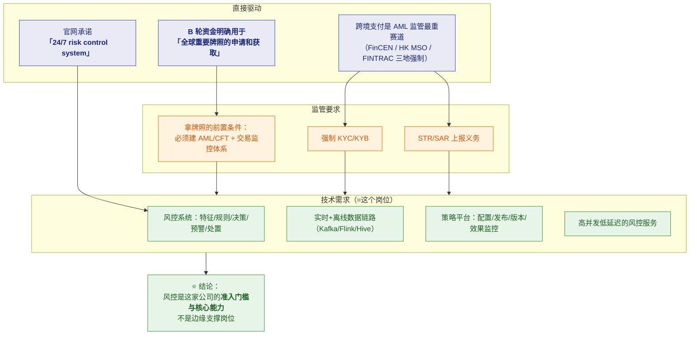
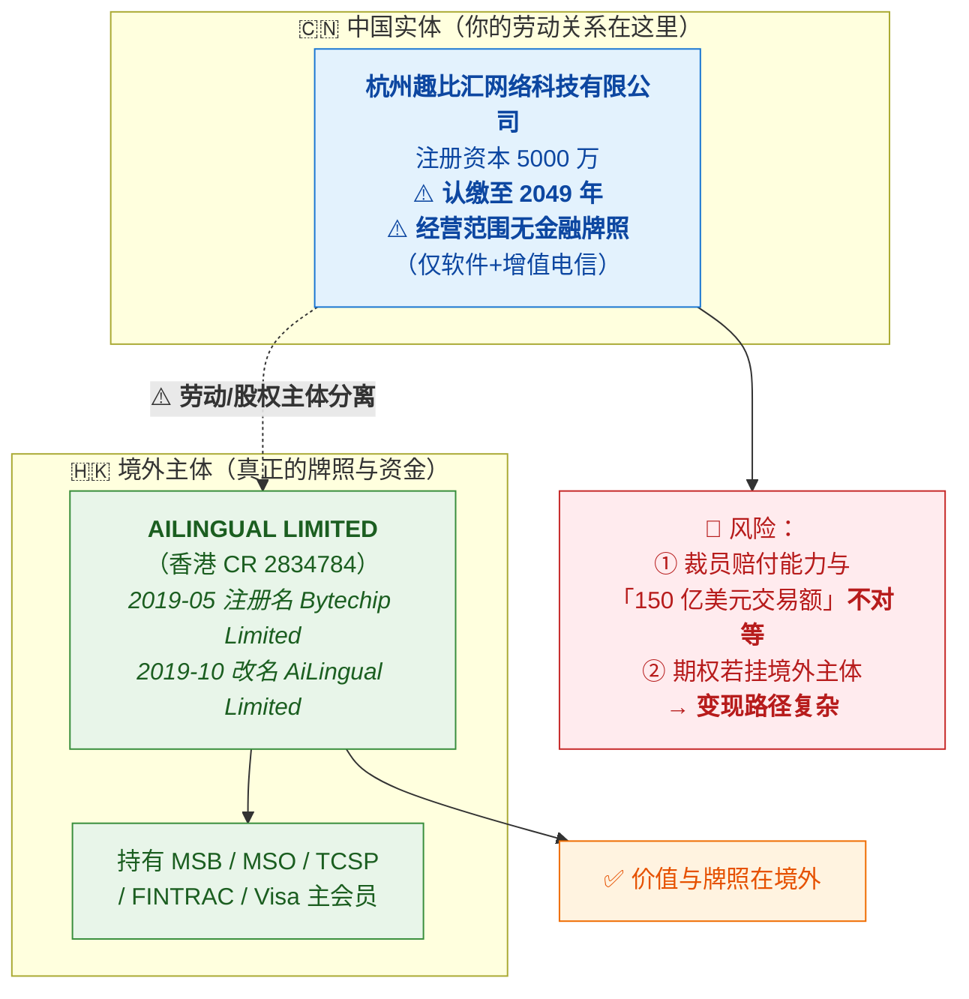
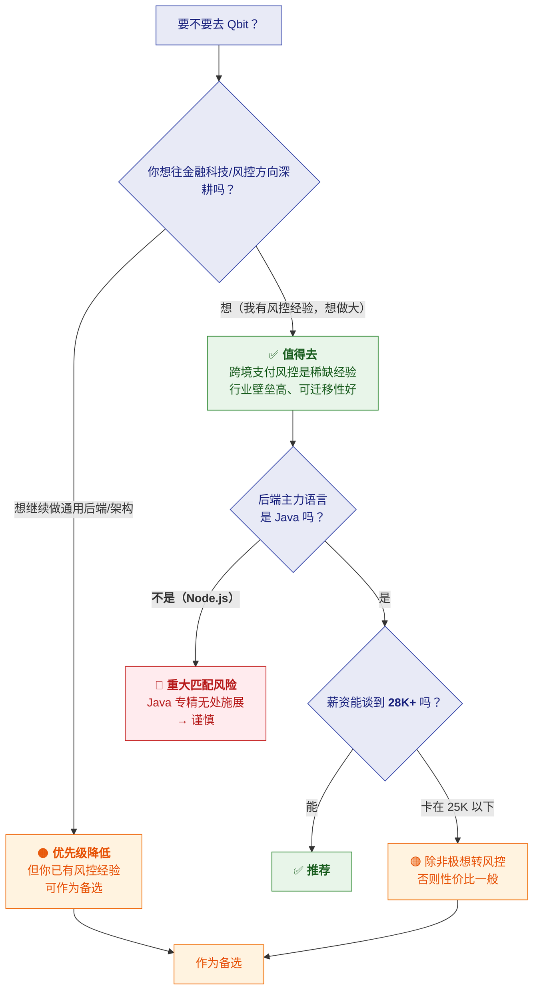

# 🏢 三、Qbit 公司情报与决策建议

> 返回 [[00-JD与匹配分析]]

> [!abstract] 先说结论
> **Qbit（趣比汇）是一家做"一站式跨境资金管理平台"的 B 轮 fintech 公司**，
> 客户是**做跨境生意的企业**（跨境电商卖家为主）。
> 产品：**全球多币种账户 + 全球收付款 + 量子虚拟卡 + 收单 + BaaS/CaaS API**。
>
> **⭐ 最重要的核实结果：没有证据表明 Qbit 做加密/稳定币业务。**
> 它的牌照清单里**没有任何虚拟资产牌照**，开发者 API 里**完全没有链上接口**。
> "结合区块链技术研发跨境清结算网络"这句话**从 2020 年 Pre-A 一直沿用到 2024 年 B 轮**，
> 措辞高度模板化，**更像融资话术而非真实业务**。
>
> **对你而言的关键判断**：
> ✅ 业务**真实且有监管刚需**（跨境支付必然要做 AML/KYC，这是拿牌照的前置条件）
> ✅ 技术栈是**主流 Java 体系**（⚠️ **但这一点未能核实，见风险四**）
> 🚩 **合同主体与持牌主体分离**——劳动关系在杭州实体，**牌照与资金在境外**
> ⚠️ 薪资区间**未能核实**，杭州同类岗位市场价约 **25-45K**（JD 标 15-25K，**明显偏低**）

---

## 一、公司做什么（已核实）

### 1.1 官方定位

> **"一站式全球资金管理平台"**，自我定位为 **Neobank（数字银行）**。
> 成立于 **2019-08-30**，杭州实体 + **海外持牌主体**的双层结构。

### 1.2 产品线（来自官网，已核实）

| 产品 | 官网英文名 | 说明 |
|---|---|---|
| **全球账户** | Global Account | 多币种收款账户 |
| **Qbit 卡 / 量子卡** | Qbit Cards / Virtual Payment Card | **虚拟卡 + 实体卡**（广告投放、订阅场景） |
| **全球付款** | Pay-outs / International Payments | 跨境付款 |
| **海外公司注册** | Business Incorporation | 帮客户注册海外主体 |
| **收单** | — | 商户收单 |
| **API 能力** | **BaaS / CaaS** | 账户/发卡能力**对外输出** |

> [!important] BaaS / CaaS 这个细节很关键
> 说明 Qbit 不只是"自己做个平台"，而是**把账户和发卡能力做成 API 对外输出**。
> **一旦能力对外输出，风险就跟着输出**，风控必须做得扎实。
> **这也说明这个风控岗位不是边缘岗位，而是核心能力的一部分。**

### 1.3 客户与规模

| 项 | 内容 |
|---|---|
| **目标客户** | **跨境电商卖家 / 广告投放型出海企业** |
| **官网自称** | **717 万张卡、150 亿美元交易额、4 万家企业客户、180+ 国家**（⚠️ 企业自述口径） |
| **员工规模** | ⚠️ 口径混乱：innoHere 50-99 / 快出海 50-150 / 36氪企服点评 11-50（**聚合站数据，可信度低**） |

> [!tip] 你要能讲清这个业务链条（面试很加分）
> **"我理解 Qbit 解决的是跨境企业的资金流转痛点：**
> **卖家在海外平台收的钱，要收回来、再付出去（供应商、广告、物流），
> 传统银行链路慢、贵、开户难。**
> **而跨境资金流转天然是 AML 的高风险场景**——
> 跨境、多币种、多主体，正是洗钱"离析"阶段的典型特征。
> **所以风控不是附加功能，是这个生意的准入门槛。**"

---

## 二、⭐ 最重要的核实：到底有没有加密业务

> [!danger] 结论：**没有证据表明 Qbit 经营加密/稳定币业务**
> 这是本次尽调**最关键的判断**，因为它直接影响你准备的方向和风险评估。

**四条证据链**：

| # | 证据 | 说明 |
|---|---|---|
| 1 | **牌照清单无虚拟资产牌照** | 只有 **US FinCEN MSB、HK MSO、HK TCSP、Canada FINTRAC MSB、PCI DSS L1**（[官方 security 页](https://www.qbitnetwork.com/security)） |
| 2 | **开发者 API 无链上接口** | [开发者文档](https://developer.qbitnetwork.com/docs) 里**完全没有** wallet / on-chain / stablecoin 相关接口，**纯法币** |
| 3 | **"区块链"是模板化话术** | "结合前沿区块链技术研发跨境清结算网络"这句**从 2020 年 Pre-A 用到 2024 年 B 轮**，措辞几乎不变 → 融资话术 |
| 4 | **但有 Web3 的 BD 动作** | 招过"杭州市市场负责人（**跨境支付与 Web3 方向**）"→ **Web3 在 BD 层面被考虑过** |

> [!important] ⭐ 对 Travel Rule 的解读要修正
> **之前我在 [[01-风控领域知识速成]] 里假设"Travel Rule → 因为涉加密货币"，这个假设需要修正。**
>
> **Travel Rule 同时适用于传统电汇和虚拟资产转账。**
> 鉴于 Qbit **无虚拟资产牌照、无链上 API**，JD 里的 Travel Rule 最可能指：
>
> **跨境支付自身的合规信息传递**——即"汇款人/收款人信息要随转账传递"，
> 这是 **FinCEN / HK MSO / FINTRAC 等牌照的合规要求**，不是加密专属。
>
> JD 里的"**区块链经验**"最可能是：
> - 用于**识别客户侧的加密资金来源**（客户收的是加密资产变现的钱 → 需要识别风险）
> - 或者只是**融资话术带进来的标签**

> [!success] 面试时怎么处理这个不确定性
> **"我看到 JD 里提到 Travel Rule 和区块链经验。想请教一下——
> 我们业务里的 Travel Rule 主要是传统跨境电汇的信息传递要求，
> 还是也涉及虚拟资产转账的场景？**
> **这会影响风控链路的设计方式。"**
>
> 👉 **这个问题一箭三雕**：① 澄清关键技术方向 ② 展示你懂 Travel Rule 的双重适用性 ③ 显得你在认真评估而不是盲目投递。

---

## 三、⭐ 为什么这个岗位存在（监管刚需）

> [!important] 这是理解岗位价值的核心
> **风控岗位不是"技术炫技"，是被监管和牌照要求逼出来的。**

> [!success] 面试时讲这个，能体现"你理解岗位价值"
> **"我理解这个岗位不是普通业务开发，而是支撑公司合规展业的核心能力。**
> **跨境支付涉及 AML、名单筛查这些法定义务——风控做不好，轻则罚单，
> 重则牌照受影响、业务停摆。**
> **所以这个系统的要求是：既要拦得住风险，又不能因为误杀把业务做死，
> 还得保证策略能快速迭代、每一次决策都能被审计。**"

---

## 四、Qbit 自述的合规能力（已核实，来自官网）

> [!note] 官网列出的合规做法（可作为面试谈资）
> | 能力 | 官网描述 |
> |---|---|
> | **KYC** | 针对不同企业客户提供**定制化 KYC 方案**，按主体、国家、监管要求做**分层有效的 KYC 体系** |
> | **交易监控** | 基于 **risk-based（风险为本）** 原则，用更科学系统的监控手段把**可疑交易分级为高/中/低**，**机器 + 人工审核结合** |
> | **卡风控** | 量子卡模块通过**实时打标 + 交易风控系统**捕捉不良用卡行为 |
> | **合规领域** | 明确提到跨境支付、**AML**、**数据保护（GDPR）** |

> [!important] 这段信息价值很高——它印证了 JD 的技术需求
> 官网说的"**可疑交易分级高/中/低 + 机器与人工结合**"，
> 正好对应 [[01-风控领域知识速成]] 里讲的"**分层处理**"
> 和 [[02-风控系统架构与技术深挖题]] 里的"**人工审核队列**"。
>
> **面试时可以直接引用**：
> **"我看到官网提到可疑交易按高中低分级、机器与人工结合审核——
> 我理解这对应系统里的'分层决策 + 人工审核队列'，
> 而人工队列的效率取决于前面自动决策的准确率，这就是误杀率为什么这么关键。"**

---

## 五、已知的公司信息（已核实）

| 项 | 内容 |
|---|---|
| 公司全称 | **杭州趣比汇网络科技有限公司** |
| 品牌 | **Qbit / QBIT**（自定位 Neobank） |
| **成立时间** | **2019-08-30** |
| **法定代表人** | **吴羽君** |
| **注册资本** | **5000 万**（⚠️ **认缴至 2049 年**） |
| **股东结构** | 吴羽君持股 **99.98%** |
| **经营范围** | ⚠️ **仅「软件 + 增值电信」，无任何金融牌照** |
| 统一社会信用代码 | 91330104MA2GPU53XA |
| 融资历程 | 种子 2018-12 → Pre-A 2020-12（沙塔基金、Parallel Ventures）→ A 2021-07（真格基金，近千万美元）→ A+ 2022-07（峰瑞资本）→ **B/B1 2024-11-25，千万级美元，投资方未披露** |
| 规模 | ⚠️ 口径混乱：50-99 / 50-150 / 11-50（聚合站数据，**可信度低**） |
| 办公地 | ✅ **杭州上城区平安金融中心 C 座 18F**（与 JD 完全吻合） |
| 官网 | qbitnetwork.com |

### 4.1 ⭐ 持牌情况（真正的价值在境外主体）

| 资质 | 说明 |
|---|---|
| **US FinCEN MSB** | 美国货币服务商牌照（2019） |
| **HK MSO** | 香港金钱服务经营者牌照（2021） |
| **HK TCSP** | 香港信托或公司服务提供者 |
| **Canada FINTRAC MSB** | 加拿大货币服务商 |
| **PCI DSS L1** | 支付卡行业数据安全标准最高等级 |
| **Visa Hong Kong Principal Member** | ✅ Visa 香港主会员（解释了发卡能力） |
| ⚠️ **虚拟资产牌照** | **无**（这个细节很重要，见第二节） |

### 4.2 🚩 关键结构：双层主体

> [!danger] ⚠️ 这是最需要注意的结构性风险
> **官网版权署名是 AILINGUAL LIMITED（境外）**，
> 而**杭州实体的经营范围里没有任何金融牌照**。
>
> **含义**：
> - **你的劳动合同主体应该是杭州趣比汇**（中国实体）→ 社保、个税、劳动争议按国内规则
> - **但真正的牌照、资金、业务价值都在境外主体**
> - 🚩 **杭州实体注册资本 5000 万且"认缴至 2049 年"**——
>   "认缴"意味着**钱还没实缴**，**实际赔付能力可能远低于注册资本**
>
> **面试必问**：
> - "劳动合同主体是杭州趣比汇吗？"
> - "如果有期权/股权激励，**挂哪个主体**？"
>
> 👉 **这不是挑剔，是跨境公司求职的标准尽调动作。**

> [!note] 关于香港主体的一个小发现
> AILINGUAL LIMITED 在 2019-05 注册时叫 **Bytechip Limited（趣比匯有限公司）**，
> 2019-10 改名为 **AiLingual Limited（艾靈谷有限公司）**。
> "艾灵谷"是创始人上一家 AI 公司的名字 → **复用了旧壳**。
> 这本身不违规（改壳很常见），但**说明这个主体系历史沿革而来，不是为持牌新设的**。

---

## 六、⚠️ 风险与需要警惕的点

### 5.1 🚩 风险一：技术栈未能核实（**最实际的匹配风险**）

> [!danger] 这条可能比合规风险更直接影响你
> **尽调结论：Java / SpringCloud / Kafka / Flink / Hive / PostgreSQL 这一套，
> 没有任何可靠证据支持。**
>
> **唯一的直接线索是**：2020 年 CNode 社区发布的
> **「Node.js 全栈工程师」** 招聘（15K-30K）——
> **指向 Node.js 技术栈，与"Java + SpringCloud"的假设方向相反。**
>
> - 没有工程博客、没有 GitHub 组织、没有技术演讲
> - 开发者文档用 ReadMe.io（SaaS），基础设施用阿里云 OSS 杭州节点

> [!warning] 怎么理解这件事
> **有两种可能，面试必须问清：**
>
> | 可能 | 说明 | 对你的影响 |
> |---|---|---|
> | **A. 确实是 Java 体系** | JD 标签明确写了 Java/SpringCloud/Kafka/Flink，**大概率是真的** | ✅ 匹配 |
> | **B. 团队主力仍是 Node.js** | 2020 年招的是 Node，后来可能转型或部分转型 | ⚠️ **实质性匹配风险** |
>
> **更可能的解读**：JD 上的 **Java 栈是"目标栈"或"新增团队栈"**，
> 而历史系统可能是 Node.js。**这在快速扩张的公司很常见。**
>
> 👉 **必须问**："**我们后端主力语言是什么？现有风控系统是 Java 还是 Node.js？**"
> **这个问题问得越早越好**——如果主力是 Node.js 而你专精 Java，要提前评估。

### 5.2 🚩 风险二：双层主体结构（见 4.2）

已在 4.2 详述。核心是**劳动关系与资产/牌照在两地**。

### 5.3 业务与合规风险

| 风险 | 说明 | 你要怎么应对 |
|---|---|---|
| **强监管行业** | 跨境支付受**银行去风险化、外汇管制、中美中港监管变化**冲击 | 问："主要展业地区？监管环境稳定吗？" |
| **不持银行牌照** | 业务**依赖合作银行与 Visa 会员资格** → 合作方变动会影响业务 | 这是行业共性问题，了解即可 |
| **加密业务定位模糊** | 无牌照无链上接口，却长期宣传区块链 + 招 Web3 BD | ⚠️ **必须问清**（见第二节） |
| **多司法区合规冲突** | 如 GDPR vs Travel Rule 的数据传递要求 | 技术挑战，也是学习机会 |

> [!important] 修正之前的一个判断
> 我在 [[00-JD与匹配分析]] 里把"区块链经验"列为**主要风险点**。
> 尽调后**需要下调这个风险等级**：
> **Qbit 大概率不做加密业务**，
> 所以"区块链经验"更可能是**识别客户侧加密资金来源**的能力要求，
> 或者是**JD 模板里的标签**。**不必为它过度焦虑。**

### 5.4 通勤与工作强度

| 项 | 内容 |
|---|---|
| **位置** | ✅ 上城区平安金融中心 C 座 18F，**近 9 号线新业路站** |
| **通勤** | ⚠️ **需你自己确认**（对比基准：智控/冠顿 15.3km、得逸 21.7km） |
| **强度** | 官网承诺 **"24/7 risk control system"** → **很可能有 on-call / 值班**，**必须问** |

### 5.5 信息真空

> [!warning] 公开信息里几乎查不到员工评价
> - 员工评价/加班文化/离职率：**公开渠道几乎为零**（36氪企服点评 **0 条点评**）
> - 黑猫投诉：**未检索到有效记录**
> - 裁判文书/劳动争议/行政处罚：**未检索到**
>   ⚠️ **但天眼查/企查查/爱企查全部反爬拦截**，所以"未发现"≠"确认没有"
> - ⚠️ 跨境电商社区 advertcn 有帖子标题《**[吐槽] qbit这家虚拟卡不建议使用**》
>   —— **页面被反爬拦截，只读到标题，无法确认内容**（建议你手动搜索看看）

### 5.6 💰 薪资现实（⚠️ JD 标注的区间明显偏低）

> [!danger] 15-25K 与市场价差得比较远
> **杭州市场同类"高级研发 / 风控研发"在跨境支付公司，
> 合理区间约 25K-45K/月**（按 16 薪约 40-70 万/年）。
>
> | 对比 | 薪资 |
> |---|---|
> | **杭州跨境支付风控研发（市场价）** | **25-45K** |
> | **Qbit JD 标注** | ⚠️ **15-25K** |
> | Qbit 自身历史招聘（2020，Node.js 高级岗） | 15-30K |
> | 智控（Java 开发，5年+） | 15-20K / 高级≤30K |
> | 冠顿（后端负责人，8年+） | 20-25K |
> | 得逸（技术经理，你谈的） | 你要求 20K |
>
> **分析**：
> - JD 写 **3-5 年**，定位是**能独立干活的骨干**，不是资深/负责人
> - **15-25K 的上限（25K）才刚够到市场价的起步（25K）** → **标价偏低**
> - ⚠️ 但要注意：**JD 上的区间常常不是最终区间**，尤其对超配的候选人
>
> **建议心理线**：
> - ✅ **30K+ 合理**——匹配"高级 + 风控 + 复合技术栈"的要求
> - 🟠 **25K 可接受**——接近市场起步价
> - ❌ **< 20K 不匹配**——与岗位要求的复合能力不对等
>
> **谈薪理由（你手上的牌）**：
> ① **你做过风控系统**（规则引擎 + 反欺诈），**不是转行**
> ② 带过项目、做过对账与工单处置体系
> ③ 能独立完成 JD 六条职责的全流程（职责 6 明确要求）
> ④ 超配经验（JD 要 3-5 年）

> [!warning] ⚠️ 一个信息缺口
> **尽调未能拿到该岗位的 JD 原文与薪资区间**
> （BOSS直聘/猎聘/58 均未命中原始岗位页）。
> 上面的市场价是**基于杭州同类岗位的推断**，不是 Qbit 的实际出价。
> **你手上的 JD 截图（15-25K）就是唯一的一手信息。**

---

## 七、⭐ 综合决策建议

> [!important] 我的判断（基于尽调更新）：**值得面，但有两个前置确认**
>
> **✅ 值得的一面**：
> - ⭐ **你做过风控**（规则引擎 + 反欺诈）——**这不是转行，是场景切换**
> - **跨境支付风控是"有壁垒"的经验**——换个人不容易上手，金融科技方向长期需求
> - **技术能直接落地**（Java/Flink/Kafka/Hive/高并发）
> - **面试本身就是学习**：补上 AML/Travel Rule 认知，对以后面金融类岗位都有用
> - ✅ **一个关键风险已排除**：尽调显示 **Qbit 大概率不做加密业务** →
>   **合规敏感度比我最初判断的低**，不必为"区块链"过度焦虑
>
> **⚠️ 两个必须先确认的前置条件**：
> 1. 🚩 **后端主力语言是不是 Java？**
>    ——尽调未找到 Qbit 用 Java 的任何证据，唯一线索是 2020 年招 **Node.js**。
>    **如果团队主力是 Node.js，你的专精无法施展。**
> 2. 🚩 **劳动合同主体与期权主体**——
>    杭州实体**注册资本 5000 万且认缴至 2049 年**，
>    而牌照与资金在境外 **AILINGUAL LIMITED**。
>
> **⚠️ 一个明显的短板**：
> **JD 标 15-25K，而杭州同类岗位市场价 25-45K**——
> **建议见面前就把薪资问清，低于 25K 不值得投入太多精力。**
>
> **建议策略**：
> ① **照常准备、去面试**（不花钱，且能拿到关键信息）
> ② **优先问清四件事：后端语言、合同/期权主体、是否值班、薪资上限**
> ③ **和冠顿/得逸放在一起比**：
>    - Qbit 若 **28K+ 且确认是 Java 栈** → 值得（你有风控经验，能直接贡献）
>    - 若 **< 20K 或主力是 Node.js** → **不如冠顿的负责人岗（20-25K + 管理头衔）**

---

## 八、面试必问清单

### 🔴 业务与合规（最重要）

1. **"我们的业务里涉及虚拟资产/加密货币吗？还是纯法币跨境？"**
   - ⭐ 最关键——决定合规敏感度和技术方向
2. **"目前持有哪些地区的牌照或资质？主要展业地区是哪些？"**
3. **"Travel Rule 是我们已经在做，还是规划中？"**
   - 判断这个技术点在实际工作中的权重

### 🔴 第一优先级：决定要不要继续（建议第一轮就问）

1. 🚩 **"我们后端的主力语言是什么？现有风控系统是 Java 还是 Node.js？"**
   - ⭐⭐ **最实际的匹配风险**——尽调未找到 Qbit 用 Java 的证据，
     唯一线索是 2020 年招 Node.js。**如果主力是 Node.js，你的专精无法施展。**
2. 🚩 **"薪资区间是 15-25K，以我的经验（做过风控系统 + 带过项目）能给到哪一档？"**
   - ⭐ 杭州同类岗位市场价 **25-45K**，**低于 25K 不值得投入太多精力**
3. 🚩 **"劳动合同主体是杭州趣比汇吗？如果有期权/股权，挂哪个主体？"**
   - 双层结构：杭州实体（注册资本认缴至 2049 年）vs 境外 AILINGUAL LIMITED
4. 🚩 **"风控是 7×24 业务，需要值班或 on-call 吗？"**
   - 官网承诺 "24/7 risk control system"

### 🟠 第二优先级：业务与技术方向

5. **"业务里的 Travel Rule 主要是传统跨境电汇的信息传递，还是也涉及虚拟资产转账？"**
   - ⭐ 一箭三雕：澄清方向 + 展示你懂 Travel Rule 的双重适用性 + 显得在认真评估
6. **"目前持有哪些地区的牌照？主要展业地区是哪些？"**（已知：US MSB、HK MSO/TCSP、Canada FINTRAC、Visa HK）
7. **"规则引擎是自研还是用开源的（Drools/自研表达式）？Flink 用在哪些场景？"**
8. **"数据量级大概多少？风控决策的 QPS 和延迟要求是多少？"**
   - ⭐ 问得专业，也能判断技术挑战度
9. **"现有风控系统是自研还是采购？我在哪些地方能直接接手？"**

### 🟡 第三优先级：团队与协作

10. **"风控团队现在多少人？研发、策略、合规怎么分工？"**
11. **"这个岗位是新增还是替代离职者？"**
12. **"日常和策略/合规团队怎么协作？"**（对应职责 5）
13. **"PostgreSQL 主要用在哪些场景？"**

---

## 九、待补充

- [ ] 通勤距离（需你确认）
- [ ] **后端主力语言**（⭐ 最关键的信息缺口）
- [ ] **薪资谈判空间**（JD 标 15-25K，需探真实上限）
- [ ] 员工评价（看准网/脉脉/Glassdoor — 本次搜索受反爬限制，未获取到有效评价）
- [ ] 客户投诉内容（advertcn 帖子《[吐槽] qbit这家虚拟卡不建议使用》——页面被拦截，只有标题）
- [ ] 是否有劳动纠纷/监管处罚记录（本次未检索到，但天眼查等全部反爬，"未发现"≠"没有"）

> [!tip] 完整尽调报告
> 一份更详尽的独立尽调报告（含融资历程、香港主体沿革、API 目录分析、11 项未验证事项）在：
> [[Qbit趣比汇-雇主尽调报告]]
>
> ⚠️ **避免误伤提醒**：检索中出现的 "UAB QBIT Financial Service"（立陶宛加密货币钱包公司，
> 涉美国加州诉讼）**与杭州趣比汇是完全不同的两家公司**，别混淆。

## 🔗 关联

- [[00-JD与匹配分析]] · [[01-风控领域知识速成]] · [[02-风控系统架构与技术深挖题]]
- [[Qbit趣比汇-雇主尽调报告]]（完整尽调）
- 对比其他机会：[[面试准备/冠顿/00-JD与匹配分析]] · [[面试准备/得逸信息/00-JD与匹配分析]]

#面试 #Qbit #趣比汇 #公司情报 #跨境支付 #风控 #决策
