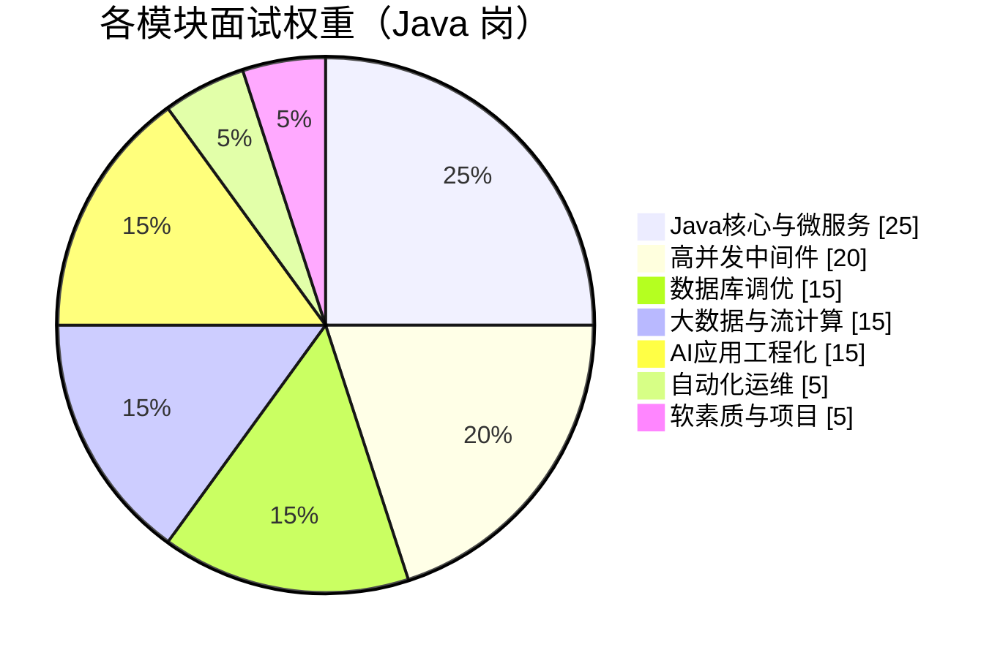

# 🎯 专业技能题库 · 总览

> [!abstract] 这个文件夹是什么
> 按你**简历里写的六条专业技能**逐条组织的面试题。
> 和 [[面试准备/技术面试题库/00-总览与使用说明|通用技术面试题库]] 的分工：
> - **通用题库** = 八股基础，不限公司
> - **本文件夹** = 按简历声明组织的**深挖题 + 话术 + 翻车点**，面哪家都能用
> - **智控文件夹** = 那家公司的专属内容

---

## 你简历上的原话

1. **AI 应用工程化**：熟悉 LLM 工程化落地，掌握 Spring AI / LangChain 应用开发，具备 RAG 企业知识库与 AI Agent 智能体组件的实战经验
2. **Java 核心与微服务**：精通 Java、高并发编程，深入掌握 Spring Boot/Cloud、Spring MVC、MyBatis 框架源码与设计模式
3. **高并发中间件**：精通 Redis 分布式缓存（穿透/雪崩/一致性）、Kafka/RabbitMQ 消息队列的异步解耦与削峰填谷方案
4. **数据库调优**：精通 SQL/PL/SQL 与复杂存储过程，擅长 MySQL 深度索引优化、慢查询调优，熟悉 MGR/Keepalived 高可用架构
5. **大数据与流计算**：精通 Hadoop、Hive、HBase 等大数据框架，深入掌握 Flink 实时流式计算的 SQL 开发与 ETL
6. **自动化运维**：精通 Shell 脚本编程

---

## ⚠️ 先看这个：你的"精通"是双刃剑

> [!danger] 简历里出现「精通」「深入掌握源码」，面试官一定会往深处钻
> 这不是坏事——**敢写就要敢接**。但必须分清哪些能扛住深挖，哪些会被打穿。

| 你的声明 | 危险等级 | 会被问到什么程度 |
|---|---|---|
| 深入掌握 **框架源码** | 🔴 极高 | 会问 `refresh()` 流程、三级缓存源码、`DispatcherServlet` 九步、MyBatis 四大对象 |
| 精通 **高并发编程** | 🔴 极高 | AQS 源码、线程池源码、无锁、伪共享 |
| 精通 **Redis** | 🟠 高 | 会问主从复制原理、哨兵选举、Cluster 槽迁移 |
| 精通 **Kafka/RabbitMQ** | 🟠 高 | ISR/HW、Rebalance、事务消息、死信/延迟队列 |
| 精通 **SQL/PL-SQL 与复杂存储过程** | 🟠 高 | 会追问"为什么互联网公司不推荐存储过程" |
| 熟悉 **MGR/Keepalived** | 🟡 中 | 会问 VRRP、MGR 一致性协议、脑裂 |
| 精通 **Hadoop/Hive/HBase** | 🟠 高 | RowKey 热点、数据倾斜、小文件 |
| 深入掌握 **Flink** | 🟠 高 | Watermark、Checkpoint 对齐、Exactly-Once 端到端 |
| 精通 **Shell** | 🟢 低 | 顶多问"你用它做过什么" |

**三条保命原则**
1. **"精通"的领域必须能讲原理，不能只讲 API** —— 被问到"为什么这么设计"就露馅了
2. **准备 1 个真实项目例子挂钩每个技能** —— 纯背八股很容易被识破
3. **不确定的，面试时主动降级**：说"这块我用得比较多，但不敢说精通"比硬撑安全得多

> [!tip] 简历优化建议（如果还来得及）
> `精通` 用得太多了。业内共识是：**精通 = 能讲源码、能设计、能排障**。
> 建议保留 2-3 个真能扛住深挖的写"精通"，其余改成"熟练/熟悉"，反而更可信。

---

## 复习优先级（时间有限就按这个顺序）

| 优先级   | 模块          | 笔记                | 理由                           |
| ----- | ----------- | ----------------- | ---------------------------- |
| 🥇 P0 | Java 核心与微服务 | [[02-Java核心与微服务]] | Java 岗的地基，且你写了"源码"           |
| 🥇 P0 | 高并发中间件      | [[03-高并发中间件]]     | 写了"精通"，Redis/Kafka 几乎必问      |
| 🥈 P1 | 数据库调优       | [[04-数据库调优]]      | MySQL 必问；MGR/Keepalived 是差异点 |
| 🥈 P1 | AI 应用工程化    | [[01-AI应用工程化]]    | 你的**差异化亮点**，但要防"只会调 API"     |
| 🥉 P2 | 大数据与流计算     | [[05-大数据与流计算]]    | 加分组合，除非岗位明确要大数据              |
| 🥉 P3 | 自动化运维       | [[06-自动化运维Shell]] | 问得浅，准备 2 个实战脚本即可             |

---

## 使用建议

- 每篇结构统一：**简历原话 → 分层问题 → 得分骨架 → 翻车点 → 话术**
- 每个模块挑 **1 个项目案例**背熟，被问细节时往项目上引
- 打 `#待补` 的当天补掉，别攒到最后

---

## 🔗 关联

- [[面试准备/技术面试题库/00-总览与使用说明|通用技术面试题库]]
- [[面试准备/智控/00-总览与待确认|智控面试准备]]

#面试 #专业技能 #简历 #导航
