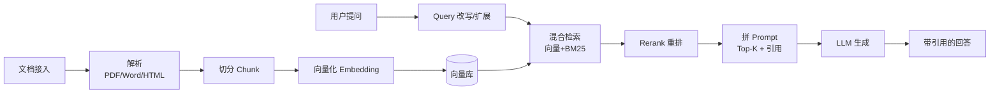

# 🤖 01 · AI 应用工程化

> 返回 [[00-总览与复习优先级]]

> [!quote] 简历原话
> 熟悉 LLM 工程化落地，掌握 Spring AI / LangChain 应用开发，具备 RAG 企业知识库与 AI Agent 智能体组件的实战经验

> [!important] 这个模块的定位
> 这是你的**差异化亮点**，但也最容易被打穿——面试官会验证你是"会调 API"还是"真的工程化落地过"。
> **关键词是"工程化"**：稳定性、成本、延迟、可观测、安全，这五个词要能展开讲。

---

## 一、LLM 基础（快速确认，别答错）

| 问题                  | 得分骨架                                                    |
| ------------------- | ------------------------------------------------------- |
| Token 是什么           | 模型处理的最小单位，约等于 0.75 个英文单词 / 1-2 个汉字；上下文窗口、计费都按 token 算   |
| Temperature / Top-p | 都是采样随机性控制；Temperature 调分布平坦度，Top-p 按累积概率截断；**同一任务只调一个** |
| 上下文窗口超了怎么办          | 截断（保留最近+系统提示）、摘要压缩、滑动窗口、RAG 只塞相关片段、分段处理                 |
| 幻觉怎么缓解              | ① 检索增强（RAG）② 引用溯源 ③ 约束输出格式 ④ 事实校验/工具核对 ⑤ 降低温度 ⑥ 人工兜底    |
| 模型怎么选型              | 效果 / 成本 / 延迟 / 上下文长度 / 私有化合规，五个维度打分；**分层用**（简单问题小模型）    |
| 开源 vs 闭源            | 数据合规、成本、可控性 vs 效果、维护成本；**欧洲客户数据不出境 → 必须私有化部署**          |

---

## 二、LLM 工程化落地（**核心考点**）

> 面试官真正想听的是这五个词：**稳定、成本、延迟、可观测、安全**。

### 2.1 稳定性
- **超时 + 重试**：LLM 调用必须设超时；重试要**指数退避 + 抖动**，且只对可重试错误（限流/5xx）重试
- **降级兜底**：主模型挂了 → 切备用模型（同厂商/异构）→ 再不行 → 返回兜底话术/转人工
- **幂等**：流式输出中断重试要能续；用 requestId 关联
- **限流**：按租户/用户限流，防止单个用户打爆额度
- **熔断**：连续失败就快速失败，别拖垮整个服务

### 2.2 成本控制（很能体现"工程化"）
| 手段 | 说明 |
|---|---|
| **Prompt 缓存** | 系统提示 + 固定上下文走缓存（Anthropic/OpenAI 都支持），能省 50-90% |
| **结果缓存** | 相同问题（归一化后）直接返回，用 Redis |
| **模型分层** | 意图识别/简单改写用小模型，复杂推理才上大模型 |
| **Token 控制** | 精简 Prompt、限制输出长度、RAG 只塞 Top-K |
| **批处理** | 离线任务用 Batch API（通常半价） |
| **流式** | 不是为了省钱，是为了**首字延迟体验** |

> 面试时给个**量级**：比如"日调用 10 万次，通过缓存 + 模型分层把成本从 X 降到 Y"。

### 2.3 延迟优化
- **首字延迟（TTFT）** vs 总延迟，是两个指标
- 手段：流式输出、Prompt 精简、RAG 并行检索、小模型前置、预热连接池
- 典型量级：TTFT 几百 ms，完整回答几秒

### 2.4 可观测（工程化的分水岭）
- **Trace**：一次请求串起 检索 → 重排 → 模型调用 → 工具调用，每步耗时和 token
- **日志**：输入输出、模型版本、Prompt 版本、token 消耗、命中缓存
- **指标**：QPS、P99 延迟、失败率、token 成本、缓存命中率
- **评测**：离线评测集（回归）+ 线上 A/B + 人工抽检

### 2.5 安全
- **Prompt 注入**：用户输入里藏指令 → 防护：输入过滤、系统提示与用户输入分隔、权限最小化、输出校验
- **数据脱敏**：手机号/身份证/内部数据在送模型前脱敏
- **内容审核**：输入输出双向审核
- **越权**：RAG 检索必须带**文档权限过滤**，否则用户能问到别人的资料

---

## 三、Spring AI（简历写了，要能讲）

| 问题 | 得分骨架 |
|---|---|
| Spring AI 是什么 | Spring 生态的 LLM 应用框架，把模型调用、向量库、RAG、工具调用抽象成 Spring 风格的 Bean |
| 核心抽象 | `ChatClient`（流式 API）、`ChatModel`（模型实现）、`EmbeddingModel`、`VectorStore`、`Advisor`（拦截器链）、`FunctionCallback`（工具） |
| 与 Spring Boot 的集成 | 自动装配 + starter；配置 `spring.ai.openai.api-key` 等；换模型只换 starter 和配置 |
| Advisor 机制 | 类似 AOP 的拦截链，可插拔地做 RAG 检索增强、对话记忆、日志（`QuestionAnswerAdvisor`） |
| 结构化输出 | 用 `BeanOutputConverter` 把模型输出直接映射成 POJO/Record |
| 为什么选它 | 与现有 Spring 项目无缝集成、依赖注入、可测试；比直接写 HTTP 调用规范 |

> [!warning] 翻车点
> 只会说"我用了 `ChatClient` 调模型"会被认为**没落地**。
> 要能讲：**多模型如何切换、如何做降级、Advisor 链怎么组织的、向量库选的什么为什么**。

---

## 四、LangChain（简历写了，要能讲）

| 问题 | 得分骨架 |
|---|---|
| LangChain 是什么 | LLM 应用编排框架：Chain / Memory / Retriever / Tool / Agent |
| 核心概念 | `PromptTemplate`、`LLMChain`、`Runnable`（LCEL 管道）、`Memory`、`Retriever`、`Tool` |
| LCEL | 用 `|` 把组件串成管道，支持流式、异步、并行、重试，统一 `invoke/stream/batch` |
| LangChain vs LangGraph | LangChain 适合线性/简单分支；**LangGraph 用图（状态机）编排复杂 Agent**，支持循环、人工介入、状态持久化 |
| Memory 类型 | 全量缓冲、窗口、摘要、摘要+缓冲 |
| 与 Spring AI 怎么选 | Java 项目优先 Spring AI；LangChain 是 Python 生态更成熟。**跨语言方案：Python 侧做 Agent 服务，Java 通过 HTTP/gRPC 调** |

> [!warning] 翻车点
> 如果实际是 Python 的 LangChain，别说成 Java 的（Java 版 LangChain4j 是另一个项目）。被追问语言时含糊其辞 = 减分。

---

## 五、RAG 企业知识库（**必问，要能画全流程**）

### 高频问题

| 问题 | 得分骨架 |
|---|---|
| **chunk 怎么切** | 固定长度+重叠（最简单）、按语义/标题层级、递归切分、**父子文档**（小块检索、大块喂给模型）；chunk 太大稀释语义，太小丢上下文；一般 300-800 token + 10-20% 重叠 |
| **检索不准怎么优化** | ① **混合检索**（向量 + BM25 关键词）② **Rerank**（交叉编码器重排 Top-50 → Top-5）③ Query 改写/HyDE ④ 多路召回 + RRF 融合 ⑤ 元数据过滤 ⑥ 调 chunk 策略 |
| **RAG vs 微调** | 知识频繁更新 → RAG；风格/格式/领域语气 → 微调；**两者可叠加**；RAG 成本低、可溯源、易更新 |
| **长上下文能替代 RAG 吗** | 不能：成本高、延迟高、超长上下文"中间遗忘"、无法做权限过滤、无法溯源 |
| **向量库选型** | pgvector（已有 PG，运维简单）、Milvus（大规模）、Elasticsearch（已有 ES，混合检索强）、Qdrant/Chroma（轻量）；按数据量/QPS/运维成本选 |
| **相似度度量** | 余弦（最常用，归一化后等价内积）、内积、欧氏距离 |
| **向量索引** | HNSW（图，查询快、内存高）、IVF（聚类，省内存、需训练）、PQ（量化压缩） |
| **怎么评估 RAG** | 检索侧：召回率/命中率/MRR；生成侧：忠实度（faithfulness）、相关性、答案正确率；工具：RAGAS；**离线评测集 + 人工抽检** |
| **文档级权限隔离** | 元数据打 tenant/部门标签，**检索时强制过滤**（在向量库查询条件里带 ACL）；绝不能"先检索再过滤" |
| **知识更新** | 增量索引 + 文档版本；删除要同步删向量；定时全量重建兜底 |
| **多轮对话怎么做** | Query 改写（把"它多少钱"结合历史改写成完整问题）再检索 |
| **表格/图片怎么办** | 表格转 Markdown/结构化；图片走多模态模型描述后再索引 |

> [!tip] 一定要能讲一个**量化结果**
> "企业知识库，文档 X 万页，检索命中率从 X% 提到 Y%，人工客服转接率下降 Z%"
> 没有数字的 RAG 项目，在面试官眼里等于没做过。

---

## 六、AI Agent 智能体

| 问题 | 得分骨架 |
|---|---|
| Agent vs 工作流 | 工作流是**预定义路径**（可控、稳定）；Agent 由模型**自主决定下一步**（灵活、不可控）；**生产上优先工作流，只在必要时用 Agent** |
| ReAct | Reasoning + Acting 交替：思考 → 调工具 → 观察 → 再思考；最经典的 Agent 范式 |
| Plan-and-Execute | 先规划出步骤列表，再逐步执行；适合长任务；可配合重规划 |
| Function Calling 原理 | 把工具定义（JSON Schema）随请求发给模型，模型返回要调用的函数名+参数，由**你的代码执行**再回传结果 |
| 工具怎么设计 | 粒度适中、描述清晰（模型靠描述选工具）、参数校验、**幂等**、超时与错误处理、限制工具数量 |
| MCP | Model Context Protocol，标准化"模型 ↔ 工具/数据源"的接入协议；好处是**工具一次开发多处复用**，不用为每个模型适配 |
| 多 Agent 架构 | 主管-工人（Supervisor）、流水线、辩论；代价是**成本和不可控性上升**，多数场景单 Agent + 工具就够 |
| **防死循环** | 最大步数限制、超时、重复动作检测、无进展则终止、强制收敛到兜底答案 |
| 状态管理 | 短期（会话记忆）、长期（向量库/数据库）；LangGraph 用 checkpoint 持久化 |
| Human-in-the-loop | 高风险动作（下单、发邮件、改数据）**必须人工确认** |
| 怎么评估 Agent | 任务完成率、步数、工具调用正确率、成本、人工介入率 |

> [!warning] 翻车点
> 说"我做了个 Agent 能自动干所有事"= 不可信。
> **成熟的说法**："我把 Agent 限定在 X 场景，用工作流兜住主流程，只有意图识别和参数抽取交给模型，高风险动作要人工确认。"

---

## 七、可能被追问的深度题

- **向量维度**：常见 768/1024/1536/3072；维度越高表达力强但存储和计算成本上升；换模型必须**重建索引**
- **Embedding 模型选型**：中文效果（BGE/M3E/text-embedding-3）、是否支持多语言、维度、是否可本地部署
- **Rerank 为什么有效**：双塔模型（向量）快但精度低；交叉编码器把 query 和 doc 一起编码，精度高但慢 → **先粗排后精排**
- **流式输出的实现**：SSE（服务端推送，最常用）vs WebSocket；要处理**断线重连**和**半截输出**
- **并发与线程模型**：LLM 调用是 IO 密集 → 线程池/异步/响应式；注意**不要用并行流**（默认 ForkJoinPool 会污染）
- **Prompt 版本管理**：像代码一样管理（模板 + 版本号 + 灰度），别硬编码在 Java 字符串里
- **多租户**：API Key 隔离、配额、成本分摊到租户

---

## 八、面试话术模板

> "我在 AI 应用这块主要做工程化落地。做过一个企业知识库 RAG 系统：
> 文档 X 万页，用 X 做解析切分、X 做向量库、混合检索 + Rerank，检索命中率从 X% 提到 Y%。
> 工程上我重点处理了三件事：**成本**（Prompt 缓存 + 模型分层，成本降了 X%）、
> **稳定性**（超时重试 + 多模型降级 + 兜底）、**权限**（检索时强制带文档 ACL，避免越权）。
> Agent 方面我比较克制——只在意图识别和参数抽取用模型，主流程还是工作流，高风险动作人工确认。"

---

## 📥 待补充

- 

## 🔗 关联

- [[00-总览与复习优先级]] · [[02-Java核心与微服务]]
- [[AI 学习规划/面试准备]] · [[AI 学习规划/技术栈地图]]

#面试 #AI #LLM #RAG #Agent #待补
