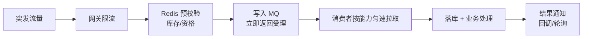

# 🔥 03 · 高并发中间件

> 返回 [[00-总览与复习优先级]] · 基础见 [[面试准备/技术面试题库/07-Redis与缓存|Redis]] / [[面试准备/技术面试题库/08-消息队列|MQ]]

> [!quote] 简历原话
> 精通 Redis 分布式缓存（穿透/雪崩/一致性）、Kafka/RabbitMQ 消息队列的异步解耦与削峰填谷方案

> [!important] 面试官最想听的是「方案」不是「概念」
> 你写的是"**方案**"——所以要能讲**一个完整的削峰填谷设计**，而不是背 Redis 三大问题。

---

## 一、Redis 深挖

### 1.1 原理层

| 问题 | 得分骨架 |
|---|---|
| 为什么单线程还这么快 | 纯内存、**无锁无竞争**、epoll IO 多路复用、高效数据结构、RESP 协议简单；瓶颈在内存/网络不在 CPU |
| Redis 6 多线程改了什么 | **只有网络 IO 多线程**，命令执行仍单线程（保证原子性） |
| **主从复制原理** | `psync` → 首次 `FULLRESYNC`（RDB 全量 + 缓冲增量）→ 之后命令传播；`repl_backlog` 环形缓冲；**断线重连尽量增量** |
| **哨兵原理** | 主观下线（单哨兵超时）→ 客观下线（quorum 投票）→ 选举 Leader 哨兵 → 选新主（优先级/offset/runid）→ 故障转移 + 通知 |
| **Cluster 槽迁移** | 16384 槽；`MOVED`（槽已迁移）vs `ASK`（正在迁移）；`cluster setslot importing/migrating`；多 key 操作需同槽（hash tag `{}`） |
| **脑裂** | 网络分区导致双主；缓解：`min-replicas-to-write` + `min-replicas-max-lag` |
| 过期删除 | 惰性删除 + 定期随机抽样删除（不是全扫） |
| 内存淘汰 | noeviction / allkeys-lru / volatile-lru / lfu / random / ttl；**近似 LRU**（采样） |
| 持久化 fork 问题 | `bgsave` fork 与内存成正比；**写时复制**导致内存可能翻倍 → 要预留内存 |

### 1.2 缓存三大问题（基础，别答错）

| 问题 | 解法 |
|---|---|
| **穿透** | 缓存空值（短 TTL）、**布隆过滤器**、参数校验 |
| **击穿** | 互斥锁重建、**逻辑过期**（不设 TTL，异步刷新）、热点永不过期 |
| **雪崩** | 过期时间加随机、多级缓存、限流降级、集群高可用 |

### 1.3 缓存与数据库一致性（**你简历点名了，必深挖**）

| 问题           | 得分骨架                                                  |
| ------------ | ----------------------------------------------------- |
| 推荐方案         | **Cache Aside：写时先更新 DB，再删除缓存**（不是更新缓存）                |
| 为什么删而不更新     | 并发写会互相覆盖产生脏数据；删除更简单且天然幂等                              |
| 为什么先 DB 后删缓存 | "先删缓存再更新 DB"在并发读下更容易产生长期脏数据                           |
| **延迟双删**     | 更新 DB → 删缓存 → 延迟（几百 ms，覆盖主从延迟）→ 再删一次                  |
| 更强方案         | **Canal 订阅 binlog 异步删缓存** → 解耦、可靠、不侵入业务               |
| 极端情况         | 读请求在"删缓存后、DB 提交前"回填了旧值 → 靠 TTL 兜底 + 对账                |
| 标准答法         | 承认**强一致代价极高**，业务上接受**最终一致**；关键是讲清"并发下会出现什么脏数据 + 怎么兜底" |

### 1.4 分布式锁

- `SET key value NX PX 30000`，value 必须唯一（UUID）
- 释放用 **Lua 脚本**：先比对 value 再删除（防误删）
- **Redisson 看门狗**：默认 30s，每 10s 续期
- RedLock 争议：Martin Kleppmann 质疑（GC 停顿、时钟漂移）；**能不用就不用**
- 更稳的思路：**fencing token** 或让下游做幂等

### 1.5 实战

- **大 key**：>10KB 拆分、压缩、`unlink` 异步删
- **热 key**：本地缓存、多副本打散、读写分离
- Pipeline（批量减 RTT，**非原子**）、Lua（原子）、事务（**不支持回滚**）
- `keys *` 禁用 → 用 `scan`
- 缓存预热、降级（Redis 挂了直接读 DB + 限流保护）

---

## 二、Kafka 深挖

| 问题 | 得分骨架 |
|---|---|
| 架构 | Producer → Broker（Topic → Partition → Replica）→ Consumer Group |
| **ISR / HW / LEO** | ISR = 与 leader 保持同步的副本集合；LEO = 日志末端；**HW = ISR 中最小的 LEO，消费者只能读到 HW 之前** |
| `acks` | 0（不等）/ 1（leader 落盘）/ all（ISR 全确认）；配合 `min.insync.replicas` |
| **为什么快** | 顺序写磁盘 + 页缓存 + **零拷贝 sendfile** + 批量压缩 + 分区并行 + 稀疏索引 |
| **Rebalance** | 触发：成员增减、订阅变化、分区数变化；**期间停止消费**；避免：调大 `session.timeout`、静态成员（`group.instance.id`）、增量协作再均衡 |
| 幂等 producer | PID + 序列号，broker 端去重 |
| 事务 | 跨分区原子写 + `read_committed` 隔离 |
| 顺序保证 | **分区内有序**；按业务键 hash 到同分区 + 单线程消费 |
| 消息丢失三环节 | 生产（acks=all + 重试）、Broker（副本 ≥3 + min.insync.replicas≥2 + 刷盘）、消费（**手动提交 offset**） |
| 重复消费 | MQ 一般 at-least-once → **消费端幂等**（唯一索引/去重表/Redis setnx/状态机） |
| 堆积处理 | 增消费者（≤分区数）、提高并行度、批量消费、优化消费逻辑（慢 SQL/外部调用）、临时转存扩容 |

---

## 三、RabbitMQ 深挖

| 问题 | 得分骨架 |
|---|---|
| **Exchange 四种** | direct（精确路由键）、topic（通配 `*`/`#`）、fanout（广播）、headers（按头匹配，少用） |
| 消息可靠性 | 生产者：**publisher confirm** + 事务（性能差）；Broker：持久化（队列 + 消息 + durable）；消费者：**手动 ack** |
| **死信队列 DLX** | 三种进入条件：被拒绝 `requeue=false`、TTL 过期、队列满；用于兜底与人工处理 |
| **延迟队列** | ① TTL + DLX（经典，但队头阻塞）② **延迟插件 `rabbitmq_delayed_message_exchange`**（推荐） |
| 幂等 | 同 Kafka：唯一键/去重表 |
| 集群与高可用 | 普通集群（只同步元数据）/ **镜像队列**（已不推荐）/ **Quorum Queue**（Raft，推荐） |
| 流控 | 内存/磁盘水位触发阻塞；`prefetch` 控制未 ack 数量 |
| 与 Kafka 选型 | Kafka 吞吐高、适合日志/流；RabbitMQ 延迟低、路由灵活、适合业务解耦 |

---

## 四、🎯 削峰填谷方案设计（**必考，按这个结构讲**）

> [!tip] 本节是速记骨架，完整方案（容量推演 / 交互设计 / 反模式 / 应急 SOP）→ [[08-异步解耦与削峰填谷]]

> [!important] 面试官问"你们怎么做削峰填谷"，按这五步答

1. **入口限流**：网关/Sentinel 限流，把超量请求挡在外面（返回排队中/稍后重试）
2. **前置校验**：Redis 预扣库存 / 资格校验，**把必然失败的请求在入口就干掉**
3. **异步化**：请求写入 MQ 后**立即返回"已受理"**，不阻塞用户
4. **匀速消费**：消费者按下游承载能力拉取，保护 DB；消费者可水平扩展（≤ 分区数）
5. **结果通知**：异步回调或前端轮询；**必须有对账兜底**（定时核对未处理完的消息）

**必须补的代价**
- 一致性变弱 → **幂等 + 对账**
- 用户体验变化 → 需要"排队中"的交互设计
- 复杂度上升 → 监控消息堆积、死信告警

**异步解耦的典型场景**：下单后发短信/推送、订单完成后算积分、日志上报、数据同步。

---

## 五、⚠️ 翻车点自查

- [ ] Redis 主从复制和哨兵选举能讲**流程**（不是"会自动切换"）
- [ ] 缓存一致性敢讲"最终一致 + 兜底"，而不是硬说强一致
- [ ] Kafka 的 **HW/LEO/ISR** 能解释清楚
- [ ] 能讲清 **RabbitMQ 延迟队列的两种实现**及各自缺陷
- [ ] 削峰填谷能画出**五步链路**并主动说代价
- [ ] 有一个**真实项目案例**：QPS 量级、削峰前后对比

---

## 六、话术模板

> "中间件我做得比较深的是 Redis 和 Kafka。缓存这块我在 X 项目里用 Canal 订阅 binlog
> 做缓存失效，替代了原来的延迟双删，把不一致窗口从 X 秒降到了 X 毫秒级。
> MQ 主要是削峰——大促峰值 QPS X 万，用 Kafka 做缓冲，消费端按 DB 承载能力匀速消费，
> 配合 Redis 预扣库存把无效请求挡在入口，最终 DB 峰值压力从 X 降到 Y。
> 代价是引入最终一致，我们用**幂等 + 定时对账**兜底。"

---

## 📥 待补充

- 

## 🔗 关联

- [[00-总览与复习优先级]] · [[02-Java核心与微服务]] · [[04-数据库调优]]
- [[面试准备/技术面试题库/07-Redis与缓存]] · [[面试准备/技术面试题库/08-消息队列]]

#面试 #Redis #Kafka #RabbitMQ #中间件 #待补
