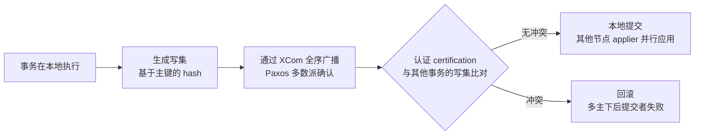
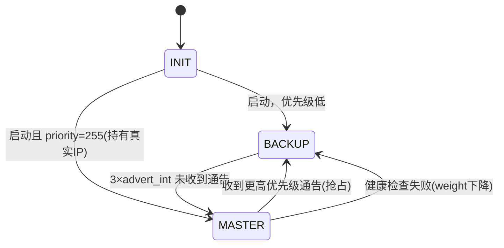

# 🏗️ 专题 · MGR 与 Keepalived 高可用

> [[00-总览与复习优先级]] · 关联 [[04-数据库调优]]（对应简历「熟悉 MGR/Keepalived 高可用架构」）

> [!warning] 简历声明定位（先定策略）
> 你写的是「**熟悉**」不是「精通」——这是准确的自我定位，答题策略：
> ① **原理讲透**（认证机制、VRRP 状态机）② **主动讲能力边界**（什么时候不该用）③ 有一段真实部署/演练经历兜底。
> ⚠️ 如果没在生产部署过 MGR，话术里"参与过部署"的部分**改成"搭建过实验集群验证"**——原理答得透的人，说实验环境反而可信。

---

## 一、先立框架：高可用三个度量（开场地基）

| 概念 | 含义 | 关键点 |
|---|---|---|
| **RPO** | 故障时**最多丢多少数据**（Recovery Point Objective） | 异步复制 RPO>0；半同步≈0；**MGR=0（多数派确认）** |
| **RTO** | **多久恢复服务**（Recovery Time Objective） | 手动切换分钟级；MGR/Keepalived 秒级~十秒级 |
| **MTTR / 复发率** | 恢复快慢 / 是否复发 | 靠预案与演练（→ [[10-故障恢复]]） |

> 金句："选高可用方案本质是选 **RPO 和 RTO 买不买得起**——MGR 用性能买 RPO=0，异步复制用丢数据风险换性能。"

---

## 二、MySQL 高可用方案全景对比（选型必考）

| 方案 | RPO | 自动切换 | 复杂度 | 一句话点评 |
|---|---|---|---|---|
| 异步复制 + Keepalived | **>0（可能丢）** | 半自动（脚本） | 低 | 小系统可用；**有脑裂风险** |
| 半同步 + MHA/Orchestrator | ≈0（AFTER_SYNC） | ✅ | 中 | 老牌方案，MHA 社区活跃度下降 |
| **MGR（单主）** | **=0（多数派）** | ✅ 内置 | 中 | 官方方案，自动故障转移 + 内置成员管理 |
| MGR 多主 | =0 | ✅ | 中高 | 写冲突需认证回滚，谨慎 |
| PXC / Galera | =0 | ✅ | 高 | 写放大明显，全节点写 |
| 云 RDS 高可用版 | ≈0 | ✅ | 低 | 交给云厂商 |
| InnoDB Cluster | =0 | ✅ | 中 | **MGR + MySQL Shell（AdminAPI）+ MySQL Router** 的官方全家桶 |

---

## 三、MGR 深入（MySQL Group Replication）

### 3.1 是什么
- MySQL **5.7.17** 引入的插件，**基于组通信（Paxos 变体 XCom 协议）**的复制方案
- 组内事务**全序广播 + 认证（certification）** → 数据强一致（RPO=0）
- 两种模式：**单主**（推荐）/ **多主**
- 上层方案：**InnoDB Cluster** = MGR + MySQL Shell（AdminAPI）+ MySQL Router

### 3.2 事务提交全流程（★核心，必须能画）



**四个必须讲清的机制**：
1. **全序广播**：所有事务经 XCom 排出**全局唯一顺序**，组内每个节点看到的事务顺序一致
2. **认证（certification）**：每个事务带**写集**（主键 hash），提交时与认证信息库比对——**修改了同一行**（且 last_committed 有依赖）→ 冲突 → 回滚
3. **多数派（quorum）**：写操作需多数节点确认；**存活节点少于多数派 → 组进入 read_only**（这就是 MGR 的"防脑裂"）
4. **故障检测与逐出**：心跳超时怀疑（suspect）→ `group_replication_member_expel_timeout`（默认 5s）后逐出 → 新视图（view change）

### 3.3 单主模式（推荐，也是你该答的版本）
- 只有 **primary 可写**，其余节点 `super_read_only`
- primary 挂 → 组内**自动选举**新主（按 `group_replication_member_weight` 权重，再按 uuid），其余节点自动指向新主
- 查谁是主：`performance_schema.replication_group_members` 的 `MEMBER_ROLE` 列
- 接入层：**MySQL Router**（官方，自动路由到 primary）或 ProxySQL（脚本判定主库）

### 3.4 多主模式（能对比出深度）
- 所有节点可写，**同一行并发修改 → 认证阶段检测 → 后提交者回滚**
- 限制：不支持 SERIALIZABLE；外键级联 + `foreign_key_checks=0` 有风险；**写冲突率随写并发上升** → 适合"写不同库表"的业务分片
- 结论话术："多主听起来诱人，但**冲突回滚发生在提交时**，业务要先兼容'事务可能被组回滚'——多数场景单主 + 读写分离更稳。"

### 3.5 硬性要求与限制（★追问必到）

| 类别 | 要求/限制 |
|---|---|
| 前置 | 表必须 **InnoDB**、**必须有主键**（否则写集无法比较）、**GTID**、`binlog_format=ROW`、`log_slave_updates` |
| 规模 | 建议 **3 或 5 节点**，最多 9 |
| 网络 | **延迟敏感**——认证与全序广播每笔事务都要组内通信，**建议同机房/同城**；跨城写延迟直接吃掉吞吐 |
| 大事务 | 认证时间随事务大小增长，有 `transaction_size_limit`；**拆小事务是 MGR 性能第一原则** |
| 流控（flow control） | 认证队列超阈值 → 节点限速写入，**整体吞吐向最慢节点看齐** |
| 并行回放 | 依赖 `last_committed` 划分事务组，写热点会导致回放串行 |

### 3.6 新节点加入（分布式恢复）
- **增量恢复**：从组内 donor 拉 binlog 追平
- **克隆插件（Clone Plugin，8.0.17+）**：数据差太多时**全量物理克隆**（`group_replication_recovery_use_clone=ON`）
- 恢复期间状态 `RECOVERING`，追平后 `ONLINE`

### 3.7 监控（运维体现）
```sql
-- 组成员与角色
SELECT * FROM performance_schema.replication_group_members;
-- 认证与冲突统计
SELECT * FROM performance_schema.replication_group_member_stats;
-- 关注：count_transactions_in_queue（认证队列）、count_conflicts_detected（冲突数）
```
告警：成员 OFFLINE/UNREACHABLE、队列堆积、冲突率突增、单节点状态异常。

---

## 四、Keepalived 深入

### 4.1 是什么
基于 **VRRP 协议**（Virtual Router Redundancy Protocol）实现 **VIP 漂移 + 健康检查**的高可用软件。
**组成**：VRRP 子进程（IP 漂移）+ Checkers（健康检查，最初为 LVS 设计）+ WatchDog。

### 4.2 VRRP 状态机（★必须能画）



**机制要点**：
- 同组节点共享 **VRID + VIP**；**Master 持有 VIP** 并周期发 VRRP 通告（`advert_int` 默认 1s，**组播 224.0.0.18**）
- Backup 超过 `3 × advert_int` 未收到通告 → 认为故障 → **优先级最高**者接管 VIP
- `priority` 1-255；`preempt`（默认，老主恢复抢回）/ `nopreempt`（避免回切闪断）
- 云环境组播常被禁 → `unicast_peer` 单播；公有云 VIP 漂移要配 **HAVIP/EIP** 类产品
- `notify_master / notify_backup / notify_fault` 钩子：切换时执行动作（告警、设置只读、ProxySQL 摘节点）

### 4.3 与 MySQL 结合的标准配置（能报出来很加分）

```bash
vrrp_script chk_mysql {
    script "/etc/keepalived/chk_mysql.sh"   # mysqladmin ping / select 1 / 复制延迟检查
    interval 2                              # 每 2s 检查一次
    fall 2                                  # 连续失败 2 次 → 判定故障
    rise 2                                  # 连续成功 2 次 → 恢复
    weight -30                              # 失败扣 30 分 → 低于备机 → 触发切换
}
vrrp_instance VI_MYSQL {
    state BACKUP            # 两台都配 BACKUP + nopreempt，避免恢复后抢占回切
    interface eth0
    virtual_router_id 51    # 同组必须一致
    priority 100            # 主 100 / 备 90
    advert_int 1
    nopreempt
    unicast_src_ip 10.0.0.11
    unicast_peer { 10.0.0.12 }
    virtual_ipaddress { 10.0.0.100/24 }
    track_script { chk_mysql }
    notify_master "/etc/keepalived/on_master.sh"   # 切主时：关旧主只读/发告警/更新 ProxySQL
}
```

检查脚本检查什么（由浅到深）：进程 → 端口 → `select 1` → **复制状态**（`Seconds_Behind_Master` 超阈值不给 VIP）——**第 4 层才是关键**，也是 Keepalived 天生缺的。

### 4.4 脑裂（★必考，也是"熟悉"到"理解"的分水岭）

**原因**：主备之间**心跳断了**（网络分区），但两边 MySQL 都活着 → **双 Master 同时持有 VIP** → 双写 → 复制中断、数据冲突。

**防范五板斧**：
1. **心跳冗余**：双网卡双链路（eth0+eth1），`unicast` 替代组播
2. **对端检测**：检查脚本同时 ping 对端——"连对端都 ping 不通时不能确定自己该接管"
3. **仲裁/fencing**：第三方仲裁节点或 STONITH（把旧主电源/网络切掉）
4. **MySQL 层兜底**：`notify_master` 脚本在接管时**将旧主置 `super_read_only`**；配合 `disable` 旧主 VIP
5. **架构层面根治**：数据层高可用不交给 Keepalived——**用 MGR/MHA/Orchestrator 这类"理解复制状态"的方案**，Keepalived 只管接入层（如 HAProxy 前端）

### 4.5 ★Keepalived 的能力边界（说出来就是理解深度）

> "Keepalived 只关心**『这台机器上的 VIP 该不该由我持有』**，它**不理解 MySQL 的复制拓扑**：
> 它不知道从库延迟多少、不知道数据是否同步完、更不知道两台谁的数据新。
> 所以『VIP 切过去了，但数据没追平』这种事故它防不了——
> **故障转移的正确性必须由理解复制状态的组件负责**（MGR 内置 / MHA / Orchestrator），
> Keepalived 更适合做**接入层（HAProxy/应用入口）的高可用**。"

---

## 五、组合架构怎么选（把 MGR 和 Keepalived 串起来）

```
推荐（数据一致性优先）：
  应用 → MySQL Router / ProxySQL → MGR 单主集群（3-5 节点）
  · 故障转移由 MGR 内置成员管理负责（RPO=0）
  · Router 自动路由到新 primary

传统方案（小系统 / 云上受限）：
  应用 → VIP（Keepalived） → 双主复制
  · 必须配脑裂防范 + 旧主只读 + 对账
  · 接受 RPO>0（异步）
```

**选型答法**：
> "数据层我优先 MGR——**它理解复制状态，多数派保证 RPO=0，故障转移内置于协议**；
> Keepalived 我用在**接入层**（比如 HAProxy 双活），不直接管数据节点。
> 如果环境受限只能双主+Keepalived，那脑裂防范和旧主只读是必须做满的，且要接受丢数据风险。"

---

## 六、高频 Q&A（MGR × Keepalived 各 5 题）

**MGR：**

**Q1：MGR 和半同步复制的区别？**
> 半同步：主等**一个从 ack binlog 收到**（不保证已应用），故障转移靠外部工具，切换正确性靠人；MGR：**多数派确认 + 组内全序 + 认证**，成员管理与故障转移内置，RPO=0 且自动选主。代价是写入要过组协议，吞吐更低、网络敏感。

**Q2：MGR 怎么保证不丢数据？**
> 事务提交前经 XCom **多数派持久化确认**；少于多数派存活 → 拒绝写入（super_read_only）——**宁可不可用，不丢数据**（CP 取向）。

**Q3：单主和多主怎么选？冲突怎么处理？**
> 默认单主（写集中，无认证冲突）。多主下**同行并发修改 → 认证阶段后提交者回滚**——业务必须兼容"提交被组拒绝"。所以我只在写集合天然不重叠（如按库表分片）时考虑多主。

**Q4：为什么 MGR 要求表必须有主键？**
> 认证靠**写集（主键 hash）判断冲突**，没有主键无法生成可靠写集，冲突检测失效（多主下相当于裸奔）。

**Q5：MGR 性能损耗在哪？怎么优化？**
> 损耗：全序广播 + 认证的组内通信、流控拖累、并行回放受 last_committed 限制。
> 优化：**拆小事务**（最大原则）、节点同机房、3/5 节点即可、压住热点行、关注认证队列与冲突计数、applier 并行参数。

**Keepalived：**

**Q6：VRRP 怎么选主？**
> priority 大者胜；相同比 IP。Master 每秒发通告，Backup 3 秒收不到就接管。生产建议两台都 BACKUP + nopreempt，避免老主恢复抢 VIP 造成闪断。

**Q7：脑裂怎么发生、怎么防？**
> 心跳断但服务活着 → 双主双 VIP 双写。防：双心跳链路、unicast、对端检测、**fencing（接管脚本把旧主 super_read_only）**、第三方仲裁。**根治是不用 Keepalived 管数据层。**

**Q8：Keepalived 怎么知道 MySQL 挂了？**
> `vrrp_script`：进程 → 端口 → `select 1` → **复制状态（Seconds_Behind_Master）**。失败扣 weight 触发切换。**关键是第 4 层**——只查进程存活是远远不够的。

**Q9：VIP 切换后旧主怎么处理？**
> notify 钩子把旧主 `super_read_only`、告警、必要时 ProxySQL 摘除；**人工确认数据一致性后才允许恢复**——否则它恢复写入就是新脑裂。

**Q10：云上用 Keepalived 有什么坑？**
> 组播普遍被禁 → unicast；VIP 漂移需要云厂商的 HAVIP/EIP 配合，不是配了就生效；健康检查要配浮动 IP 生命周期。所以**云上更倾向 RDS 高可用版或 MGR + Router**。

---

## 七、翻车点自查 + 话术

- [ ] MGR 提交流程能画（写集 → XCom 全序 → 认证 → 多数派）
- [ ] **脑裂**原因与五板斧脱口而出
- [ ] 说得出 **Keepalived 能力边界**（不理解复制拓扑）
- [ ] 单主/多主的冲突处理差异
- [ ] 前置条件（InnoDB/主键/GTID/ROW）+ 规模（3/5 节点）
- [ ] RPO/RTO 能给三种方案对号入座
- [ ] 有一段**真实/实验**部署经历可讲（节点数、为什么这么选、遇到过什么问题）

**一分钟话术**：
> "高可用这块我的架构选择是：**数据层 MGR 单主，接入层 Router/ProxySQL，Keepalived 只做接入层冗余**。
> 选 MGR 是因为要 RPO=0——事务经 XCom 全序广播、多数派确认后才提交，少于多数派宁可只读也不丢数据；
> 故障转移是协议内置的，不用外部工具猜哪台数据新。
> Keepalived 我很清楚它的边界——**它不理解复制拓扑**，只管 VIP 可达性，
> 所以双主+Keepalived 那套要配脑裂防范和旧主只读，我用它一般只管 HAProxy 这类入口。
> MGR 的运维重点我看三个数：认证队列、冲突数、成员状态——大事务拆小是性能第一原则。"

## 📥 待补充
- [ ] 你的实际部署参数（节点数/模式/为什么）与一次故障或演练经历
- [ ] 如果冠顿追问"你们为什么不用 MGR"，准备当时的真实理由

## 🔗 关联
[[04-数据库调优]] · [[10-故障恢复]] · [[面试准备/冠顿/00-JD与匹配分析]] · [[面试准备/技术面试题库/09-分布式与微服务]]

#面试 #MySQL #MGR #Keepalived #高可用 #待补
