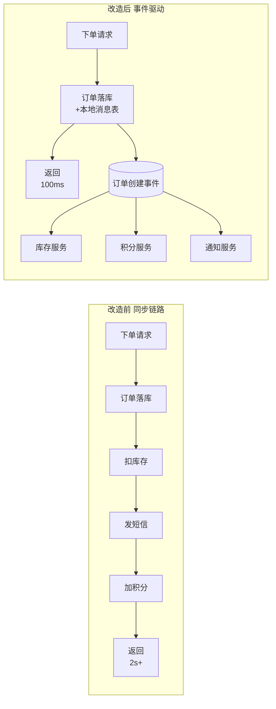
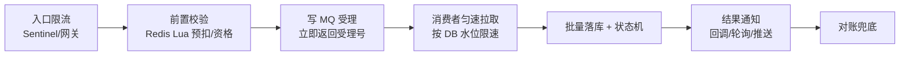

# 🌊 专题 · 消息队列的异步解耦与削峰填谷

> [[00-总览与复习优先级]] · 对应简历「精通 Kafka/RabbitMQ 消息队列的**异步解耦与削峰填谷方案**」
> 关联 [[03-高并发中间件]]（速记）· [[08-消息]]（RocketMQ/冠顿版）· [[面试准备/技术面试题库/08-消息队列]]（八股）

> [!warning] 简历声明定位
> 你写的是「**方案**」——面试官的预期是：**你完整设计过一个削峰链路，并知道每个环节为什么这么定、参数怎么算、出事怎么办**。
> 所以这篇的核心不是概念，是：**容量推演、交互设计、反模式、应急 SOP**。
> ⚠️ 数字先用 X 占位，面里必须换成你项目的真实数字。

---

## 一、两个词的本质（30 秒讲清，别绕）

|          | 本质                                 | 关键约束                                  |
| -------- | ---------------------------------- | ------------------------------------- |
| **异步解耦** | 把"调用方等待结果"变成"调用方发布事实"——上游不再知道下游是谁  | 收益是解耦与吞吐，**代价是最终一致 + 链路变长**           |
| **削峰填谷** | 把**瞬时峰值**变成**平稳消费**——中间用 MQ 当"蓄水池" | 填谷的"谷"由**下游最弱环节（通常是 DB）**决定，不是由 MQ 决定 |

> [!important] 两个最容易被问住的本质句
> ① "MQ 解决的是**不要求立即成功、但要求最终一定成功**的问题。"
> ② "削峰填谷的**谷有多深，由 DB 的写入水位决定**——MQ 本身从来不是瓶颈。"

---

## 二、异步解耦方案设计

### 2.1 哪些链路适合异步化（判定三问）

```
① 结果必须同步返回吗？（必须 → 同步 RPC + 超时；不需要 → 可异步）
② 失败可补偿吗？（可 → MQ；不可且强一致 → 本地事务/TCC）
③ 下游关心"这件事发生了"还是"要一个返回值"？（前者 → 事件）
```

典型改造：下单后发短信/积分/推送/数据同步——**主链路只保留"订单落库"**。

### 2.2 改造前后（架构图）



### 2.3 方案六要素（缺一个就是事故）

| 要素 | 内容 | 兜底 |
|---|---|---|
| **事件契约** | 事件名 + payload schema + 版本号（v1/v2），**消费者按版本兼容** | 契约变更走评审，禁删字段 |
| **事务边界** | 本地消息表 / 事务消息——**"业务成功 ⇒ 事件必达"** | 扫描补偿任务 |
| **消费幂等** | 唯一键 + 去重表（→ [[06-幂等]]） | 唯一索引兜底 |
| **失败处理** | 可重试→递增重试；不可重试→死信/异常表 | 死信告警 + 人工补偿 SOP |
| **可观测** | **事件带 traceId 透传**；按事件类型监控生产/消费/延迟 | 全链路可查 |
| **对账** | 上游流水 vs 下游结果 T+1 比对 | 差异工单 |

### 2.4 反模式清单（✓ 说得出这些，才叫"用过"）

- ❌ **用 MQ 当 RPC**：发消息后同步等结果——那是把延迟问题转嫁
- ❌ **消息里塞大对象**（>1MB 图片/整个订单快照）→ 存 **业务 ID + 引用**，消费端按需查
- ❌ **无契约裸奔**：生产者随手改 payload，消费者半夜挂掉
- ❌ **一个 topic 装所有事件**：互相拖累消费速度，无法独立扩容
- ❌ **没有死信处理**：失败消息无人认领，业务悄悄少数据
- ❌ **消息当数据库用**：想靠 MQ 保留全部历史——那是日志/数仓的活

---

## 三、削峰填谷完整方案（★核心，按这个讲）

### 3.1 全链路六步



| 步骤 | 关键设计 | 参数怎么定 |
|---|---|---|
| **① 入口限流** | 集群限流（Sentinel 规则）+ 单用户维度限频；**超限返回"排队中"而非报错** | 阈值 = **压测拿到的系统水位** × 0.8，不是拍脑袋 |
| **② 前置校验** | Redis Lua **原子预扣/资格检查**，把必然失败的请求挡在 MQ 之前 | Lua 里一次完成"校验+扣减+写受理记录"，防并发穿透 |
| **③ 写 MQ 受理** | 受理即返回**受理号**；接口语义从"下单成功"改为"已受理" | MQ 只做缓冲，**堆积上限要评估**（磁盘/保留期） |
| **④ 匀速消费** | 消费并行度 = min(分区数, 实例×线程)；**批量拉取 + 批量落库** | 消费速率 = **DB 安全写入水位**（压测值），不是 MQ 能力 |
| **⑤ 落库与状态** | 订单状态机：已受理→处理中→成功/失败；批量 insert（每批 200-500） | 失败单进异常表，不阻塞批次 |
| **⑥ 结果通知** | 回调（有入口）/ 轮询（查受理号）/ 推送 | **前端体验设计见 3.3** |

### 3.2 容量推演（★面试官最想看你算这笔账）

**示例（数字可替换成你项目的）**：

```
活动瞬时受理峰值：50,000 单/秒，高峰持续 60 秒 → 总量 300 万单
消费端能力（分库分表 + 批量写）：5,000 单/秒

① 积压峰值 ≈ 300万 − 前60秒已消费 30万 = 270 万条
   → MQ 是否扛得住？Kafka 单分区顺序写 10万+/s、磁盘堆积成本低 → 无压力
   → 分区数：≥ 消费实例数（如 16 实例 → 32 分区，留扩容余量）

② 排空时间 = 300万 ÷ 5,000/s = 600 秒 = 10 分钟
   → 用户从"受理"到"完成"平均等待约 5 分钟

③ 决策点：
   - 业务能接受 10 分钟内最终一致吗？能 → 方案成立
   - 不能 → 提升消费能力（分库分表/批量/多实例），而不是换 MQ
```

> [!tip] 这笔账的意义
> **"谷有多深由 DB 水位决定"**——排空时间只取决于消费能力。
> 面试里主动算这笔账，比说"用 MQ 削峰"专业十倍：
> 它说明你理解**堆积是设计出来的，不是出了事才知道的**。

### 3.3 用户交互设计（多数候选人漏掉的一环）

- **接口语义变更**：`POST /orders` 返回 `202 已受理 + 受理号`，**不是 201 成功**
- 前端展示"**排队处理中**"+ 进度可查（轮询 `GET /orders/{受理号}/status`）
- **取消与超时**：受理未消费前允许取消（发取消事件，消费时校验状态机）；排队超时上限（如 15 分钟未消费 → 自动失效退额）
- **失败可见**：消费失败必须可查询、可退款——**异步不能变成"黑洞"**

### 3.4 大促前 checklist

- [ ] 全链路压测：入口水位、MQ 堆积水位、消费速率、DB 写入水位
- [ ] 预案演练：消费挂了怎么办、Redis 挂了怎么办、MQ 挂了怎么办（降级开关）
- [ ] 监控看板：**堆积量 + 消费延迟（时间滞后）+ 死信数**，阈值按正常水位 ×N 定
- [ ] 降级预案：MQ 不可用 → 核心链路同步兜底 + 非核心直接拒绝
- [ ] 对账任务提前配置（活动结束 T+1 必跑）

---

## 四、Kafka vs RabbitMQ 在这两个场景怎么选

| 维度 | Kafka | RabbitMQ |
|---|---|---|
| 吞吐/堆积 | **百万级/s，磁盘顺序写，堆积成本低** | 万级/s，堆积多了性能下降 |
| 重放 | ✅ 按 offset/时间戳重放（**数据修复利器**） | ❌ 消费即删（除非镜像/队列策略） |
| 消息粒度 ack | 分区级位移提交（配合手动提交做粒度） | **单条 ack/nack 灵活** |
| 路由 | topic+key，简单 | **exchange 路由灵活**（direct/topic/fanout） |
| 延迟 | ms 级 | **μs~ms 级更低** |
| 生态 | 与大数据/流计算（Flink）天然衔接 | 业务集成、延迟队列插件 |

**选型结论**：
> "**大流量事件流、需要重放、要接实时计算** → Kafka（我们订单事件、埋点都走它）；
> **业务指令分发、低延迟、路由复杂** → RabbitMQ。
> 削峰场景两者都行，**决策点在'要不要重放'和'堆积规模'**——我经历的项目两条都上过：事件流 Kafka，任务分发 RabbitMQ。"

---

## 五、监控与运营指标

| 指标 | 含义 | 告警阈值逻辑 |
|---|---|---|
| **堆积量（lag）** | 未消费消息数 | 正常水位 × N，且看**增长斜率**（只看绝对值会误报） |
| **消费延迟（lag time）** | 最新消息 vs 消费位点的时间差 | 比 lag 条数更能反映**用户体验** |
| 消费 TPS / 失败率 | 消费健康度 | 失败率突增 → 下游故障 |
| **死信数** | 重试耗尽 | >0 就该看（P1） |
| **端到端延迟 P99** | 受理 → 完成时间 | 用户视角的最终指标 |

---

## 六、高频 Q&A（完整答案版）

**Q1：为什么用 MQ 异步，不用线程池/内存队列？**
> 线程池/内存队列三大死穴：① **进程重启全丢**（MQ 持久化 + 重放）② **无法跨实例扩容与堆积**（内存有界）③ **没有轨迹与重试体系**。MQ 把"异步"从进程内升级为**跨系统、可持久化、可观测、可重放**的契约。

**Q2：削峰期间堆积了 100 万条怎么排空？**
> SOP：① 定性（生产突增 or 消费变慢）→ ② 扩容消费者（Kafka 上限=分区数，不够先扩分区/转储）→ ③ **跳过式恢复**：旧消息批量转储到临时 topic，新消息先消费，再单独追历史（保证幂等）→ ④ 根因治理（消费逻辑批量/异步化、慢 SQL）→ ⑤ 预防：堆积斜率告警。

**Q3：下单改成异步返回，前端怎么知道结果？**
> 受理号 + 状态机 + 三种通知方式（回调/轮询/推送）组合；同时给出**超时语义**（排队超时自动失效退额）。**接口契约从"结果"变成"受理"，这是产品级变更，要和业务方确认。**

**Q4：削峰填谷和直接限流拒绝，怎么取舍？**
> 看**请求价值与用户容忍度**：可延迟的高价值请求（下单、抢购）→ 削峰排队；**低价值或强实时的**（库存查询）→ 限流快速失败。两者是组合：**限流定入口上限，削峰消化入口内的峰值**。

**Q5：消费速率该设多快？**
> 由**最弱下游的水位**决定（DB 写入、第三方 API 配额），不是 MQ 能力。做法：压测拿 DB 安全写入值 → 消费速率 = 水位 × 0.8 → 靠批量/并行逼近上限。

**Q6：异步化后链路变长，出问题怎么查？**
> 事件带 **traceId 透传**（HTTP header → MQ header → 消费日志）+ 消息 key（业务单号）可查 + 状态机可查 + 死信告警。**链路长不可怕，可怕的是断点不可见。**

**Q7：秒杀的削峰和普通大促削峰有什么区别？**
> 秒杀**前置过滤比例极高**（99% 请求注定失败）→ 重点在 Redis 预扣 + 请求拦截，MQ 只处理"抢到的"；普通大促**请求大多有效** → 重点在消费吞吐与 DB 水位。**过滤比例不同，方案重心完全不同。**

**Q8：怎么验证削峰方案有效？**
> 全链路压测（峰值模型回放）+ 预案演练 + 灰度放量 + **事后对账**（受理数 = 成功数 + 失败数 + 取消数，一项对不上就是漏）。

---

## 七、话术模板（STAR，数字自己填）

> "削峰填谷我在 X 项目里完整落地过。
> 背景：大促峰值受理 5 万单/秒，而 DB 安全写入水位只有 5,000/s。
> 方案：入口 Sentinel 限流 → Redis Lua 预扣把无效请求挡在门外 → **下单接口改为'受理即返回受理号'**，
> Kafka 承接 300 万单的缓冲，消费端批量落库匀速消费，**排空 10 分钟**，用户侧展示排队进度；
> 失败单进异常表，T+1 对账保证受理数与结果数一致。
> 结果：DB 峰值压力从 5 万降到 5 千，**零超卖、零丢单**，客诉集中在'等待时间'——
> 我们后续通过批量写和加实例把排空压到了 X 分钟。
> 代价我也讲清楚：**最终一致 + 用户等待**，这两点是和业务方事先约定好的。"

---

## 八、翻车点自查

- [ ] 能说出**异步化的代价**（最终一致/链路长/幂等），不是只讲收益
- [ ] **容量推演**能现场算：峰值 → 总量 → 消费能力 → 排空时间
- [ ] 知道**消费速率由 DB 水位决定**，不是 MQ 决定
- [ ] 受理接口的**语义变更与前端交互**讲得清（202 + 受理号 + 状态机）
- [ ] 堆积 SOP、死信处理、对账三件事都在方案里
- [ ] Kafka/RabbitMQ 选型能落到"**要不要重放、堆积规模**"两个决策点
- [ ] 有真实数字（峰值/水位/排空时间/对账结果）

## 📥 待补充
- [ ] 你项目的真实数字：峰值受理量、消费速率、排空时间、堆积峰值、对账差异率
- [ ] 一次堆积或死信的真实处理经历（时间线 + 动作 + 结果）

## 🔗 关联
[[03-高并发中间件]] · [[06-幂等]] · [[08-消息]] · [[面试准备/技术面试题库/08-消息队列]]

#面试 #消息队列 #Kafka #RabbitMQ #削峰填谷 #异步解耦 #待补
