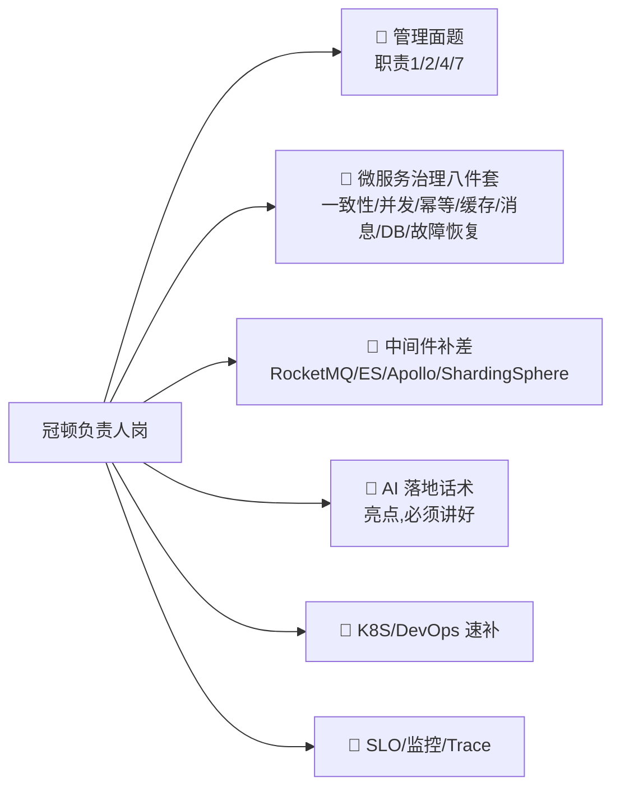

# 🎯 冠顿电子 · 后端开发负责人

> [!abstract] 一句话判断
> 这是一个**管理+技术双职责的负责人岗**（不是纯开发岗）。
> **比智控那个开发岗更匹配你的十几年经验**——JD 要 8 年+、2 年管理经验，你全超配。
> 唯一的两个坎：**管理经验的正式头衔**、以及几个你简历上没写的中间件名词（ES/RocketMQ/Apollo/ShardingSphere/K8S）。

---

## 1. JD 原文（OCR 整理版）

> 来源：截图 OCR（kimi-cli）。来源为招聘平台，信息以 HR 沟通为准。

| 项 | 内容 |
|---|---|
| 岗位 | **后端开发负责人** |
| 薪资 | **20-25K** |
| 地点 | 杭州余杭区**阿里中心·未科 D11-904**（仓前，近 5 号线葛巷地铁站） |
| 经验/学历 | 5-10 年 / 本科 |
| 公司 | 杭州冠顿电子科技有限公司 · **100-499 人 · 电子/硬件开发** |
| 联系人 | 甘女士（招聘专员，今日回复 10+ 次） |
| 通勤 | 平台显示距你家 15.3 km |

**技能标签**：Java、**团队管理经验**、Elasticsearch、微服务经验、MySQL、MyBatis、Redis、**架构设计经验**、Spring

### 岗位职责
1. 负责后端团队的**目标制定、分工协作、人才培养和绩效管理**
2. 负责后端**研发计划、方案评审、任务拆解、交付质量和上线结果**，保障重点业务按期稳定落地
3. 制定并推动**后端架构演进路线**，在业务交付与技术治理之间形成可执行的阶段计划
4. 建立并持续改进**编码规范、架构约束、Code Review、自动化测试、持续集成、发布和回滚流程**
5. 为核心接口和业务链路建立**监控指标、日志、Trace、告警与 SLO**
6. **关键项目的牵头人与核心代码编写**
7. 营造**事实导向、主动负责、及时暴露风险并持续改进**的工程文化

### 任职要求
1. **8 年以上** Java 开发经验，**2 年以上技术团队管理或技术负责人经验**
2. 熟悉 Spring Boot、MyBatis 等，**能够深入代码和运行机制定位问题**
3. 复杂互联网业务系统的**架构、交付和微服务治理**经验——**事务一致性、并发、幂等、缓存、消息、数据库性能、故障恢复**
4. 熟悉中间件：**Redis、ElasticSearch、RocketMQ、Apollo、MySQL、ShardingSphere**
5. 熟悉 **DevOps 交付理念，熟悉 K8S**，有 **service mesh** 经验者优先
6. **有推进 AI 在研发的落地，熟练使用主流的 coding agent 和 work agent**
7. 责任心强，沟通与团队协作能力

---

## 2. 匹配度分析

### ✅ 你的硬匹配（这条 JD 几乎是照着你的简历写的）

| JD 要求 | 你的情况 | 结论 |
|---|---|---|
| 8 年+ Java | **十几年** | ✅ 超配 |
| Spring Boot / MyBatis **深入代码和运行机制** | 简历写了"框架源码"，[[面试准备/专业技能/02-Java核心与微服务]] 已备 | ✅ |
| 事务一致性、并发、幂等、缓存、消息、DB 性能、**故障恢复** | 第 3 条几乎逐词对应你的技能清单 | ✅ **主场** |
| Redis / MySQL | 精通级 | ✅ |
| 架构设计经验 | 十几年 + 两个主导项目 | ✅ |
| **AI 在研发落地 + coding agent / work agent** | RAG demo（Spring AI Alibaba）+ **日常深度使用 AI 编码工具** | ✅✅ **差异化亮点** |

### ⚠️ 三个风险点（必须提前备话术）

| 风险 | JD 原文 | 你的现状 | 应对 |
|---|---|---|---|
| **管理经验** | 2 年以上技术团队管理/负责人 | 之前自评"没有管理经验怎么答" | 用**主导项目 + 带教新人 + 跨团队协调**的真实经历支撑；诚实说"正式头衔时间不长，但实际承担了 X"，见 [[01-管理面与负责人题]] |
| **中间件名词缺口** | RocketMQ、ES、Apollo、ShardingSphere | 简历是 Kafka/RabbitMQ，无 ES/Apollo | ① Kafka→RocketMQ **概念迁移话术** ② ES/Apollo **速补最小知识**，见 [[02-技术补差与AI亮点]] |
| **K8S / service mesh** | 熟悉 DevOps、K8S，mesh 优先 | 简历只有 Shell | K8S 概念 + CI/CD + 发布策略速补；**mesh 是"优先"不是必须**，不会就说不会 |

> [!danger] 最容易翻车的一句话
> 别说"Kafka 我精通，RocketMQ 差不多"。
> 正确姿势："Kafka 我用得深，RocketMQ 的模型我清楚——**事务消息和延迟消息是 RocketMQ 有而 Kafka 弱的**，
> 业务上分别怎么用我能讲清。"（体现迁移能力，而不是装精通）

---

## 3. 与智控岗对比（帮你做决策）

| | 智控（ZKONG） | 冠顿 |
|---|---|---|
| 岗位性质 | Java 开发工程师（**纯开发**） | **后端开发负责人**（管理+技术） |
| 薪资 | 中级 15-20K / 高级 ≤30K | 20-25K |
| 经验要求 | 5 年+ | **8 年+ 且 2 年管理** |
| 对你的定位匹配 | 有降薪风险（中级） | **更符合十几年经验的定位** |
| 技术主场 | IoT 设备接入、高并发 | 微服务治理、中间件、团队管理 |
| 公司 | ESL 电子价签，300+ 人，出海 | 电子/硬件，100-499 人 |
| 面试时间 | **9-22（明天）** | 待确认 |

> [!tip] 决策提示
> 两家都是**硬件公司招软件平台岗**——你的 IoT 业务经验（送物机器人、回收设备接入）在两边都用得上。
> 冠顿这个岗位级别更高，但 **20-25K 对"负责人"来说偏低**（杭州后端负责人常见 25-40K），
> 谈薪时可以用"职责范围"（团队管理 + 架构 + 核心编码）争取上沿。
> **先面智控（明天），两个都拿到 offer 再比价。**

---

## 4. 复习优先级（和智控共用题库，别重复准备）

| 优先级 | 内容 | 去哪准备 |
|---|---|---|
| 🥇 | **管理面**（目标制定/绩效/Code Review/架构治理/工程文化） | [[01-管理面与负责人题]] |
| 🥇 | 微服务治理八件套 | [[面试准备/专业技能/02-Java核心与微服务]]、[[面试准备/技术面试题库/09-分布式与微服务]] |
| 🥈 | RocketMQ / ES / Apollo / ShardingSphere 补差 + **AI 落地话术** | [[02-技术补差与AI亮点]] |
| 🥈 | 架构演进、SLO/监控/Trace | [[01-管理面与负责人题]] |
| 🥉 | K8S / DevOps / service mesh | [[02-技术补差与AI亮点]] |

---

## 5. 微服务治理七件套（JD 任职要求第 3 条逐词拆解）

> JD 原文："能够处理**事务一致性、并发、幂等、缓存、消息、数据库性能和故障恢复**等问题"
> —— 面试官大概率**按这七个词逐个点名**，已各建一篇，每篇都是"场景 + 方案对比 + 治理 + 话术"：

| # | 主题 | 核心答案一句话 |
|---|---|---|
| 1 | [[04-事务一致性]] | 能本地事务不拆、能最终一致不上强一致、**对账是最后防线** |
| 2 | [[05-并发]] | 读靠缓存热点探测，写靠削峰/原子预扣，**全链路超时 + 隔离** |
| 3 | [[06-幂等]] | Redis 只做第一道过滤，**唯一索引/状态机是兜底**；重复请求返回首次结果 |
| 4 | [[07-缓存]] | Cache Aside + binlog 订阅删缓存，TTL 兜底；**Redis 挂了先保 DB** |
| 5 | [[08-消息]] | RocketMQ 事务消息/延迟/顺序/死信；**堆积有 SOP、死信必须有人管** |
| 6 | [[09-数据库性能]] | 四层治理：SQL → 架构 → 慢查询 SOP → 容量水位 |
| 7 | [[10-故障恢复]] | 止血→定位→恢复→复盘；**没演练过的预案等于没有**，KPI 是 MTTR |

---

## 6. 待确认

- [ ] 面试形式与轮次（负责人岗大概率有**老板面/HR 面**，管理问题会更狠）
- [ ] 团队规模（带几个人？这直接决定管理题怎么答）
- [ ] 是替代离职者还是新开团队（组建型 vs 承接型，答法不同）
- [ ] 薪资空间（20-25K 是不是上限）

## 🔗 关联

- [[01-管理面与负责人题]] · [[02-技术补差与AI亮点]]
- [[面试准备/专业技能/00-总览与复习优先级]] · [[面试准备/智控/00-总览与待确认]]

#面试 #冠顿 #JD #负责人 #待确认
