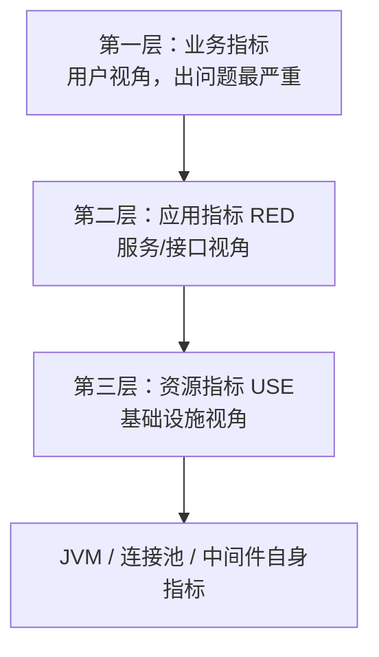

# 📊 监控指标、日志、Trace、告警与 SLO

> 返回 [[00-JD与匹配分析]] · 对应 JD 职责第 5 条

> [!important] 为什么这道题是区分度最高的
> 绝大多数候选人只会答"我们用了 Prometheus + Grafana + SkyWalking"——那是**报工具名**。
> 面试官要听的是**体系**：指标怎么分层、告警怎么分级、SLO 怎么定、错误预算怎么用。
> 这篇背完，你在这一题上超过 90% 的候选人。

---

## 一、先立框架：可观测性三支柱

| 支柱 | 回答的问题 | 形态 |
|---|---|---|
| **Metrics 指标** | "有没有问题？多严重？" | 数字聚合（成本最低，可长时间保留） |
| **Tracing 链路** | "问题出在**哪一跳**？" | 调用树（跨服务串起来） |
| **Logging 日志** | "具体发生了什么？" | 明细文本（信息最全，成本最高） |

**排查的标准动线**（面试必说）：
> **指标发现问题 → Trace 定位环节 → 日志查清细节**

三者缺一：只有日志 = 大海捞针；只有指标 = 知道出问题不知道在哪；只有 trace = 知道慢在哪一跳但看不到细节。

工具举例：Prometheus（指标）+ SkyWalking/OTel（Trace）+ ELK/Loki（日志）+ Grafana（统一视图）。

---

## 二、三层指标体系（**必背，这是骨架**）

### 第一层：业务指标（最高优先级）
**回答："生意还好吗？"**

- 例子：下单量、支付成功率、注册数、履约量、积分发放量、机器人配送成功数
- **为什么必须有**：技术指标全绿但业务跌了 = 出大问题了（典型：上游改了字段、配置错误、支付渠道挂了）
- 特点：**业务方看得懂**，大盘贴在墙上让所有人知道"现在正不正常"

### 第二层：应用指标 RED（对每个服务/接口）
| 字母 | 含义 | 典型指标 |
|---|---|---|
| **R**ate | 请求速率 | QPS、每秒请求数 |
| **E**rrors | 错误率 | HTTP 5xx 比例、业务失败码比例 |
| **D**uration | 耗时 | **P50 / P95 / P99** |

> [!warning] 为什么用 P99 不用平均值（高频追问）
> **平均数会被长尾掩盖**：1000 个请求里 990 个 50ms、10 个 5s，平均才 99ms 看起来很好，
> 但那 10 个用户体验是灾难。P99 直接暴露长尾。
> 更细的还有 P999（千分之一）——核心交易接口要看。

### 第三层：资源指标 USE（对基础设施）
| 字母 | 含义 | 例子 |
|---|---|---|
| **U**tilization | 使用率 | CPU 使用率、堆内存占用、连接池已用比例 |
| **S**aturation | **饱和度**（排队/等待） | **线程池队列长度**、TCP 重传、GC 等待、磁盘 IO 等待 |
| **E**rrors | 错误 | 硬件/OOM/连接获取失败 |

**Saturation 是 USE 的灵魂**，也是多数人漏掉的：CPU 60% 看着健康，但**线程池队列在堆积**就是出问题的前兆。

**别漏了中间件自身**：
- MySQL：慢查询数、活跃连接、**主从延迟**、锁等待
- Redis：命中率、内存碎片率、阻塞客户端数、慢日志
- MQ：**堆积量**（最关键）、消费 TPS、重试数、死信数
- JVM：GC 次数与耗时、堆/元空间、线程数

---

## 三、日志

| 要点 | 内容 |
|---|---|
| 分级纪律 | ERROR 必须可行动；WARN 表示"自动处理了但要关注"；INFO 记关键流转；DEBUG 只在排查时开 |
| **结构化日志** | JSON 格式 + 固定字段：`traceId`、`userId`、`uri`、`耗时`、`错误码`——**没有结构化就没法聚合检索** |
| 采集链路 | 应用落盘 → Filebeat/Loki-Promtail → ES/Loki → Kibana/Grafana |
| 纪律 | ① 不打敏感信息（手机号/密码/卡号脱敏）② 不在循环里打 ③ ERROR 一定要带上下文和 traceId ④ 异常要打堆栈，不要只打 `e.getMessage()` |

---

## 四、Trace 与 traceId 全链路透传（**JD 点名，必考**）

### 4.1 基本模型
- 一次请求 = 一个 **trace**（traceId 全局唯一）
- 里面每一段处理 = 一个 **span**（带 parent spanId），形成**调用树**
- span 记录：服务名、接口、耗时、状态、Tag

### 4.2 透传机制（按场景背）

| 场景 | 透传方式 |
|---|---|
| HTTP 调用 | Header：标准 `traceparent`（W3C Trace Context）或自定义 `X-Trace-Id` |
| RPC | Dubbo **attachment**、gRPC **metadata** |
| **MQ** | 消息头/属性透传（Kafka **header**、RocketMQ **userProperty**）——**这是最容易断的一环** |
| **异步/线程池** | 上下文传递：`TransmittableThreadLocal`（TTL）、对线程池做包装装饰 |
| 定时任务 | 任务入口**自己生成**新 traceId |

### 4.3 常见断点（说出来很加分）
1. **跨线程池**：`@Async` / 自定义线程池没做上下文传递 → traceId 丢
2. **MQ 消费端**：发送时没把 traceId 塞进消息头
3. **跨公司/第三方**：拿不到对方的 traceId → 在边界打日志建立映射
4. **网关重写请求**时把 header 丢了

### 4.4 采样
全量存储成本高 → **头部采样**（固定比例，简单但可能丢掉异常样本）vs **尾部采样**（tail-based：**错误的、慢的全保留**，正常的采样——更合理但要收集端支持）。

### 4.5 工具
- **SkyWalking**：Java agent **零侵入**，国内最常用（Java 团队首选）
- Zipkin / Jaeger / OTel：开源标准；**OpenTelemetry** 是统一采集标准（metrics+logs+traces 一套 SDK）

### 4.6 排查实例（可以直接讲的故事）
> "有次接口 P99 从 200ms 涨到 1.2s。
> 先看 RED：错误率没涨、QPS 正常，只有 Duration 涨 → 说明不是故障，是**变慢**；
> 打开 Trace 看 P99 慢请求的调用树：发现慢在一跳 DB 查询（本来 30ms 变 900ms）；
> 按 traceId 聚合日志，那些请求都带了同一个新上的查询条件；
> `explain` 一看没走索引（隐式类型转换）→ 修索引 → P99 回到 220ms。
> 复盘时给该接口加了**慢查询告警**和**类型断言**。"

---

## 五、告警分级与治理

### 5.1 分级表（背下来）

| 级别 | 定义 | 通知方式 | 响应 |
|---|---|---|---|
| **P0** | 核心业务**不可用** / 资损 | **电话** + 群 + 升级到负责人 | 立即，7×24 |
| **P1** | 核心功能**降级**、错误率超阈、SLO 快速燃烧 | 群通知 @值班 | 15 分钟内响应 |
| **P2** | 非核心异常、容量预警、堆积抬头 | 工单/群 | 工作时间处理 |
| **P3** | 信息类（发布通知、周报趋势） | 日报 | 定期看 |

### 5.2 告警设计四原则

1. **每条告警必须可行动**——收到的人知道该干什么。不能行动的删掉或降级成日报
2. **基于症状，不是基于原因**：报"支付成功率跌破 99%"（用户可感知），而不是"CPU 超 80%"（可能只是正常高峰）
3. **防抖动**：`for` 持续 2-3 个周期才触发、用比例而非绝对数、多窗口确认
4. **定期治理**：每月审计"过去 30 天被忽略/自动恢复的告警"，砍掉或降级

> [!danger] 告警疲劳
> 100 条告警里 95 条没人理 → 真出事那条也会被淹没。
> **告警疲劳比没有告警更危险。** 负责人的职责是让每条告警都"值得被叫醒"。

---

## 六、⭐ SLO / SLI / SLA / 错误预算（**区分度最高，多数人答不出**）

### 6.1 三个概念一句话分清

| 概念 | 一句话 | 例子 |
|---|---|---|
| **SLI**（Indicator 指标） | **测量的东西** | "过去 5 分钟内成功请求的**比例**"、"P99 延迟" |
| **SLO**（Objective 目标） | **内部要达到的目标值** | "30 天滚动窗口内可用性 ≥ 99.9%" |
| **SLA**（Agreement 协议） | **对外的合同承诺 + 违约赔偿** | "月度可用性 99.5%，未达标赔付" |

关系：**SLI 是尺子，SLO 是内部及格线，SLA 是对外合同**（SLA 一般比 SLO 宽松，留出缓冲）。

### 6.2 错误预算（Error Budget）——**核心考点**

**定义**：`错误预算 = 1 − SLO`，即允许失败的部分。

**必须会算**（30 天滚动窗口）：

| SLO | 30 天总分钟数 | 允许出错 | 换算 |
|---|---|---|---|
| 99.9% | 30×24×60 = **43,200 分钟** | **43.2 分钟** | 每天 ~1.44 分钟 |
| 99.95% | 43,200 分钟 | **21.6 分钟** | 每天 ~0.72 分钟 |
| 99.99% | 43,200 分钟 | **4.32 分钟** | 每天 ~0.14 分钟 |

### 6.3 错误预算的**用法**（这才是精髓，Google SRE 的核心实践）

1. **把"要不要稳定性"从争吵变成数学题**
   > 业务说"要发版"，SRE 说"要稳定"。不用吵——**看预算还剩多少**：
   > 预算充足 → 该发就发、可以做重构和实验；**预算烧完 → 冻结功能发布**（只允许修复性变更），全员恢复可靠性。
   > 稳定性和迭代速度的平衡，用预算额度自动裁决，**双方事先认账**。

2. **燃烧率告警（burn rate）**
   不只看"预算剩多少"，还看**烧的速度**：
   - 1 小时烧掉 5% 预算 → 快速告警（P0，这样烧下去几小时就没了）
   - 3 天烧掉 30% → 慢速告警（P1，按这个速度月底必超）

3. **指导发布节奏**
   预算剩余 50% 以上 → 正常节奏；20% 以下 → 只发修复；0 → 冻结 + 专项治理

### 6.4 SLO 怎么定（负责人视角）

| 原则 | 说明 |
|---|---|
| **不设 100%** | 100% 意味着不能发任何版本、成本指数级上升；错误预算的存在就是为了允许"可控的失败" |
| **从用户视角定** | SLI 测的是**用户请求**的成功率/延迟，不是单机健康度 |
| **用分位数不用平均** | P99，不是平均值 |
| **从宽开始逐步收紧** | 先定能稳定达到的（如 99.9%），跑一个季度再调；一上来就定 99.99% 必然天天违约 |
| **分服务分级定** | 核心交易 99.95%~99.99%；一般业务 99.9%；内部系统 99%~99.5% |
| **必须挂钩决策** | 预算耗尽要真的触发"冻结发布"，否则 SLO 只是墙上的装饰 |

### 6.5 高频追问速答

| 追问 | 答法 |
|---|---|
| SLO 和 SLA 什么关系？ | SLO 是内部目标，SLA 是对外合同；**SLA 要比 SLO 宽松**，否则内部达标了还是得赔 |
| 错误预算烧完了怎么办？ | 冻结功能发布（只允许修复）、专项可靠性治理、复盘预算去哪了；**如果总烧完，说明 SLO 定得不现实或架构有硬伤，要重新评估** |
| 为什么不定 100%？ | 不可实现且扼杀迭代；错误预算的本质是**用可控的失败换取迭代速度** |
| SLO 谁来定？ | SRE/后端负责人起草，**和业务方共同确认**——因为它直接约束业务节奏，必须双方认账 |

---

## 七、综合面试题（Q&A，按概率排序）

**Q1：线上接口突然变慢，你怎么排查？**
> ① 看业务指标有没有异常波动（缩小影响范围：全量？部分用户？某站点？）
> ② RED 定位：错误率涨没涨？QPS 变化？只有 Duration 涨 → 是"慢"不是"坏"
> ③ Trace 看慢请求的调用树，定位慢在哪一跳（DB / 下游服务 / 锁 / GC）
> ④ 按 traceId 聚合日志找共同点（参数、时间段、机器）
> ⑤ 资源层 USE 看饱和度：线程池队列、连接池、GC
> ⑥ 修复后复盘：为什么没提前发现 → 补监控/告警/压测

**Q2：从零给一个系统建监控体系，你怎么做？**
> 四步，一个月跑起来：
> ① **打地基**：统一 traceId 生成与透传、日志结构化（没有这两样，后面全是孤岛）
> ② **核心链路大盘**：先覆盖最重要的 1-2 条业务链路（业务指标 + RED），不追求全覆盖
> ③ **告警分级 + 值班机制**：P0-P3 定清楚，"可行动"原则
> ④ **SLO + 错误预算 + 复盘闭环**：跑一个季度，用数据修正
> 顺序不能反——很多团队一上来就买工具，最后变成"有监控、没体系"。

**Q3：怎么衡量稳定性做得好不好？**
> 看 SLO 达成率、错误预算消耗曲线、P0/P1 故障数与 MTTR（平均恢复时间）、告警有效率（可行动比例）。
> **重点讲 MTTR**：故障不可能为零，负责人的价值是让**恢复时间越来越短**（预案、自动化回滚、演练）。

**Q4：故障复盘怎么搞？**
> 24-48h 内开，**无指责**（blameless）：时间线还原 → 根因（问 5 个为什么，挖到流程而非个人）→ action items（每条有 owner 和 deadline）→ 下次复盘先检查上次的 items 是否闭环。

**Q5：告警天天狼来了，团队开始忽略了怎么办？**
> 承认这是告警治理问题，不是团队态度问题：统计过去 30 天每条告警的"触发-忽略"率 → 砍掉/降级 >70% 被忽略的 → 剩下的收紧阈值加 `for` 窗口 → 两条铁律：**可行动、防抖动**。

---

## 八、一分钟话术（面试直接用）

> "监控这块我按'三支柱 + 三层指标 + 闭环'来建。
> 三支柱是指标、日志、Trace，排查动线是**指标发现问题、Trace 定位环节、日志查细节**。
> 指标分三层：业务层看用户视角，应用层用 **RED**（Rate/Errors/Duration，看 P99 不看平均），
> 资源层用 **USE**——关键是 **Saturation 饱和度**，比如线程池队列堆积，这往往比 CPU 高更能预警。
> 告警分 P0-P3，两条铁律：**每条可行动、防抖动**，定期治理告警疲劳。
> 最后是 SLO 和**错误预算**：SLO 99.9% 意味着 30 天只有 43.2 分钟预算，
> 预算内放心发版，烧完就冻结功能发布只做修复——
> **这样'稳定还是迭代'就不用吵了，用数学裁决**。
> 故障处理我坚持'止血→定位→恢复→复盘'，无指责复盘，action items 必须闭环。"

---

## 📥 待补充

- [ ] 把你两个真实项目里的监控做法（用了什么、量级、一次真实故障）回填进来
- [ ] 冠顿如果问"你们现在 K8S 里怎么做 HPA"，补一句容器视角的扩缩容

## 🔗 关联

- [[00-JD与匹配分析]] · [[01-管理面与负责人题]] · [[02-技术补差与AI亮点]]
- [[面试准备/技术面试题库/03-JVM与性能调优]]（线上排查）· [[面试准备/技术面试题库/09-分布式与微服务]]

#面试 #冠顿 #监控 #SLO #可观测性 #待补
