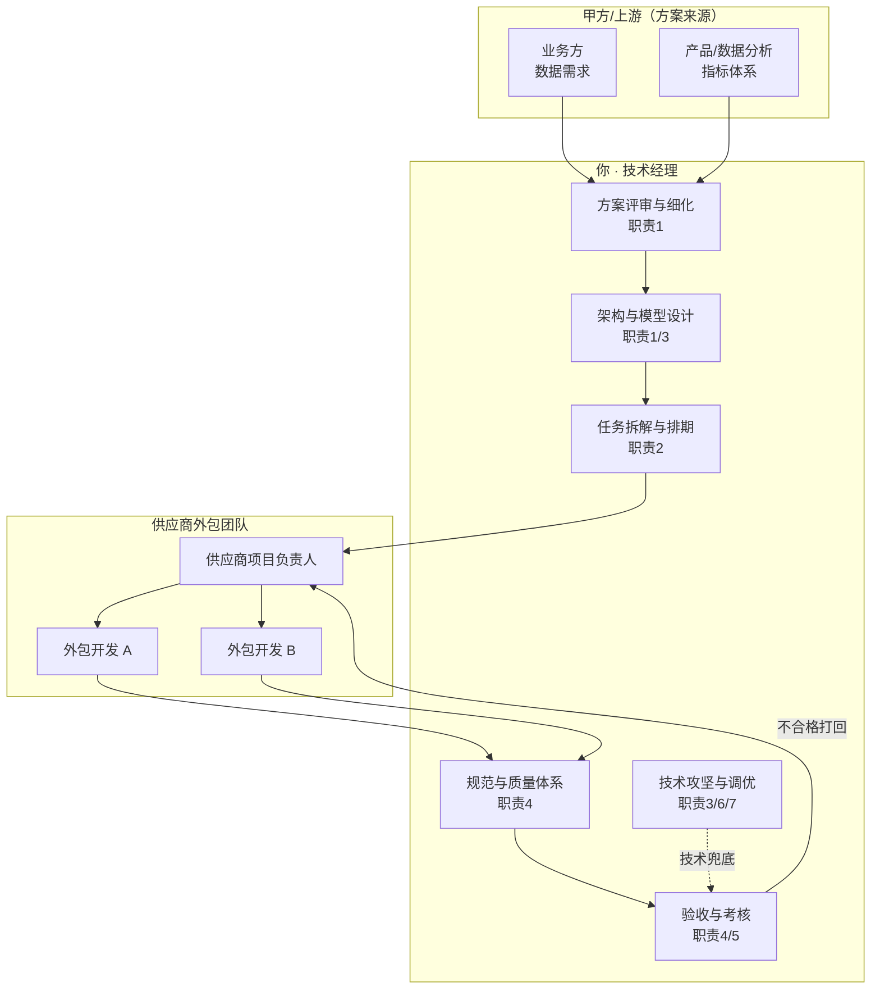
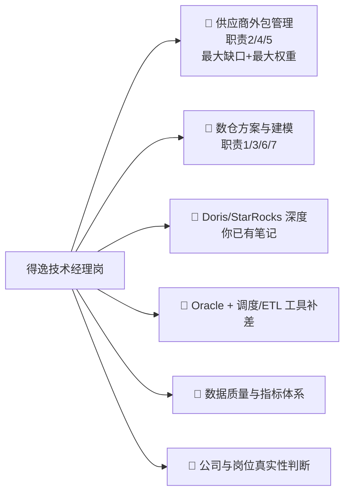

# 🎯 得逸信息 · 技术经理（数仓方向）

> [!abstract] 一句话判断（先说结论）
> **这是一个"数仓技术负责人 + 外包团队管理"的混合岗，而且外包管理是真正的重点。**
> JD 七条职责里，**第 2、4、5 条整整三条都在讲"管供应商团队"**——这不是普通开发岗的加分项，
> 而是这个岗位**存在的理由**。技术上的数仓能力是门槛（筛掉不会的人），
> **能不能管住一帮外包、把交付质量扛住，才是决定录不录你的东西**。
>
> 你的情况：**数仓技术面通过自学 + 项目可以撑住，但"管理外包团队"经验是硬缺口**，
> 而这家公司本身大概率就做外包/人力服务——详见 [[03-公司情报与决策建议]]。

---

## 1. JD 原文（整理版）

> 来源：招聘平台截图。信息以 HR 沟通为准。

| 项 | 内容 |
|---|---|
| 岗位 | **技术经理** |
| 公司 | 上海得逸信息技术有限公司 · 未融资 · **1000-9999 人** · 计算机软件 |
| 地点 | 杭州西湖区**嘉华中心 17 楼** |
| 行业标签 | 互联网 / AI |
| HR 活跃度 | 今日回复 10+ 次、13 分钟前回复（**响应很快，可能急招/在大量捞人**） |
| 通勤 | 距你家 **21.7 km**（对比：智控、冠顿都在 15 km 左右） |

### 岗位职责（7 条，按"性质"归类）

| # | 原文要点 | 性质 |
|---|---|---|
| 1 | 数仓整体建设方案、**分层架构（ODS/DWD/DWS/ADS）**、数据模型、数据清洗、**指标体系**的对接、评审与细化；联动业务/产品/数据分析梳理需求，输出**标准化可落地**的数仓开发方案；保障数据链路完整、**口径统一** | 🧱 **数仓架构** |
| 2 | **主导内外部开发团队管理，核心统筹供应商外包开发团队**；按迭代计划拆任务、分人力、排期；把控进度与节点交付 | 👥 **外包管理（核心）** |
| 3 | 核心数仓架构搭建、分层模型设计；复杂数据计算、数据同步、数据优化攻坚；**Oracle、StarRocks/Doris** 体系落地；解决**数据延迟、数据冗余、查询性能差、数据不一致** | 🧱 **技术攻坚** |
| 4 | 建立数仓开发规范、**数据质量校验规则**、任务调度规范；对**供应商开发成果做代码审核、数据校验、复盘验收**；杜绝数据错误、重复开发、不规范开发 | 👥 **质量管控（管外包）** |
| 5 | 对接**供应商项目负责人**，同步需求/迭代目标/交付标准；定期复盘、进度同步；对供应商**工作成果、交付质量、工作效率进行考核与管控**；协调解决外包团队人力、技术卡点 | 👥 **供应商考核（管外包）** |
| 6 | 数仓迭代与优化：架构、模型、查询性能；梳理**链路瓶颈**，优化计算逻辑、**索引策略、分区规则**；保障大数据量下稳定运行 | 🧱 **性能优化** |
| 7 | **数仓调优**：识别性能瓶颈与故障，制定**调优规范**，带团队做性能/模型优化、故障排查 | 🧱 **调优 + 带团队** |

> [!important] 关键洞察：这份 JD 是"缝"出来的
> 注意第 1、3 条里"**对接、评审与细化**"、"**方案对接**"这些措辞——
> 它不是"从 0 设计数仓"，而是"**甲方/上游给了方案，你负责评审、细化、落地、验收**"。
> 再叠加第 2、4、5 条对供应商的管理，画像非常清晰：
>
> **这是一个"数仓交付经理"岗——技术上是方案的落地者与守门人，管理上是外包团队的甲方接口人。**
> 这解释了为什么它既要 Oracle（传统企业存量系统）又要 Doris/StarRocks（新数仓），
> 也解释了为什么"1 年以上团队管理/项目统筹经验"是**硬性要求**而不是"优先"。

### 任职要求（4 条）

| # | 要求 | 硬/软 |
|---|---|---|
| 1 | 本科+，计算机/数据/软件工程相关；**3 年以上数仓开发经验**；**1 年以上团队管理/项目统筹经验**；**有供应商团队统筹管理经验者优先** | 🔴 管理是硬要求 |
| 2 | 精通 **Oracle、MySQL**：存储过程、函数、索引优化、SQL 调优、数据迁移、分区管理；熟悉 **StarRocks/Doris** 架构：建表、分区、物化视图、查询优化、数据同步、集群使用；熟练使用主流数仓开发、调度工具 | 🟠 技术硬要求 |
| 3 | 成熟的**数仓分层架构思维**，熟练掌握**维度建模、范式建模**；能独立完成需求拆解、模型设计、指标体系搭建；有**中大型数仓项目整体落地经验** | 🟠 技术硬要求 |
| 4 | 需求对接、方案梳理、任务拆解能力；**擅长管理外包/供应商开发团队**；把控进度与交付质量；跨部门沟通、问题协调、复盘总结能力；抗压能力与项目推进能力；熟悉数仓开发流程与数据质量管控体系；有大数据平台、业务数仓建设项目经验者优先 | 🔴 管理是硬要求 |

---

## 2. 匹配度分析

### ✅ 你的硬匹配

| JD 要求 | 你的情况 | 结论 |
|---|---|---|
| 3 年+ 数仓开发 | 十几年后端 + 大数据/数仓自学体系（[[5-bigdata/1-doris/0-Doris总览\|Doris 十篇深度笔记]]） | ✅ **超配年限**，但需证明"数仓"而非"后端" |
| **Doris / StarRocks** | 已有 **Doris 全套笔记**：架构原理、数据模型、表设计、建表分区分桶、查询优化、导入与 Flink CDC、湖仓一体、运维调优、对比 StarRocks/ClickHouse、面试高频题 | ✅✅ **这是你最强的匹配点**，详见 [[02-数仓方案与建模深度题]] |
| Oracle / MySQL / 存储过程 / SQL 调优 | 简历第 4 条"精通 SQL/PL-SQL 与复杂存储过程、MySQL 深度索引优化、慢查询调优" | ✅ 主场 |
| 数仓分层、维度建模、范式建模 | 有概念 + 项目可挂钩（回收平台报表体系、积分流水） | 🟠 **需补：把"报表"讲成"数仓分层"** |
| 指标体系搭建 | 回收平台有站点/区域/品类多维分析 | 🟠 需补**指标口径统一**的方法论 |
| 数据质量校验规则 | 回收平台**T+1 对账机制**（设备流水 vs 平台流水） | ✅✅ **这是你的王牌，见下方** |
| 调度规范 / 主流调度工具 | 有 Flink、Shell、定时任务经验 | 🟠 需补 Airflow/DolphinScheduler/DataX 等名词 |
| 性能调优 / 故障排查 | [[面试准备/专业技能/04-数据库调优]]、冠顿 09/10 篇已备 | ✅ |
| **1 年+ 团队管理 / 项目统筹** | ⚠️ 无正式头衔（同冠顿的软肋） | 🔴 **最大风险，见下** |
| **供应商/外包团队统筹管理** | ❌ **基本没有** | 🔴🔴 **最致命缺口，见下** |

> [!success] 你有一个被低估的王牌：对账 = 数据质量治理
> JD 第 4 条要"数据质量校验规则"，很多人只会答"加非空校验、加唯一性校验"。
> 而你在回收平台真做过 **T+1 双向对账**：拉设备流水 vs 平台流水，差异分三类（平台多、设备多、金额不符），
> 生成工单流转。**这就是数据质量治理的完整闭环**——
> 发现（对账）→ 定位（差异分类）→ 处理（自动冲正/人工工单）→ 闭环（工单跟踪）。
> 讲这条比讲十个"我加了校验规则"都有说服力。**务必把它翻译成数仓语言。**

### 🔴 风险点（按致命程度排序）

#### 风险一：**供应商/外包团队管理经验为零** ⚠️ 这是本场面试的头号杀手

> [!danger] 面试官一定会往死里问
> 因为**这岗位存在的意义就是管外包**。他会问：
> - "你管过外包团队吗？多少人？"
> - "外包同学交付质量不行，你怎么处理？"
> - "供应商虚报工时/人力，你怎么识别？"
> - "外包人员流动大，知识不留存，你怎么办？"
> - "你怎么跟供应商项目负责人谈交付标准？"
>
> **答"没管过"= 直接出局。** 必须用**等价经验迁移**，详见 [[01-供应商外包团队管理]]。

**你的可迁移素材**（真实，不编造）：
1. **跨团队/跨专业协调**——机器人项目里要和**嵌入式、硬件、前端、酒店 IT** 多方对齐接口与排期，本质是"你没有考核权但要对交付负责"的弱矩阵管理
2. **第三方系统对接与验收**——PMS、梯控都是外部方，你做过**接口规范定义 + 联调 + 对账 + 验收**，这和管供应商是同一套动作
3. **带教新人**——有培养路径的真实经历
4. **方案评审 / 任务拆解 / 交付质量把关**——项目牵头人职责

> [!tip] 核心话术方向（先记住，细节见 [[01-供应商外包团队管理]]）
> **不撒谎，但要把"弱矩阵协调"讲成"管理"的内核**：
> "我没有正式的外包供应商合同管理经验，但我管过**没有汇报关系的人和外部团队**——
> 这部分和管理外包的难点是一样的：**你没有奖惩权，还要对方按你的标准和节奏交付**。
> 我的做法是靠三样东西：**前置的交付标准、过程的可见性、验收的客观证据**。"
> 然后**立刻给出你设想的完整外包管理框架**（见 [[01-供应商外包团队管理]]），
> 把"没做过"变成"**我清楚这件事该怎么做**"。

#### 风险二：**"数仓"经验是自学 + 项目侧写，不是岗位title**

面试官会验证："你说做过数仓，那讲一下你负责的数仓，多少张表？多少 TB？几个主题域？"
- 你的真实项目是**业务系统**（机器人调度、积分平台），不是数仓项目
- 你有**Doris 深度自学**（这是真东西）+ 项目里的**报表统计、对账、多维分析**（可上溯到数仓）

**应对**：同 [[面试准备/简历/00-AI经历怎么讲与简历改写策略]] 的策略——
**坦白 + 亮证据 + 给设计**。不要编一个数仓项目，会被"多少张表/多少 TB"问穿。

#### 风险三：**Oracle 深度不够 + 传统数仓工具链缺名词**

- JD 第 2 条 **Oracle 排第一**（不是 MySQL）——说明客户/项目是**传统企业或银行/运营商存量系统**
- 你的主场是 MySQL，Oracle 是"了解"
- 缺名词：**调度工具**（Airflow / DolphinScheduler / Azkaban / Control-M）、**ETL**（DataX / Kettle / Informatica / ODI）、**建模工具**（PowerDesigner / ERwin）、**BI**（FineReport / Tableau / 帆软）

**应对**：Oracle 用"概念迁移 + 诚实降级"话术；工具名词**速补到能对话**即可，别装精通。

#### 风险四：**通勤 21.7 km**

比智控、冠顿都远。这个岗位本身"抗压能力""保障交付"暗示**加班/驻场可能**，要算清时间账。

---

## 3. 这个岗位的真实画像（帮你判断要不要去）

> [!warning] 从这个图能读出三件事
> 1. **你大概率不写大部分代码**——你写的是规范、方案、关键攻坚，和"审别人的代码"
> 2. **你的 KPI 是"交付质量 + 进度"**，不是"我写了多少代码"
> 3. **你的权力是"标准和验收"，不是"人事权"**——外包的工资不是你发的，
>    所以你的管理必须靠**规则、证据、和向上借力**，这恰恰是 [[01-供应商外包团队管理]] 要解决的核心问题

---

## 4. 复习优先级

| 优先级 | 内容 | 去哪准备 |
|---|---|---|
| 🥇 | **供应商/外包团队管理与考核** | [[01-供应商外包团队管理]] |
| 🥇 | **数仓分层、维度建模、指标体系、口径统一** | [[02-数仓方案与建模深度题]] |
| 🥇 | Doris/StarRocks 架构、建表分区、物化视图、查询优化 | **已有** [[5-bigdata/1-doris/0-Doris总览]] 全系列 |
| 🥈 | Oracle 存储过程/分区/迁移 + 调度与 ETL 工具名词 | [[02-数仓方案与建模深度题]] 第六节 |
| 🥈 | 数据质量校验规则、对账体系（你的王牌） | [[01-供应商外包团队管理]] 第四节 |
| 🥉 | 这家公司到底做什么、要不要去、怎么谈 | [[03-公司情报与决策建议]] |

> [!tip] 和冠顿/智控共用材料，别重复准备
> - **管理面通用题**（目标制定、绩效、Code Review、架构演进、工程文化）→ 直接复用 [[面试准备/冠顿/01-管理面与负责人题]]，**只需把场景从"微服务团队"换成"数仓外包团队"**
> - **数据库调优** → [[面试准备/专业技能/04-数据库调优]]
> - **故障恢复/监控** → [[面试准备/冠顿/10-故障恢复]]
> - **大数据与流计算** → [[面试准备/专业技能/05-大数据与流计算]]、[[5-bigdata/0-flink/10-面试高频题]]

---

## 5. 待确认（面试前问 HR 或现场必问）

- [ ] **这是自研岗还是驻场岗？**（外包公司常见：你自己也是被派驻到客户现场的）
- [ ] **团队规模**：内外部各几人？外包是哪家供应商？
- [ ] **数据源和体量**：多少 TB？多少张表？日增多少？实时还是离线为主？
- [ ] **客户是谁**：银行？运营商？制造业？（决定 Oracle 权重和技术栈）
- [ ] **数仓是从 0 建设还是接手已有？**（答法完全不同）
- [ ] **这个岗位是新增还是替代离职者？**
- [ ] **薪资范围**（JD 未标，必须问）
- [ ] **是否需要长期驻场/出差**

## 🔗 关联

- [[01-供应商外包团队管理]] · [[02-数仓方案与建模深度题]] · [[03-公司情报与决策建议]]
- [[面试准备/冠顿/01-管理面与负责人题]]（管理面通用答案）
- [[5-bigdata/1-doris/0-Doris总览]] · [[5-bigdata/1-doris/10-面试高频题]]

#面试 #得逸信息 #技术经理 #数仓 #外包管理 #待确认
