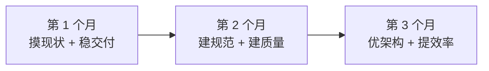

# 👥 供应商 / 外包团队管理 · 全套打法

> 返回 [[00-JD与匹配分析]]

> [!danger] 先认清：这一篇决定你能不能过
> JD 七条职责里，**第 2、4、5 条是纯粹的外包管理**，第 1、7 条里也有"带团队""评审验收"。
> 也就是说 **70% 的职责权重在"管外包"上**。
> 而你的简历里**没有任何供应商管理经验**——这是你和这个岗位之间唯一的、也是最大的鸿沟。
>
> **本篇的目标：让你在被追问时，从"没管过"变成"我清楚这件事该怎么管，而且能说出细节"。**

---

## 一、开场：怎么回答"你管过外包团队吗？"

> [!important] 答法结构：**承认边界 → 迁移等价经验 → 立刻给出方法论框架**
> 顺序不能反。先承认（建立可信度），再迁移（证明不是白纸），最后给框架（证明你懂行）。

### 话术模板（背熟，按你的真实情况调整数字）

> "**先说清楚**：我没有直接签过供应商框架合同、管过几十人外包团队的经历，这个我不骗您。
>
> **但我管过同类的难题**。做送物机器人项目时，我要对整体交付负责，
> 但**梯控厂家、PMS 供应商、还有硬件和嵌入式团队，都不是我的下属**——
> 我没有他们的考核权，却要对接口质量、联调进度和上线结果负责。
> 这跟管外包的**本质是一回事**：**你没有奖惩权，还要对方按你的标准和节奏交付。**
>
> 我当时的做法总结下来是三件事，我觉得管外包也是这套：
>
> **第一，把交付标准前置并且写死。** 接口字段、错误码、超时重试、幂等要求，全部落到接口文档和联调 checklist 上，
> 联调前双方签字确认。**标准模糊是后面所有扯皮的根源。**
>
> **第二，让过程可见。** 我不接受"快好了"这种汇报。要求对方给**可验证的中间产物**——
> 每天的任务清单、能跑通的 demo、日志和监控截图。**看不见的进度等于没有进度。**
>
> **第三，验收靠客观证据，不靠感觉。** 对不对得上前置的标准，数据对不对得上源系统，
> 有争议就拉日志和流水对账，不是靠谁嗓门大。
>
> **所以您问的这些问题我认真想过**——比如外包交付质量差、人员流动大、虚报工时，
> 我的思路是先靠**规范和验收卡住结果**，再用**数据和复盘**去推动对方项目负责人。
> 如果方便的话我很想听听咱们现在这块是怎么管的，实际痛点在哪。"

> [!tip] 为什么这个答法能救你
> 1. **诚实**——面试官不会在"没管过"上纠缠，他会转向"那你打算怎么管"，**战场就换了**
> 2. **迁移**——"无汇报关系却要对结果负责"精准命中外包管理的本质，这是**内行话**
> 3. **框架**——三件事（标准前置/过程可见/证据验收）是可复述、可追问的骨架
> 4. **反问收尾**——把球踢回去，显得你在**平等讨论管理**而不是被审问

---

## 二、外包管理的核心认知（先想明白，再答题）

> [!important] 一句话本质
> **你和外包团队之间没有"管理关系"，只有"契约关系 + 甲方地位"。**
> 你管不了他的人、他的工资、他的晋升。你能管的只有三样：
> **① 进什么活（范围）② 什么算完成（标准）③ 不合格怎么办（验收与升级）**。

### 为什么外包交付质量天然容易出问题（面试官爱问"为什么"）

| 根因 | 表现 | 你的应对方向 |
|---|---|---|
| **激励错位** | 外包公司按**人力工时**赚钱，不按**你系统的质量**赚钱 → 有动机拖长工期、多报人力 | 用**固定交付物 + 里程碑验收**替代"按人天计"，至少关键节点要绑死 |
| **人员流动高** | 熟手被抽调到别的项目，换新人 = 你反复交学费 | **强制知识留存的交付物**：文档、脚本、数据字典必须随代码交付；关键人要有备份 |
| **只做不问** | 按字面需求做，不理解业务上下文 → 做出"符合需求但没用"的东西 | **需求澄清会要求外包核心开发参加**，让他讲一遍理解，讲错当场纠正 |
| **无主人翁意识** | 出了问题先甩锅——"需求就是这么写的" | **责任界面清晰**：需求文档、设计文档、变更记录都要签字确认；变更走流程 |
| **能力天花板** | 复杂逻辑做不动，简单逻辑做不规范 | **核心攻坚自己做**（JD 第 3 条正是这个意思），把标准动作交给外包 |

> [!tip] 面试时可以主动说这个洞察
> "外包交付质量问题的**根因往往不是能力，是激励**——外包公司按人天赚钱，
> 他的最优解是**安全地拖长工期**，而不是帮我把系统做快做好。
> 所以我的管理重点是**把验收标准客观化、把里程碑绑死**，让'做到什么程度'没有解释空间。"

---

## 三、外包管理六大动作（JD 职责 2/4/5 逐条拆解）

### 动作 1️⃣：任务拆解与排期（职责 2）

| 面试问题 | 答题骨架 |
|---|---|
| **怎么给外包团队拆任务？** | ① **拆到"可独立验收"的粒度**——一个任务一张表/一个指标/一个同步链路，有明确的输入输出。 ② **依赖关系前置**——先定维表口径、先定分层规范，再让外包动手建表，否则返工。 ③ **任务单写清验收标准**——不是"开发 DWD 层"，而是"产出 X 张 DWD 表，字段覆盖率 100%，主键唯一，与源表 T+1 对账差异 0"。 |
| **怎么排期？** | ① **倒排**：从交付节点往前推，识别**关键路径**。 ② **给缓冲但不给水分**——每阶段留 10-20% buffer，但 buffer 不告诉外包（否则会被吃掉）。 ③ **识别不可并行项**：口径确认、上游数据就绪、UAT 环境，这些卡住就全卡住。 |
| **人力怎么分配？** | 按**模块耦合度**分，不按人数平均分——否则接口永远对不齐。一个主题域给一个外包小组，减少跨人沟通成本。 |
| **进度怎么把控？** | **日粒度看产出、周粒度看里程碑**。日会只问三件事：昨天交付了什么可验证的东西、今天做什么、有什么卡住。**不接受"在做了"。** |

### 动作 2️⃣：开发规范与质量体系（职责 4）

> [!important] 这是你"管外包"最有力的武器
> **规范是提前写好的规则，它替你说"不"，不用每次都靠人情和争吵。**

**需要建立的规范清单（面试可以直接背出来，非常加分）**：

| 规范类别 | 具体内容 |
|---|---|
| **建模规范** | 分层职责边界（ODS 只做落地不做清洗、DWD 做清洗+规范化、DWS 做轻度汇总、ADS 面向应用）；**命名规范**（表名前缀、字段后缀 `_id/_amt/_cnt/_dt`）；**公共维度统一**（日期、地区、用户、机构维度必须走公共维表，禁止各自建） |
| **建表规范** | 强制指定分区（时间分区）；分桶数与数据量匹配；明确数据模型（明细用 Duplicate、维表/CDC 用 Unique+MoW、指标用 Aggregate）；**必须写表注释和字段注释** |
| **开发规范** | SQL 禁止 `SELECT *`；禁止在分区列上套函数（**这是 Doris 分区裁剪失效最经典的坑**）；大表 Join 必须明确 Join 方式；复杂逻辑必须拆临时表，禁止一个 SQL 嵌套五层 |
| **调度规范** | 任务必须配**依赖**（不能靠时间猜）；必须设**超时与重试上限**（防雪崩）；必须配**失败告警**且告警要有人接；任务分级（核心链路 vs 非核心） |
| **变更规范** | 表结构变更、口径变更、逻辑变更**必须走变更单**，评估下游影响面，禁止"悄悄改" |

**Code Review 怎么做**（职责 4 明确要求"对供应商开发成果进行代码审核"）：

> "SQL 的 review 和 Java 不太一样，重点看四件事：
> ① **口径对不对**——这个指标算的是不是业务要的那个东西，单位、精度、时间范围；
> ② **性能有没有坑**——有没有分区裁剪失效、有没有不必要的 Shuffle、大表 Join 顺序对不对，我会让他们**贴 EXPLAIN 和 PROFILE 过来**，不看计划不 review；
> ③ **规范有没有遵守**——命名、注释、分层边界；
> ④ **有没有重复造轮子**——指标是不是已经有公共层算过了，禁止各写各的。
>
> 做法上，我用**工具做第一道**（SQL 规范检查、命名检查），把低级问题挡在人工之前，
> 人工只 review 口径和性能这两个工具看不出来的。**review 意见对事不对人，但必须闭环——提了不改不能 merge。**"

### 动作 3️⃣：数据质量校验（职责 4）

> [!success] 🎯 这是你的王牌，一定要主动讲
> 你在回收平台真做过 **T+1 双向对账**——这就是最完整的数据质量治理闭环。
> **把它翻译成数仓语言，这比任何八股都值钱。**

**话术**：

> "数据质量我分**事前、事中、事后**三层来做：
>
> **事前——规则前置**。在开发阶段就要求配好校验规则，我一般分四类：
> **完整性**（主键非空、分区行数不能为 0、波动超阈值告警）、
> **唯一性**（主键/业务键唯一，Unique 模型本身就是约束）、
> **一致性**（明细汇总能对上——ADS 的汇总值必须等于 DWD 明细的聚合值）、
> **及时性**（任务必须在时间窗口内完成，比如早 8 点前必须就绪）。
>
> **事中——调度卡口**。质量校验做成**调度任务的前置依赖**：上游数据没通过校验，下游任务**不允许跑**。
> 宁可让报表晚出并告警，也不能让错的数据流到下游——**错数据比没数据危害大得多**。
>
> **事后——对账兜底**。这个我在上一个项目真做过：回收平台的设备流水和平台流水每天做**双向比对**，
> 差异分成三类——平台多了、设备多了、金额不符，分别生成工单流转处理，
> 自动能冲正的自动冲正，不能的判断后转人工。
>
> 我的体会是：**对账是数据准确性的最后一道防线**。
> 规则再全也有漏的，但**只要能和源头对上账，问题就一定能被发现**。
> 这套东西放到数仓就是 ODS 层和源系统对账、DWD 和 ODS 对账、ADS 和 DWD 对账。"

### 动作 4️⃣：供应商考核与管控（职责 5 —— 最硬的一条）

> [!danger] 面试官最爱在这里深挖，因为这条最难
> "对供应商团队工作成果、交付质量、工作效率进行考核与管控"——**你凭什么考核人家？**

**答题骨架：建立"可量化 + 有证据 + 有后果"的考核机制**

| 维度 | 怎么量化 | 数据从哪来 |
|---|---|---|
| **交付质量** | 一次验收通过率、生产事故数（按外包模块归属）、review 打回次数、数据质量告警次数 | 验收记录、事故复盘、质量校验平台 |
| **交付效率** | 里程碑准时率、需求平均交付周期、返工率 | 任务系统、迭代记录 |
| **规范遵守** | 规范检查通过率、文档交付完整度、变更流程合规率 | 自动化检查、抽查 |
| **协作与响应** | 问题响应时长、跨团队配合评价 | 日常记录、协作方反馈 |

**关键设计原则（这几句很显专业）**：

1. **指标要客观、可追溯，不能凭印象**——"我觉得他不行"是没用的，要能拿出数据
2. **考核要事前约定**——SLA/交付标准在项目启动时就写进合作协议或会议纪要，**不是事后算账**
3. **必须有后果**——质量持续不达标 → 正式约谈供应商负责人 → 要求换人 → 扣减/暂停结算 → 影响后续合作。**没有后果的考核就是形式主义**
4. **对事不对人，但对人要动**——问题在流程就改流程，问题在人就要求换人；**外包换人的成本远低于自己扛**

**话术**：

> "对外包的考核我不会靠感觉，我会**在项目启动时就把交付标准量化约定好**——
> 一次验收通过率、里程碑准时率、生产事故数、review 打回次数，
> 然后**定期复盘把这些数据摆出来跟供应商负责人对齐**。
>
> 但考核的意义在于**有后果**。如果只是每个月开个会说'你们要提升质量'，那没有用。
> 我的做法是**分级升级**：单个任务不合格 → 打回重做；
> 模块级持续不达标 → 正式约谈供应商项目负责人，要整改计划；
> 再不行 → **要求换人**，或者把这类模块收回来自己做。
>
> **我不会一开始就升级冲突**，但我会让对方清楚**升级路径是存在的、而且我会用**。
> 说白了，管外包最难的不是发现问题，是**敢不敢用规则去推动对方**——
> 这一点我清楚，也是我想到这个岗位上来做完整的原因。"

### 动作 5️⃣：与供应商项目负责人的协同（职责 5）

| 场景 | 做法 |
|---|---|
| **定期同步** | 固定节奏：**日站会**（看卡点）+ **周例会**（看里程碑和风险）+ **迭代复盘**（看质量和改进项）。会议必须有**纪要 + action items + 责任人 + 截止时间**，下次会先过上次的 action |
| **需求同步** | 需求不能只发文档了事。**需求澄清会要求外包核心开发参加并复述理解**，理解偏了当场纠正——这是最便宜的纠错时机 |
| **交付标准同步** | 验收标准**前置到需求阶段**，不能等交付了才提 |
| **人力问题协调** | 外包抽人/换人是常态。要求**关键岗位有 backup**，人员变更必须**提前通报 + 完成交接清单**才允许走 |
| **技术卡点协调** | 外包卡住的技术难题，**我兜底攻坚**（这也正是 JD 第 3 条"技术攻坚"的用意）——既保证交付，也建立技术威信 |

### 动作 6️⃣：知识留存与去单点化

> [!warning] 外包项目最大的隐性风险：**人走了，东西还在他脑子里**
> 面试官很可能会问："外包人员流动大，你怎么保证知识不流失？"

**答法**：

> "这是个真问题，我的原则是 **'人可以被替换，系统不能依赖某个具体的人'**。具体三条：
> ① **交付物强制包含文档**——数据字典、血缘关系、调度依赖图、口径说明、
>    运维手册（任务失败了怎么办），**这些不在交付清单里就不算交付完成**；
> ② **脚本和配置必须入库**——不允许有"只在他本地跑得通"的东西，环境必须能重建；
> ③ **关键环节要有备份人**——核心链路至少两人熟悉，平时就做交叉 review，
>    不做成"只有张三懂"的黑盒。人员变更必须有**交接清单 + 交接验收**。
>
> 说白了，**我要的不是"这个人可靠"，是"这个系统换谁来都能维护"**。"

---

## 四、情境题速答（面试官最爱问的场景）

| 情境 | 答题骨架 |
|---|---|
| **"外包交付的东西质量很差，但工期很紧，你怎么办？"** | 先**分级**：核心链路（影响口径正确性/上游依赖）**必须打回，宁可延期也不能上错的**；非核心（报表样式、边缘维度）可以**先上线再迭代**，但要记录技术债和偿还时间。同时**并行走升级**——约谈供应商负责人要人和整改。**绝不能为了工期放行错误的数** |
| **"外包说这个需求做不了/工期不够，你怎么判断？"** | ① **要拆解**——让他把任务拆到天级，看哪一步卡住；② **要证据**——卡在技术上就让他说明具体技术难点，而不是"很复杂"；③ **自己兜底**——核心攻坚本来就是我该做的（JD 第 3 条），我可以下场做给他看；④ **要换方案**——技术上做不了往往是要的东西太多，**砍范围**而不是无限延期 |
| **"外包虚报人力/工时，你怎么识别？"** | ① **看产出而不是看人天**——按交付物验收，不按人头计价；② **看燃尽和任务粒度的合理性**——一个"很简单"的任务报 5 天就是信号；③ **要可见的中间产物**；④ 严重就**要求供应商说明并调整结算**。核心是**让计费方式尽量绑定到交付结果上** |
| **"外包团队和你们内部团队扯皮，说是需求没写清，怎么办？"** | **先看证据，不看情绪**。需求文档、变更记录、会议纪要拿出来对。责任在需求侧就认，并**补流程**（需求澄清会 + 签字确认）；责任在开发侧就按标准处理。**关键是把这类争议变成流程改进，而不是每次靠吵架解决** |
| **"供应商负责人是你朋友/关系很好，但他团队交付不行，你怎么办？"** | **公私分开，用数据说话**。关系好不是放水的理由——数据不合格就是不合格。我会**私下先沟通**给整改机会，但**标准不打折**。如果因为关系就放水，最后背责任的是我，而且**对这个供应商也是害他**——他会在别的客户那里栽更大的跟头 |
| **"你怎么保证外包写的 SQL 性能没问题？"** | ① **规范前置**——分区列不能套函数、禁止 `SELECT *`，工具做第一道拦截；② **review 必须贴 EXPLAIN/PROFILE**，不看执行计划不通过；③ **上线前压测**——用真实量级或倍数数据跑，看 P99 和资源占用；④ **上线后监控**——慢查询日志 + 任务耗时趋势，**变慢就告警**；⑤ 大表 Join、物化视图这类性能敏感的设计**由我定方案，外包按方案实现** |
| **"如果外包团队集体流失，你怎么保证项目不断？"** | 这就是**去单点化**的价值——文档、脚本、血缘、调度依赖都在库里，**换个团队能接手**。短期靠①自己顶上核心链路 ②要求供应商紧急补人（合同里应有条款）③拆掉非关键需求保核心交付。**长期教训是必须在平时就做好知识留存** |
| **"你既管人又写代码，怎么分配精力？"** | JD 第 3 条要求"核心攻坚"，所以我的定位是：**管理 60-70%，技术 30-40%**。技术上我只做三件事——**架构与模型设计、核心难点攻坚、关键代码 review**，不做常规开发。**负责人写代码是为了保持技术判断力，能识破外包的"这个做不了"，不是为了抢活干** |

---

## 五、反问清单（外包管理视角，非常加分）

> [!tip] 问这些问题，面试官会觉得你**真的懂这岗位**
> 因为它证明你在关心"怎么把事管住"，而不只是"技术能不能做"。

1. 现在外包团队有多少人？来自几家供应商？**是驻场还是远程？**
2. 供应商的计费方式是**按人天还是按交付物**？（← 这个问题很专业，能看出管理成熟度）
3. 目前对外包有没有考核机制？**交付质量的痛点主要在哪**——是能力、流动率还是规范执行？
4. 数仓规范和验收标准现在是**已有的还是需要我建**？
5. 数据质量这块现在有校验体系吗？有没有和源系统对账？
6. 核心攻坚的技术难题现在主要卡在哪——**性能、口径还是数据同步**？
7. 数仓现在是从 0 建设，还是接手已有体系？如果是已有，**最想改进的是什么**？
8. 您期望这个岗位**前 3 个月**先解决什么问题？

---

## 六、入职前 90 天计划（面试讲这个，杀伤力极强）

> [!important] 面试官问"你来了打算怎么干"，直接给这个

| 阶段 | 动作 | 交付物 |
|---|---|---|
| **第 1 个月：摸现状、稳交付** | ① 盘清数仓现状——分层、表数量、血缘、调度依赖、数据量 ② 盘清人——内部几人、外包几家几人、各自能力与负责模块 ③ 盘清痛点——性能瓶颈、口径冲突、质量事故、交付延期在哪 ④ **先不动流程，保证现有交付不出事** | 数仓现状与风险清单、团队能力矩阵、痛点优先级排序 |
| **第 2 个月：建规范、建质量** | ① 落地**建模/建表/开发/调度/变更**五类规范 ② 建立**数据质量校验规则**，接入调度做卡口 ③ 建立**验收标准与考核指标**，与供应商负责人正式对齐 ④ 建立 review 机制（贴 EXPLAIN 才能过） | 数仓开发规范文档、质量校验规则集、供应商考核办法 |
| **第 3 个月：优架构、提效率** | ① 攻**性能瓶颈**——分区/分桶调整、物化视图、慢查询治理 ② 治**口径不统一**——建公共维度与指标语义层 ③ 治理**重复开发**——盘点重复指标，收敛到公共层 ④ 优化**交付效率**——任务模板化、公共组件沉淀 | 性能优化报告、指标口径字典、公共层建设方案 |

**话术收尾**：
> "我的思路是**先稳住、再规范、后优化**。
> 上来就大改流程会让交付失控，但一直不改规范，质量问题会一直重复发生。
> **第一个月我保证不出事，第二个月让规则立起来，第三个月开始出优化成果。**"

---

## 🔗 关联

- [[00-JD与匹配分析]] · [[02-数仓方案与建模深度题]] · [[03-公司情报与决策建议]]
- [[面试准备/冠顿/01-管理面与负责人题]]（目标制定/绩效/Code Review 通用答案）

#面试 #得逸信息 #外包管理 #供应商 #管理面 #待补
