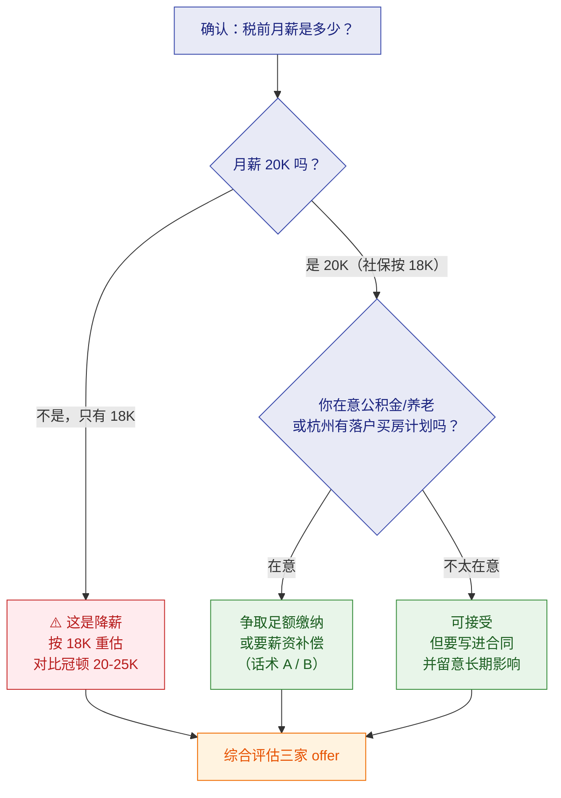

# 💰 薪资与社保基数谈判

> 返回 [[00-JD与匹配分析]] · 公司背景见 [[03-公司情报与决策建议]]

> [!danger] 先给结论
> **你要求的 20K 和"社保按 18K 缴"是两件不同的事，必须拆开谈。**
>
> 1. **20K 是否到手 20K？** —— 先确认谈的是**税前月薪**还是**总包**，以及**底薪/绩效/津贴**的比例
> 2. **社保按 18K 缴 = 少缴，法律上站不住** —— 《社会保险法》第 60 条要求"按时**足额**缴纳"，基数应与实际工资对应
> 3. **但对你个人而言：短期到手会多、长期权益会少** —— 这不是单向的坏事，**要算清账再决定要不要争**
> 4. 🚩 **风险在你这边**：这家公司**有"未足额缴纳社保公积金"的劳动仲裁先例**（[[03-公司情报与决策建议]] 第五节）

---

## 一、先搞清楚这句话到底是什么意思

"社保基数按 18K 发"是一句**很含糊的话**，至少有三种可能，**含义和法律含义完全不同**：

| # | 可能的真实含义 | 性质 | 你怎么问 |
|---|---|---|---|
| **A** | 工资就是 18K，但**按 20K 的口径谈** | ⚠️ **降薪** | "所以我的税前月薪是 18000，对吗？" |
| **B** | 工资 20K，但**社保/公积金按 18K 申报** | 🚩 **少缴社保**（违法，但行业常见） | "我的税前月薪是 20000，社保按 18000 申报，是这样吗？" |
| **C** | 20K 是**总包**，其中 2K 是绩效/津贴不计入基数 | ⚠️ **看结构** | "20K 里底薪、绩效、津贴各多少？" |

> [!important] 第一步：把 A / B / C 问清楚
> **不要在这种模糊表述上往下谈**。B 和 A 的差别是 **2000 元/月的税前工资**，
> 一年就是 **24000 元**——不能靠猜。
>
> **建议原话**：
> "我想确认一下——我的**税前月薪是 20000**，只是**社保和公积金的申报基数按 18000**，是这样理解吗？
> 另外想了解下 20K 的结构，底薪、绩效、津贴大概各占多少？"

---

## 二、社保按 18K 缴，合法吗？

> [!danger] 不合规。这不是"公司福利政策"，是法定义务的规避。

### 2.1 法律依据

| 依据 | 内容 |
|---|---|
| **《社会保险法》第 60 条** | 用人单位应当**自行申报、按时足额缴纳**社会保险费 |
| **《社会保险法》第 12 条 / 《劳动法》第 72 条** | 用人单位和劳动者**必须依法参加**社会保险，缴纳社会保险费 |
| **司法解释与判例** | **"足额"的核心即指缴费基数应与职工的实际工资收入相对应** |

> [!important] 关键判例（2026 年北京一中院）
> 某公司**与员工协商一致**，以低于实际工资的标准确定社保基数，
> 并把差额以**补贴形式**随工资发放，主张不应补缴。
>
> **法院判决：驳回公司全部诉讼请求。**
>
> 判决理由（原文要点）：
> - **"缴纳社会保险费是国家对用人单位课以的强制性公法义务，不属于用人单位与职工可自由处分私权的范畴。"**
> - **"'约定无需缴纳''约定无需按照法律规范确定的费基、费率缴纳'的协议、承诺均属无效。"**
> - 用人单位按时足额缴纳社保费是法定义务，**不能协商变更或免除**
>
> 来源：[光明网 · 法定之责无议价空间](https://legal.gmw.cn/2026-05/17/content_38769233.htm)、
> [人民法院报](https://www.rmfyb.com/mobile/202605/16/article_1024902_1391825825_6614686.html)、
> [辽宁阜新中院案例](https://fx.lncourt.gov.cn/article/detail/2026/05/id/9316472.shtml)
>
> 👉 **结论：即使你"同意"，这个约定也是无效的。**
> 公司仍可能被责令补缴 + 滞纳金，甚至行政处罚。

### 2.2 杭州/浙江的基数规则

| 项 | 数值（2025 年） |
|---|---|
| **缴费基数下限** | **4986 元/月** |
| **缴费基数上限** | **25299 元/月** |
| 浙江 2024 加权平均工资 | 101194 元/年（8433 元/月） |

> [!note] 18K 处在什么位置
> **18000 元在 4986 ~ 25299 区间内**——所以这**不是"按下限最低基数缴"**那种恶劣情况。
> 它是"**按低于实际工资的数额申报**"，属于**部分少缴**。
> 但性质上仍然是**未足额缴纳**。
>
> 来源：[浙江省人社厅 · 2025 年社会保险基数政策解读](https://rlsbt.zj.gov.cn/art/2025/9/18/art_1229101513_2569494.html)

---

## 三、给你算清账：到底损失多少

> [!important] 两组互相抵消的效应，必须一起看

**按 18K 申报（对比按实际 20K 申报）**：

| 项目 | 按 18K 申报 | 按 20K 实际 | 差额 |
|---|---|---|---|
| 单位月缴 | 5,328 元 | 5,920 元 | **单位省 592 元/月** |
| 个人月缴 | 2,790 元 | 3,100 元 | **个人少扣 310 元/月** |
| 合计月缴 | 8,118 元 | 9,020 元 | 902 元/月 |

> [!tip] ⚠️ 这就是为什么很多人"不介意"
> **个人每月到手会多约 310 元。**
> 有些人会觉得"反正钱到我手上了，挺好"——
> **但这是用长期权益换短期现金**，账要这么算：

### 3.1 你的真实损失

| 损失项 | 每月 | 每年 | 性质 |
|---|---|---|---|
| **公积金**（个人+单位各 5%，**全额归你**） | **-200 元** | **-2,400 元** | 🔴 **直接的现金收入损失** |
| **养老个人账户**（个人 8% 进账户） | -160 元 | -1,920 元 | 🟠 影响退休金 |
| **医保个人账户** | 少量 | 少量 | 🟠 影响门诊买药 |
| **失业金** | 少量 | 少量 | 🟡 失业时领取额度降低 |
| **生育/工伤待遇** | — | — | 🟡 按基数计发 |

> [!danger] 最容易被忽略的是公积金
> **公积金是个人和单位各缴一半、全额进入你个人账户的钱**，
> 相当于**变相工资**。按 18K 缴，你每月**实际少了 200 元现金等价收入**。
>
> 而且公积金**可以提取**（租房、买房、还贷）——所以这部分**不是"未来的钱"，是当下就能用的钱**。
>
> **所以真实的账是：**
> - 你到手现金：**+310 元/月**（社保个人部分少扣）
> - 你公积金账户：**-200 元/月**
> - 你养老账户：**-160 元/月**
> - **净结果：短期现金多了约 110 元/月，但两个账户合计少了 360 元/月**
>
> 👉 **换句话说：你每月多拿 ~110 元现金，代价是 360 元的长期权益被压缩。**

### 3.2 长期影响

| 影响 | 说明 |
|---|---|
| **养老金** | 个人账户 10 年本金差约 **1.9 万元**（未计利息）；且**统筹部分也按基数计算**，实际差距更大 |
| **公积金贷款额度** | 很多城市**贷款额度与账户余额/缴存基数挂钩** → 直接影响你买房能贷多少 |
| **医保报销** | 部分地区医保待遇与缴费基数相关 |
| **落户/购房/子女入学积分** | 部分城市**社保连续缴纳与基数**是硬指标 ⚠️ **杭州要特别核实** |
| **一次性待遇** | 工伤、生育津贴等按基数计发 |

> [!warning] 如果你在杭州有落户/买房/摇号计划
> **社保基数被压低可能影响资格审核。**
> 杭州部分政策与社保缴纳情况挂钩，**这个务必提前确认**——
> 它的影响可能远超那每月几百块。

---

## 四、⚠️ 更大的风险：这家公司有先例

> [!danger] 这不是假设，是有案底的
> **深南劳人仲案【2025】1123 号**：
> 员工诉得逸信息深圳分公司，诉求包括：
> - 追讨工资 **116,321.83 元**
> - 被迫解除劳动合同经济补偿 **69,000 元**
> - **补缴未足额缴纳的社保和公积金** ← 🚩 **和你现在遇到的是同一类问题**
>
> 公司一度"用其它方式无法送达"，走**公告送达**。
>
> 详见 [[03-公司情报与决策建议]] 第五节。

> [!important] 这说明什么
> 1. **"社保按低基数缴"在这家公司是系统性做法**，不是个别 HR 的口误
> 2. 已经**引发过劳动仲裁**，说明有员工不接受并诉诸法律
> 3. **你要评估的是：这家公司在其他方面是否也这样"灵活处理"**（发薪准时性、项目结束时的处理、绩效兑现）

**建议增加的确认项**：
- [ ] **发薪是否准时？每月几号发？有没有延迟过？**
- [ ] **社保公积金是按月足额缴纳、还是按季度/年终补？**
- [ ] **试用期是否缴纳社保？**（法律规定必须缴）
- [ ] **绩效/津贴部分是否计入社保基数？**

---

## 五、⭐ 怎么谈（策略与话术）

> [!important] 核心策略：**先确认结构，再判断是否值得争，用"总包"思维谈**

### 5.1 三种情形，三种应对

| 情形 | 你的应对 |
|---|---|
| **A. 税前月薪只有 18K** | ⚠️ **这是降薪**。明确说这是 18K 不是 20K，按 18K 重新评估是否接受 |
| **B. 税前 20K，社保按 18K 缴** | 用下面 5.2 的话术谈；**或接受但要求补偿** |
| **C. 20K 是总包（含绩效/津贴）** | 问清底薪多少——**底薪才是社保基数和安全感的基础** |

### 5.2 话术 A：希望按实际工资足额缴纳

> "感谢您的沟通。关于社保这块我想说明一下我的想法。
>
> **我理解公司这样做有成本上的考虑，我也不是想为难谁。**
> 但从我的角度，社保和公积金里有一部分是**直接进我个人账户、我随时能用的钱**——
> 特别是公积金，是我租房和以后买房要用的。
>
> **如果公司方便的话，我希望社保公积金能按 20000 的实际工资申报。**
> 如果确实有困难，我们也可以看看有没有别的方案，
> 比如**在薪资上做一点补偿**，我心里也有个平衡。
>
> 当然这只是一个想法，**我更在意的是咱们能不能长期合作**，所以想先听听您的意见。"

> [!tip] 这个话术的三个设计
> 1. **不说"你们违法"** —— 一旦扣帽子，HR 只能防御性回答，谈不下去
> 2. **落到"公积金是我能用的钱"** —— 具体的、正当的个人诉求，比讲法条更有说服力
> 3. **留了台阶和替代方案** —— 给公司选择空间，反而更容易拿到让步

### 5.3 话术 B：接受低基数，但要换补偿

> [!important] 如果公司坚持按 18K，**那就把它变成谈判筹码**

> "我理解公司的做法。那我能不能这样提——
> **社保按 18K 我接受，但我想在月薪上补一点平衡，比如 20500 或 21000。**
> 因为按 18K 缴，我公积金账户每月少了 200，养老账户少了 160，
> 这些是我实实在在少拿的。
>
> 我不是要为难公司，**只是希望整体待遇是合理的**。
> 您看这个方向有没有可能？"

**要价参考**：

| 方案 | 说明 |
|---|---|
| **争取月薪 +500~1000** | 覆盖你的账户损失（360 元/月）还有余 |
| **或争取一次性签约补贴** | 比如 3000-6000 元，补偿第一年的损失 |
| **或争取其他**（年假、试用期全薪、转正时间） | 非现金补偿也是补偿 |

### 5.4 话术 C：如果对方含糊其辞

> "我理解。那我想确认几个具体的点，方便我做决定：
> **① 我的税前月薪是多少？② 社保公积金按多少申报？③ 这个基数进公司后会调整吗？**"

> [!warning] ⚠️ 一定要让关键约定落到 offer 上
> **口头承诺不算数。** 劳动合同/offer 上要写明：
> - **税前月薪金额**
> - **薪资结构**（底薪/绩效/津贴）
> - **社保公积金缴纳基数**
> - **发放时间**
>
> 🚩 这家公司有欠薪仲裁先例，**"写进合同"对你尤其重要**。

---

## 六、决策建议

> [!important] 我的建议：**把这一条纳入整体比较，而不是单独纠结**
>
> **值得注意的三点：**
> 1. **社保按 18K 不是致命问题**——18000 在合法区间内，属于"部分少缴"，
>    比"按最低基数 4986 缴"好得多。**不要在这一点上把关系谈僵。**
> 2. **但它是一个信号**——结合那起仲裁案，它在提示你：
>    **这家公司在用工合规上偏"灵活"，你要在其他条款上更谨慎**（发薪、绩效、项目结束安排）。
> 3. **真正决定要不要去的是这些**：① 是否驻场 ② 20K 是否为底薪 ③ 项目稳定性
>    ④ 通勤 21.7 km ⑤ 能不能拿到"技术经理"的正式头衔
>    —— **社保基数只是其中一项，别让它喧宾夺主。**

### 优先级排序（钱的部分）

| 优先级 | 要争取什么 | 为什么 |
|---|---|---|
| 🥇 **第一** | **确认 20K 是税前月薪还是总包；底薪多少** | 这决定基本盘，比社保基数重要 10 倍 |
| 🥇 **第二** | **是否驻场、项目周期、项目结束怎么安排** | 决定这份工作稳不稳 |
| 🥈 **第三** | **社保公积金基数** | 影响长期权益，但金额可控 |
| 🥉 **第四** | 年假、试用期薪资、转正时间 | 边际收益 |

---

## 七、30 秒速查

| 问题 | 答案 |
|---|---|
| "社保按 18K"合法吗 | **不合规**。《社会保险法》第 60 条要求**按时足额**缴纳，基数应对应实际工资 |
| 就算我同意了有效吗 | **无效**。法院明确：社保是**强制性公法义务**，不能协商变更或免除 |
| 18K 是什么水平 | 浙江区间 **4986~25299**，18K 在区间内——是**部分少缴**，不是按下限缴 |
| 我每月损失多少 | **公积金 -200 元**（直接现金）+ 养老账户 -160 元 = **合计约 360 元/月** |
| 我到手会变多吗 | 会，**多约 310 元/月**（个人缴费少扣）——但账户少了 360 元 |
| 最大风险是什么 | 公司**有"未足额缴纳社保公积金"的仲裁先例** |
| 要不要争 | **看情况**。金额不大，**别谈僵**；但它是个合规信号，要在其他条款上更谨慎 |
| 最该先问什么 | **20K 是税前月薪还是总包？底薪多少？** —— 这个比社保基数重要得多 |
| 一定要做什么 | **把薪资结构、社保基数、发放时间写进 offer/合同**（口头不算） |

---

## 🔗 关联

- [[00-JD与匹配分析]] · [[03-公司情报与决策建议]]（仲裁先例与薪资现实）
- [[README]]（总览与必问清单）

#面试 #得逸信息 #薪资 #社保 #谈薪 #公积金
