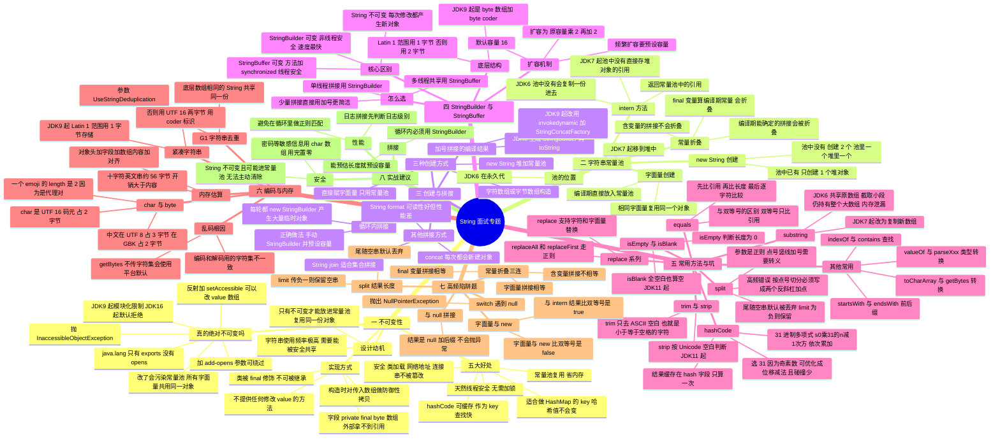

# 🧵 String 专题 · 详解版

> 返回 [[00-总览与使用说明]] · 配套：[[01-Java基础与集合]]

> [!tip] 怎么用这份笔记
> - **脑图**：每个节点就是一句能直接说出口的答案，预览模式原生渲染
> - **详解**：脑图分支的完整展开，带代码和推导
> - **速答版**：拉到底部第四节，面试前 5 分钟只看那一节
> - 要**可编辑**的详细脑图 → 重新导入 [[12-String思维导图-大纲版]]（已填成完整答案）

---

## 一、详细脑图



---

## 二、详细讲解

### 1. 不可变性

**一句话定义**：String 对象一旦创建，它表示的字符序列就永远不会变。所有"修改"方法（`toUpperCase`、`substring`、`concat`）都是**返回新对象**，原对象不动。

**怎么做到的（4 个措施，缺一不可）**

| 措施 | 作用 |
|---|---|
| `public final class String` | 不能被继承 → 子类无法重写方法搞破坏 |
| `private final byte[] value`（JDK9+；JDK8 是 `char[]`） | 字段私有 → 外部拿不到数组引用 |
| 不提供任何修改 `value` 的方法 | 没有 `setCharAt` 之类的口子 |
| 构造时 `Arrays.copyOf` 做**防御性拷贝** | 传入的数组后续被改，也不影响这个 String |

**为什么这么设计（动机）**

字符串是使用频率最高的类型。如果它可变，就无法安全地在多处共享同一份数据——常量池、HashMap 的 key、多线程共享全都会出问题。**不可变是"可安全共享"的前提。**

**五大好处（面试答 4 点就够）**

1. **常量池复用**：相同字面量只存一份，省内存
2. **线程安全**：状态不可变 → 天然并发安全，不需要任何同步
3. **hashCode 可缓存**：算一次存进 `hash` 字段，之后直接用 → HashMap 查找快
4. **适合做 HashMap 的 key**：哈希值永远稳定，不会"放进去找不回来"
5. **安全性**：类加载的类名、网络地址、数据库连接串不会被中途篡改

#### 真的绝对不可变吗？—— 从"随便改"到"模块化封杀"

**结论先说**：JDK8 可以随便改；JDK9 起被模块系统限制；**JDK16 起默认直接抛异常**；加 `--add-opens` 仍能绕过，但**改了会污染常量池**。

**① JDK8：没有模块系统，反射畅通无阻**

```java
String s = "abc";
Field f = String.class.getDeclaredField("value");   // JDK8 里是 char[]
f.setAccessible(true);
char[] v = (char[]) f.get(s);
v[0] = 'x';                                          // s 变成 "xbc"
```

`setAccessible(true)` 直接成功，连警告都没有。

**② JDK9：JPMS 来了，但先"放水"**

JEP 261 引入模块系统。`java.base` 模块里对 `java.lang` 的定义是：

- **`exports java.lang`** —— 公开 API，正常调用完全没问题
- **没有 `opens java.lang`** —— 不允许**深度反射**访问非 public 成员

于是 `setAccessible(true)` 变成"非法反射访问"。但 JDK9~15 默认 `--illegal-access=permit`，**只打印警告仍然放行**：

```
WARNING: An illegal reflective access operation has occurred
WARNING: Illegal reflective access by Hack3 to field java.lang.String.value
```

**③ 时间线（面试可以直接说这条线）**

| 版本 | 默认行为 |
|---|---|
| JDK 8 | 完全允许 |
| JDK 9 ~ 15 | 允许，但打印 illegal reflective access 警告 |
| **JDK 16** | **默认 deny**（JEP 396：Strongly Encapsulate JDK Internals by Default） |
| **JDK 17** | 彻底移除 `--illegal-access` 开关（JEP 403），只能靠 `--add-opens` |

**④ 实测（本机 JDK 17.0.11）**

```java
String s = "abc";
Field f = String.class.getDeclaredField("value");
f.setAccessible(true);      // ← 这一行抛异常
```

```
value 字段类型   = byte[]
>>> setAccessible 失败: java.lang.reflect.InaccessibleObjectException
>>> Unable to make field private final byte[] java.lang.String.value accessible:
    module java.base does not "opens java.lang" to unnamed module @221af3c0
```

注意两个细节：
- **`getDeclaredField` 是成功的**，抛异常的是 `setAccessible`
- 异常信息把原因说得很直白：`module java.base does not "opens java.lang"`

**⑤ 怎么绕过：`--add-opens`**

```bash
java --add-opens java.base/java.lang=ALL-UNNAMED YourApp
```

- `ALL-UNNAMED` 指 classpath 上的代码（未命名模块）
- 如果你的代码是命名模块：`--add-opens java.base/java.lang=your.module.name`

加了之后确实能改（实测）：

```
>>> setAccessible 成功
s        = Xbc
literal  = Xbc
```

**⑥ 但"能改"≠"该改"—— 常量池会被全局污染**

实测（`--add-opens` 下）：

```
改之前: s.equals(independent) = true
改之后: s = Xbc , independent = abc
改之后: s.equals(independent) = false
改之后: ("ab" + "c").intern() = Xbc        ← 常量池里的 "abc" 已变成 "Xbc"
```

字面量 `"abc"` 在**整个程序里共用同一个对象**。改了它，所有用到 `"abc"` 的地方（包括已经缓存的 hashCode、HashMap 里以它为 key 的条目）全部被污染。**这正是"不可变"存在的意义**，也是为什么 JDK 要封杀这条路。

**⑦ 升级 JDK8 → JDK17 的连带坑**

不只是模块限制，**字段类型也变了**，老反射代码会直接 `ClassCastException`：

| | JDK8 | JDK9+ |
|---|---|---|
| 字段 | `char[] value` | `byte[] value` + `byte coder` |

**⑧ 另一条路：`sun.misc.Unsafe`**

同样受限，而且已被官方标记为**逐步弃用移除**（JEP 471，JDK 23 起弃用其内存访问方法）。别在项目里用。

**⑨ 面试话术（背这段就够）**

> "String 严格来说可以用反射改，JDK8 直接 `setAccessible` 就行。JDK9 引入模块系统后，`java.lang` 只有 exports 没有 opens，深度反射受限——JDK9 到 15 还只是打警告，**JDK16 起默认拒绝，抛 `InaccessibleObjectException`**，要加 `--add-opens java.base/java.lang=ALL-UNNAMED` 才能绕过。但这只是理论上的口子，真改了会**污染常量池**，因为所有字面量共用同一个对象。所以实践上 String 就是不可变的。"

**⑩ 顺带：JDK17 升级常见的 `--add-opens` 清单**

面试时提一句"升级 JDK17 时处理过这些"，可信度立刻不一样：

| 场景 | 参数 |
|---|---|
| 反射改 String / Lombok 等 | `--add-opens java.base/java.lang=ALL-UNNAMED` |
| 反射改集合内部数组 | `--add-opens java.base/java.util=ALL-UNNAMED` |
| 直接内存 / NIO（Netty 等） | `--add-opens java.base/java.nio=ALL-UNNAMED` |
| 反射改并发类 | `--add-opens java.base/java.util.concurrent=ALL-UNNAMED` |
| 反射改反射本身（Spring / CGLIB） | `--add-opens java.base/java.lang.reflect=ALL-UNNAMED` |
| 反射改文本处理 | `--add-opens java.base/java.text=ALL-UNNAMED` |
| 反射改加密类 | `--add-opens java.base/javax.crypto=ALL-UNNAMED` |

---

### 2. 字符串常量池

**池子在哪**

| 版本     | 位置                       |
| ------ | ------------------------ |
| JDK6   | 永久代（PermGen），大小受限，容易 OOM |
| JDK7 起 | **堆**（所以 intern 的行为跟着变了） |

**创建对象个数（必考）**

```java
String s1 = "abc";              // 池中有 → 0 个新对象；没有 → 1 个（放进池）
String s2 = new String("abc");  // 池中没有 → 2 个（池 1 + 堆 1）；已有 → 1 个（堆）
```

> 记忆口诀：**字面量只看池里有没有；new 一定要在堆里造一个。**

**intern 的语义变迁**

- **JDK6**：池中没有 → **复制一份**进永久代，返回副本引用
- **JDK7+**：池中没有 → 直接把**堆里那个对象的引用**记录到池里，返回它（不再复制）

```java
String s = new String("abc");   // 堆对象
String t = s.intern();          // 返回池中的 "abc"
System.out.println(s == t);     // false（池里本来就有字面量 "abc"）
```

**常量折叠（编译期优化）**

```java
String b = "hello";

String a = "hel" + "lo";     // 编译期折叠 → 直接指向池中 "hello"
a == b                        // true

String c = "hel";
String d = c + "lo";         // 含变量 → 运行期拼接
d == b                        // false

final String e = "hel";      // final 且初始值是常量 → 编译期常量
String f = e + "lo";         // 也会折叠
f == b                        // true
```

---

### 3. 创建方式与拼接

| 写法 | 对象产生 | 位置 |
|---|---|---|
| `String s = "abc"` | 0 或 1 个 | 只在常量池 |
| `new String("abc")` | 1 或 2 个 | 堆 + 常量池 |
| `new String(char[])` / `new String(byte[], Charset)` | 1 个 | 堆（内部拷贝数组） |

**加号拼接的编译结果（版本差异是加分点）**

| JDK | `a + b + c` 编译成什么 |
|---|---|
| JDK8 及以前 | `new StringBuilder().append(a).append(b).append(c).toString()` |
| **JDK9 起** | `invokedynamic` + `StringConcatFactory`（JEP 280），运行时决定最优策略，通常更快 |

**循环内拼接为什么是灾难**

```java
// 差：每轮循环都 new 一个 StringBuilder，产生 1000 个临时对象
String r = "";
for (int i = 0; i < 1000; i++) r += i;

// 好：复用同一个，并预设容量避免扩容
StringBuilder sb = new StringBuilder(4000);
for (int i = 0; i < 1000; i++) sb.append(i);
String r2 = sb.toString();
```

**其他拼接方式**

| 方式 | 说明 |
|---|---|
| `+` | 少量拼接最简洁，编译器会优化 |
| `concat` | 每次都新建对象，性能一般 |
| `StringBuilder` | 循环 / 大量拼接首选 |
| `String.join` | 适合集合、数组按分隔符拼接 |
| `String.format` | 可读性好，但**性能差**，别放循环里 |

---

### 4. StringBuilder 与 StringBuffer

| | String | StringBuilder | StringBuffer |
|---|---|---|---|
| 可变性 | 不可变 | 可变 | 可变 |
| 线程安全 | 安全（因为不可变） | **不安全** | 安全（方法加 `synchronized`） |
| 性能 | 每次修改都新建对象 | **最快** | 略慢 |
| 适用 | 少量、共享 | 单线程拼接 | 多线程共享拼接 |

**底层结构（JDK9+）**

`byte[] value` + `byte coder`。`coder = 0` 表示 Latin-1（每字符 1 字节），`coder = 1` 表示 UTF-16（每字符 2 字节）。这是 JDK9 的**紧凑字符串**优化，纯 ASCII 内容内存直接减半。

**扩容机制**

- 默认容量 **16**
- 扩容公式：**新容量 = 原容量 × 2 + 2**
- 扩容要 `Arrays.copyOf` 复制整个数组 → 频繁扩容很伤性能

> **能预估长度就预设容量** —— 这是最容易被面试官认可的实战细节。

---

### 5. 常用方法与坑

#### equals 与双等号

`String.equals` 的判断顺序：① 引用相同 → true ② 类型不是 String → false ③ 长度不同 → false ④ 逐字节比较。

- **双等号**：比引用地址（基本类型比值）
- **equals**：比内容

#### hashCode

**公式**：`s[0]*31^(n-1) + s[1]*31^(n-2) + ... + s[n-1]`，循环写法是 `hash = 31 * hash + value[i]`

**为什么用 31（三个理由）**
1. 31 是**奇素数**，降低哈希冲突概率
2. `31 * i` 可优化成 `(i << 5) - i`，**位移比乘法快**
3. 质数里不太大也不太小，兼顾分布与溢出

**关键点**：结果**缓存在 `hash` 字段**，只算一次 —— 这正是 String 适合做 HashMap key 的原因。

#### substring 的坑（经典内存泄漏题）

| 版本 | 实现 | 后果 |
|---|---|---|
| JDK6 | `new String(offset, count, value)` **共享原 char[]** | 从 1MB 字符串里取 3 个字符，仍持有整个 1MB 数组 → **内存泄漏** |
| JDK7+ | `Arrays.copyOfRange(...)` **复制新数组** | 无此问题 |

> 话术：「JDK6 的 substring 共享底层数组，长字符串截取小段会让大数组无法回收，是典型的内存泄漏；JDK7 之后改成复制就修掉了。」

#### split 的坑

```java
"a,b,,".split(",").length       // 2   尾随空串被丢弃
"a,b,,".split(",", -1).length   // 4   limit 为负 → 保留空串
"a.b.c".split(".").length       // 0   点号是正则元字符！必须写 "\\."
```

- 参数是**正则表达式**，不是普通字符串
- 常见需转义的元字符：`.` `|` `+` `*` `?` `(` `)` `[` `]` `{` `}` `^` `$` `\`
- `limit`：正数限制份数；0 丢弃尾随空串（默认）；**负数保留全部**

#### replace 系列

| 方法 | 是否正则 |
|---|---|
| `replace(CharSequence, CharSequence)` | 否，字面量 |
| `replace(char, char)` | 否 |
| `replaceAll(regex, replacement)` | **是正则** |
| `replaceFirst(regex, replacement)` | **是正则**，只替换第一个 |

#### trim 与 strip

- `trim()`：只去 **ASCII 空白**（码点 ≤ U+0020）
- `strip()`（JDK11+）：按 **Unicode 空白**判断，能处理全角空格

#### isEmpty 与 isBlank

- `isEmpty()`：`length() == 0`
- `isBlank()`（JDK11+）：长度为 0 **或全是空白字符**

#### 其他常用方法速查

| 方法 | 用途 |
|---|---|
| `indexOf` / `lastIndexOf` | 查找位置，找不到返回 -1 |
| `contains` | 底层就是 `indexOf(...) >= 0` |
| `startsWith` / `endsWith` | 前后缀判断 |
| `toCharArray` | 转 char 数组 |
| `getBytes(Charset)` | 转字节数组，**一定要指定字符集** |
| `valueOf(...)` | 任意类型转 String |
| `parseInt` / `parseDouble` | String 转基本类型 |
| `matches` | 整串正则匹配 |
| `join` | 按分隔符拼接 |
| `repeat`（JDK11+） | 重复 n 次 |
| `intern` | 放入 / 取自常量池 |

---

### 6. 编码与内存

**char 与 byte 的关系**

- `char` 是 **UTF-16 码元（code unit）**，占 2 字节
- 一个**码点（code point）**可能对应 1 个或 2 个 char（代理对）
- 所以 `String.length()` 返回**码元数，不是字符数**

```java
"😀".length()              // 2  ！一个 emoji 是代理对
"😀".codePointCount(0, 2)  // 1  才是真正的字符数
```

**中文占几个字节**

| 编码 | 一个中文 |
|---|---|
| UTF-8 | **3 字节** |
| GBK | **2 字节** |
| UTF-16 | 2 字节（BMP 范围内） |
| UTF-32 | 4 字节 |

**乱码的根本原因**

1. **编码与解码用的字符集不一致**（最常见）—— 用 UTF-8 写、用 GBK 读
2. `getBytes()` 不指定字符集 → 使用**平台默认字符集**，换台机器就乱
3. 按字节截断了一个多字节字符

> 结论：**任何 `getBytes` / `new String(bytes)` 都必须显式指定 `StandardCharsets.UTF_8`。**

**JDK9 紧凑字符串（Compact Strings）**

- 内部从 `char[]` 改为 `byte[]` + `coder`
- 内容全是 Latin-1（纯英文数字）→ 每字符 **1 字节**，内存减半
- 含中文等 → 仍用 UTF-16，每字符 2 字节，`coder = 1`

**G1 字符串去重**

- 参数：`-XX:+UseStringDeduplication`（配合 G1）
- 把内容相同但**不同对象**的 String 底层数组指向同一份
- 注意：只去重底层数组，**不合并 String 对象本身**

**内存占用估算**

一个 10 字符纯英文 String（开启压缩指针）：

| 部分 | 大小 |
|---|---|
| String 对象头 | 12 字节 |
| `byte[] value` 引用 | 4 字节 |
| `int hash` | 4 字节 |
| `byte coder` + 对齐 | ~4 字节 |
| `byte[]` 数组头 | 16 字节 |
| 数组内容（10 × 1 字节） | 10 字节 |
| **合计** | **约 56 字节** |

> 结论：String 的**额外开销远大于内容本身**。存海量短字符串时要考虑去重或换结构。这个量级感说出来很加分。

---

## 三、高频陷阱题（含解析）

### 题 1：字面量 vs new vs intern
```java
String s1 = "abc";
String s2 = new String("abc");
String s3 = s2.intern();

System.out.println(s1 == s2);        // false  堆对象 vs 常量池对象
System.out.println(s1 == s3);        // true   intern 返回池中引用
System.out.println(s1.equals(s2));   // true   内容相同
```

### 题 2：常量折叠三连（最常考）
```java
String b = "hello";

String a = "hel" + "lo";     // 编译期折叠
System.out.println(a == b);  // true

String c = "hel";
String d = c + "lo";         // 含变量 → 运行期拼接
System.out.println(d == b);  // false

final String e = "hel";
String f = e + "lo";         // final 常量 → 折叠
System.out.println(f == b);  // true
```

### 题 3：与 null 拼接
```java
String s = null;
System.out.println(s + "a");   // "nulla"  不会抛 NPE
```

### 题 4：split 的长度
```java
"a,b,,".split(",").length       // 2
"a,b,,".split(",", -1).length   // 4
"a.b.c".split(".").length       // 0   （点号必须转义）
```

### 题 5：switch 遇到 null
```java
String s = null;
switch (s) { }   // NullPointerException（switch 前会调用 hashCode）
```

### 题 6：length 不是字符数
```java
System.out.println("😀".length());   // 2   代理对占两个 char
System.out.println("中文".length());  // 2   中文在 UTF-16 里各占 1 个 char
System.out.println("中文".getBytes(StandardCharsets.UTF_8).length);  // 6
```

### 题 7：循环拼接的反例
```java
// 差：每轮 new StringBuilder
String r = "";
for (int i = 0; i < 1000; i++) r += i;

// 好：复用 + 预设容量
StringBuilder sb = new StringBuilder(4000);
for (int i = 0; i < 1000; i++) sb.append(i);
String r2 = sb.toString();
```

---

## 四、面试前 5 分钟速答版

> 只看这一节就能应付大部分 String 问题。

1. **为什么不可变** → `final` 类 + `private final byte[]` + 无修改方法 + 防御性拷贝；好处是常量池复用、线程安全、hashCode 可缓存、Map key 稳定、安全。
2. **创建几个对象** → 字面量看池里有没有（0 或 1）；`new` 一定在堆造一个（池没有则 2，有则 1）。
3. **常量池在哪** → JDK6 永久代，JDK7+ 堆。
4. **intern** → 返回池中引用；JDK7+ 不再复制，直接存堆对象引用。
5. **拼接** → 编译期常量会折叠；含变量 JDK8 用 StringBuilder、JDK9+ 用 invokedynamic；**循环内必须手动 StringBuilder**。
6. **StringBuilder vs StringBuffer** → 前者快但不安全，后者加 synchronized 安全；默认容量 16，扩容 ×2+2，**能预估就预设容量**。
7. **hashCode 为什么用 31** → 奇素数、可优化为位移减法、碰撞少；**结果缓存在 hash 字段**。
8. **substring 的坑** → JDK6 共享数组导致内存泄漏，JDK7+ 改成复制。
9. **split 的坑** → 参数是正则，点号要写 `\\.`；尾随空串默认丢弃，limit 为负保留。
10. **编码** → `char` 是 UTF-16 码元；中文 UTF-8 占 3 字节、GBK 占 2 字节；**乱码 = 编解码字符集不一致**；JDK9 紧凑字符串纯英文省一半内存。
11. **内存** → 一个 10 字符英文 String 约 56 字节，**开销大于内容**。
12. **密码为什么用 char[]** → 可置零；String 不可变且可能进常量池，无法清除。
13. **真的不可变吗** → 反射能改，但 JDK9 起模块限制、**JDK16 起默认抛 `InaccessibleObjectException`**，要加 `--add-opens java.base/java.lang=ALL-UNNAMED` 才能绕过；而且改了会**污染常量池**（字面量全局共用同一对象）。

**一句话总结**：不可变是根 → 常量池是果 → StringBuilder 是解药 → 字符集是坑。

---

## 📥 待补充

- 

## 🔗 关联

- [[00-总览与使用说明]] · [[01-Java基础与集合]] · [[12-String思维导图-大纲版]]

#面试 #Java #String #思维导图 #待补
