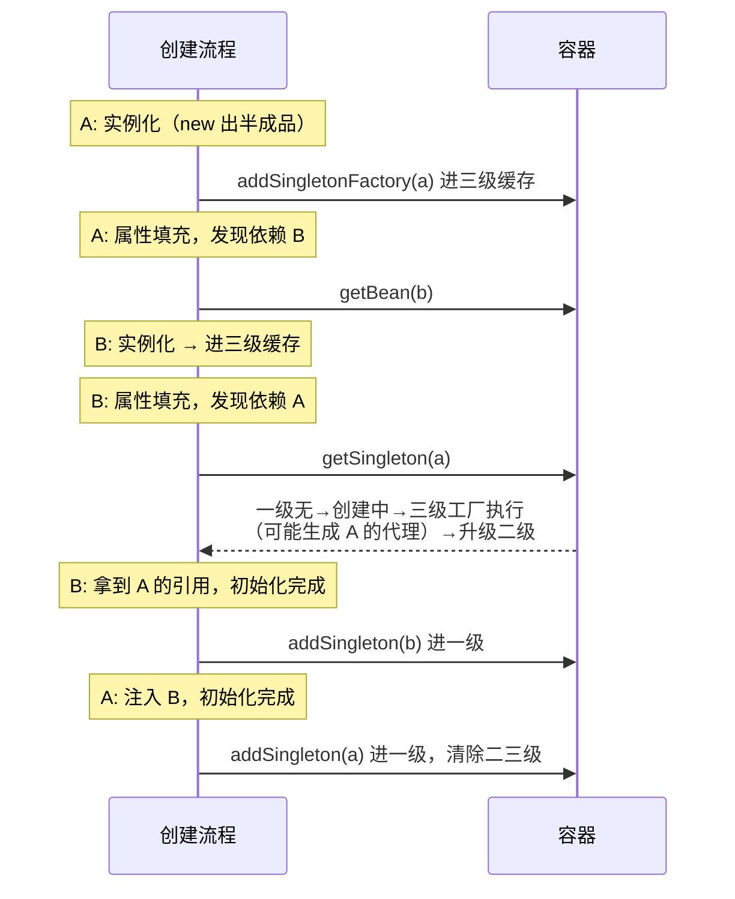

# 🔄 14 · Spring 循环依赖专题

> 返回 [[00-总览与使用说明]] · 姊妹篇 [[13-Spring源码专题]]

> [!abstract] 为什么单独开一篇
> 循环依赖是 Spring 源码**最高频**的考点，也是分层最明显的一题：
> 背八股的答"三级缓存"；读过源码的答"**提前暴露 + 按需代理**"；
> 读透的答"**两级其实也能解决，三级是为了 AOP 的一致性，Boot 2.6 起干脆默认禁止**"。
> 这篇按第三档准备。

---

## 一、问题定义（30 秒开场）

```java
@Service
class OrderService {
    @Autowired private StockService stockService;   // A 依赖 B
}
@Service
class StockService {
    @Autowired private OrderService orderService;   // B 依赖 A
}
```

**三种形态**（先分类，后面"能不能解决"全靠这个分类）：

| 形态 | 能否被 Spring 自动解决 |
|---|---|
| **字段/Setter 注入** | ✅ singleton 可以 |
| **构造器注入** | ❌ `BeanCurrentlyInCreationException` |
| **prototype 作用域** | ❌ |

---

## 二、为什么需要"特殊机制"——根源在生命周期顺序

```
Bean 创建：实例化（new，属性是默认值）→ 属性填充（注入依赖）→ 初始化（@PostConstruct/AOP 代理）
```

- 注入发生在**属性填充**阶段，也就是**实例化之后**
- 所以：**对象刚 new 完、还没初始化完时，这个"半成品"引用已经存在**
- 循环依赖的解法本质：**把半成品引用提前暴露给对方**，等双方都完成后各自补全

> 一句话：**Spring 的循环依赖 = "提前暴露半成品" + "创建完成后自愈"。**

---

## 三、三级缓存（源码级）

> 关键类：`DefaultSingletonBeanRegistry`

```java
/** 一级：成品（初始化完成） */
private final Map<String, Object> singletonObjects;
/** 二级：提前暴露的半成品（可能是代理），保证单例只暴露一次 */
private final Map<String, Object> earlySingletonObjects;
/** 三级：ObjectFactory —— 只有真的发生循环依赖时才调用 */
private final Map<String, ObjectFactory<?>> singletonFactories;
```

**查找逻辑**（Spring 5.x；6.x 优化了锁粒度，思路一致）：
```java
protected Object getSingleton(String beanName, boolean allowEarlyReference) {
    Object o = singletonObjects.get(beanName);                     // ① 一级
    if (o == null && isSingletonCurrentlyInCreation(beanName)) {   // ② 正在创建中（循环依赖信号）
        o = earlySingletonObjects.get(beanName);                   // ③ 二级
        if (o == null && allowEarlyReference) {
            synchronized (this.singletonObjects) {                 // ④ 并发互斥
                o = singletonObjects.get(beanName);
                if (o == null) o = earlySingletonObjects.get(beanName);
                if (o == null) {
                    ObjectFactory<?> f = singletonFactories.get(beanName);  // ⑤ 三级
                    if (f != null) {
                        o = f.getObject();          // ★ 这里可能生成 AOP 代理
                        earlySingletonObjects.put(beanName, o);     // 升级二级
                        singletonFactories.remove(beanName);        // 删三级
                    }
                }
            }
        }
    }
    return o;
}
```

**三个必须注意的细节**：
1. **② `isSingletonCurrentlyInCreation` 是触发条件**——没在创建中的 bean 走不到二三级
2. **⑤ 调用工厂后立即"升级二级、删除三级"**——保证单例的提前引用**只会生成一次**（第二次直接走二级）
3. **④ synchronized**：并发 getSingleton 时的互斥（多线程同时触发循环依赖解析）

---

## 四、完整时序推演（★能手画这图 = 真懂）



**自愈过程**：B 先拿着 A 的半成品引用完成了；之后 A 初始化完成后进入一级缓存——**B 里的那个引用和一级缓存里是同一个对象**（引用相同，状态会随 A 的初始化补全），所以最终是自洽的。

---

## 五、★核心问题：为什么是三级，两级不行吗？

**先说结论**：不考虑 AOP，**两级完全够用**。三级的唯一目的是**让 AOP 代理"按需"生成，并保证一致性**。

### 两级方案的两种实现，各有问题

**实现一：实例化后立刻生成代理，放进二级**
- ❌ 违背 Spring 的设计原则：代理应**在初始化完成后**生成（`postProcessAfterInitialization`）
- ❌ 所有 Bean 都要提前代理，哪怕 99% 没有循环依赖
- ❌ 代理过早生成，可能拦截不到初始化阶段的增强

**实现二：二级缓存放原始对象，最后统一替换成代理**
- ❌ B 里注入的是**原始对象**，容器最终暴露的是**代理**——两者不一致
- ❌ 通过原始对象调用会**绕过切面**（事务、日志全部失效），且极难排查

### 三级方案
```
三级缓存放的是 ObjectFactory → 只有真的发生循环依赖、被 getEarlyBeanReference 时
才生成代理 → 按需 + 生成出来的就是"最终会暴露的那个代理" → 一致性成立
```

> [!important] 标准答法
> "两级缓存解决**引用互通**没问题，但解决不了**代理一致性**：
> AOP 的代理本来应该在初始化后生成，三级缓存把这一步做成**按需延迟**——
> 只有真发生循环依赖时才通过 `getEarlyBeanReference` 提前生成，
> 而且生成出来就是最终暴露的那个代理。**既守住了设计原则，又解决了循环依赖。**"

---

## 六、边界与特例（"能不能"全家桶）

| 场景 | 能否自动解决 | 原因 |
|---|---|---|
| singleton + 字段/setter 注入 | ✅ | 三级缓存机制 |
| **构造器注入循环** | ❌ | **还没 new 完就要找依赖**——连"半成品"都不存在，无法暴露 → `BeanCurrentlyInCreationException` |
| **prototype 循环** | ❌ | prototype 不缓存，每次都是新对象 → 无限递归 |
| `@Async` 混入循环 | ❌ 报错 | 见第七节 |
| `@Lazy` 注入点 | ✅ 打破环 | 注入的是**代理**，首次调用才真正 `getBean` → 环在"用时"才解开 |
| `ObjectProvider` / `ApplicationContextAware` 手动取 | ✅ | 延迟获取，同 @Lazy 思路 |

### ★ Spring Boot 2.6+ 的重大变化（**版本跟踪力，必讲**）

```
Spring Boot 2.6 起：spring.main.allow-circular-references 默认 false
→ 默认禁止循环依赖，启动直接报错；需要时要显式开启
```

**为什么官方要禁止**：
- 循环依赖本质是**设计坏味道**（职责耦合）
- 提前暴露的半成品有隐患（见第七节）
- 强迫团队**在启动期暴露设计问题**，而不是运行期踩坑

> 话术："Boot 2.6 之前循环依赖是'默认帮你解决'，2.6 之后**默认禁止、显式放行**——
> 我认为这是正确的演进：三级缓存是**兜底能力**，不是**设计许可**。"

---

## 七、@Async + 循环依赖为什么报错（进阶，区分度最高）

**机制**：
1. 循环依赖发生时，提前引用通过 `SmartInstantiationAwareBeanPostProcessor#getEarlyBeanReference` 获取
2. **普通 AOP**（`AbstractAutoProxyCreator`）实现了这个接口 → 提前就能给出**代理** → 提前暴露 == 最终暴露 → 通过 ✅
3. **`@Async`** 的代理由 `AsyncAnnotationBeanPostProcessor` 在**初始化后**才创建，它不参与提前暴露 → 提前暴露的是**原始对象**
4. `doCreateBean` 末尾有一致性检查：`earlySingletonReference != null && exposedObject != bean && 存在依赖它的 bean` → **抛 `BeanCurrentlyInCreationException`**
5. （有个 `allowRawInjectionDespiteWrapping` 开关可以放行，但会注入原始对象、@Async 失效——**别在生产用**）

**解法**：`@Lazy` 注入、拆 bean、把异步逻辑挪出被循环依赖的类。

---

## 八、提前暴露"半成品"的风险（负责人视角）

半成品 = **已分配内存、但 `@PostConstruct`/AOP/属性还没就绪**：

- B 在**初始化阶段**调用 A 的方法 → A 的 `@PostConstruct` 还没跑，A 的内部状态可能不完整
- 如果提前暴露时生成了代理，切面逻辑是有的；但**业务初始化逻辑没有**
- 所以官方从 2.6 起默认禁止——**能用，但它是妥协不是特性**

---

## 九、生产治理（负责人加分项）

```mermaid
flowchart LR
    A[启动报循环依赖] --> B{能不能立刻重构?}
    B -->|能| C[拆 Bean / 抽公共逻辑 / 事件解耦]
    B -->|不能| D[@Lazy 或 ObjectProvider 过渡]
    D --> E[记入技术债 + 排期治理]
```

- **定位方法**：看启动异常栈，从下往上找 `isSingletonCurrentlyInCreation` 的 bean 链，就是环的路径
- **治理规则**：架构评审**禁止新增循环依赖**；存量用 `@Lazy` 标记 + 技术债清单
- **解耦手段排序**：拆 bean > 事件驱动（`ApplicationEvent`）> 引入中间服务 > `@Lazy`（最后手段）
- 为什么拆 bean 最好：环 = **两个类互相知道对方**，拆开就是职责重划

---

## 十、真题 Q&A（完整答案版）

**Q1：Spring 怎么解决循环依赖的？**
> 分层答：① 生命周期顺序是根源（注入发生在实例化后，半成品已存在）→ ② 机制是三级缓存提前暴露（一级成品/二级半成品/三级工厂）→ ③ 对 singleton 字段注入生效 → ④ 关键是 `getEarlyBeanReference` 让 AOP 代理能**按需提前生成**。

**Q2：为什么三级缓存，两级不行？**
> 不考虑 AOP 两级够；三级是为了**代理一致性**：工厂只在真发生循环依赖时生成代理，且生成即最终暴露的那个。两级方案要么全员提前代理（违背设计），要么注入原始对象绕过切面（不一致）。

**Q3：构造器注入为什么解决不了？**
> 提前暴露的前提是"对象已 new 出来"。构造器循环依赖在实例化阶段就互相要对方——**半成品都不存在**，直接抛 `BeanCurrentlyInCreationException`。

**Q4：prototype 为什么不行？**
> 机制依赖"缓存半成品等自愈"，prototype 每次都新建、不缓存 → 只会无限递归。（Spring 对 prototype 循环依赖会提前检测并抛异常。）

**Q5：@Async 的 bean 参与循环依赖，为什么报错？**
> `@Async` 的代理在初始化后才由 `AsyncAnnotationBeanPostProcessor` 创建，不参与 `getEarlyBeanReference` 提前暴露 → 提前暴露的是 raw，最终是 proxy → doCreateBean 末尾一致性检查抛异常。普通 AOP 参与提前暴露所以没事。解法 @Lazy/拆 bean。

**Q6：Spring Boot 2.6 有什么变化？**
> `allow-circular-references` 默认 false，**默认禁止**。官方立场：循环依赖是设计问题，框架兜底是最后的宽容，不该成为常态。

**Q7：B 拿到的 A 是半成品，会有什么问题？**
> A 的属性注入、@PostConstruct、AOP（若未提前代理）都未完成。引用最终会"自愈"（同一对象），但**B 若在初始化期间就回调 A 的业务方法，可能踩到未就绪状态**——这是隐性风险，也是官方禁止的原因之一。

**Q8：三级缓存的查找顺序和升降级？**
> 一级 → 判断创建中 → 二级 → 加锁再三级的工厂 → **执行工厂、结果升二级、删三级**。升级保证提前引用只生成一次，删除三级防止重复创建。

**Q9：A→B→C→A 三个对象成环呢？**
> 同样机制：沿环依次实例化+暴露，最后回到 A 时从二级缓存拿到提前引用，逐级自愈。环长不影响机制，只影响排查难度。

**Q10：团队里怎么治理循环依赖？**
> ① 2.6+ 默认禁止，升级即暴露存量 ② 评审禁止新增 ③ 解法优先级：拆 bean > 事件解耦 > @Lazy 过渡+技术债 ④ 把"互相依赖"看作职责划分问题的信号。

---

## 十一、手画清单 + 话术

**手画三样（画得出来就是真懂）**：
- [ ] 三个 Map + `getSingleton` 查找顺序
- [ ] A→B 的完整时序（含升级二级）
- [ ] 两级方案失败的两种情况

**一分钟话术**：
> "循环依赖的解法本质是**提前暴露半成品 + 后续自愈**。
> 机制上是一级成品、二级半成品、三级工厂：只有真发生循环依赖时才执行工厂，
> 通过 `getEarlyBeanReference` 把 AOP 代理按需提前生成，同时升级二级删三级保证只暴露一次。
> 为什么三级不是两级——两级要么全员提前代理违背设计，要么注入 raw 对象绕过切面；
> 三级用工厂**按需 + 一致性**。
> 边界上：构造器和 prototype 解决不了，@Async 会因为代理时机不一致报错；
> 而且 Boot 2.6 起默认禁止——我认为方向是对的，**三级缓存是兜底能力，不是设计许可**，
> 团队里我会禁止新增循环依赖，用拆 bean 和事件解耦治本。"

## 📥 待补充
- 

## 🔗 关联
[[13-Spring源码专题]] · [[05-Spring与框架]] · [[面试准备/专业技能/02-Java核心与微服务]]

#面试 #Spring #循环依赖 #源码 #待补
