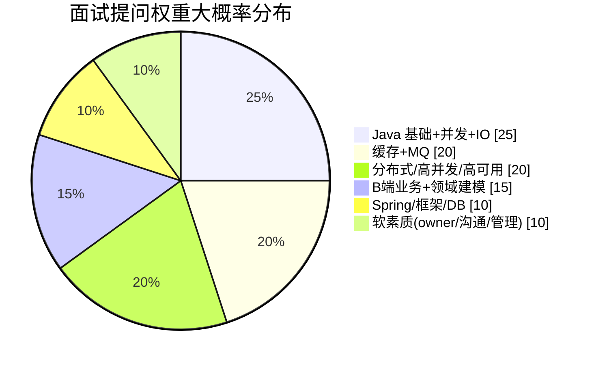
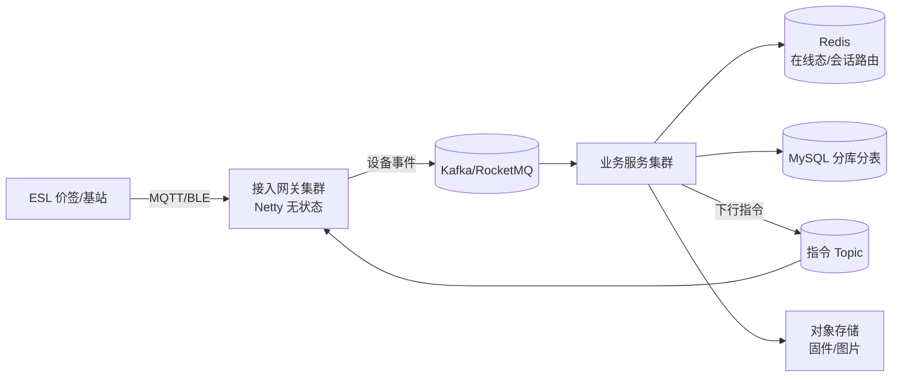

# 🎤 智控网络（ZKONG）Java 面试准备

> [!warning] 关于你给的那份 PDF
> `智控品牌介绍 2026 V1.pdf` 是**纯品牌宣传册**（32 页，公司简介 / 产品线 / 荣誉 / 案例），
> **不含任何岗位要求**。所以下面的 JD 是我从公开招聘渠道抓的真实岗位描述，来源见文末。

> [!abstract] 一句话画像
> 智控 = **IoT 硬件 + SaaS 云平台**的出海公司（ESL 电子价签全球领跑者）。
> 所以这场面试的主战场是 **Java 后端 + 海量设备接入的高并发高可用**，
> 你的**大模型知识是差异化加分项**，但不是主菜。

---

## 0. 需要你补的 3 个信息

- [ ] **面试轮次/形式**：技术面？主管面？有没有笔试或手撕代码？（你说还没确认——建议今天问 HR）
- [ ] **具体是哪个岗位**：中级（15-20k）还是高级（≤30k）？两者 JD 正文几乎一样，但**薪资带差一倍**，直接决定谈薪策略
- [ ] **你整理的那份「需求 + 面试问题」**：贴给我，我合并进本笔记第 4 节

---

## 1. 公司情报（可直接在面试中引用，显得做过功课）

### 硬数据
| 维度 | 数据 |
|---|---|
| 成立 | 2006 年（智控网络 2017 年成立，全球首发 SaaS 架构 ESL 方案） |
| 总部 | 杭州钱塘区科技园路 558 号 1 幢悦萱堂大厦 2301 |
| 新总部 | 中国海宁，建设中（2025 启动） |
| 规模 | 300+ 员工，**研发人员占比 70%+** |
| 海外 | 欧洲（杜塞尔多夫）、日本（东京）、香港设办事处/分公司；业务覆盖 **60+ 国家** |
| 客户 | 合作品牌 **3000+**，部署门店 **200,000+** |
| 制造 | 自有工厂 50,000㎡+，年产能 5,000 万+ 片；SMT/DIP + 注塑 + 组装产线；MES + ERP |
| 专利 | 国内外专利 **220+** |
| 认证 | FCC / CE / RoHS / MIC、ISO9001/14001/50001、SA8000 |

### 客户名单（面试时可提，证明你了解业务）
盒马鲜生、永辉超市、中免集团、正大集团、SONY、小米、美的、大润发、银泰商场、易捷、京客隆

### 产品线（技术面试官很可能让你"讲讲你理解的我们做什么"）
- **ESL 电子价签**（EPD 电子纸，7 大系列：ARROW 长条拼接 / SHIELD 亚克力防护 / VALLEY 无面板 / BLADE 超薄 / BLADE+PTL 亮灯拣选 / QUANTUM 超窄边框 / FASHION 服装 / ESSENCE 全彩大尺寸）
- **LCD 商显屏**（SPARKLE 小尺寸 / LEGENDARY 大尺寸高端）
- **无线云基站**（ZAP-C/DX/DL/U）：**单基站管 15000+ 片价签**，室内覆盖 700㎡ / 直径 20m，多 AP 负载均衡
- **SaaS 云平台**：ESL + LCD 全硬件统一管理，**秒级同步，15 分钟全店切换**，开放 API
- **AoA 定位**：仓库/门店货品定位、商品导航、员工管理、防盗，大型连锁超市实测准确率 **97%**
- **通信制式**：蓝牙 5.4 / NFC / Sub-1GHz / Wi-Fi / CAT1（千兆以太网）；SSL/TLS 加密

### ⚡ 从产品参数反推的「后端技术命题」（这是本笔记最有价值的部分）
面试官大概率会围绕这些问系统设计，**提前把答案想好**：

1. **单基站 15000+ 设备、20 万门店** → 海量长连接网关、设备在线态、连接路由
2. **秒级同步 / 15 分钟全店切换** → 批量下发编排、削峰、回执与补偿
3. **价签待机电流 2.9uA、电池供电** → 下行报文必须极简、心跳可配、批量合并（**硬件约束反推后端设计，讲出来非常加分**）
4. **3000+ 品牌共用 SaaS** → 多租户隔离、套餐配额、RBAC
5. **60+ 国家出海** → 多区域部署、就近接入、GDPR 数据合规、时区多语言
6. **云部署 vs 本地化部署双形态**（宣传册第 27 页专门对比） → 一套代码如何支持私有化交付
7. **弱网/离线门店** → 指令缓存、幂等下发、序列号防乱序
8. **AoA 定位高频数据** → 时序存储、实时轨迹计算

---

## 2. 真实岗位 JD（公开渠道抓取）

> [!note] 来源说明
> 抓自第三方招聘网站，发布方为「杭州智控网络有限公司」。字段（薪资/经验/学历）在聚合站上偶有错位，
> **以 HR 实际沟通为准**；但「职位描述 / 任职要求」正文两个岗位完全一致，可信度高。
> - [中级 Java 开发工程师（15-20k · 钱塘区）](http://www.jrzp.com/job3996423.shtml)
> - [Java 高级开发工程师（≤30k）](http://www.jxphrc.com/job27023624.shtml)
> - [初级 Java 开发工程师](https://jobs.51job.com/hangzhou-qtq/169512808.html)

**职位描述**
1. 能独立完成核心模块的设计、开发工作
2. 参与难题攻关，快速定位并解决线上问题
3. 参与系统架构设计，对系统进行优化
4. 和上下游团队沟通，共同协作保障项目的质量和进度

**任职要求**
1. 本科（统招）及以上，计算机软件或相关专业，**5 年及以上 Java 开发经验**
2. 良好的逻辑思维和编程习惯，具备独立解决问题的能力
3. **Java 基础扎实，熟悉 IO、多线程、缓存、消息队列等机制**；熟练使用 Spring、MVC 等主流框架，**有一定的技术癖**（对技术有钻研/品味）
4. 有**大型分布式系统、高并发、高可用**系统设计、开发和调优经验**优先**
5. 具有 **owner 精神**，能自我驱动

**加分项**
1. 有团队管理或项目管理经验
2. **熟悉领域建模**
3. 有**复杂 B 端业务系统**设计、开发经验

**其他**：杭州钱塘区悦萱堂大厦 2201；福利标注「全勤奖 / 节日福利 / 不加班 / 周末双休」（宣传册口径，以实际为准）

### JD 关键词拆解 → 面试权重



---

## 3. 你的匹配度分析与风险点

### ✅ 优势（要主动打出来的牌）
- **10+ 年 Java**：JD 只要 5 年，你远超门槛 → 直接对应「加分项 1：团队管理/项目管理经验」
- **分布式 + 大数据栈**（Flink/Kafka/Doris）：对应 JD 第 4 条「大型分布式、高并发、高可用」
- **大模型 / AI 应用**（RAG、Agent）：智控**正在出海 + 3000 品牌 SaaS**，AI 落地场景非常多（见第 6 节）
- **带团队/主导方案**：对应「owner 精神」与加分项

### ⚠️ 风险点（必须提前准备话术）
1. **薪资错配**：中级岗 15-20k 对 10+ 年经验是**降薪**。若 HR 按中级约面，你要么确认能否按高级定级，要么准备好"为什么接受"的说法。
2. **"你经验这么多，为什么来我们这做开发？"** → 准备一个真诚且不虚伪的回答（业务方向认同 + IoT 出海 + 想回到技术一线做深）。
3. **领域建模 / 复杂 B 端**：这是加分项，若你过去偏 C 端/数据平台，要**提前编好一个 B 端故事**（多角色权限、审批流、配置化）。
4. **IoT 协议栈**：MQTT/CoAP/Sub-1GHz、Netty 长连接，如果不是你的强项，**至少把网关模型讲清楚**（第 4 节 G 组）。
5. **"不加班"承诺**：别主动质疑，也别过度热情接受加班。

---

## 4. 技术面试题库（按命中率排序）

> [!tip] 使用方法
> 每题**用自己的话讲 1 分钟**。讲不顺的打 `#待补`，集中攻克。
> 骨架给的是**必须命中的得分点**，不是完整答案。

### A. Java 基础与并发（JD 明写「多线程」，必问）

| 问题                         | 得分骨架                                                                       |
| -------------------------- | -------------------------------------------------------------------------- |
| HashMap 1.8 原理             | 数组+链表+红黑树、扩容 2 倍、树化阈值 8/退化 6、hash 扰动、并发扩容死循环（1.7 头插）                       |
| ConcurrentHashMap 怎么保证线程安全 | 1.8 取消分段锁 → CAS + synchronized 锁桶头；size 用 CounterCell 分散计数                 |
| synchronized 锁升级           | 无锁→偏向锁→轻量级锁（自旋）→重量级锁；对象头 Mark Word；JDK15 后偏向锁默认关闭                          |
| volatile                   | 可见性 + 禁止重排序；不保证原子性；内存屏障；DCL 单例为什么要它                                        |
| AQS 原理                     | state + CLH 双向队列 + CAS；独占/共享；ReentrantLock 公平非公平、可中断、Condition             |
| 线程池 7 参数 + 执行流程            | core→队列→max→拒绝策略；**为什么先入队再加线程**；4 种拒绝策略；参数怎么定（CPU 密集 N+1 / IO 密集 2N，最终靠压测） |
| ThreadLocal 内存泄漏           | ThreadLocalMap key 弱引用 value 强引用；必须 remove；线程池复用场景必漏                       |
| 死锁排查                       | jstack 看 deadlock；四条件；如何避免（顺序加锁、tryLock 超时）                                |
| JMM / happens-before       | 主内存-工作内存、8 大原子操作、happens-before 规则                                         |
| 线上 CPU 100% 怎么查            | top -Hp → printf %x → jstack 定位线程栈；常见：死循环、GC、正则回溯                          |

### B. IO 与网络（JD 明写「IO」，IoT 公司必问）

| 问题 | 得分骨架 |
|---|---|
| BIO / NIO / AIO | 阻塞 / 多路复用 / 异步回调；epoll 的 LT vs ET |
| 零拷贝 | mmap、sendfile、splice；DMA 参与；Kafka 为什么快 |
| Netty 线程模型 | 主从 Reactor、EventLoopGroup、ChannelPipeline、ByteBuf（堆外/池化） |
| 粘包拆包 | 定长/分隔符/长度字段；LengthFieldBasedFrameDecoder |
| 心跳与重连 | IdleStateHandler、指数退避、会话恢复 |
| **MQTT 协议**（IoT 核心） | 发布订阅、QoS 0/1/2、遗嘱消息、保留消息、Clean Session、Topic 设计 |

### C. 缓存（JD 明写）

- 缓存穿透 / 击穿 / 雪崩 → 布隆过滤器、空值缓存、互斥锁/逻辑过期、过期时间加随机
- **双写一致性**：先删缓存再更新 DB？延迟双删？Canal 订阅 binlog？→ 讲清"最终一致 + 兜底对账"
- 分布式锁：SETNX+过期+唯一值、Redisson 看门狗、RedLock 争议、**锁续期与误删问题**
- 大 key / 热 key：拆分、本地缓存、多级缓存
- Redis 集群：主从 / 哨兵 / Cluster 分片、槽位、持久化 RDB vs AOF、内存淘汰策略

### D. 消息队列（JD 明写）

- 选型：Kafka vs RocketMQ vs RabbitMQ（吞吐/顺序/延迟/事务）
- **幂等消费**：唯一键 + 去重表 / Redis 去重（IoT 设备重传场景必问）
- 顺序消息、事务消息、延迟消息、死信队列、消息堆积怎么处理
- 消息丢失的三个环节：生产 / Broker / 消费，各怎么防

### E. Spring / 框架

- IoC / AOP 原理，动态代理 JDK vs CGLIB
- Bean 生命周期 + **三级缓存解决循环依赖**（为什么需要第三级）
- **事务失效场景**（自调用、非 public、异常被吞、传播行为、多线程）→ 高频
- Spring Boot 自动装配（@EnableAutoConfiguration、SPI）
- MyBatis 执行流程、一级/二级缓存、#{} vs ${}

### F. 分布式 / 高并发 / 高可用（JD 第 4 条）

- 分布式事务：2PC / TCC / Saga / 本地消息表 / Seata AT
- 分布式 ID：雪花算法（时钟回拨怎么办）、号段模式
- 限流（令牌桶/漏桶/滑动窗口/ Sentinel）、熔断降级、隔离
- 分库分表：ShardingSphere、分片键选择、跨片查询、扩容
- CAP / BASE、一致性哈希、读写分离与主从延迟
- 幂等设计、对账与补偿、灰度发布

### G. 🎯 智控业务专属场景题（**最高命中率，务必背熟**）

> [!important] 这组题是你的决胜区
> 大多数候选人只会背八股，**能把技术映射到智控业务**的人极少。

**G1. 一个基站要管 15000+ 片价签，20 万门店，设备接入网关怎么设计？**
> 得分点：Netty 长连接网关无状态化 → 网关集群 + 注册中心；会话路由（设备 ID → 网关节点，存 Redis）；在线状态与心跳；连接数上限与文件句柄调优；网关宕机后的重连风暴治理（**重连退避 + 分批放行**）；协议层 MQTT。



**G2. 改价要「秒级同步、15 分钟全店切换」，怎么保证不丢、不重、可观测？**
> 得分点：任务编排（一次改价 = 一个批次任务）；分组/分区并行下发；**限流削峰**（避免打爆基站）；逐设备回执 + 进度聚合；失败重试与指数退避；超时补偿任务；幂等（指令带版本号/序列号，设备端丢弃旧版本）；大盘监控下发成功率。

**G3. 价签电池供电（待机 2.9uA），后端要怎么配合？**
> 得分点：**下行报文极简化**（差分更新、只传变化字段）；合并下发（一个心跳周期内聚合多条指令）；心跳周期可配置/自适应；避免广播风暴；设备端确认后才标记成功。

**G4. 3000+ 品牌共用 SaaS，多租户怎么隔离？**
> 得分点：三种方案对比（字段 tenant_id / 独立 schema / 独立库）与各自成本；**推荐字段隔离 + 分片键带 tenant_id**；越权防护（所有查询强制注入租户条件，用 MyBatis 拦截器）；套餐与配额限流；数据导出与删除（合规）。

**G5. 出海 60+ 国家，欧洲/日本/香港都有业务，架构上怎么支撑？**
> 得分点：多区域部署（就近接入、降低延迟）；数据驻留与 **GDPR 合规**（欧洲数据不出境）；跨区域数据同步与冲突（最终一致）；时区/货币/多语言；CDN；全球统一管控面 + 区域数据面。

**G6. 客户既买 SaaS 又要本地化私有部署（宣传册明确两种模式），一套代码怎么支撑？**
> 得分点：配置化差异（部署模式开关）；依赖抽象（对象存储/消息队列/短信可替换）；离线授权（License 文件 + 机器指纹）；升级包与版本管理；**不要把 SaaS 强依赖写死在业务代码里**。

**G7. 设备弱网/离线，指令怎么保证最终一致？**
> 得分点：指令持久化 + 待下发队列；设备上线后拉取增量（版本号比对）；幂等下发；TTL 过期丢弃（过期的价格不值得下发）；对账任务兜底。

**G8. 门店商品/价格要和客户的 POS/ERP 对接，开放 API 怎么设计？**
> 得分点：鉴权（AppKey/Secret + 签名 + 时间戳防重放）；幂等键；限流配额；异步回调 + 重试；**对账机制**；版本化 API；错误码规范；沙箱环境。

**G9. AoA 定位产生高频数据，怎么存怎么算？**
> 得分点：写入侧削峰（MQ 缓冲）；存储选型（时序库 / Redis GEO / ClickHouse）；实时轨迹计算与历史归档；降采样；查询按门店+时间分区。

**G10. 促销日早市海量改价峰值怎么扛？**
> 得分点：削峰填谷、任务排队与优先级、资源隔离（改价链路不拖垮其他服务）、容量评估与压测、降级预案。

### H. 数据库

- MySQL 索引：B+ 树为什么、最左前缀、覆盖索引、索引下推、回表
- explain 关键列、慢 SQL 优化步骤
- 事务隔离级别 + **MVCC + 间隙锁/next-key lock**（幻读怎么解）
- redo / undo / binlog、两阶段提交、主从复制与延迟
- 分库分表后怎么做分页与聚合

### I. 领域建模 & B 端（**JD 加分项，你很可能被问**）

- DDD 核心概念：限界上下文、聚合根、实体/值对象、领域事件、防腐层
- 贫血模型 vs 充血模型，怎么选
- **拿智控业务练手**：把系统拆成 商品域 / 价格域 / 门店域 / 设备域 / 用户权限域，各自聚合根是什么？
- 复杂 B 端怎么做：多角色权限（RBAC/ABAC）、审批流、**配置化而非硬编码**、多组织架构
- 怎么和产品/上下游对齐需求（JD 第 4 条明确要求沟通协作）

### J. 手撕代码（若含笔试）
- 常见：反转链表、LRU/LFU 缓存、TopK、字符串、二叉树遍历、多线程交替打印、生产者消费者
- **限流器实现**（令牌桶）、**单例 DCL**、**手写线程池**——与 JD 高度相关
- 建议：现场先问清边界，写完讲复杂度

---

## 5. 大模型知识：怎么用成加分项（而不是被当成"不务正业"）

> [!important] 关键策略
> 智控**不是 AI 公司**，面试官可能对 LLM 不熟。
> **不要主动长篇输出 LLM 术语**，而是回答"我能用它帮智控解决什么"。

### 可落地的场景（讲 2-3 个即可，越具体越好）
| 场景 | 技术方案 | 业务价值 |
|---|---|---|
| **出海多语言价签/商品文案** | LLM 批量翻译 + 术语表约束 + 人工抽检 | 60+ 国家上线提速 |
| **商品图文自动建档** | 多模态模型识别商品图 → 结构化属性 → 人工确认 | 门店建档人力下降 |
| **门店经营数据问答** | Text-to-SQL + 指标语义层 | 客户不用等报表 |
| **实施/售后知识库** | RAG（文档切分 + 向量检索 + 重排） | 交付与客服效率 |
| **动态定价/选品建议** | 时序预测 + LLM 解释 | 提升客户粘性 |

### 可能被问到的 LLM 问题（答不上会掉分，答得好是亮点）
- RAG vs 微调怎么选？（知识更新频率 / 成本 / 数据量）
- RAG 全流程 + chunk 策略 + 检索不准怎么优化（混合检索 + 重排）
- 幻觉怎么缓解？（引用溯源、约束解码、事实校验、人工兜底）
- Agent / Function Calling / MCP 解决什么问题？
- 成本与延迟怎么控制？（小模型分流、缓存、流式、批处理）
- **私有化部署**（客户数据合规要求，尤其欧洲）→ 开源模型本地部署方案
- 怎么评估一个 LLM 应用？（离线评测集 + 线上 A/B + 人工抽检）

> 详见已有笔记：[[AI 学习规划/面试准备]]

---

## 6. 自我介绍模板（10+ 年经验版本，请按真实情况改）

```
我是 X，X 年 Java 后端开发经验，长期做分布式系统设计与高并发调优。
最近一份工作在 X 公司，负责 X 系统（规模：日订单 X 万 / QPS X / 数据量 X），
主导过 X（举一个最有分量的架构或优化案例，带量化结果）。

技术上我扎实的是 Java 并发与 JVM 调优、缓存与消息队列、分库分表，
同时带过 X 人团队，完整负责过项目从需求到上线的交付。

近一年我还在做 AI 应用方向的实践（RAG 知识库 / Agent），
我关注到智控在 ESL 出海和多租户 SaaS 上的体量——
单基站 15000+ 设备、20 万门店、60+ 国家的场景，
在设备接入、指令下发一致性、多租户隔离上都有很硬的技术挑战，
这正好是我擅长的方向，也是我想深入做下去的地方。
```

### STAR 卡片（**必须自己填真实内容**，模板见 [[大数据学习规划/05-求职与面试]]）

- [ ] 项目 1：______（S 背景 / T 我负责 / A 方案 / **R 量化**）
- [ ] 项目 2：______
- [ ] 每个项目准备 **3 个可被追问的深挖点**（数字要真实，编的必被抓）

> [!danger] 十年经验的必答题
> "你最有成就感的一个技术难题是什么？"——**没有量化结果的答案等于没答**。
> 提前准备好：QPS 从多少到多少、延迟从多少降到多少、成本省了多少、故障率降了多少。

---

## 7. 反问清单（体现你已经是"负责人"视角）

**问业务/技术（优先，显得懂行）**
1. 目前 ESL 云平台的**设备接入层**大概什么量级？用的是自研网关还是 MQTT 中间件？
2. 改价指令从云端下发到价签刷新，**端到端延迟**目前是什么水平？最大的瓶颈在哪？
3. 3000+ 品牌的多租户，数据隔离目前是哪种方案？
4. 出海多区域部署，欧洲的数据合规是怎么处理的？
5. 云平台的技术栈大概是？（Java 版本 / Spring Cloud / MQ / 存储）

**问岗位（关键，直接决定你去不去）**
6. 这个岗位属于**中级还是高级**？团队目前多少人、怎么分工？
7. 我 10+ 年经验，团队里期待我承担的是**纯开发**还是能参与架构/带人？
8. 未来 6-12 个月，这个岗位最重要的交付目标是什么？
9. 目前的研发流程（需求→上线）、发布频率、有没有线上值班？

**谈薪铺垫**
10. 薪资结构和调薪机制？（注意：中级 15-20k / 高级 ≤30k，**先确认定级再谈数字**）

---

## 8. 两天冲刺计划

> 面试约在后天。按优先级排，**别想着全看完**。

### Day 1（今天）—— 打地基
- [ ] 问 HR 确认：**面试形式 + 岗位级别 + 是否笔试**（最高优先级）
- [ ] 背熟第 1 节公司情报（能脱稿讲 1 分钟"智控是做什么的"）
- [ ] **G 组业务场景题 G1/G2/G3/G4 四题**，每题能讲 3 分钟
- [ ] 写自我介绍，**录音听一遍**（超时/卡壳就重写）
- [ ] 填 2 张 STAR 卡片，量化数字必须真实

### Day 2（明天）—— 补硬技能
- [ ] A 组 Java 并发（线程池 / CHM / AQS / ThreadLocal）+ B 组 IO/Netty/MQTT
- [ ] C 组缓存 + D 组 MQ 的"幂等 / 一致性"话术
- [ ] F 组分布式事务 + 限流 + 分库分表
- [ ] 第 5 节挑 2 个 LLM 场景，练成 1 分钟版本
- [ ] 手撕：LRU + 限流器 + 单例，白板写一遍

### Day 3（面试当天）
- [ ] 提前 20 分钟到，带 2 份纸质简历
- [ ] 开场 3 分钟自我介绍过一遍
- [ ] 反问清单挑 3-4 个
- [ ] 面试后**立刻**把被问到的问题记到本笔记第 4 节（复盘 + 为下一轮准备）

---

## 9. 待补充

- [ ] 用户提供的「整理好的需求 + 面试问题」→ 合并到第 4 节
- [ ] HR 确认的面试形式与岗位级别
- [ ] 真实项目 STAR 卡片

## 🔗 关联

- [[AI 学习规划/面试准备]] —— LLM / 系统设计 / 领导力题库
- [[大数据学习规划/05-求职与面试]] —— Flink / 实时数仓 / STAR 模板
- [[AI 学习规划/技术栈地图]]

## 🏷️ 标签

#面试 #Java #智控 #ZKONG #IoT #ESL #待补
