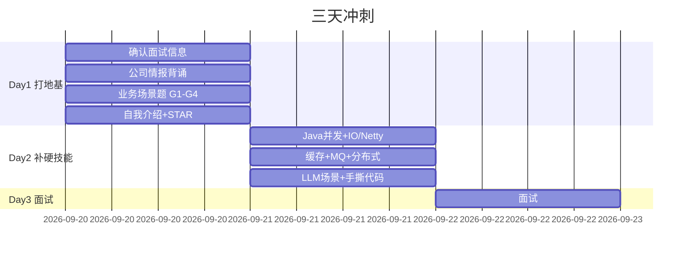

# 🎯 智控网络（ZKONG）面试 · 总览

> [!info] 关键信息卡
> | 项 | 内容 |
> |---|---|
> | 公司 | 杭州智控网络有限公司（ZKONG） |
> | 岗位 | Java 开发工程师 |
> | 面试日 | **2026-09-22（周二）** —— 后天 |
> | 地点 | 杭州钱塘区科技园路 558 号 1 幢悦萱堂大厦 2301 / 2201 |
> | 薪资带 | 中级 15-20k ／ 高级 ≤30k（待确认定级） |
> | 你的牌 | 10+ 年 Java、分布式、大数据、大模型 |

---

## ⚠️ 待你确认（填完这一块，准备才有方向）

> 这些我无法替你确认，**今天优先问 HR**。填在冒号后面即可。

- [ ] **面试形式**：技术面 / 主管面 / HR 面 / 几轮？ → 
- [ ] **岗位级别**：中级还是高级？（薪资差一倍） → 
- [ ] **是否有笔试或手撕代码**？ → 
- [ ] **面试时间 + 线上还是现场**？ → 
- [ ] **面试官是谁**（HR / 技术负责人 / 未来主管）？ → 
- [ ] **期望薪资底线**（你自己定） → 
- [ ] **你整理的那份「需求 + 面试问题」** → 贴到 [[03-技术题库]] 末尾「待补充」区
- [ ] **2 个代表作**（项目名 + 你的角色 + 量化结果） → 填到 [[04-话术与反问清单]] 的 STAR 卡

---

## 📚 笔记导航

| 笔记 | 内容 | 什么时候看 |
|---|---|---|
| [[01-公司情报]] | 公司数据、产品线、**从产品参数反推的技术命题** | Day 1 |
| [[02-岗位JD与匹配分析]] | 真实 JD 原文、匹配优势、风险点、谈薪 | Day 1 |
| [[03-技术题库]] | Java/缓存/MQ/分布式 + **智控业务场景题 10 道** | Day 2 |
| [[04-话术与反问清单]] | 自我介绍、STAR、HR 问题、反问、谈薪 | Day 1-2 |
| [[05-Day1-今天]] | 今天（09-20 周日）任务 | 现在 |
| [[06-Day2-明天]] | 明天（09-21 周一）任务 | 明天 |
| [[07-Day3-面试当天]] | 后天（09-22 周二）checklist | 面试当天 |
| [[面试准备/技术面试题库/00-总览与使用说明\|通用技术面试题库]] | 不限公司的 Java 八股（12 篇，含手撕代码） | 长期复用 |
| [[面试准备/专业技能/00-总览与复习优先级\|专业技能题库]] | 按你简历六条专业技能组织的深挖题 + 翻车点 | 长期复用 |
| [[面试准备/简历/00-AI经历怎么讲与简历改写策略\|简历与项目改写]] | 大模型经历怎么讲 + 两个项目的增强描述 | 长期复用 |

---

## 📊 进度看板

- [ ] Day 1 完成
- [ ] Day 2 完成
- [ ] Day 3 面试完成
- [ ] 面试后复盘（把被问到的问题记回 [[03-技术题库]]）

---

## 🗒️ 我的补充区

> 你后续想加的任何内容（HR 沟通记录、岗位原文、面经、想法）直接写在这里。

- 

---

## 🔗 关联

- [[AI 学习规划/面试准备]]
- [[大数据学习规划/05-求职与面试]]

#面试 #智控 #ZKONG #待确认
