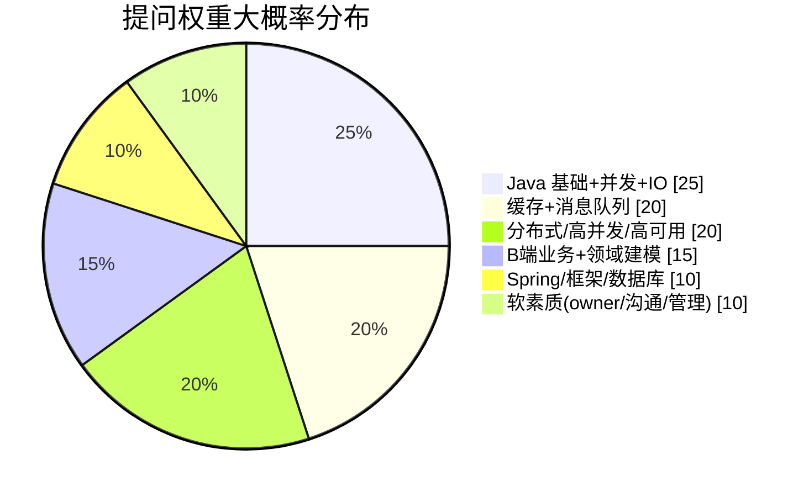

# 📋 岗位 JD 与匹配分析

> [!warning] 关于你给的那份 PDF
> `智控品牌介绍 2026 V1.pdf` 是**纯品牌宣传册**（32 页：公司简介 / 产品线 / 荣誉 / 案例），
> **不含任何岗位要求**。下面的 JD 来自公开渠道抓取，发布方为杭州智控网络有限公司。

---

## 1. 真实 JD 原文

**来源**（第三方招聘站，字段偶有错位，以 HR 沟通为准）：
- [中级 Java 开发工程师（15-20k · 钱塘区 · 5 年以上 · 本科）](http://www.jrzp.com/job3996423.shtml)
- [Java 高级开发工程师（≤30k）](http://www.jxphrc.com/job27023624.shtml)
- [初级 Java 开发工程师](https://jobs.51job.com/hangzhou-qtq/169512808.html)

> 中级岗与高级岗的「职位描述 / 任职要求」**正文完全一致**，只有薪资带和标题不同。

### 职位描述
1. 能独立完成核心模块的设计、开发工作
2. 参与难题攻关，能够快速定位并解决线上问题
3. 参与系统架构设计，对系统进行优化
4. 和上下游团队沟通，共同协作保障项目的质量和进度

### 任职要求
1. 本科（统招）及以上学历，计算机软件或相关专业，**5 年及以上 Java 开发经验**
2. 良好的逻辑思维和编程习惯，具备独立解决问题的能力
3. **Java 基础扎实，熟悉 IO、多线程、缓存、消息队列等机制**；熟练使用 Spring、MVC 等主流框架，**有一定的技术癖**
4. 有**大型分布式系统、高并发、高可用**系统设计、开发和调优经验优先
5. 具有 **owner 精神**，能自我驱动

### 加分项
1. 有团队管理经验或者项目管理经验
2. **熟悉领域建模**
3. 有**复杂 B 端业务系统**设计、开发经验

**其他**：工作地点杭州钱塘区悦萱堂大厦 2201；福利标注「全勤奖 / 节日福利 / 不加班 / 周末双休」

---

## 2. JD 关键词拆解 → 面试权重

**逐条对照表**

| JD 要求 | 对应准备位置 |
|---|---|
| Java 基础 / IO / 多线程 | [[03-技术题库]] A 组、B 组 |
| 缓存 / 消息队列 | [[03-技术题库]] C 组、D 组 |
| Spring / MVC | [[03-技术题库]] E 组 |
| 大型分布式 / 高并发 / 高可用 | [[03-技术题库]] F 组 + **G 组业务场景题** |
| 领域建模（加分） | [[03-技术题库]] I 组 |
| 复杂 B 端（加分） | [[03-技术题库]] I 组 |
| 团队管理 / 项目管理（加分） | [[04-话术与反问清单]] |
| owner 精神 / 自我驱动 | [[04-话术与反问清单]] |
| 快速定位并解决线上问题 | [[03-技术题库]] A 组「线上排查」 |

---

## 3. 你的匹配度分析

### ✅ 优势（要主动打出来的牌）
- **10+ 年 Java**：JD 只要 5 年，你**超门槛一倍** → 直接对应加分项「团队管理 / 项目管理经验」
- **分布式 + 大数据栈**（Flink / Kafka / Doris / 实时数仓）→ 对应 JD 第 4 条「大型分布式、高并发、高可用」
- **大模型 / AI 应用**（RAG、Agent、Transformer）→ 智控正在**出海 + 3000 品牌 SaaS**，AI 落地场景多（见 [[03-技术题库]] K 组）
- **owner / 带团队 / 主导方案** → 对应 JD 第 5 条与加分项 1

### ⚠️ 风险点与应对

| 风险 | 面试官可能的问法 | 你的应对 |
|---|---|---|
| **薪资错配** | 「我们这个岗位预算 15-20k」 | 先确认能否按**高级**定级；若不能，明确自己的底线，别现场松口 |
| **经验过载** | 「你经验这么多，为什么来做开发？」 | 认同业务方向（IoT 出海 + SaaS 体量）+ 想回技术一线做深，**别贬低自己** |
| **领域建模 / B 端** | 「讲讲你做过的最复杂的 B 端系统」 | 提前编好一个故事：多角色权限、审批流、配置化（[[04-话术与反问清单]]） |
| **IoT 协议栈** | 「了解 MQTT / 设备网关吗？」 | 至少把网关模型讲清楚（G1），并坦白哪些是了解、哪些是实战 |
| **年龄/加班** | 「能接受加班吗？」 | 就事论事，别过度承诺也别抵触 |
| **管理经验被质疑** | 「你带过几个人？怎么带的？」 | 用具体事实 + 量化（团队规模、交付结果） |

---

## 4. 谈薪策略

> [!tip] 关键动作
> **先确认定级，再谈数字。** 中级和高级差近一倍，定级错了后面全错。

- 你的锚点：**高级岗 ≤30k** 是公开上限，中级 15-20k 是明显降薪
- 问法：「这个岗位是中级还是高级编制？以我的经验，期望是按高级岗位来评估的。」
- 若被压价：不要现场答应，说「我理解预算区间，想先了解完整的薪酬结构和调薪机制」
- 需要准备的数字：**当前薪资 / 期望薪资 / 底线**（填到 [[00-总览与待确认]]）

---

## 5. 待补充

> 你整理的那份「大概需求」原文贴在这里，我来合并。

- 

## 🔗 关联

- [[00-总览与待确认]] · [[01-公司情报]] · [[03-技术题库]] · [[04-话术与反问清单]]

#智控 #JD #岗位分析 #谈薪
