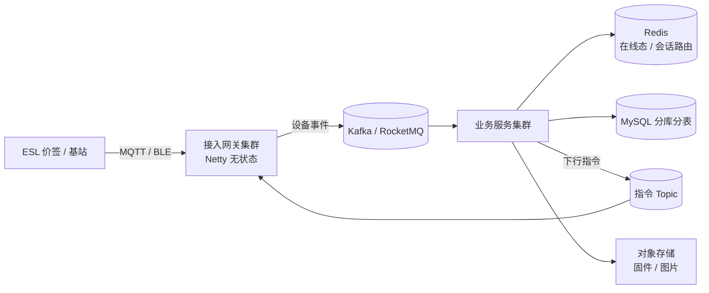

# 🧠 技术题库（按命中率排序）

> [!tip] 使用方法
> 每题**用自己的话讲 1 分钟**。讲不顺的打 `#待补`，集中攻克。
> 表格里给的是**必须命中的得分点**，不是完整答案。

> [!note] 与通用题库的关系
> 本篇是**智控专属**（含公司业务场景题 G 组）。
> 更细的通用八股（并发 / JVM / MySQL / Redis / MQ / 分布式 / 手撕代码）见
> → [[面试准备/技术面试题库/00-总览与使用说明|通用技术面试题库]]

---

## A. Java 基础与并发（JD 明写「多线程」，必问）

| 问题 | 得分骨架 |
|---|---|
| HashMap 1.8 原理 | 数组+链表+红黑树、扩容 2 倍、树化阈值 8 / 退化 6、hash 扰动、1.7 并发扩容死循环 |
| ConcurrentHashMap 线程安全 | 1.8 取消分段锁 → CAS + synchronized 锁桶头；size 用 CounterCell 分散计数 |
| synchronized 锁升级 | 无锁→偏向锁→轻量级（自旋）→重量级；对象头 Mark Word；JDK15 后偏向锁默认关闭 |
| volatile | 可见性 + 禁止重排序；**不保证原子性**；内存屏障；DCL 单例为什么要它 |
| AQS 原理 | state + CLH 双向队列 + CAS；独占/共享；ReentrantLock 公平非公平、可中断、Condition |
| 线程池 7 参数与执行流程 | core→队列→max→拒绝策略；**为什么先入队再加线程**；4 种拒绝策略；参数怎么定（CPU 密集 N+1 / IO 密集 2N，最终靠压测） |
| ThreadLocal 内存泄漏 | key 弱引用 value 强引用；必须 remove；**线程池复用场景必漏** |
| 死锁排查 | jstack 看 deadlock；四条件；避免（顺序加锁、tryLock 超时） |
| JMM / happens-before | 主内存-工作内存、8 大原子操作、happens-before 规则 |
| 线上 CPU 100% 怎么查 | top -Hp → printf %x → jstack 定位线程栈；常见：死循环、GC、正则回溯 |
| OOM / 内存泄漏排查 | jmap dump → MAT/jvisualvm；堆/元空间/直接内存分别看 |
| GC 调优 | G1 vs CMS vs ZGC；停顿目标；FullGC 频繁怎么查 |

---

## B. IO 与网络（JD 明写「IO」，IoT 公司必问）

| 问题 | 得分骨架 |
|---|---|
| BIO / NIO / AIO | 阻塞 / 多路复用 / 异步回调；epoll 的 LT vs ET |
| 零拷贝 | mmap、sendfile、splice；DMA 参与；Kafka 为什么快 |
| Netty 线程模型 | 主从 Reactor、EventLoopGroup、ChannelPipeline、ByteBuf（堆外/池化） |
| 粘包拆包 | 定长 / 分隔符 / 长度字段；LengthFieldBasedFrameDecoder |
| 心跳与重连 | IdleStateHandler、指数退避、会话恢复 |
| **MQTT 协议**（IoT 核心） | 发布订阅、**QoS 0/1/2**、遗嘱消息、保留消息、Clean Session、Topic 设计 |
| 长连接保活与重连风暴 | 网关侧限流放行、随机抖动、退避策略（**20 万门店同时重连怎么扛**） |

---

## C. 缓存（JD 明写）

- 缓存穿透 / 击穿 / 雪崩 → 布隆过滤器、空值缓存、互斥锁 / 逻辑过期、过期时间加随机
- **双写一致性**：先删缓存再更新 DB？延迟双删？Canal 订阅 binlog？→ 讲清「最终一致 + 兜底对账」
- 分布式锁：SETNX + 过期 + 唯一值、Redisson 看门狗、RedLock 争议、**锁续期与误删**
- 大 key / 热 key：拆分、本地缓存、多级缓存
- Redis 集群：主从 / 哨兵 / Cluster 分片、槽位、RDB vs AOF、内存淘汰策略

---

## D. 消息队列（JD 明写）

- 选型：Kafka vs RocketMQ vs RabbitMQ（吞吐 / 顺序 / 延迟 / 事务）
- **幂等消费**：唯一键 + 去重表 / Redis 去重（**IoT 设备重传场景必问**）
- 顺序消息、事务消息、延迟消息、死信队列、消息堆积怎么处理
- 消息丢失三个环节：生产 / Broker / 消费，各怎么防
- 削峰填谷：设备上报洪峰 → MQ 缓冲 → 消费限速

---

## E. Spring / 框架

- IoC / AOP 原理，动态代理 JDK vs CGLIB
- Bean 生命周期 + **三级缓存解决循环依赖**（为什么需要第三级）
- **事务失效场景**（自调用、非 public、异常被吞、传播行为、多线程）→ 高频
- Spring Boot 自动装配（@EnableAutoConfiguration、SPI）
- MyBatis 执行流程、一级/二级缓存、`#{}` vs `${}`

---

## F. 分布式 / 高并发 / 高可用（JD 第 4 条）

- 分布式事务：2PC / TCC / Saga / 本地消息表 / Seata AT
- 分布式 ID：雪花算法（**时钟回拨怎么办**）、号段模式
- 限流（令牌桶 / 漏桶 / 滑动窗口 / Sentinel）、熔断降级、隔离
- 分库分表：ShardingSphere、分片键选择、跨片查询、扩容
- CAP / BASE、一致性哈希、读写分离与主从延迟
- 幂等设计、对账与补偿、灰度发布

---

## G. 🎯 智控业务专属场景题（**最高命中率，务必背熟**）

> [!important] 这组题是你的决胜区
> 大多数候选人只会背八股，**能把技术映射到智控业务**的人极少。
> 对应业务参数见 [[01-公司情报]] 第 3 节。

**G1. 一个基站要管 15000+ 片价签，20 万门店，设备接入网关怎么设计？**
> 得分点：Netty 长连接网关**无状态化** → 网关集群 + 注册中心；会话路由（设备 ID → 网关节点，存 Redis）；在线状态与心跳；连接数与文件句柄调优；网关宕机后的**重连风暴治理**（退避 + 分批放行）；协议层 MQTT。

**G2. 改价要「秒级同步、15 分钟全店切换」，怎么保证不丢、不重、可观测？**
> 得分点：任务编排（一次改价 = 一个批次任务）；分组/分区并行下发；**限流削峰**（避免打爆基站）；逐设备回执 + 进度聚合；失败重试与指数退避；超时补偿任务；**幂等**（指令带版本号/序列号，设备端丢弃旧版本）；下发成功率大盘。

**G3. 价签电池供电（待机 2.9uA），后端要怎么配合？**
> 得分点：**下行报文极简化**（差分更新、只传变化字段）；合并下发（一个心跳周期内聚合多条指令）；心跳周期可配置 / 自适应；避免广播风暴；设备端确认后才标记成功。
> 💡 这题最能体现你「从硬件约束反推软件设计」的能力。

**G4. 3000+ 品牌共用 SaaS，多租户怎么隔离？**
> 得分点：三种方案对比（字段 `tenant_id` / 独立 schema / 独立库）与成本；推荐**字段隔离 + 分片键带 tenant_id**；越权防护（所有查询强制注入租户条件，MyBatis 拦截器）；套餐与配额限流；数据导出与删除（合规）。

**G5. 出海 60+ 国家，欧洲/日本/香港都有业务，架构上怎么支撑？**
> 得分点：多区域部署（就近接入、降延迟）；数据驻留与 **GDPR 合规**（欧洲数据不出境）；跨区域同步与冲突（最终一致）；时区 / 货币 / 多语言；CDN；**全球统一管控面 + 区域数据面**。

**G6. 客户既买 SaaS 又要本地化私有部署，一套代码怎么支撑？**
> 得分点：配置化差异（部署模式开关）；依赖抽象（对象存储 / MQ / 短信可替换）；离线授权（License + 机器指纹）；升级包与版本管理；**别把 SaaS 强依赖写死在业务代码里**。

**G7. 设备弱网/离线，指令怎么保证最终一致？**
> 得分点：指令持久化 + 待下发队列；设备上线后拉取增量（版本号比对）；幂等下发；**TTL 过期丢弃**（过期的价格不值得下发）；对账任务兜底。

**G8. 门店商品/价格要和客户 POS/ERP 对接，开放 API 怎么设计？**
> 得分点：鉴权（AppKey/Secret + 签名 + 时间戳防重放）；幂等键；限流配额；异步回调 + 重试；**对账机制**；API 版本化；错误码规范；沙箱环境。

**G9. AoA 定位产生高频数据，怎么存怎么算？**
> 得分点：写入侧削峰（MQ 缓冲）；存储选型（时序库 / Redis GEO / ClickHouse）；实时轨迹计算与历史归档；降采样；按门店+时间分区。

**G10. 促销日早市海量改价峰值怎么扛？**
> 得分点：削峰填谷、任务排队与优先级、**资源隔离**（改价链路不拖垮其他服务）、容量评估与压测、降级预案。

---

## H. 数据库

- MySQL 索引：B+ 树为什么、最左前缀、覆盖索引、索引下推、回表
- explain 关键列、慢 SQL 优化步骤
- 隔离级别 + **MVCC + 间隙锁 / next-key lock**（幻读怎么解）
- redo / undo / binlog、两阶段提交、主从复制与延迟
- 分库分表后怎么做分页与聚合

---

## I. 领域建模 & B 端（**JD 加分项，很可能被问**）

- DDD 核心概念：限界上下文、聚合根、实体/值对象、领域事件、防腐层
- 贫血模型 vs 充血模型，怎么选
- **拿智控业务练手**：拆成 商品域 / 价格域 / 门店域 / 设备域 / 用户权限域，各自聚合根是什么？
- 复杂 B 端怎么做：多角色权限（RBAC/ABAC）、审批流、**配置化而非硬编码**、多组织架构
- 怎么和产品/上下游对齐需求（JD 第 4 条明确要求沟通协作）

---

## J. 手撕代码（若含笔试）

- 高频：反转链表、LRU / LFU 缓存、TopK、字符串、二叉树遍历、多线程交替打印、生产者消费者
- **与 JD 高度相关**：限流器（令牌桶）、单例 DCL、手写线程池
- 建议：现场先问清边界，写完讲复杂度

---

## K. 大模型知识：用成加分项，而不是「不务正业」

> [!important] 关键策略
> 智控**不是 AI 公司**，面试官可能对 LLM 不熟。
> **不要主动长篇输出术语**，而是回答「我能用它帮智控解决什么」。

### 可落地场景（挑 2-3 个讲，越具体越好）
| 场景 | 技术方案 | 业务价值 |
|---|---|---|
| **出海多语言价签/商品文案** | LLM 批量翻译 + 术语表约束 + 人工抽检 | 60+ 国家上线提速 |
| **商品图文自动建档** | 多模态模型识别商品图 → 结构化属性 → 人工确认 | 门店建档人力下降 |
| **门店经营数据问答** | Text-to-SQL + 指标语义层 | 客户不用等报表 |
| **实施/售后知识库** | RAG（文档切分 + 向量检索 + 重排） | 交付与客服效率 |
| **动态定价 / 选品建议** | 时序预测 + LLM 解释 | 提升客户粘性 |

### 可能被问到的 LLM 问题
- RAG vs 微调怎么选？（知识更新频率 / 成本 / 数据量）
- RAG 全流程 + chunk 策略 + 检索不准怎么优化（混合检索 + 重排）
- 幻觉怎么缓解？（引用溯源、约束解码、事实校验、人工兜底）
- Agent / Function Calling / MCP 解决什么问题？
- 成本与延迟怎么控制？（小模型分流、缓存、流式、批处理）
- **私有化部署**（客户数据合规，尤其欧洲）→ 开源模型本地部署
- 怎么评估一个 LLM 应用？（离线评测集 + 线上 A/B + 人工抽检）

> 详见 [[AI 学习规划/面试准备]]

---

## 📥 待补充（你整理的面试问题贴这里）

> 把你自己整理的问题贴进来，我来补答案骨架。

- 

## 🔗 关联

- [[00-总览与待确认]] · [[01-公司情报]] · [[04-话术与反问清单]]

#面试 #Java #技术题库 #IoT #待补
