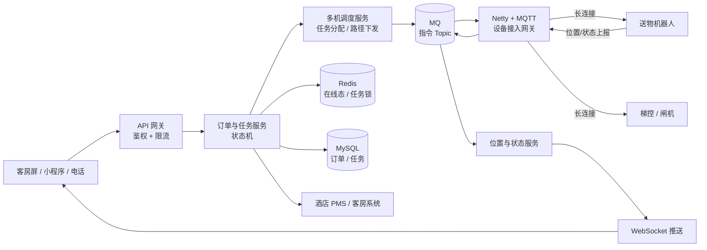

# 🤖 酒店 / 楼宇送物机器人

> 返回 [[00-AI经历怎么讲与简历改写策略]]

> [!info] 你的角色
> **主导后端 / 核心模块**（这是强表述，要能撑住细节追问）

---

## 一、简历怎么写（真实增强版）

> [!tip] 原则：**背景 → 我的职责 → 技术方案（带难点） → 量化结果**
> 不要写"使用了 Netty、MQTT、Redis"这种技术罗列——那是初级写法。

### 标准版（推荐，约 5 行）

> **酒店/楼宇送物机器人系统** ｜ 后端负责人 ｜ 202X.XX - 202X.XX
> - 面向酒店客房物品配送场景，解决夜间配送人力不足、响应慢的问题，覆盖 **X 家酒店 / X 台机器人**，单机日均配送 **X 单**
> - **主导后端架构设计与核心模块开发**：基于 Netty + MQTT 构建机器人长连接接入网关，支撑 **X 台设备同时在线**，实现心跳保活、断线重连与离线任务回收
> - 设计**多机协同调度**与任务状态机，解决任务抢占、重复执行、机器人故障重分配问题，配送任务成功率 **X%**
> - 打通酒店 PMS 与梯控系统（开放 API + 签名鉴权 + 幂等 + 对账），实现自动乘梯与订单状态回传
> - 基于 WebSocket 实时推送机器人与任务状态；高峰时段用消息队列削峰，核心接口 P99 **< X ms**

### 进阶版（想突出高并发时加）

> - 针对入住高峰的并发下单，采用 **Redis 预校验 + MQ 异步落单 + 状态机幂等** 的组合方案，将 DB 峰值写入压力降低 **X%**，订单零重复

---

## 二、系统架构（面试要能画出来）

---

## 三、核心难点与解法（**面试深挖全靠这节**）

| 难点 | 你的解法（得分骨架） |
|---|---|
| **多机协同，怎么避免抢单** | 任务分配走 Redis 原子操作（Lua / `SETNX`）或 DB 乐观锁；调度服务按「就近 + 负载」选机，分配结果写状态机；**同一任务只允许一个机器人认领** |
| **任务重复执行** | 任务状态机（待分配→已分配→取物中→配送中→已送达→已完成/已取消）+ **幂等键**；状态流转做前置校验，非法流转直接拒绝 |
| **机器人离线 / 故障** | 心跳超时（如 3 个周期）→ 标记离线 → **任务回收重分配**；已取物任务特殊处理（通知人工介入），避免物品丢失 |
| **长连接网关怎么扩展** | 网关**无状态化**，设备路由表存 Redis（`robotId → 网关节点`）；网关宕机后设备重连到新节点并重新注册 |
| **断线重连风暴** | 客户端**指数退避 + 随机抖动**；服务端分批放行 + 限流，避免瞬间打满 |
| **电梯 / 闸机联动** | 与第三方梯控走独立长连接或 HTTP；**必须设超时 + 重试 + 降级**（失败则改走人工或电话通知） |
| **位置上报太频繁** | 上报**降频 + 变化才推**（移动超过阈值才上报）；MQ 削峰后由推送服务合并，避免 WebSocket 打爆 |
| **与 PMS 对接一致性** | 开放 API + 签名（AppKey/Secret + 时间戳防重放）+ 幂等键；异步回调 + 重试；**T+1 对账**兜底 |
| **高峰期扛压** | Redis 预校验（房间/物品合法性）→ MQ 异步落单 → 消费端匀速处理；核心接口限流 |

---

## 四、面试官会问什么（准备好答案）

- 「多机调度算法是怎么做的？为什么不用最短路径？」→ 讲**工程折中**：实时性优先、就近 + 负载均衡，路径规划交给机器人本体
- 「任务状态机有多少个状态？状态流转怎么保证不出错？」
- 「机器人走到一半没电了怎么办？」→ 低电量预警 + 任务回滚 + 就近充电桩
- 「长连接网关 QPS 上限多少？怎么压测的？」
- 「和 PMS 对接遇到过什么坑？」→ 对端不稳定、字段语义不一致、时区/房号格式
- 「这个项目最有技术挑战的地方是什么？」→ **提前准备一个能讲 3 分钟、带数字的答案**

> [!warning] 要补的数字（**没有数字 = 显得粗糙**）
> 酒店数量、机器人数量、日均订单、峰值 QPS、任务成功率、P99 延迟、替代人工数

---

## 五、🎨 如果引入大模型，我会这么设计（**面试谈资，不是"我做过"**）

> [!important] 明确说清是"设计"而不是"落地"
> 说法：「我们业务里还没落地，但我认真想过这类场景怎么用。」
> 这样既展示能力，又零风险。

| 场景 | 方案 | 价值 |
|---|---|---|
| **语音下单** | ASR → LLM 做**意图识别 + 槽位抽取**（房间号/物品/数量）→ **Function Calling** 直接生成结构化任务单 | 免去多层语音按键菜单，客人一句话下单 |
| **多轮澄清** | 信息不全时 LLM 主动追问（"送两瓶水" → 追问房间号） | 提升下单成功率 |
| **异常安抚** | 机器人被阻挡/超时时，LLM 生成得体的安抚话术，推到客房屏或电话 | 降低客诉 |
| **服务知识库问答** | RAG（酒店服务 FAQ、设施说明、周边信息） | 替代部分前台问询 |
| **运营数据问答** | Text-to-SQL + 指标语义层 | 店长自然语言查配送量/高峰时段 |
| **派单解释** | LLM 把调度决策翻译成人话（"为什么派了 3 号机"） | 提升运营信任度 |

**如果面试官追问实现细节**，往这些点答：
- 槽位抽取用 **Function Calling / 结构化输出**，比纯 Prompt 稳定
- 多轮对话要存**会话状态**（Redis，带 TTL）
- 语音链路要处理**流式**与打断
- 异常话术要**限制模板 + 安全审核**，不能让模型自由发挥

---

## 🔗 关联

- [[00-AI经历怎么讲与简历改写策略]] · [[02-回收站点积分平台-项目描述]]
- [[面试准备/专业技能/01-AI应用工程化]]

#面试 #简历 #项目 #机器人 #待补
