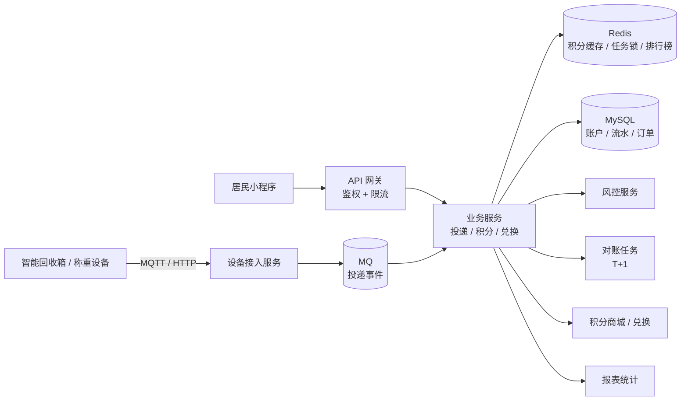

# ♻️ 回收站点 · 积分管理平台

> 返回 [[00-AI经历怎么讲与简历改写策略]]

> [!info] 你的角色
> **主导后端 / 核心模块**（账户、积分、设备接入、结算）

---

## 一、简历怎么写（真实增强版）

### 标准版（推荐，约 5 行）

> **回收站点积分管理平台** ｜ 后端负责人 ｜ 202X.XX - 202X.XX
> - 面向社区/园区回收场景，居民投递可回收物按**品类与重量**获得积分并兑换商品，覆盖 **X 个站点 / X 万用户**，日均处理投递 **X 单**
> - **主导后端架构设计**：设计积分账户体系（可用/冻结/累计三分账），通过 **Redis + Lua 原子扣减 + 唯一键幂等**，实现高并发下**积分零超发**
> - 接入智能回收箱与称重设备（IoT 协议 → MQTT 上报），解决设备重复上报、数据异常（重量突变/离线补传）问题
> - 建立 **T+1 对账机制**（设备流水 vs 平台流水），差异率控制在 **X%** 以内，并配套异常工单流转
> - 设计**风控防刷**（同用户/设备频次限制、异常重量识别、黑名单），拦截异常投递 **X 次/月**
> - 报表体系支撑站点、区域、品类多维分析；积分排行榜基于 **Redis ZSet**，百万级数据毫秒响应

### 进阶版（想突出并发与一致性时加）

> - 积分过期采用 **延迟消息 + 定时兜底** 双保险，避免漏过期与集中失效；大促兑换场景通过 **库存预扣 + MQ 削峰**，接口 P99 **< X ms**

---

## 二、系统架构

---

## 三、核心难点与解法（**面试深挖全靠这节**）

| 难点 | 你的解法（得分骨架） |
|---|---|
| **积分并发扣减不超发**（必问） | 三选一并能对比：① **Redis + Lua 原子脚本**（性能最好，推荐）② **DB 乐观锁**（`update ... where balance >= x`，简单可靠）③ 分布式锁（最重，慎用）；**流水表 + 余额表分离**，先记流水再改余额 |
| **积分过期** | ① **延迟消息**（到期投递）② 定时任务扫描兜底 ③ **Redis ZSet 按过期时间排序**；要防"集中失效"（加随机偏移） |
| **设备重复上报** | 投递事件带**唯一键**（设备号 + 时间戳 + 序号）→ 去重表/Redis setnx；**幂等处理**后再计价发分 |
| **重量数据不准** | ① 设备校准记录 ② 异常值剔除（超阈值直接挂起转人工）③ 离线补传按时间排序回放 |
| **对账** | 每日拉取设备流水与平台流水做**双向比对**，差异分三类（平台多、设备多、金额不符）生成工单；**对账是最终一致的最后防线** |
| **风控防刷** | 频次限制（同用户/设备/IP）、异常重量识别、短时间高频拦截、黑名单；**规则 + 阈值可配置**，避免硬编码 |
| **多站点数据隔离** | 所有查询强制带站点/租户条件（MyBatis 拦截器统一注入）；站点管理员只能看自己站点 |
| **排行榜** | **Redis ZSet**（`ZINCRBY` / `ZREVRANGE`）；按周期（日/周/月）分 key，定时归档落库 |
| **兑换并发** | 商品库存 Redis 预扣 + Lua 原子校验；下单 MQ 异步落库；**防超卖**（`where stock >= 1`） |

---

## 四、面试官会问什么

- 「积分为什么会超发？你怎么保证不超发？」→ **这是本项目的核心题**，要能讲清并发场景
- 「为什么用 Redis 扣减，不直接用数据库？」
- 「Redis 和数据库不一致怎么办？」→ 最终一致 + 对账兜底
- 「积分过期怎么实现的？为什么不用定时任务？」→ 讲延迟消息 vs 定时扫表的取舍
- 「设备上报的数据你怎么信？」→ 幂等 + 校准 + 异常剔除 + 对账
- 「对账发现差异怎么处理？」→ 分级：自动冲正 / 人工工单
- 「这个项目最难的地方是什么？」→ **提前准备 3 分钟带数字的答案**

> [!warning] 要补的数字
> 站点数、用户数、日均投递量、峰值 QPS、积分流水量、对账差异率、拦截刷单数

---

## 五、🎨 如果引入大模型，我会这么设计（**面试谈资，不是"我做过"**）

> [!important] 这个项目其实是**RAG 的教科书场景**
> 说法：「我们业务里没落地，但回收平台有个特别适合大模型的场景——各地分类标准不一样。」

| 场景 | 方案 | 为什么合适 |
|---|---|---|
| **垃圾分类问答**（**最推荐讲这个**） | **RAG**：把各城市垃圾分类标准做成知识库，居民问"奶茶杯算什么垃圾"，检索后由模型回答**并给出依据来源** | 各地标准不同且频繁更新 → **典型 RAG 场景**（微调不现实，知识更新太快） |
| **拍照识别兜底** | 传统 CV 识别为主，**多模态大模型兜底**（置信度低时走大模型） | 兼顾成本与准确率 |
| **客服工单处理** | LLM 自动分类 + 摘要 + 派单建议 | 降低人工客服量 |
| **运营报告生成** | 定时把统计指标喂给 LLM，生成站点周报/月报 | 运营同学不用等报表 |
| **数据问答** | Text-to-SQL + 指标语义层 | 管理者自然语言查回收量 |
| **积分规则解释** | 用户问"我这单为什么只有 5 分"，模型结合规则解释 | 减少客诉 |

**面试官追问时能答的细节**：
- 为什么用 RAG 不用微调 → **标准每月都在变，微调成本高且滞后**
- 检索不准怎么办 → **混合检索（向量 + 关键词）+ Rerank**，因为"奶茶杯""珍珠奶茶杯"这类专有名词关键词召回更准
- 文档权限/多城市隔离 → 检索时按**城市标签强制过滤**
- 幻觉怎么办 → **强制带引用来源**，答不出来就说"建议咨询当地站点"，不能编
- 成本 → 高频问题加**结果缓存**，简单分类走小模型

---

## 🔗 关联

- [[00-AI经历怎么讲与简历改写策略]] · [[01-酒店送物机器人-项目描述]]
- [[面试准备/专业技能/01-AI应用工程化]]

#面试 #简历 #项目 #积分 #待补
