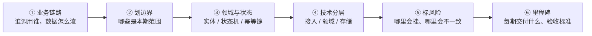

# 🏗️ 「如何从 0 到 1 搭建服务」· 面试话术

> 返回 [[面试准备/简历/00-AI经历怎么讲与简历改写策略|00-AI经历怎么讲与简历改写策略]]

> [!info] 这篇怎么用
> - 面试官问「你怎么从 0 到 1 搭一个服务 / 平台」时，**直接用第一节的「五步法」当骨架**。
> - 第二、三节是**你自己的弹药**（两个真实项目 + RAG demo），必须能各讲 90 秒。
> - 第四节按面试时长挑版本：1 分钟 / 3 分钟 / 8 分钟白板版。
> - 第五、六节是追问和雷区，**面前一天过一遍就够**。
> - 带 `X` 的地方是你的真实数字，**必须回填**，编的数字一定被抓（见 [[面试准备/简历/01-酒店送物机器人-项目描述|01]] / [[面试准备/简历/02-回收站点积分平台-项目描述|02]] 的「要补的数字」）。

---

## 一、先破题：面试官问这句话，到底在考什么

> [!important] 一句话结论（**开场先说这句，气势就稳了**）
> 「我理解的**从 0 到 1**，不是把代码写出来，而是**把一个以前没有的能力，变成业务能稳定依赖的服务**。
> 所以我的第一步永远不是选技术栈，而是**先把『1』长什么样谈清楚**。」

面试官不是在考你会不会用 Spring Boot 建工程。他在筛四件事：

| 考什么 | 低分答法 | 高分答法 |
|---|---|---|
| **判断力** | 上来就报技术栈 | 先分「必须做」和「可以后做」，有取舍 |
| **结构性** | 讲零散经验 | 有一套从需求到上线的方法论 |
| **落地能力** | 只讲架构图 | 能扛住幂等、一致性、容量、故障的细节追问 |
| **演进意识** | 一步到位上微服务 | 知道一期做到什么程度，MVP + 演进 |

> [!danger] 三个最常见的送命开场（**别说**）
> 1. 「先搭 Spring Cloud 微服务，再上 Redis、Kafka、分库分表」→ 面试官立刻判定：**没做过 0 到 1，只在别人搭好的架子上写代码**。
> 2. 「看需求文档，然后设计表、写接口」→ 太浅，等于没方法论。
> 3. 「这个我没主导过」→ 你有两个项目是从零做起来的，**别自己放弃**。

---

## 二、万能骨架：0 → 1 五步法（**背这一段**）

> [!tip] 记忆口诀：**定边界 → 通闭环 → 立地基 → 上强度 → 做治理**
> 每一步都讲清三件事：**这一步干什么、为什么这么排、什么条件才允许进入下一步**。

| 阶段 | 目标 | 关键动作 | 交付标准（进入下一步的判据） |
|---|---|---|---|
| **0 · 定边界** 立项 | 把「1」定义清楚 | 业务目标量化（谁用、解决什么、成功指标）；非功能需求（并发 / 延迟 / 数据量 / 可用性）；**明确「这期不做什么」** | 一句话说清成功标准 + 明确的 out of scope |
| **1 · 通闭环** MVP | 先有能用的 | **单体起步**，一条主链路端到端跑通；接口契约与表结构定下来；脏数据也能先跑 | 业务方能真实使用、能演示，主流程被认可 |
| **2 · 立地基** 抽象 | 让系统可演进 | 领域建模 + **状态机**；幂等键与唯一约束；一致性方案；分层（接入 / 领域 / 存储）；配置化与灰度开关 | 核心链路的**异常路径都是闭环的**，重复调用不出错 |
| **3 · 上强度** 稳定 | 让系统可用可扛 | **压测定容量水位**；缓存 / 异步削峰 / 限流降级；监控告警 + 日志 + Tracing；备份恢复与回滚预案 | 达到业务承诺的 SLO；**故障有预案、能回滚** |
| **4 · 做治理** 规模化 | 从 1 到 100 | 多租户 / 多站点隔离与权限；成本与容量规划；自动化交付 CI/CD；对账与运营视角 | 能复制到第 N 个客户 / 站点 / 机房，**边际成本递减** |

### 支撑这套方法的三个原则（**加分点，主动说出来**）

1. **先跑通，再跑快**
   > "MVP 阶段我会刻意**不上**不必要的中间件。单体 + 一个数据库能扛住，就先不上微服务、不上 MQ、不分库分表——**每一层复杂度都要用真实的痛来换**。"

2. **为演进留缝，不为未来买单**
   > "我会按领域把**模块边界和接口契约**划清楚，事件模型也预留，将来要拆随时能拆；但**不会提前拆**。这是我和『一上来就微服务』最大的区别。"

3. **风险前置**
   > "0 到 1 最容易死的地方是**最后集成才发现走不通**。所以我会先做最不确定的技术验证——长连接稳不稳、对端接口能不能通、数据能不能拿到。**把风险放到第一周，而不是最后一周。**"

---

## 三、你的弹药：用真实项目讲（**每段 90 秒，背到能脱口而出**）

> [!warning] 原则
> 讲「从 0 到 1」**必须挂一个真实项目**，否则就是背方法论。
> 每个项目只讲一条主线：**当时最大的风险是什么 → 我怎么定的边界 → 分几步做 → 结果**。

### 🅰️ 酒店送物机器人 —— 从 0 到 1 是「连得上、调得动、不丢单」

> "这个系统我们是**从零开始**做的。当时最大的不确定性不是业务逻辑，是**设备**——机器人能不能稳定在线、任务能不能可靠下发。所以我第 0 步先把「1」定义成：**跑通『下单 → 派机 → 取物 → 送达』一条闭环，并且任务不丢、不重复**，先不谈多机协同和高峰削峰。
>
> 第 1 步我先把**设备接入网关**跑通：基于 **Netty + MQTT** 建长连接，解决心跳保活、断线重连和离线任务回收——**这是整个系统的地基，它不稳，上面全是空中楼阁**。
>
> 第 2 步才是抽象：把任务做成**状态机**（待分配 → 已分配 → 取物中 → 配送中 → 已送达 → 已完成 / 已取消），加**幂等键**，非法流转直接拒绝；再往上做**多机调度**，按「就近 + 负载」选机，用 Redis 原子操作保证**同一任务只被一个机器人认领**，不会抢单。
>
> 第 3 步上强度：**长连接网关无状态化**，设备路由表放 Redis，网关挂了设备重连到新节点重新注册；断线重连做**指数退避 + 随机抖动 + 服务端分批放行**，避免重连风暴；位置上报**降频 + 变化才推**，MQ 削峰后再推 WebSocket。
>
> 最后打通酒店 PMS 和梯控——这块我用的是**签名鉴权 + 幂等键 + 异步回调重试 + T+1 对账**兜底，因为**第三方系统你控制不了，只能用对账保证最终一致**。
>
> 结果是覆盖 X 家酒店 / X 台机器人，任务成功率 X%。"

**被追问时往这两个点引**（你的差异化）：
- 「长连接网关怎么扩展」→ 无状态化 + Redis 路由表 + 重连风暴治理
- 「任务为什么不会重复执行」→ 状态机前置校验 + 幂等键，讲清「谁先谁后」

### 🅱️ 回收站点积分平台 —— 从 0 到 1 是「积分（钱）不能算错」

> "这个项目从 0 到 1 的**一号风险非常明确：积分不能超发**。因为积分等于钱，一旦算错就是资损，而且是**不可逆的信任损失**。所以我的『1』定得很窄：**先把投递 → 计价 → 发分 → 查询这条链路做对，再谈兑换商城和排行榜**。
>
> 第 0 步我先定**账户模型**：可用 / 冻结 / 累计**三分账**，**流水表和余额表分离**，先记流水再改余额——这样任何一笔都能追溯、能对账。
>
> 第 2 步是核心：高并发扣减用 **Redis + Lua 原子脚本**，配合**唯一键幂等**，保证零超发。这里我做过取舍：**DB 乐观锁**（`update ... where balance >= x`）更简单可靠但扛不住峰值，**分布式锁**最重、我不倾向用，所以最终选了 Redis Lua。
>
> 设备接入这块的关键认知是：**设备数据天生不可信**。重复上报用「设备号 + 时间戳 + 序号」做唯一键去重；重量突变直接挂起转人工；离线补传按时间排序回放；再配**T+1 对账**做最后一道防线——**设备流水和平台流水双向比对，差异分三类生成工单**。
>
> 第 3、4 步才做风控防刷（频次 / 异常重量 / 黑名单）和规模化（站点级数据隔离，查询强制带租户条件；排行榜走 Redis ZSet）。
>
> 结果是覆盖 X 个站点 / X 万用户，日均投递 X 单，**积分零超发**，对账差异率控制在 X% 以内。"

**被追问时往这两个点引**：
- 「Redis 和 DB 不一致怎么办」→ 最终一致 + **对账兜底**（这是最容易加分的答案）
- 「你怎么知道设备上报的数据是真的」→ 幂等 + 校准 + 异常剔除 + 对账，四层

### 🅲 AI 侧：RAG demo（**只说 demo，别说实战**）

> "AI 这块我目前是**个人实践项目**：用 **Spring AI Alibaba** 独立做了个企业知识库 RAG 的 demo，走通了从文档解析、切分、向量化、检索到流式生成的完整链路。
>
> 如果**从 0 到 1 做一个生产级 RAG 服务**，我会在这个骨架上补三层：**权限**——文档打租户标签、**检索条件里强制过滤**（绝不能先检索再筛，会泄漏）；**评估**——建评测集（Golden Set），没有它就没法判断改动是变好还是变坏，还要嵌进 CI 做回归门禁；**成本与稳定性**——Prompt 缓存 + 模型分层控成本，超时重试 + 降级兜底保可用。
>
> 这三块我心里有方案，demo 阶段没做。"

> [!tip] 这段的价值
> 它把你的「0 到 1 方法论」**迁移到了 AI 平台**——正好命中 [[面试准备/AI运维与架构岗/00-JD整理与学习清单|AI 运维 / AI 架构师 JD]] 里「0 到 1 建平台 + Golden Set 评测 + RAG 全链路」的要求。

---

## 四、按面试时长挑版本

### ⏱️ 1 分钟版（电梯版，**背到能一口气说完**）

> "我理解的从 0 到 1，不是把代码写出来，而是**让一个以前没有的能力变成业务能稳定依赖的服务**。
> 我一般分五步：**先定义『1』长什么样**——业务指标和非功能指标先谈清楚，同时明确这期不做什么；
> **第二步打通最小闭环**，单体起步、一条主链路端到端跑通，先让业务方能用；
> **第三步立地基**，把领域模型、状态机、幂等和一致性方案定下来，保证异常路径也闭环；
> **第四步上强度**，压测定水位，加缓存、异步削峰、限流降级，配监控告警和回滚预案；
> **第五步才是规模化治理**，多租户、成本、自动化交付。
> 我做过两个系统基本都是这个路子——比如回收积分平台，我第一步就把『积分不能超发』当成一号风险，先定账户模型和幂等键，再往上堆业务。"

### ⏱️ 3 分钟版（主答）

1. **破题 + 五步法**（上面 1 分钟版，约 45 秒）
2. **挂一个项目佐证**（挑 🅱️ 回收积分，约 90 秒，因为「钱不能算错」最有说服力）
3. **收尾给取舍和反思**（约 30 秒）：

> "如果让我重来一次，回收平台我会**更早把对账做出来**——我一开始把它放在第三期，结果发现**对账其实是发现问题的唯一手段**，做得越早，前面阶段的信心越足。
> 所以我的经验是：**0 到 1 阶段，可观测和对账不是收尾工作，是地基的一部分。**"

> [!success] 这个「反思句」是真正的加分项
> 大多数候选人只会讲自己多正确。**能说出「我会怎么改」的人，才是真的主导过项目的人。**

### ⏱️ 8–10 分钟白板版（架构师 / 技术负责人岗）

**画图顺序很关键，别一上来画中间件：**

**每一层都能被追问，按这个顺序讲就不会乱：**

| 步骤 | 讲什么 | 面试官想听的关键词 |
|---|---|---|
| ① 业务链路 | 主链路端到端，谁产生数据、谁消费 | 先业务后技术 |
| ② 划边界 | 本期做什么、**不做什么** | 取舍、MVP |
| ③ 领域与状态 | 实体、状态机、幂等键、一致性 | **幂等 / 状态流转 / 唯一约束** |
| ④ 技术分层 | 单体 → 分层 → 何时拆 | **演进式架构，不提前拆** |
| ⑤ 标风险 | 单点、一致性、第三方依赖、容量 | 风险前置 |
| ⑥ 里程碑 | 每期目标 + 验收 + 回滚 | **可交付、可回滚** |

---

## 五、高频追问与得分骨架（**面前一天过一遍**）

| 追问 | 得分骨架（**结论先行**） |
|---|---|
| **为什么自研，不买现成的？** | 先算清「买 vs 自研」的边界：标准能力买、**核心竞争力自研**。自研的代价是长期维护成本，所以要先确认这东西是不是差异化能力。 |
| **单体还是微服务？怎么拆？** | **MVP 一律单体**，按领域分模块。拆的信号是：**团队规模超过沟通成本**、**某模块有独立扩容需求**、**发布节奏冲突**。拆的边界是领域，不是技术层（不是「controller 一个服务、dao 一个服务」）。 |
| **表怎么设计？幂等怎么做？** | 先定**业务唯一键**（订单号 / 设备号 + 时间戳 + 序号），DB 建**唯一索引**兜底；状态机做**前置校验**；对外接口用**幂等表 / 去重表**记录请求 ID。**唯一索引是最后一道防线，不能只靠代码判断。** |
| **怎么保证高可用？几个 9？** | 先反问/明确业务要几个 9（**不同 9 成本差一个数量级**）。手段：无状态化 + 多实例、依赖降级、超时重试（指数退避 + 抖动）、熔断限流、**故障演练**。别只背组件名。 |
| **Redis 和数据库不一致怎么办？** | 不追求强一致，走**最终一致**：Cache Aside + 延迟双删 / 消息补偿，**最后用对账兜底**。承认「不一致是常态，关键是能发现和修复」。 |
| **第三方接口不稳定怎么处理？** | 超时 + 重试（**幂等前提**）+ 熔断降级 + 异步回调 + **T+1 对账**。核心心法：「**你控制不了对端，就只能保证自己可恢复**」。 |
| **上线后出故障怎么办？** | 三板斧：**先止血**（回滚 / 降级 / 限流）→ **再定位**（监控 + 日志 + Trace 串链路）→ **最后复盘并补监控/预案**。强调「**先恢复业务，不是先找原因**」。 |
| **团队几个人、多久上线？** | 给真实节奏：几人 ×几周，怎么切里程碑。**别报「三个月全做完」**，要说「第一期 X 周打通闭环，第二期 X 周上强度」。 |
| **如果重来一次你会怎么改？** | 见 3 分钟版收尾的「反思句」。**这题是送分题，一定要有准备。** |
| **从 0 到 1 和从 1 到 100 有什么区别？**（管理 / 架构师岗常问） | 0→1 考**定性判断和取舍**（做对的事）；1→100 考**体系化**（可复制、可度量、成本递减、组织协同）。0→1 靠个人英雄主义能成，1→100 只能靠机制。 |
| **你怎么带人做 0 到 1？** | 定边界 → 拆里程碑 → **接口契约先行**（并行开发的前提）→ 定代码规范与 Review → 风险点自己盯 → 每周对齐。核心：**我定标准和边界，具体模块交出去**。 |

---

## 六、金句库（**挑 3 句用，别全倒出来**）

> - 「**从 0 到 1 的『1』不是代码写完，是业务能稳定用起来。**」
> - 「**每一层复杂度都要用真实的痛来换。**」
> - 「**为演进留缝，但不为未来买单。**」
> - 「**把风险放到第一周，而不是最后一周。**」
> - 「**对账不是收尾工作，是地基的一部分。**」
> - 「**你控制不了对端，就只能保证自己可恢复。**」
> - 「**先恢复业务，再找原因。**」
> - 「**唯一索引是最后一道防线，不能只靠代码判断。**」

---

## 七、雷区（**说出口就掉分**）

> [!danger] 七个不要
> 1. **不要一上来报技术栈**——先讲业务目标和边界，技术是结果不是起点。
> 2. **不要一步到位上微服务 / 分库分表**——这是「没做过 0 到 1」的最强信号。
> 3. **不要只讲架构不讲结果**——**没有数字的答案等于没答**。
> 4. **不要说「先把框架搭好」**——框架搭好是最没信息量的回答。
> 5. **不要把「从 0.5 到 1」说成「从 0 到 1」**——如果项目本来就有基础，诚实说清你接手的是什么状态，反而更可信。
> 6. **不要回避故障**——主动讲一个出过的问题 + 怎么定位 + 怎么防复发，可信度暴涨。
> 7. **不要把 AI demo 说成实战**——参照 [[面试准备/简历/00-AI经历怎么讲与简历改写策略|00 的口径]]，**主动说不是实战 = 有工程判断力**。

---

## 八、面试前 checklist

- [ ] 五步法能在 **60 秒**内一口气说完（**录音听一遍**）
- [ ] 🅰️ 酒店机器人 90 秒稿能脱稿讲
- [ ] 🅱️ 回收积分 90 秒稿能脱稿讲
- [ ] 两个项目各自能讲 **3 个可深挖点**（网关扩展 / 任务幂等 / 积分不超发 / 对账 / 重连风暴）
- [ ] 白板版能**边画边讲**，顺序是业务 → 边界 → 领域 → 技术 → 风险 → 里程碑
- [ ] 准备 **1 个真实故障故事**（现象 → 止血 → 定位 → 根因 → 防复发）
- [ ] **回填所有 `X` 数字**：酒店数 / 机器人数 / 日均单量 / 峰值 QPS / 成功率 / P99 / 站点数 / 用户数 / 差异率 / 拦截刷单数
- [ ] 准备好那句「**如果重来一次**」的反思
- [ ] AI 迁移版能讲：（权限隔离 / 评测体系 / 成本与稳定性）三件事

---

## 🔗 关联

- [[面试准备/简历/00-AI经历怎么讲与简历改写策略]] · AI 经历的诚实口径
- [[面试准备/简历/01-酒店送物机器人-项目描述]] · 难点与追问全集
- [[面试准备/简历/02-回收站点积分平台-项目描述]] · 积分与对账细节
- [[面试准备/简历/03-SpringAIAlibaba-RAG-Demo-答辩准备]] · 「上生产还缺什么」
- [[面试准备/智控/04-话术与反问清单]] · 自我介绍 / STAR / 反问清单
- [[面试准备/冠顿/01-管理面与负责人题]] · 带团队做 0 到 1 的口径
- [[面试准备/AI运维与架构岗/00-JD整理与学习清单]] · AI 平台 0 到 1 的 JD 要求

#面试 #话术 #从0到1 #架构设计 #STAR #待补
